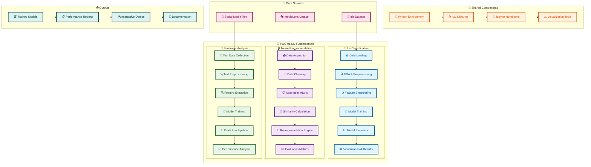
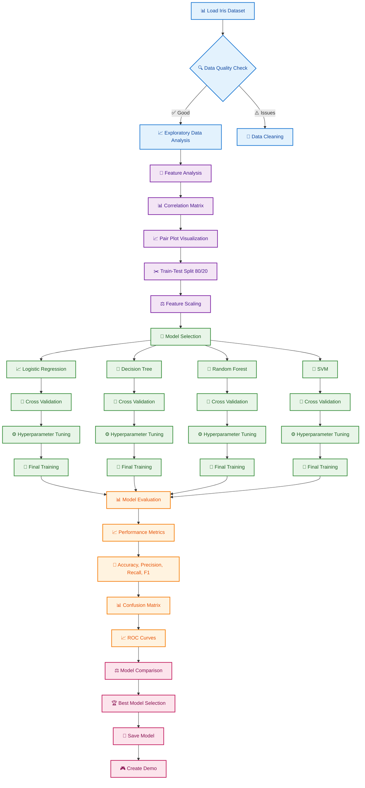
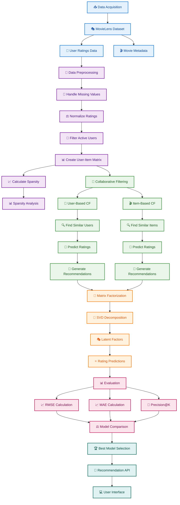
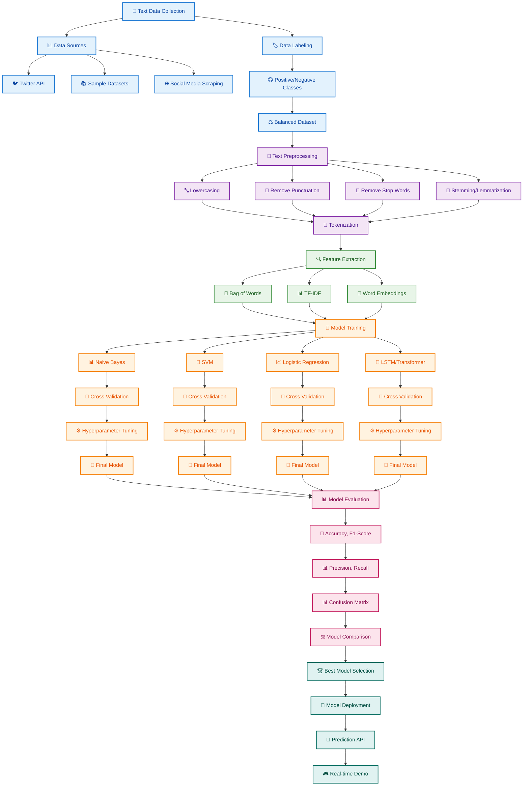
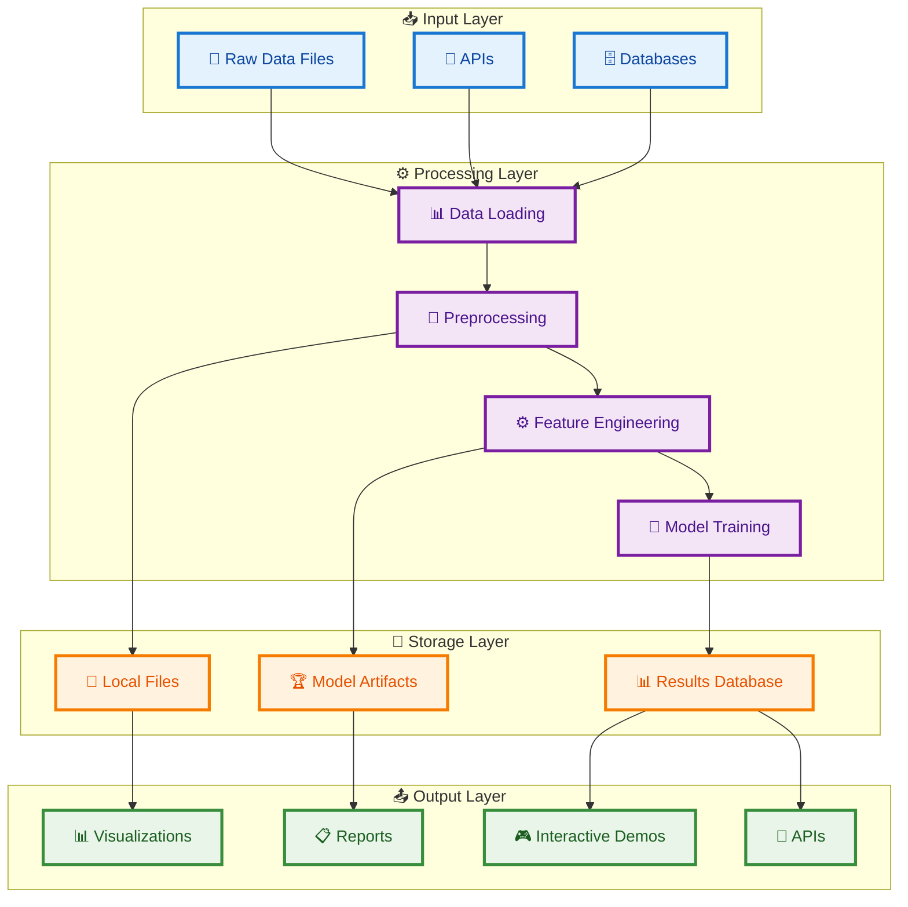
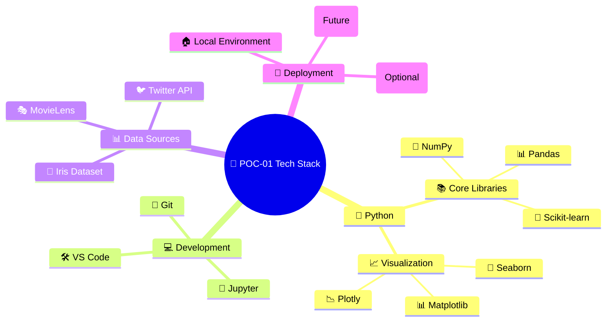
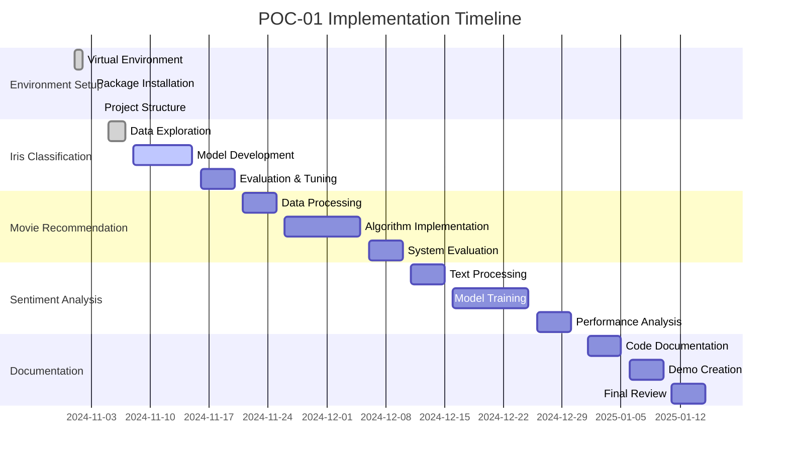
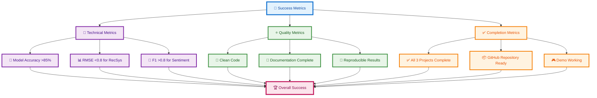

# POC-01 ML Fundamentals Architecture Plan

## Overview
This POC implements three foundational machine learning projects demonstrating core concepts in supervised learning, recommendation systems, and natural language processing.

## System Architecture


```

## Iris Classification Detailed Flow



## Movie Recommendation System Architecture



## Sentiment Analysis Pipeline



## Data Flow Architecture



## Technology Stack Visualization



## Implementation Timeline



## Success Metrics Dashboard


