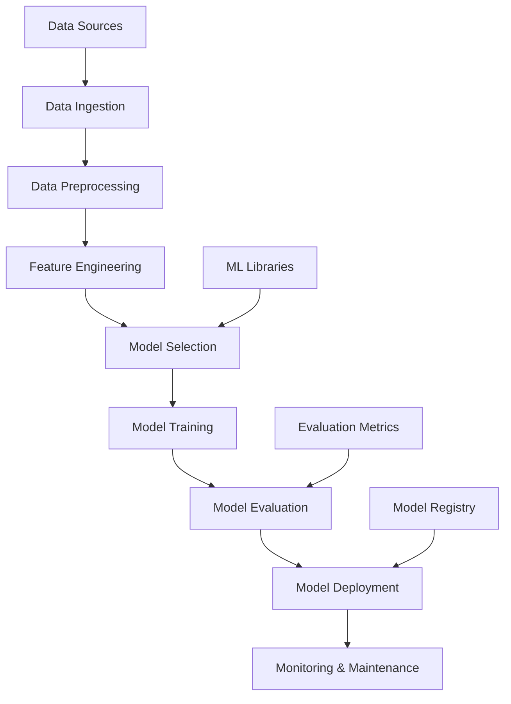
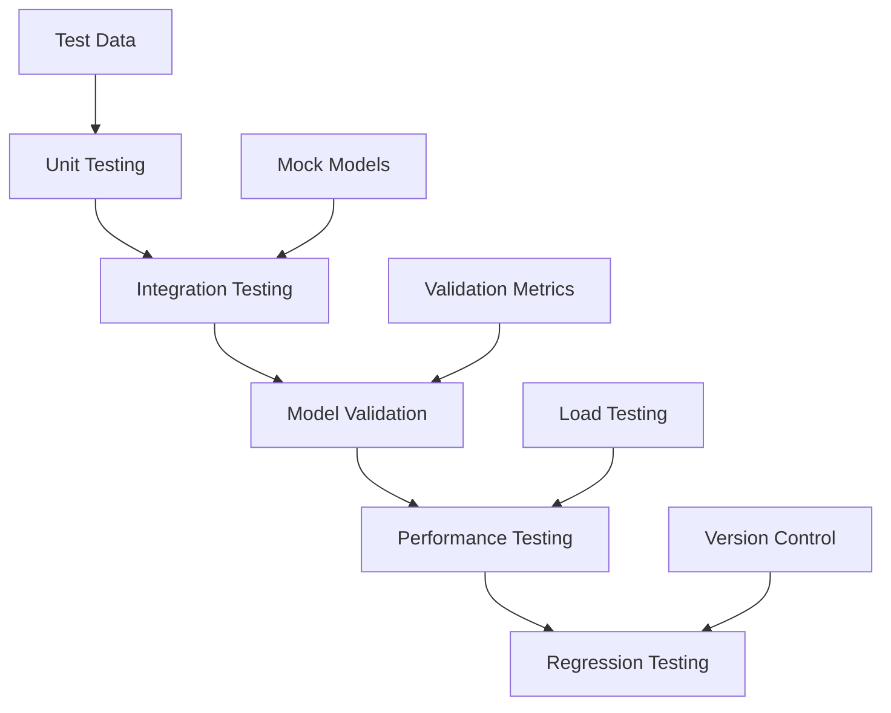
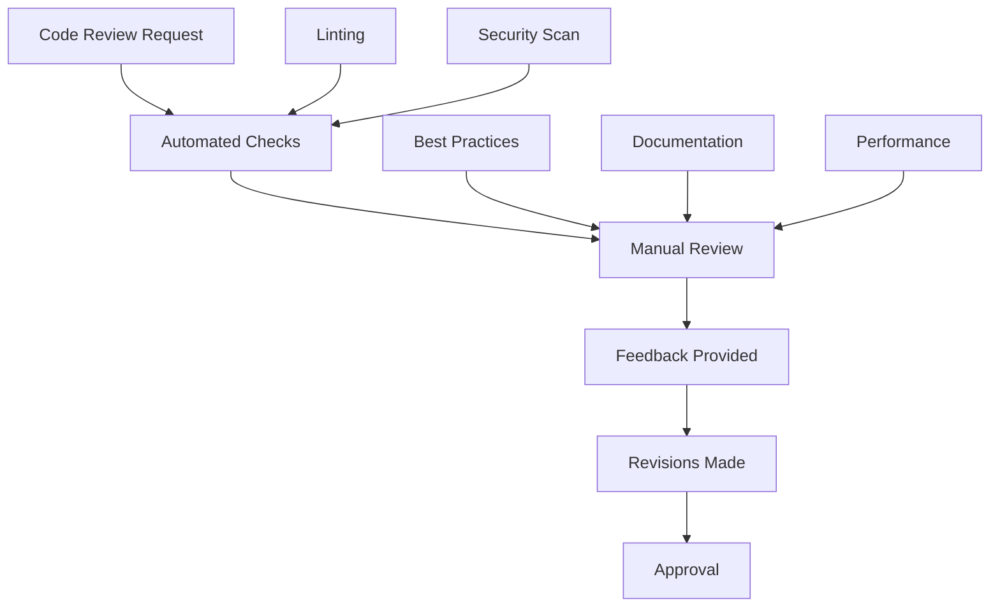
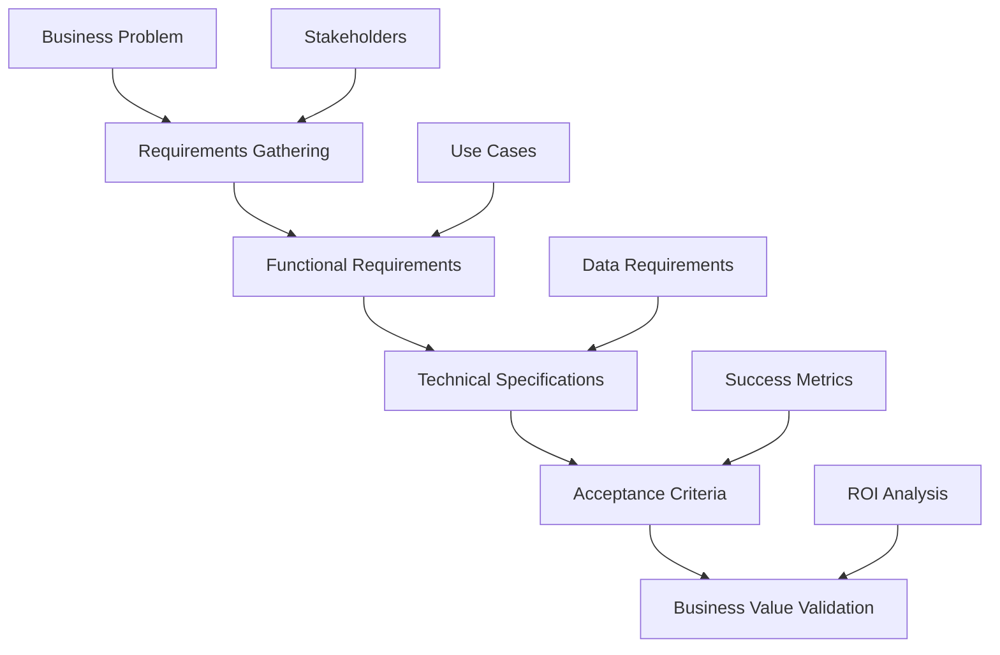
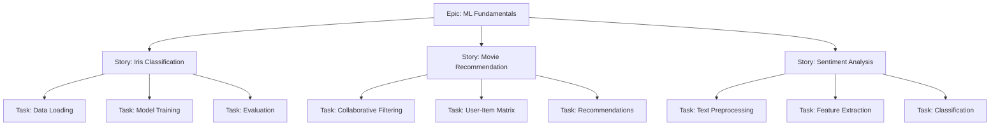
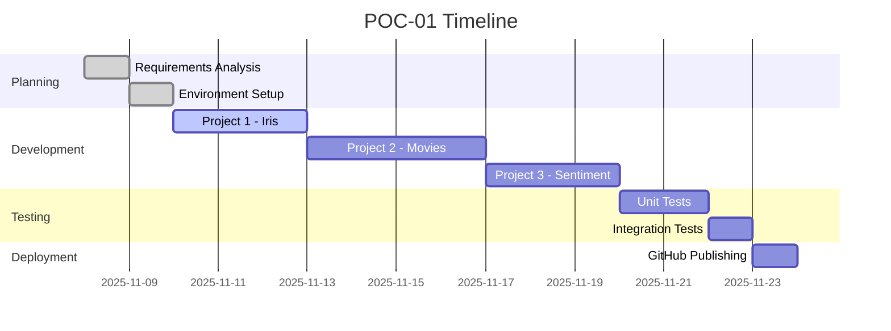

# POC-01: ML Fundamentals - Mini-Projects Implementation Guide

## Agenda of POC
This Proof of Concept (POC) aims to establish a strong foundation in Machine Learning fundamentals by building three practical mini-projects. The goal is to demonstrate hands-on proficiency in core ML concepts including supervised learning, data preprocessing, model training, evaluation, and basic deployment. This POC serves as the entry point for transitioning from data engineering to AI/ML roles, showcasing the ability to apply ML algorithms to real-world problems.

### Objectives:
- Understand and implement supervised learning algorithms
- Practice data preprocessing and feature engineering
- Learn model evaluation and validation techniques
- Build confidence in Python ML ecosystem
- Create portfolio-worthy projects for GitHub

### Success Criteria:
- All three projects achieve >85% accuracy on test sets
- Clean, documented code with proper README
- Visualizations for model performance
- GitHub repository with professional presentation

## Tech Stack
- **Programming Language**: Python 3.8+
- **Core Libraries**:
  - scikit-learn: Machine learning algorithms and utilities
  - pandas: Data manipulation and analysis
  - numpy: Numerical computing
  - matplotlib/seaborn: Data visualization
- **Development Environment**:
  - Jupyter Notebook: Interactive development
  - VS Code: Code editing
  - Git: Version control
- **Deployment**: Local model serialization with joblib/pickle

## How to Start
### Prerequisites:
1. Python environment configured (use existing .venv)
2. Install required packages:
   ```bash
   pip install scikit-learn pandas numpy matplotlib seaborn jupyter
   ```
3. Create project structure:
   ```
   POC-01-ML-Fundamentals/
   ├── notebooks/
   │   ├── 01_iris_classification.ipynb
   │   ├── 02_movie_recommendation.ipynb
   │   └── 03_sentiment_analysis.ipynb
   ├── data/
   ├── models/
   ├── src/
   └── README.md
   ```

### Initial Setup:
1. Fork/clone the repository
2. Set up virtual environment
3. Install dependencies
4. Download datasets (iris from sklearn, movies from Kaggle, sentiment from NLTK)
5. Start with Project 1: Iris Classification

## How to End
### Final Deliverables:
1. Three trained models saved in `models/` directory
2. Jupyter notebooks with complete analysis
3. Performance reports and visualizations
4. GitHub repository with:
   - Professional README
   - Project descriptions
   - Live demo (if applicable)
   - Requirements.txt

### Completion Checklist:
- [ ] All models trained and evaluated
- [ ] Accuracy >85% achieved
- [ ] Code documented and commented
- [ ] Visualizations created
- [ ] Repository published on GitHub
- [ ] LinkedIn post about the projects

## Architect View
As the Solution Architect, I design the overall ML pipeline architecture ensuring scalability, maintainability, and best practices.

### Architecture Overview:


### Design Principles:
- **Modularity**: Each project follows the same pipeline structure
- **Reusability**: Common utilities for data loading, preprocessing
- **Scalability**: Code structured for easy extension to larger datasets
- **Best Practices**: Proper train/test splits, cross-validation, hyperparameter tuning

### Technical Decisions:
- Use scikit-learn for consistency across projects
- Implement proper error handling and logging
- Design for reproducibility with random seeds
- Consider future integration with MLOps tools

## Developer View
As the Developer, I focus on implementing clean, efficient, and maintainable code following software engineering best practices.

### Development Workflow:


### Code Structure:
```python
# Example structure for each project
class MLProject:
    def __init__(self, config):
        self.config = config
        self.model = None

    def load_data(self):
        # Data loading logic
        pass

    def preprocess_data(self):
        # Preprocessing pipeline
        pass

    def train_model(self):
        # Model training
        pass

    def evaluate_model(self):
        # Evaluation metrics
        pass

    def save_model(self):
        # Model serialization
        pass
```

### Key Implementation Details:
- Use OOP principles for project structure
- Implement proper logging with Python's logging module
- Write unit tests for critical functions
- Use type hints for better code readability
- Follow PEP 8 style guidelines

## Tester View
As the QA Engineer, I ensure the ML models and code meet quality standards and perform reliably.

### Testing Strategy:


### Test Cases:
1. **Data Loading Tests**:
   - Verify data shapes and types
   - Check for missing values handling
   - Validate data integrity

2. **Preprocessing Tests**:
   - Test feature scaling/normalization
   - Verify encoding of categorical variables
   - Check outlier handling

3. **Model Tests**:
   - Test model initialization
   - Verify training completes without errors
   - Check prediction outputs are reasonable

4. **Evaluation Tests**:
   - Test accuracy calculations
   - Verify confusion matrix generation
   - Check cross-validation results

### Quality Metrics:
- Code coverage >80%
- All tests pass before commit
- Performance benchmarks met
- No data leakage in train/test splits

## Reviewer View
As the Code Reviewer, I ensure code quality, adherence to standards, and knowledge sharing.

### Review Checklist:


### Review Criteria:
1. **Code Quality**:
   - Clean, readable code
   - Proper error handling
   - Efficient algorithms

2. **ML Best Practices**:
   - Proper data splits
   - Feature engineering justification
   - Model evaluation comprehensiveness

3. **Documentation**:
   - Inline comments for complex logic
   - Function docstrings
   - README completeness

4. **Testing**:
   - Adequate test coverage
   - Edge cases covered
   - Integration tests present

### Feedback Template:
- **Strengths**: What was done well
- **Suggestions**: Areas for improvement
- **Blockers**: Must-fix issues
- **Questions**: Clarifications needed

## Business Analyst View
As the Business Analyst, I translate business requirements into technical specifications and validate business value.

### Business Requirements:


### Project 1: Iris Classification
- **Business Value**: Demonstrate ability to classify species for botanical research
- **Success Metrics**: >95% accuracy, fast prediction time
- **Stakeholders**: Researchers, data scientists

### Project 2: Movie Recommendation
- **Business Value**: Improve user engagement on streaming platforms
- **Success Metrics**: Relevant recommendations, user satisfaction
- **Stakeholders**: Product managers, UX designers

### Project 3: Sentiment Analysis
- **Business Value**: Monitor customer feedback, brand sentiment
- **Success Metrics**: Accurate sentiment detection, actionable insights
- **Stakeholders**: Marketing teams, customer service

### Business Impact:
- Portfolio enhancement for job applications
- Skill demonstration for AI/ML roles
- Foundation for more complex ML projects

## Product Owner View
As the Product Owner, I define the product vision, prioritize features, and ensure delivery of business value.

### Product Vision:
Build a portfolio of ML projects that demonstrate expertise and attract high-value opportunities in AI/ML engineering roles.

### Product Backlog:


### Prioritization:
1. **High Priority**: Core ML algorithms implementation
2. **Medium Priority**: Advanced visualizations
3. **Low Priority**: Additional datasets exploration

### Definition of Done:
- [ ] Code implemented and tested
- [ ] Model achieves target accuracy
- [ ] Documentation complete
- [ ] Demo available
- [ ] Business value demonstrated

### Roadmap:


### Metrics & KPIs:
- **Quality**: Model accuracy >85%
- **Efficiency**: Development time within estimates
- **Value**: GitHub stars/views > target
- **Learning**: New skills acquired and documented

This comprehensive guide provides all perspectives needed to successfully implement POC-01. Each role contributes unique value to ensure the POC delivers both technical excellence and business impact.