# ML Fundamentals: From Beginner to Expert

## Welcome to Machine Learning! 🤖

**Hello!** If you're reading this, you're about to embark on an exciting journey into the world of Machine Learning (ML). Don't worry if you've never written a line of code or don't know what an "algorithm" is - we'll start from absolute basics and build up step by step.

This guide will teach you:
- What ML is and why it matters
- How to think like a machine learning engineer
- A complete learning roadmap from beginner to expert
- Core concepts explained with visual diagrams
- Strategies to evolve your skills over time

---

## Chapter 1: What is Machine Learning? 🤔

### The Big Idea
Machine Learning is teaching computers to learn from data, just like humans learn from experience.

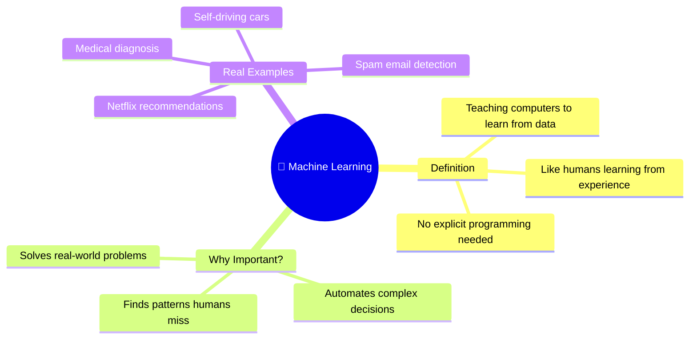

### Traditional Programming vs Machine Learning

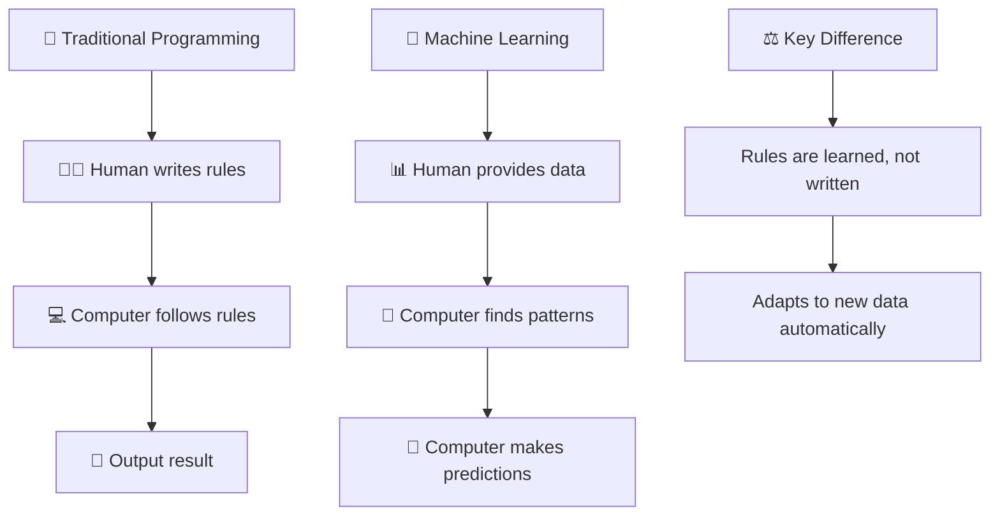

### Types of Machine Learning

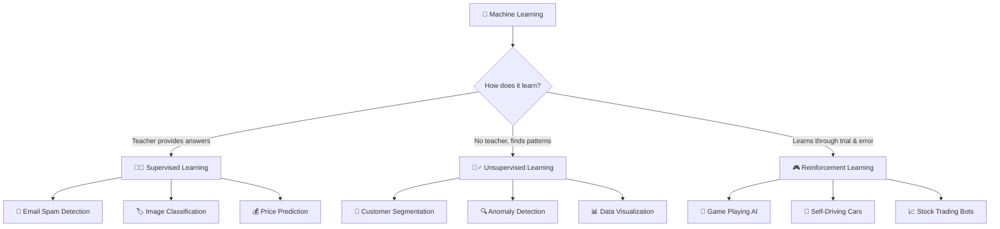

---

## Chapter 1.25: AI, ML, DL, Neural Networks & Gen-AI Explained 🔗

### The AI Family Tree

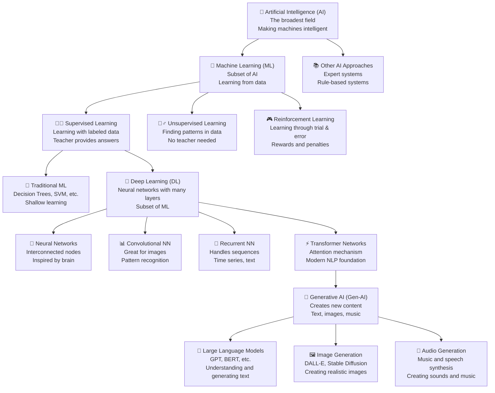

### Where Should You Start Your Learning Journey?

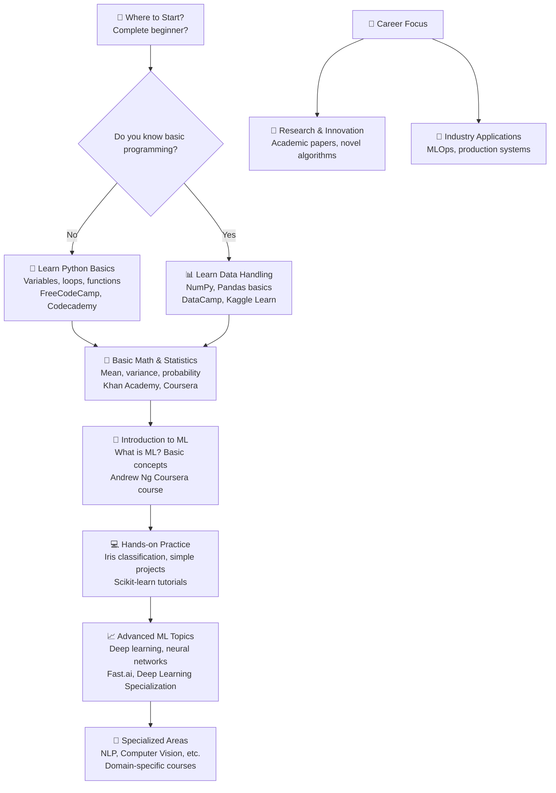

### Understanding the Relationships

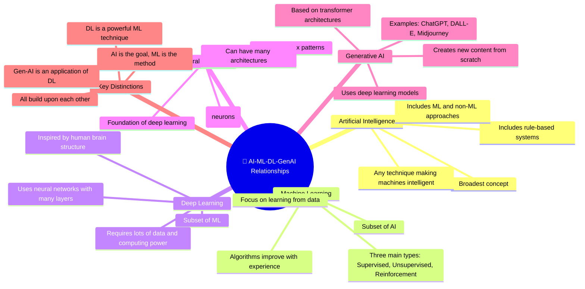

### Why This Hierarchy Matters

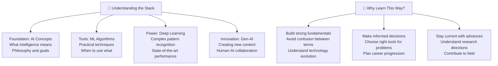

### Neural Networks: The Building Blocks

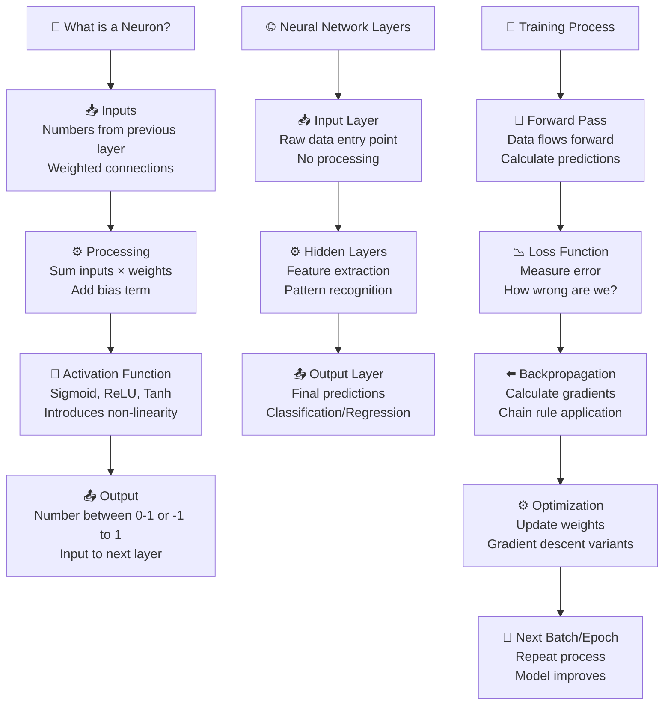

### Generative AI: Creating the Future

#### What is Generative AI?

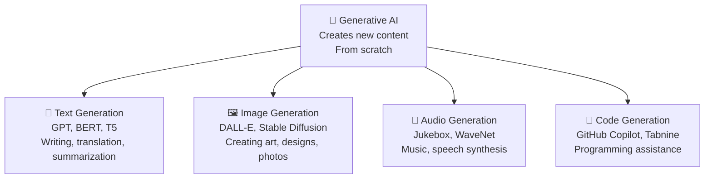

#### How Generative AI Works

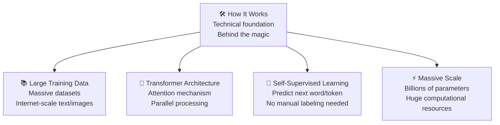

#### Generative AI Applications

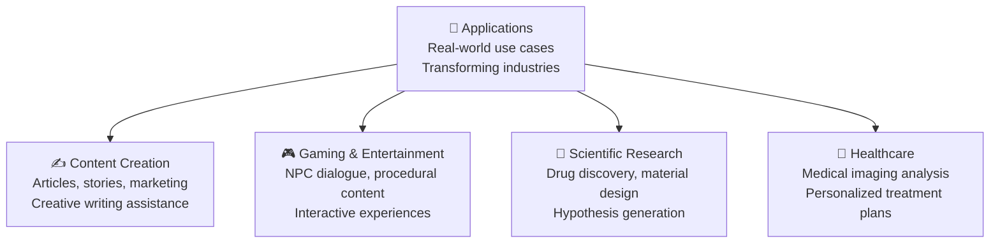

---

## Chapter 1.5: ML Jargon Buster 📖

### Essential Terms You'll Encounter

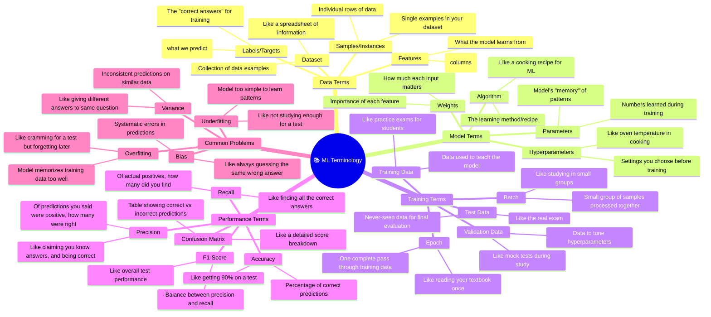

### Key Concepts Explained Simply

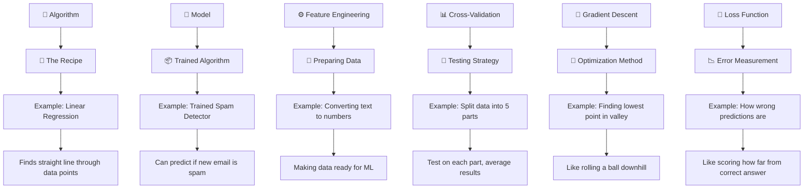

### Popular Algorithms and What They Do

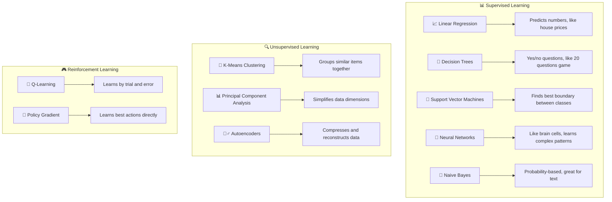

### Data Science vs Machine Learning Terms

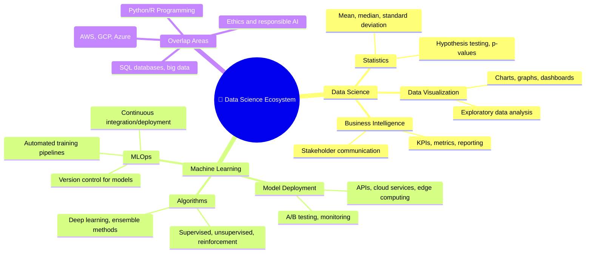

### Common Abbreviations You'll See

#### ML Terms

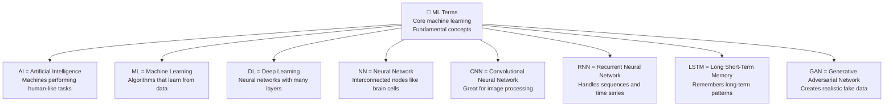

#### Data Terms

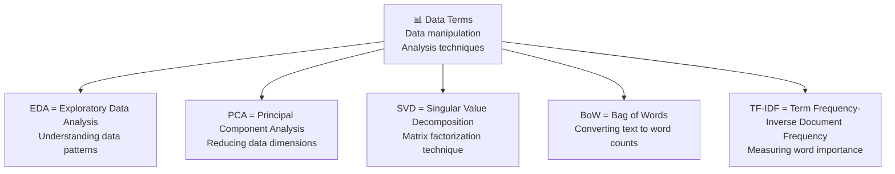

#### Process Terms

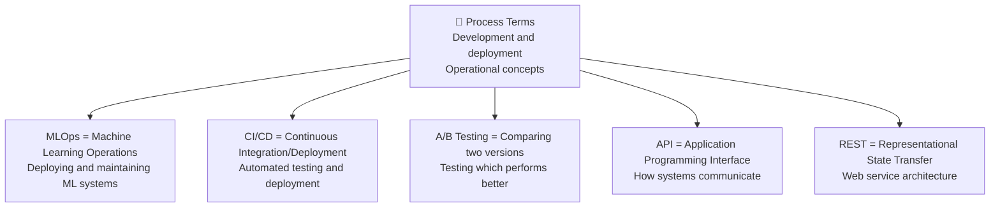

#### Performance Metrics

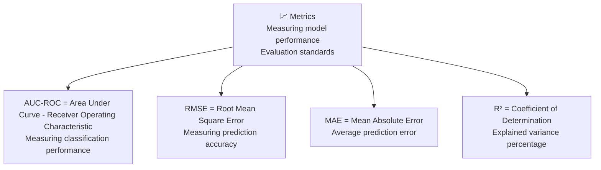

---

## Chapter 2: How to Think Like an ML Engineer 🧠

### The ML Thinking Framework

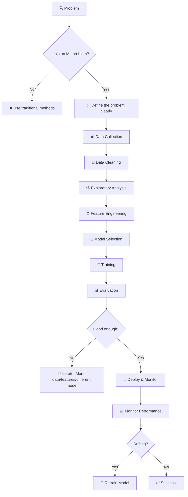

### Common Thinking Traps to Avoid

```mermaid
mindmap
  root((🚫 Common Mistakes))
    Overfitting
      Model works great on training data
      Fails miserably on new data
      Solution: Cross-validation, simpler models
    Underfitting
      Model too simple
      Can't capture patterns
      Solution: More complex models, better features
    Data Leakage
      Future information in training data
      Unrealistic performance
      Solution: Proper train/test splits
    Ignoring Baseline
      No comparison to simple methods
      Think you're doing great, but aren't
      Solution: Always compare to naive approaches
```

### The Scientific Method in ML

```mermaid
flowchart LR
    A[❓ Question/Hypothesis] --> B[🔬 Experiment Design]
    B --> C[📊 Data Collection]
    C --> D[⚙️ Model Building]
    D --> E[📈 Results Analysis]
    E --> F{Conclusion?}
    F -->|No| G[🔄 Refine Hypothesis]
    F -->|Yes| H[📝 Document Findings]
    H --> I[🔬 New Questions]
    I --> A
```

---

## Chapter 3: Your Learning Journey 🚀

### From Beginner to Expert: The Roadmap

```mermaid
gantt
    title Your ML Learning Journey
    dateFormat YYYY-MM-DD
    section Foundation (Month 1-2)
        Mathematics Basics     :done, 2024-01-01, 2024-01-31
        Python Programming     :done, 2024-02-01, 2024-02-28
        Data Handling          :active, 2024-03-01, 2024-03-31
    section Core ML (Month 3-6)
        Supervised Learning    :2024-04-01, 2024-05-15
        Unsupervised Learning  :2024-05-16, 2024-06-15
        Model Evaluation       :2024-06-16, 2024-07-15
    section Advanced Topics (Month 7-12)
        Deep Learning          :2024-08-01, 2024-09-30
        NLP & Computer Vision  :2024-10-01, 2024-11-30
        MLOps & Deployment     :2024-12-01, 2025-01-31
    section Expert Level (Month 13+)
        Research & Innovation  :2025-02-01, 2025-06-30
        Leadership & Strategy  :2025-07-01, 2025-12-31
        Industry Specialization :2026-01-01, 2026-12-31
```

### Skill Progression Mindmap

```mermaid
mindmap
  root((🎯 ML Skills Progression))
    Beginner Level
      Python Basics
      Data Structures
      Basic Statistics
      Simple Algorithms
    Intermediate Level
      Advanced Python
      ML Libraries
      Model Selection
      Feature Engineering
      Basic Deep Learning
    Advanced Level
      Research Papers
      Custom Architectures
      Distributed Training
      Production Systems
      Team Leadership
    Expert Level
      Novel Algorithms
      Industry Leadership
      Academic Research
      Strategic Planning
      Innovation
```

### Learning Strategies by Level

```mermaid
graph TD
    subgraph "🍼 Beginner"
        B1[📚 Structured Courses]
        B2[💻 Small Projects]
        B3[👥 Study Groups]
        B4[📝 Daily Practice]
    end

    subgraph "🚶 Intermediate"
        I1[🔬 Research Papers]
        I2[🏗️ Complex Projects]
        I3[💼 Kaggle Competitions]
        I4[👨‍🏫 Teaching Others]
    end

    subgraph "🏃 Advanced"
        A1[📊 Open Source Contributions]
        A2[🎓 Advanced Degrees]
        A3[💼 Industry Projects]
        A4[📝 Conference Papers]
    end

    subgraph "🚀 Expert"
        E1[🔬 Novel Research]
        E2[🏢 Company Leadership]
        E3[📚 Book Authoring]
        E4[🌍 Industry Standards]
    end

    B1 --> I1
    B2 --> I2
    B3 --> I3
    B4 --> I4

    I1 --> A1
    I2 --> A2
    I3 --> A3
    I4 --> A4

    A1 --> E1
    A2 --> E2
    A3 --> E3
    A4 --> E4
```

---

## Chapter 4: Core ML Concepts Explained 📚

### The Data Science Process

```mermaid
flowchart TD
    A[❓ Business Problem] --> B[🔍 Data Understanding]
    B --> C[📊 Data Preparation]
    C --> D[🔬 Exploratory Analysis]
    D --> E[⚙️ Feature Engineering]
    E --> F[🤖 Model Development]
    F --> G[📈 Model Evaluation]
    G --> H[🚀 Deployment]
    H --> I[📊 Monitoring & Maintenance]
    I --> J{Problem Solved?}
    J -->|No| K[🔄 Iterate]
    J -->|Yes| L[✅ Success]
```

### Supervised Learning Deep Dive

```mermaid
graph TD
    A[👨‍🏫 Supervised Learning] --> B[📚 Labeled Data]
    B --> C[🎯 Target Variable Y]
    C --> D[🔍 Features X]

    D --> E[📊 Training Data]
    E --> F[🤖 Learning Algorithm]
    F --> G[🧠 Model]
    G --> H[📊 Test Data]
    H --> I[🔮 Predictions]
    I --> J[📈 Performance Metrics]

    K[📧 Classification] --> L[Binary: Spam/Not Spam]
    K --> M[Multi-class: Cat/Dog/Bird]
    K --> N[Multi-label: Multiple tags]

    O[💰 Regression] --> P[House Prices]
    O --> Q[Stock Prices]
    O --> R[Temperature Forecast]
```

### Bias-Variance Tradeoff

```mermaid
graph TD
    A[🎯 Target] --> B[📊 Training Data]
    B --> C[🤖 Model]

    C --> D[High Bias] --> E[Underfitting]
    C --> F[High Variance] --> G[Overfitting]
    C --> H[Perfect Balance] --> I[Good Generalization]

    D --> D1[Too simple model]
    D --> D2[Misses patterns]
    D --> D3[High training error]

    F --> F1[Too complex model]
    F --> F2[Memorizes noise]
    F --> F3[High test error]

    H --> H1[Right complexity]
    H --> H2[Learns patterns]
    H --> H3[Good on new data]
```

### Feature Engineering Process

```mermaid
flowchart TD
    A[📊 Raw Data] --> B[🔍 Domain Knowledge]
    B --> C[🧠 Feature Ideas]

    C --> D[🔢 Numerical Features]
    C --> E[📝 Categorical Features]
    C --> F[📅 Date/Time Features]
    C --> G[📍 Text Features]
    C --> H[🖼️ Image Features]

    D --> I[⚖️ Scaling]
    E --> J[🔄 Encoding]
    F --> K[📅 Extraction]
    G --> L[🔤 Tokenization]
    H --> M[🧮 Extraction]

    I --> N[🧹 Missing Values]
    J --> N
    K --> N
    L --> N
    M --> N

    N --> O[📊 Feature Selection]
    O --> P[🔍 Correlation Analysis]
    O --> Q[📈 Feature Importance]
    O --> R[🔄 Dimensionality Reduction]

    R --> S[🎯 Final Features]
    S --> T[🤖 Model Training]
```

---

## Chapter 5: Evolving Your ML Strategies 🏗️

### Career Progression Strategy

```mermaid
mindmap
  root((🚀 Career Evolution))
    Junior ML Engineer
      Focus: Learning fundamentals
      Skills: Python, basic ML, simple models
      Projects: Tutorials, small datasets
      Goal: Build confidence
    Mid-level ML Engineer
      Focus: Production systems
      Skills: MLOps, deployment, optimization
      Projects: End-to-end solutions
      Goal: Deliver business value
    Senior ML Engineer
      Focus: Architecture & leadership
      Skills: System design, team management
      Projects: Large-scale systems
      Goal: Scale and mentor
    ML Architect/Principal
      Focus: Strategy & innovation
      Skills: Research, business strategy
      Projects: Company-wide initiatives
      Goal: Transform organizations
```

### Research to Production Pipeline

```mermaid
graph TD
    A[💡 Research Idea] --> B[📝 Paper Review]
    B --> C[🔬 Experiment Design]
    C --> D[💻 Prototype Code]
    D --> E[📊 Initial Results]
    E --> F[🔄 Iteration]
    F --> G[📈 Performance Benchmark]
    G --> H[🧪 Production Testing]
    H --> I[🚀 Deployment]
    I --> J[📊 Monitoring]
    J --> K[🔧 Maintenance]
    K --> L[📈 Optimization]
    L --> M{New Research?}
    M -->|Yes| A
    M -->|No| N[✅ Product Success]
```

### Continuous Learning Strategy

```mermaid
flowchart TD
    A[📚 Current Knowledge] --> B[🎯 Set Learning Goals]
    B --> C[📖 Choose Resources]
    C --> D[⏰ Schedule Time]
    D --> E[💻 Active Learning]
    E --> F[🏗️ Build Projects]
    F --> G[👥 Teach/Share Knowledge]
    G --> H[📝 Reflect & Assess]
    H --> I{Goals Achieved?}
    I -->|No| J[🔄 Adjust Strategy]
    I -->|Yes| K[🎯 Set New Goals]
    J --> B
    K --> B
```

### Problem-Solving Framework

```mermaid
graph TD
    A[🔍 New Problem] --> B[📋 Understand Requirements]
    B --> C[🔍 Research Solutions]
    C --> D[⚙️ Design Approach]
    D --> E[💻 Implement Solution]
    E --> F[🧪 Test & Validate]
    F --> G[📊 Analyze Results]
    G --> H[📝 Document Process]
    H --> I[🔄 Apply to Future Problems]

    J[🧠 Critical Thinking] --> B
    J --> C
    J --> D

    K[💡 Creativity] --> D
    K --> E

    L[📏 Rigor] --> F
    L --> G
    L --> H
```

---

## Chapter 6: Advanced ML Concepts for Experts 🧠

### Deep Learning Architecture

#### Neural Network Structure

```mermaid
graph TD
    A["🧠 Neural Network<br/>Interconnected nodes<br/>Inspired by brain"] --> B["📥 Input Layer<br/>Receives raw data<br/>Pixels, text, numbers"]
    B --> C["⚙️ Hidden Layers<br/>Process information<br/>Extract features"]
    C --> D["📤 Output Layer<br/>Final predictions<br/>Classification/Regression"]
```

#### Hidden Layer Types

```mermaid
graph TD
    C["⚙️ Hidden Layers<br/>Feature processing<br/>Pattern extraction"] --> C1["🔄 Fully Connected<br/>All neurons connected<br/>Dense layers"]
    C --> C2["📊 Convolutional<br/>Pattern recognition<br/>Image processing"]
    C --> C3["🔁 Recurrent<br/>Sequence processing<br/>Time series, text"]
    C --> C4["⚡ Attention<br/>Focus on important parts<br/>Transformer models"]
```

#### Training Process

```mermaid
graph TD
    E["🎯 Training Process<br/>How networks learn<br/>Optimization cycle"] --> F["🔄 Forward Pass<br/>Data flows forward<br/>Calculate predictions"]
    F --> G["📉 Loss Calculation<br/>Measure error<br/>How wrong we are"]
    G --> H["⬅️ Backpropagation<br/>Calculate gradients<br/>Error flows backward"]
    H --> I["⚙️ Parameter Update<br/>Adjust weights<br/>Gradient descent"]
    I --> J["🔄 Next Epoch<br/>Repeat process<br/>Improve model"]
```

#### Advanced Techniques

```mermaid
graph TD
    K["🚀 Advanced Techniques<br/>Modern deep learning<br/>State-of-the-art methods"] --> L["📈 Transfer Learning<br/>Use pre-trained models<br/>Fine-tune for new tasks"]
    K --> M["🔧 Regularization<br/>Prevent overfitting<br/>Dropout, L2 penalty"]
    K --> N["⚖️ Normalization<br/>Stable training<br/>Batch normalization"]
    K --> O["🎭 Data Augmentation<br/>Create variations<br/>Rotate, flip, noise"]
```

### MLOps Pipeline

```mermaid
flowchart TD
    A[💻 Development] --> B[📝 Code Version Control]
    B --> C[🧪 Automated Testing]
    C --> D[🏗️ CI/CD Pipeline]
    D --> E[📦 Model Packaging]
    E --> F[🚀 Deployment]
    F --> G[📊 Model Monitoring]
    G --> H[🔄 Model Retraining]
    H --> I[📈 Performance Tracking]
    I --> J[🚨 Alert System]
    J --> K[👥 Human Intervention]
    K --> L[🔄 Feedback Loop]
    L --> A
```

### Ethics in Machine Learning

```mermaid
mindmap
  root((⚖️ ML Ethics))
    Fairness
      Bias Detection
      Fair Representation
      Equal Opportunity
    Privacy
      Data Protection
      Consent Management
      Anonymization
    Transparency
      Explainable AI
      Model Interpretability
      Decision Documentation
    Accountability
      Error Handling
      Human Oversight
      Legal Compliance
    Safety
      Robustness Testing
      Failure Mode Analysis
      Risk Assessment
```

---

## Chapter 7: Your Next Steps 🎯

### Immediate Action Plan

```mermaid
graph TD
    A[🚀 Start Today] --> B[📚 Learn Python Basics]
    B --> C[🔢 Study Basic Statistics]
    C --> D[📊 Practice with Simple Datasets]
    D --> E[🤖 Build Your First Model]
    E --> F[💼 Join ML Community]
    F --> G[🏗️ Work on Personal Projects]
    G --> H[📈 Track Your Progress]
    H --> I[🎯 Set Monthly Goals]
    I --> J[🔄 Continuous Improvement]
```

### Resources by Learning Stage

```mermaid
mindmap
  root((📚 Learning Resources))
    Beginner
      "Hands-On ML" Book
      Coursera ML Course
      Python for Data Science
      FreeCodeCamp
    Intermediate
      Kaggle Competitions
      Research Papers
      Advanced Courses
      Open Source Projects
    Advanced
      ArXiv Papers
      Conference Proceedings
      Industry Blogs
      Academic Journals
    Expert
      Research Labs
      Industry Partnerships
      Academic Collaborations
      Thought Leadership
```

### Measuring Your Progress

```mermaid
graph TD
    A[📊 Progress Metrics] --> B[💻 Code Quality]
    A --> C[🧠 Concept Understanding]
    A --> D[🏗️ Project Complexity]
    A --> E[👥 Community Contribution]
    A --> F[💼 Career Advancement]

    B --> B1["Clean, documented code<br/>Well-structured programs<br/>Readable variable names"]
    B --> B2["Efficient algorithms<br/>Optimal time/space complexity<br/>Best practices followed"]

    C --> C1["Explain concepts clearly<br/>Debug complex issues<br/>Understand fundamentals"]
    C --> C2["Design effective solutions<br/>Choose right algorithms<br/>Solve real problems"]

    D --> D1["Real-world datasets<br/>Production-ready systems<br/>Scalable architectures"]
    D --> D2["Complex ML pipelines<br/>End-to-end solutions<br/>Advanced techniques"]

    E --> E1["Open source contributions<br/>Help others learn<br/>Share knowledge"]
    E --> E2["Blog posts & tutorials<br/>Conference presentations<br/>Mentoring juniors"]

    F --> F1["Job promotions<br/>Salary increases<br/>Leadership roles"]
    F --> F2["Industry recognition<br/>Speaking engagements<br/>Thought leadership"]
```

---

## Final Thoughts 💭

Machine Learning is a journey, not a destination. The field evolves rapidly, and the most successful ML practitioners are those who:

1. **Never stop learning** - Technology changes constantly
2. **Think critically** - Question assumptions, validate results
3. **Build ethically** - Consider impact on society and individuals
4. **Collaborate widely** - Share knowledge, learn from others
5. **Stay curious** - Ask "why" and "what if" constantly

Remember: Every expert was once a beginner. Every breakthrough came from asking simple questions. Your journey starts with a single step - take it today!

**Happy Learning! 🚀🤖**