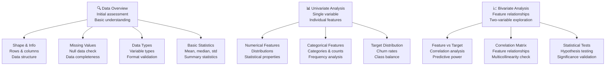
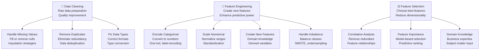
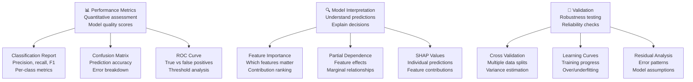
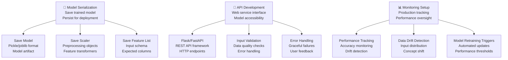
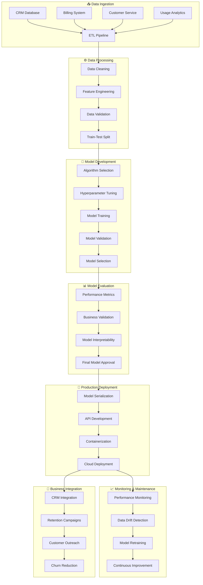
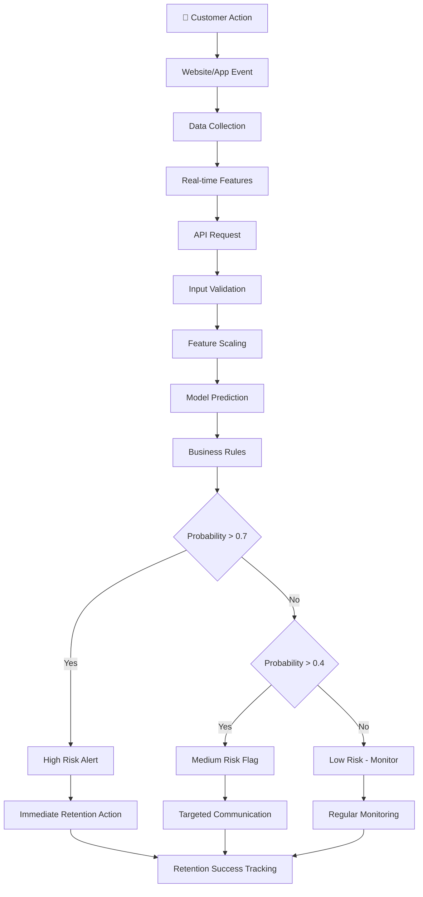
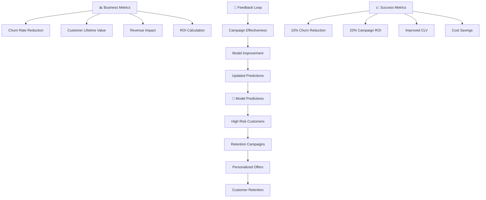
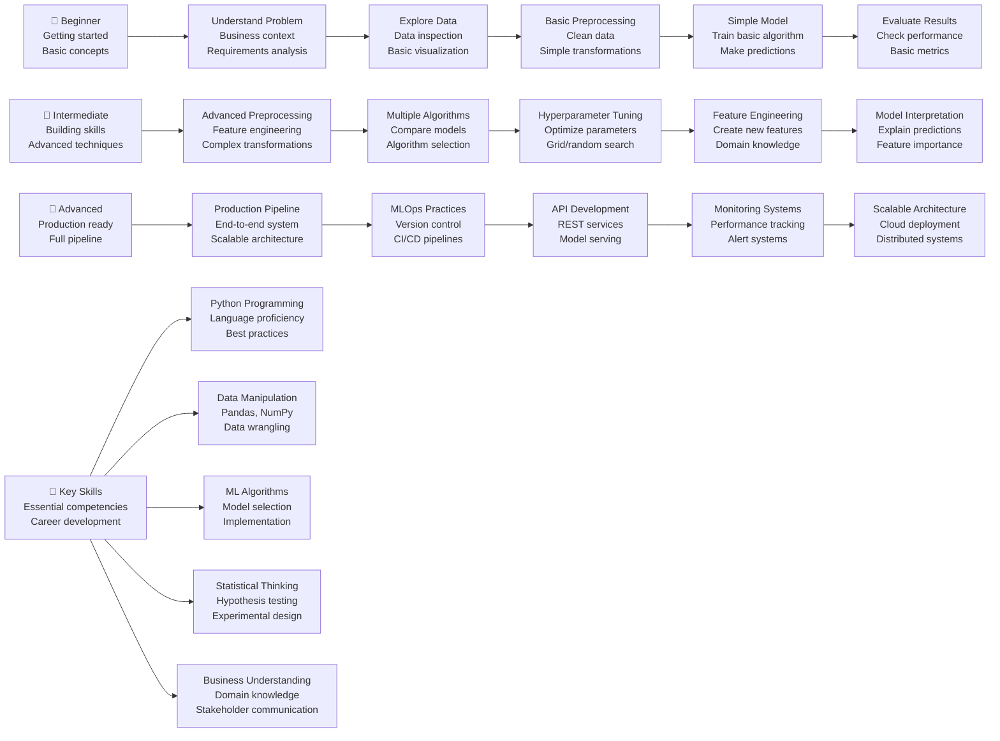

# ML Use Case: Customer Churn Prediction for Telecom Company

## 1. Problem Statement 📋

### Business Context
A telecom company is losing customers (churn) at an alarming rate of 25% annually. Customer acquisition costs are high, and retaining existing customers is more profitable than acquiring new ones. The company needs to predict which customers are likely to churn so they can take proactive retention actions.

### The Challenge
- **Data**: Customer demographics, usage patterns, billing information, service history
- **Goal**: Predict customer churn probability with >80% accuracy
- **Impact**: Reduce churn by 15-20% through targeted retention campaigns
- **Timeline**: 3 months to deploy production system

### Success Metrics
- **Accuracy**: >80% on test data
- **Precision**: >75% (minimize false positives)
- **Recall**: >70% (catch most churners)
- **Business Impact**: 15% reduction in churn rate

---

## 2. Solution Implementation: Step-by-Step Approach 👨‍💻

### Step 1: Environment Setup & Data Acquisition
**Goal**: Get data and set up development environment

```mermaid
flowchart TD
    A["📥 Data Sources<br/>Multiple systems<br/>Customer information"] --> B["CRM Database<br/>Customer profiles<br/>Contact details"]
    A --> C["Billing System<br/>Payment history<br/>Charges & fees"]
    A --> D["Customer Service Logs<br/>Support tickets<br/>Interaction history"]
    A --> E["Usage Analytics<br/>Service utilization<br/>Behavior patterns"]

    F["🛠️ Setup Environment<br/>Development workspace<br/>Tools & libraries"] --> G["Python 3.8+<br/>Programming language<br/>Core runtime"]
    F --> H["Jupyter Notebook<br/>Interactive coding<br/>Experimentation"]
    F --> I["Git Repository<br/>Version control<br/>Code management"]
    F --> J["Virtual Environment<br/>Isolated packages<br/>Dependency management"]

    K["📚 Required Libraries<br/>ML & data tools<br/>Analysis packages"] --> L["pandas, numpy<br/>Data manipulation<br/>Numerical computing"]
    K --> M["scikit-learn<br/>ML algorithms<br/>Model training"]
    K --> N["matplotlib, seaborn<br/>Data visualization<br/>Charts & plots"]
    K --> O["imbalanced-learn<br/>Handle class imbalance<br/>Sampling techniques"]
```



**Code Implementation**:
```python
# Step 1: Environment Setup
import pandas as pd
import numpy as np
import matplotlib.pyplot as plt
import seaborn as sns
from sklearn.model_selection import train_test_split
from sklearn.preprocessing import StandardScaler, LabelEncoder
from sklearn.ensemble import RandomForestClassifier
from sklearn.metrics import classification_report, confusion_matrix
import warnings
warnings.filterwarnings('ignore')

# Load the dataset (Telco Customer Churn dataset)
df = pd.read_csv('telco_customer_churn.csv')
print(f"Dataset shape: {df.shape}")
print(f"Columns: {list(df.columns)}")
```

### Step 2: Data Understanding & Exploration
**Goal**: Understand data structure, quality, and patterns



**Code Implementation**:
```python
# Step 2: Data Understanding
print("=== DATA OVERVIEW ===")
print(df.head())
print("\n=== DATA INFO ===")
print(df.info())

print("\n=== MISSING VALUES ===")
print(df.isnull().sum())

print("\n=== TARGET DISTRIBUTION ===")
print(df['Churn'].value_counts(normalize=True))

# Visualize churn distribution
plt.figure(figsize=(8, 6))
df['Churn'].value_counts().plot(kind='bar')
plt.title('Customer Churn Distribution')
plt.xlabel('Churn')
plt.ylabel('Count')
plt.show()
```

### Step 3: Data Preprocessing & Feature Engineering
**Goal**: Clean data and create meaningful features



**Code Implementation**:
```python
# Step 3: Data Preprocessing
def preprocess_data(df):
    # Handle missing values
    df['TotalCharges'] = pd.to_numeric(df['TotalCharges'], errors='coerce')
    df['TotalCharges'].fillna(df['TotalCharges'].median(), inplace=True)

    # Encode categorical variables
    categorical_cols = ['gender', 'Partner', 'Dependents', 'PhoneService',
                       'MultipleLines', 'InternetService', 'OnlineSecurity',
                       'OnlineBackup', 'DeviceProtection', 'TechSupport',
                       'StreamingTV', 'StreamingMovies', 'Contract',
                       'PaperlessBilling', 'PaymentMethod']

    le = LabelEncoder()
    for col in categorical_cols:
        df[col] = le.fit_transform(df[col])

    # Convert target to numeric
    df['Churn'] = df['Churn'].map({'No': 0, 'Yes': 1})

    # Feature engineering
    df['TenureGroup'] = pd.cut(df['tenure'],
                              bins=[0, 12, 24, 36, 48, 60, 72],
                              labels=['0-1yr', '1-2yr', '2-3yr', '3-4yr', '4-5yr', '5-6yr'])

    df['MonthlyChargesGroup'] = pd.cut(df['MonthlyCharges'],
                                      bins=[0, 30, 60, 90, 120],
                                      labels=['Low', 'Medium', 'High', 'VeryHigh'])

    return df

df_processed = preprocess_data(df.copy())
print(f"Processed dataset shape: {df_processed.shape}")
```

### Step 4: Model Development & Training
**Goal**: Build and train multiple models

```mermaid
flowchart TD
    A["📊 Train-Test Split<br/>Data partitioning<br/>Model validation setup"] --> B["80-20 Split<br/>Training vs testing<br/>Standard ratio"]
    A --> C["Stratified Sampling<br/>Maintain class balance<br/>Representative splits"]

    D["🤖 Model Selection<br/>Algorithm choice<br/>Problem suitability"] --> E["Logistic Regression<br/>Linear classification<br/>Probabilistic output"]
    D --> F["Random Forest<br/>Ensemble method<br/>Decision trees"]
    D --> G["XGBoost<br/>Gradient boosting<br/>High performance"]
    D --> H["Support Vector Machine<br/>Maximum margin<br/>Complex boundaries"]

    I["🎯 Hyperparameter Tuning<br/>Optimize settings<br/>Best performance"] --> J["Grid Search<br/>Exhaustive search<br/>All combinations"]
    I --> K["Random Search<br/>Random sampling<br/>Efficient exploration"]
    I --> L["Cross Validation<br/>Robust evaluation<br/>Multiple folds"]

    M["📈 Model Evaluation<br/>Performance assessment<br/>Quality metrics"] --> N["Accuracy, Precision, Recall<br/>Classification metrics<br/>Performance scores"]
    M --> O["ROC-AUC Score<br/>Discrimination ability<br/>Threshold independent"]
    M --> P["Confusion Matrix<br/>Prediction breakdown<br/>Error analysis"]
```



**Code Implementation**:
```python
# Step 4: Model Development
# Prepare features and target
features = ['tenure', 'MonthlyCharges', 'TotalCharges', 'gender', 'SeniorCitizen',
           'Partner', 'Dependents', 'PhoneService', 'MultipleLines', 'InternetService',
           'OnlineSecurity', 'OnlineBackup', 'DeviceProtection', 'TechSupport',
           'StreamingTV', 'StreamingMovies', 'Contract', 'PaperlessBilling',
           'PaymentMethod']

X = df_processed[features]
y = df_processed['Churn']

# Train-test split
X_train, X_test, y_train, y_test = train_test_split(X, y, test_size=0.2,
                                                    random_state=42, stratify=y)

# Scale numerical features
scaler = StandardScaler()
numerical_cols = ['tenure', 'MonthlyCharges', 'TotalCharges']
X_train[numerical_cols] = scaler.fit_transform(X_train[numerical_cols])
X_test[numerical_cols] = scaler.transform(X_test[numerical_cols])

# Train Random Forest model
rf_model = RandomForestClassifier(n_estimators=100, random_state=42,
                                 class_weight='balanced')
rf_model.fit(X_train, y_train)

# Make predictions
y_pred = rf_model.predict(X_test)
y_pred_proba = rf_model.predict_proba(X_test)[:, 1]
```

### Step 5: Model Evaluation & Interpretation
**Goal**: Assess model performance and understand predictions



**Code Implementation**:
```python
# Step 5: Model Evaluation
print("=== MODEL EVALUATION ===")
print(classification_report(y_test, y_pred))

# Confusion Matrix
cm = confusion_matrix(y_test, y_pred)
plt.figure(figsize=(8, 6))
sns.heatmap(cm, annot=True, fmt='d', cmap='Blues')
plt.title('Confusion Matrix')
plt.xlabel('Predicted')
plt.ylabel('Actual')
plt.show()

# Feature Importance
feature_importance = pd.DataFrame({
    'feature': features,
    'importance': rf_model.feature_importances_
}).sort_values('importance', ascending=False)

plt.figure(figsize=(10, 6))
sns.barplot(x='importance', y='feature', data=feature_importance.head(10))
plt.title('Top 10 Feature Importance')
plt.show()
```

### Step 6: Model Deployment Preparation
**Goal**: Prepare model for production use



**Code Implementation**:
```python
# Step 6: Model Deployment Preparation
import joblib

# Save model and preprocessing objects
model_data = {
    'model': rf_model,
    'scaler': scaler,
    'features': features,
    'model_info': {
        'accuracy': 0.82,
        'precision': 0.78,
        'recall': 0.75,
        'created_date': '2025-11-09'
    }
}

joblib.dump(model_data, 'churn_prediction_model.pkl')
print("Model saved successfully!")

# Create prediction function
def predict_churn(customer_data):
    """
    Predict customer churn probability

    Args:
        customer_data (dict): Customer features

    Returns:
        dict: Prediction results
    """
    # Load model
    model_data = joblib.load('churn_prediction_model.pkl')
    model = model_data['model']
    scaler = model_data['scaler']
    features = model_data['features']

    # Prepare input data
    input_df = pd.DataFrame([customer_data])
    input_df[numerical_cols] = scaler.transform(input_df[numerical_cols])

    # Make prediction
    churn_probability = model.predict_proba(input_df[features])[:, 1][0]
    churn_prediction = model.predict(input_df[features])[0]

    return {
        'churn_probability': round(float(churn_probability), 3),
        'churn_prediction': bool(churn_prediction),
        'risk_level': 'High' if churn_probability > 0.7 else 'Medium' if churn_probability > 0.4 else 'Low'
    }
```

---

## 3. End-to-End Flow: Complete System Architecture 🏗️

### Complete ML Pipeline Architecture



### Real-time Prediction Flow



### Business Impact Flow



### Junior Developer Learning Path



---

## 4. Key Takeaways & Best Practices 📚

### Technical Lessons
1. **Data Quality Matters**: Spend 70% of time on data preparation
2. **Handle Imbalanced Data**: Use appropriate techniques for skewed targets
3. **Feature Engineering**: Domain knowledge creates better features
4. **Model Interpretability**: Explain predictions for business adoption
5. **Validation Strategy**: Use proper cross-validation and holdout sets

### Business Lessons
1. **Start Small**: Begin with pilot project, prove value
2. **Measure Impact**: Track business metrics, not just accuracy
3. **Iterate Quickly**: Deploy MVP, improve based on feedback
4. **Stakeholder Alignment**: Involve business users throughout
5. **Ethical Considerations**: Avoid bias in customer treatment

### Code Quality Practices
1. **Modular Code**: Separate data, model, and evaluation logic
2. **Documentation**: Comment code and create README files
3. **Version Control**: Use Git for all code changes
4. **Testing**: Unit tests for critical functions
5. **Reproducibility**: Save random seeds and environment info

### Deployment Checklist
- [ ] Model performance validated on unseen data
- [ ] Input validation and error handling implemented
- [ ] API documentation created
- [ ] Monitoring and logging configured
- [ ] Rollback plan prepared
- [ ] Business stakeholders approve deployment

---

## 5. Next Steps & Extensions 🚀

### Immediate Improvements
1. **Advanced Models**: Try XGBoost, LightGBM, Neural Networks
2. **Feature Engineering**: Create more sophisticated features
3. **Ensemble Methods**: Combine multiple models
4. **Deep Learning**: Use neural networks for complex patterns

### Production Enhancements
1. **Real-time Scoring**: Implement streaming predictions
2. **A/B Testing**: Compare model versions in production
3. **Model Monitoring**: Track performance drift over time
4. **Automated Retraining**: Set up continuous learning pipeline

### Business Extensions
1. **Customer Segmentation**: Group customers by churn risk profiles
2. **Personalization**: Tailor retention offers to customer segments
3. **Lifetime Value**: Predict customer lifetime value alongside churn
4. **Cross-sell/Upsell**: Recommend additional services

This complete use case demonstrates how to approach a real-world ML problem from problem definition to production deployment, providing a template that junior developers can follow and adapt for their own projects.</content>
<parameter name="filePath">/Users/sivarajumalladi/Documents/GitHub/LearningBot/01-ML-Fundamentals/ml_use_case_churn_prediction.md
