# POC-02 Cloud AI Platform Architecture Plan

## Overview
This POC demonstrates end-to-end machine learning on Google Cloud Platform, focusing on Vertex AI for customer churn prediction with production-ready deployment.

## System Architecture

### Cloud Infrastructure Overview

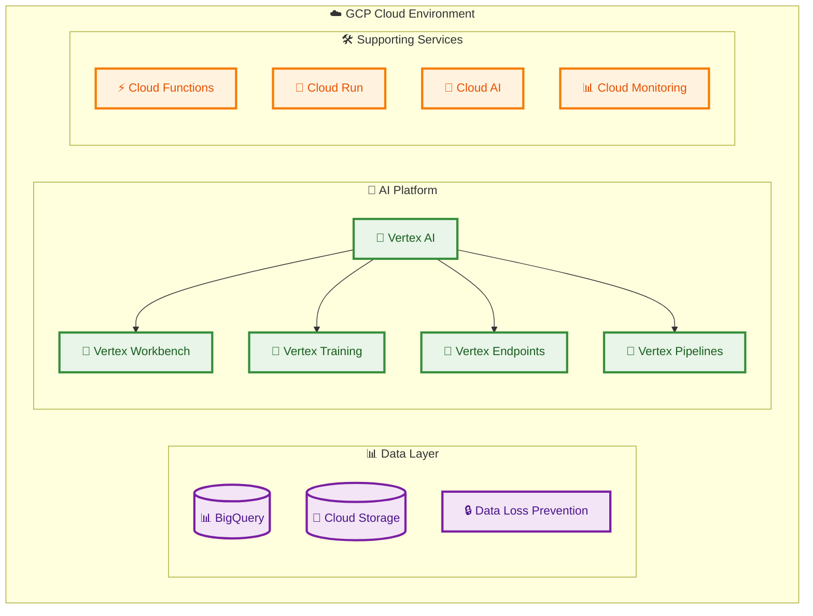

### Development Environment Setup

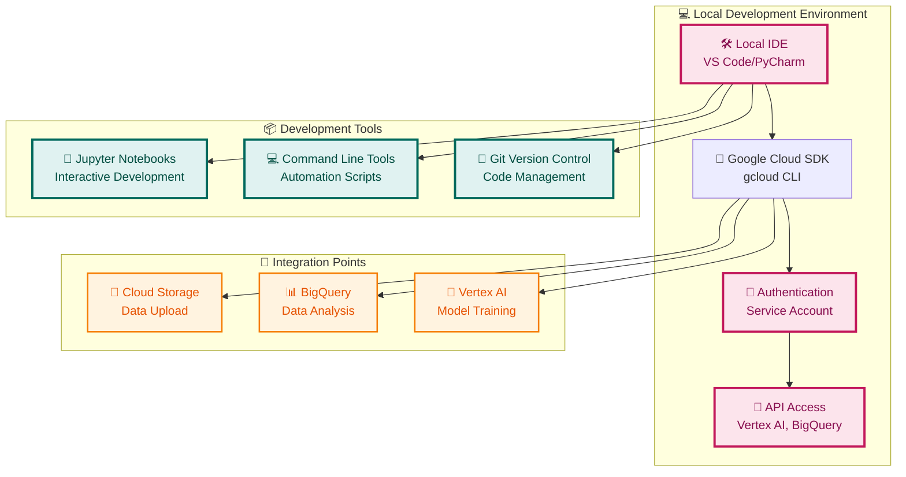

### Data Pipeline Flow

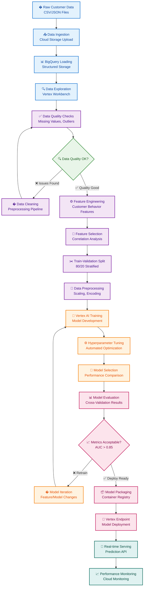

### User Interface Integration

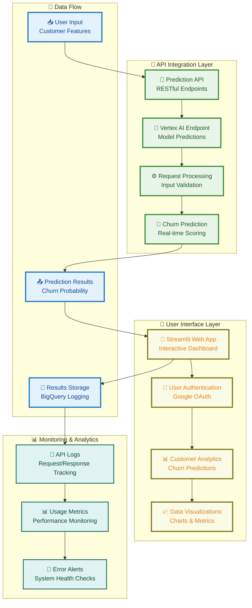

## Detailed Data Pipeline

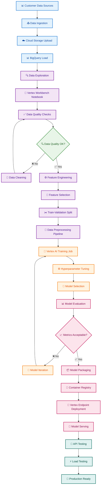

## Vertex AI Components Architecture

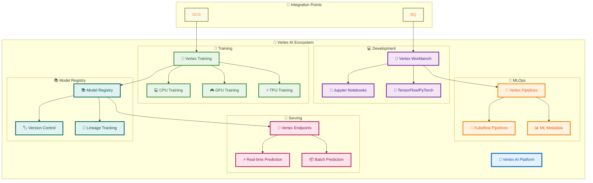

## Customer Churn Prediction Workflow

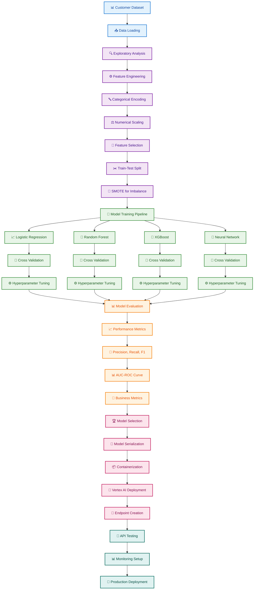

## Cloud Infrastructure Architecture

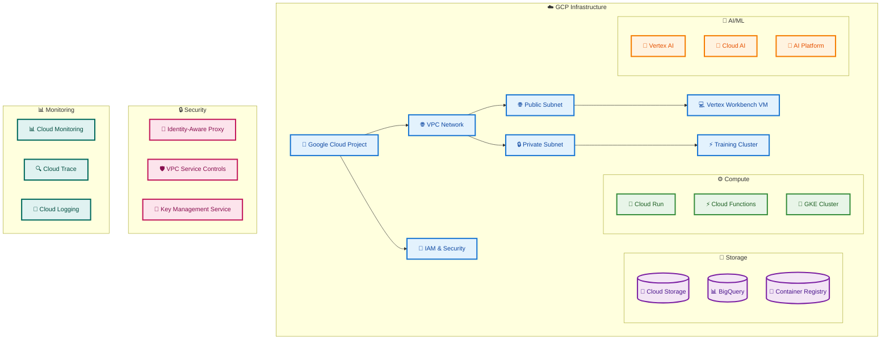

## CI/CD Pipeline Architecture

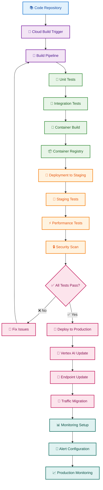

## Cost Optimization Architecture

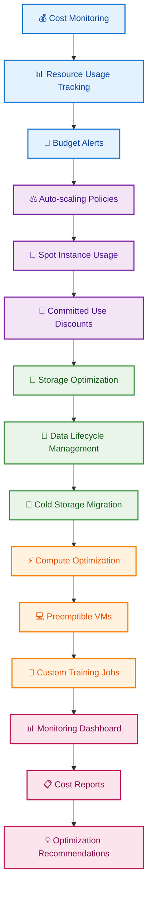

## Technology Stack Visualization

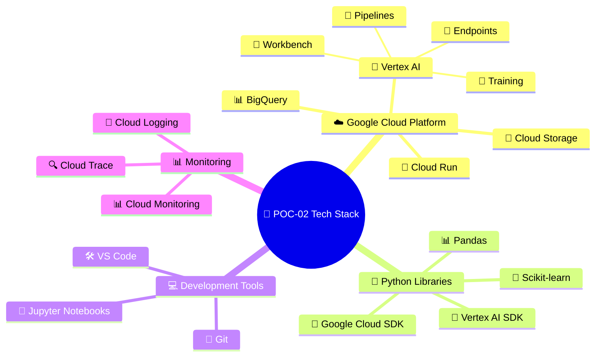

## Implementation Phases

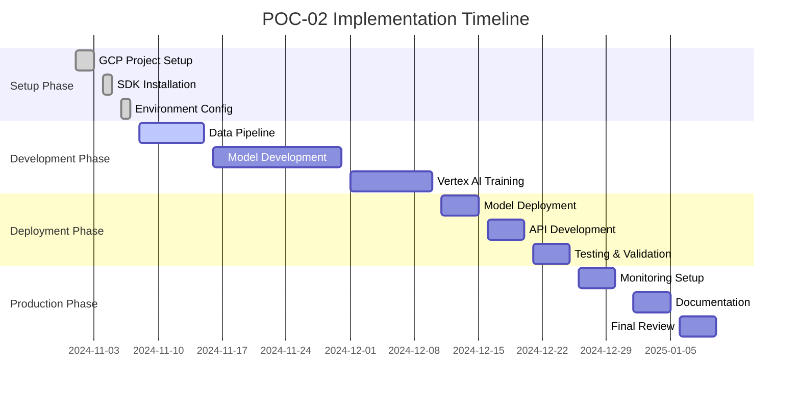

## Success Metrics Dashboard

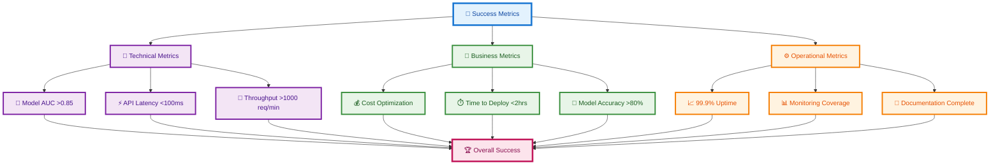
