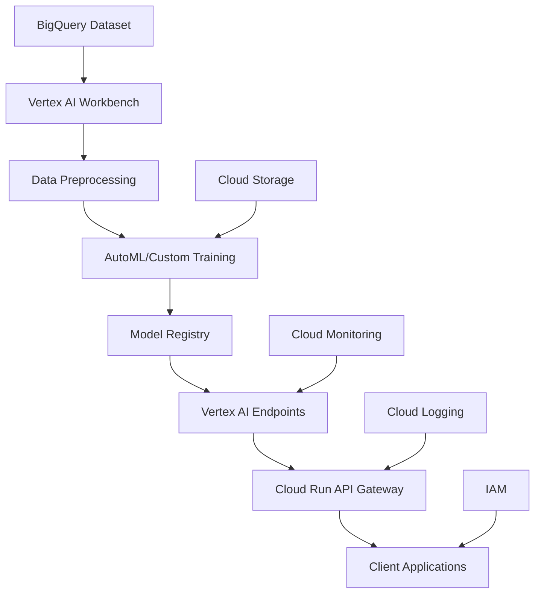
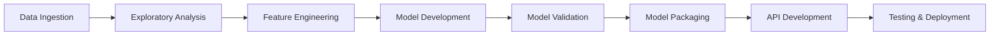
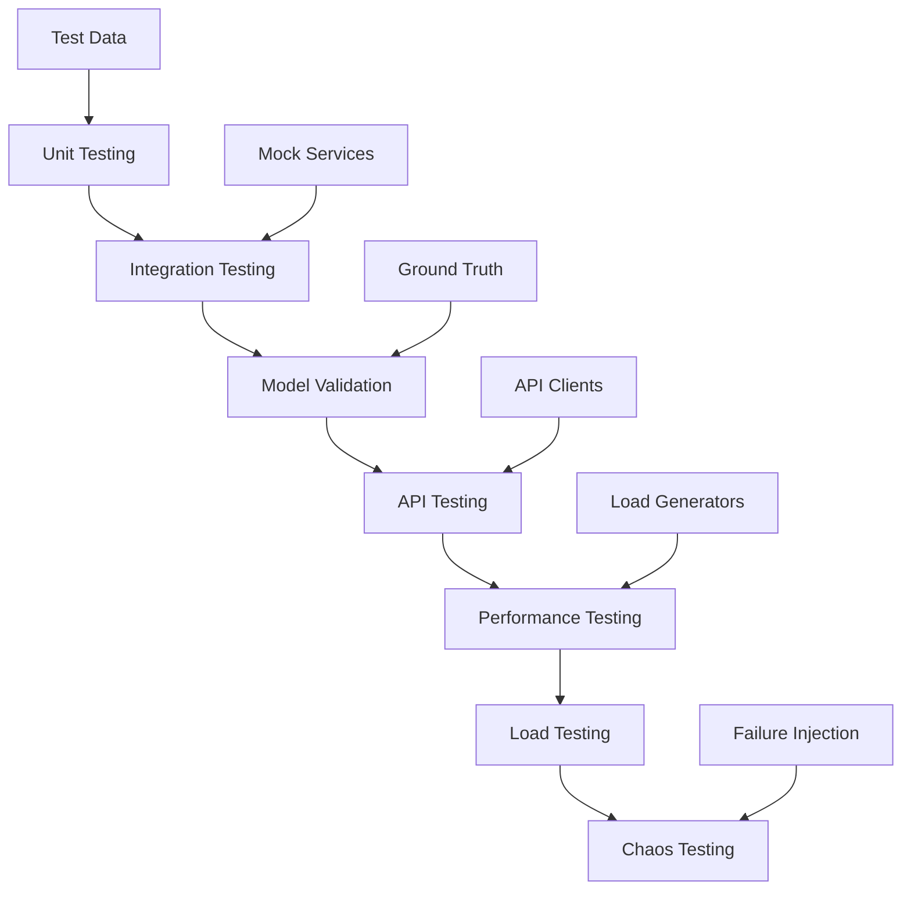
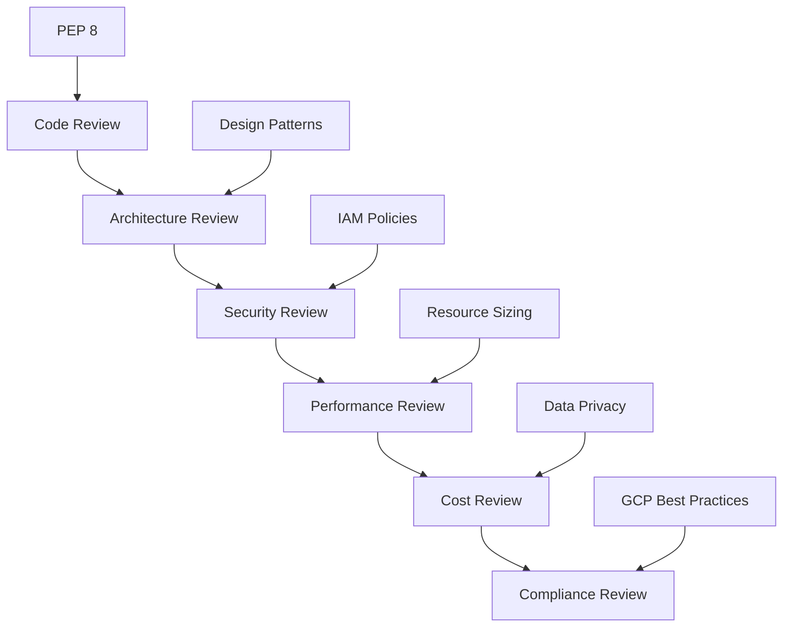
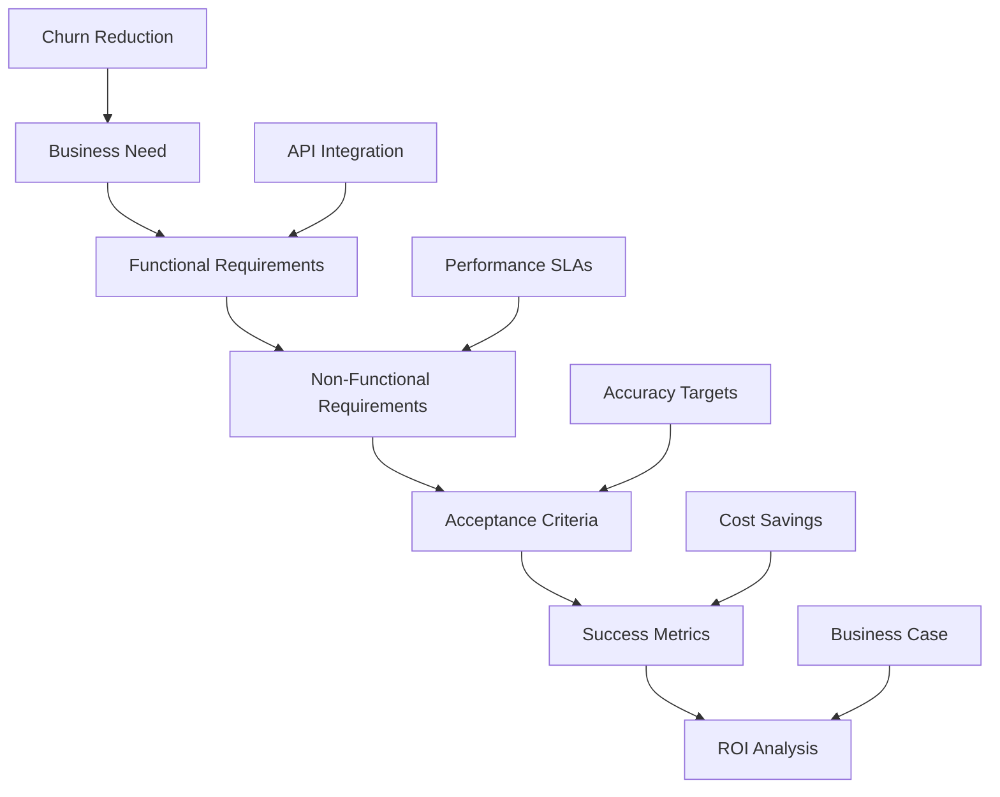
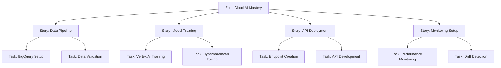
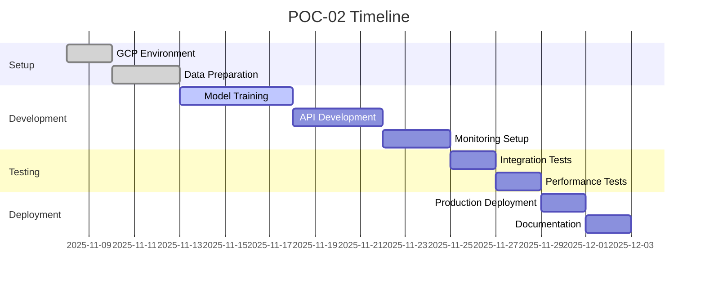

# POC-02: Cloud AI Platform - Churn Prediction Implementation Guide

## Agenda of POC
This Proof of Concept demonstrates proficiency in cloud-based AI/ML platforms by building an end-to-end churn prediction system on Google Cloud Platform. The POC showcases the ability to leverage Vertex AI for model training, deployment, and monitoring, bridging the gap between data engineering expertise and cloud AI capabilities.

### Objectives:
- Master GCP Vertex AI ecosystem
- Implement ML pipeline on cloud infrastructure
- Deploy model as production-ready API
- Set up basic monitoring and drift detection
- Demonstrate cloud-native ML development

### Success Criteria:
- Model deployed as REST API endpoint
- Sub-100ms prediction response time
- >80% precision/recall on test data
- Monitoring dashboard with drift alerts
- Cost-effective implementation within free tier limits

## Tech Stack
- **Cloud Platform**: Google Cloud Platform (GCP)
- **AI/ML Services**:
  - Vertex AI: Model training, deployment, monitoring
  - BigQuery: Data storage and analysis
  - Cloud Storage: Model artifacts storage
- **Compute**:
  - Vertex AI Workbench: Development environment
  - Cloud Run: API deployment
- **Development**:
  - Python 3.8+
  - scikit-learn, pandas, numpy
  - Flask/FastAPI: API framework
  - Docker: Containerization
- **Monitoring**:
  - Vertex AI Model Monitoring
  - Cloud Logging/Monitoring

## How to Start
### Prerequisites:
1. GCP account with billing enabled
2. Free credits activated ($300)
3. Required APIs enabled:
   - Vertex AI API
   - BigQuery API
   - Cloud Storage API
   - Cloud Run API

### Initial Setup:
```bash
# Install Google Cloud SDK
curl https://sdk.cloud.google.com | bash
exec -l $SHELL
gcloud init

# Set project
gcloud config set project YOUR_PROJECT_ID

# Enable APIs
gcloud services enable aiplatform.googleapis.com
gcloud services enable bigquery.googleapis.com
gcloud services enable run.googleapis.com
```

### Project Structure:
```
POC-02-Cloud-AI-Platform/
├── notebooks/
│   ├── 01_data_exploration.ipynb
│   ├── 02_model_training.ipynb
│   └── 03_deployment.ipynb
├── src/
│   ├── data_preparation.py
│   ├── model_training.py
│   ├── api.py
│   └── monitoring.py
├── docker/
│   └── Dockerfile
├── terraform/  # Optional for infrastructure
├── tests/
└── README.md
```

### Getting Started:
1. Create Vertex AI Workbench instance
2. Load sample telco churn dataset to BigQuery
3. Begin data exploration and preprocessing

## How to End
### Final Deliverables:
1. Trained model deployed on Vertex AI Endpoints
2. REST API accessible via public URL
3. Monitoring dashboard with performance metrics
4. Documentation with API usage examples
5. Cost analysis and optimization recommendations

### Completion Checklist:
- [ ] Model trained and evaluated on Vertex AI
- [ ] API deployed and tested
- [ ] Monitoring alerts configured
- [ ] Performance benchmarks met
- [ ] Documentation published
- [ ] Demo video recorded

## Architect View
As the Cloud Architect, I design a scalable, secure, and cost-effective ML platform on GCP.

### Architecture Overview:


### Design Principles:
- **Serverless First**: Leverage managed services for scalability
- **Security by Design**: Implement least privilege access
- **Cost Optimization**: Use appropriate instance types and auto-scaling
- **Observability**: Comprehensive logging and monitoring
- **CI/CD Ready**: Infrastructure as code with Terraform

### Technical Decisions:
- Vertex AI for unified ML platform
- BigQuery ML for initial prototyping
- Cloud Run for API deployment (cost-effective)
- Regional deployment for data residency compliance

## Developer View
As the ML Engineer, I implement the end-to-end ML pipeline using GCP services and best practices.

### Development Workflow:


### Key Implementation:
```python
# Example Vertex AI training job
from google.cloud import aiplatform

def train_churn_model():
    aiplatform.init(project=PROJECT_ID, location=REGION)

    job = aiplatform.CustomTrainingJob(
        display_name="churn-prediction-training",
        script_path="src/model_training.py",
        container_uri="gcr.io/cloud-aiplatform/training/scikit-learn-cpu.0-23:latest"
    )

    model = job.run(
        dataset=None,  # Using BigQuery directly
        model_display_name="churn-prediction-model",
        args=["--dataset", "telco_churn_data"]
    )

    return model
```

### Best Practices:
- Use managed datasets in Vertex AI
- Implement proper train/validation/test splits
- Log experiments with Vertex AI ML Metadata
- Containerize training code for reproducibility
- Use pre-built containers for faster development

## Tester View
As the QA Engineer, I validate the ML system across functional, performance, and reliability dimensions.

### Testing Strategy:


### Test Categories:
1. **Data Quality Tests**:
   - Schema validation for BigQuery tables
   - Data drift detection
   - Missing value handling verification

2. **Model Tests**:
   - Prediction accuracy on holdout sets
   - Feature importance validation
   - Model serialization/deserialization

3. **API Tests**:
   - Endpoint availability and response codes
   - Input validation and error handling
   - Authentication and authorization

4. **Performance Tests**:
   - Response time under various loads
   - Throughput and concurrency limits
   - Memory and CPU usage monitoring

### Quality Gates:
- All unit tests pass (>90% coverage)
- Model accuracy meets business requirements
- API performance within SLAs
- Security scans pass
- Load tests complete without failures

## Reviewer View
As the Technical Reviewer, I ensure the implementation follows GCP best practices and ML engineering standards.

### Review Checklist:


### Key Review Areas:
1. **GCP Best Practices**:
   - Proper use of Vertex AI services
   - Efficient BigQuery queries
   - Appropriate IAM permissions
   - Cost optimization strategies

2. **ML Engineering Standards**:
   - Reproducible model training
   - Proper evaluation metrics
   - Model versioning and lineage
   - Bias and fairness considerations

3. **Code Quality**:
   - Clean, documented code
   - Error handling and logging
   - Type hints and docstrings
   - Test coverage

4. **Security & Compliance**:
   - Data encryption in transit/rest
   - Access control implementation
   - Audit logging
   - GDPR/CCPA compliance

### Feedback Framework:
- **Must-Fix**: Security issues, compliance violations
- **Should-Fix**: Performance bottlenecks, code quality issues
- **Nice-to-Have**: Optimization opportunities, additional features

## Business Analyst View
As the Business Analyst, I ensure the POC delivers measurable business value and aligns with organizational goals.

### Business Requirements:


### Business Value Proposition:
- **Problem**: High customer churn impacting revenue
- **Solution**: Predictive model to identify at-risk customers
- **Impact**: Proactive retention strategies, reduced churn rate
- **Benefits**: Increased customer lifetime value, improved satisfaction

### Success Metrics:
- **Model Performance**: >80% precision in identifying churners
- **Operational Efficiency**: <100ms prediction latency
- **Cost Effectiveness**: Implementation within free tier limits
- **Scalability**: Handle 1000+ predictions per minute

### Stakeholder Analysis:
- **Data Science Team**: Model accuracy and interpretability
- **Engineering Team**: API reliability and performance
- **Business Users**: Ease of integration and actionable insights
- **Executives**: ROI and strategic alignment

## Product Owner View
As the Product Owner, I define the product vision and ensure the POC delivers value to the AI/ML career transition.

### Product Vision:
Demonstrate cloud-native ML capabilities that position me as a Cloud Data Architect + AI Integrator, commanding ₹70L+ compensation.

### Product Backlog:


### Prioritization (MoSCoW):
- **Must Have**: Model training and deployment
- **Should Have**: Basic monitoring and API
- **Could Have**: Advanced features like A/B testing
- **Won't Have**: Multi-model serving (future POC)

### Definition of Done:
- [ ] Model achieves >80% accuracy
- [ ] API responds in <100ms
- [ ] Monitoring alerts configured
- [ ] Documentation complete
- [ ] Demo successfully presented

### Roadmap:


### KPIs:
- **Technical**: Model accuracy, API latency, uptime
- **Business**: Portfolio enhancement, skill demonstration
- **Learning**: GCP expertise gained, best practices learned
- **Career**: Interview opportunities generated

This guide provides a comprehensive framework for implementing POC-02, ensuring all perspectives are considered for successful delivery of cloud-based AI capabilities.