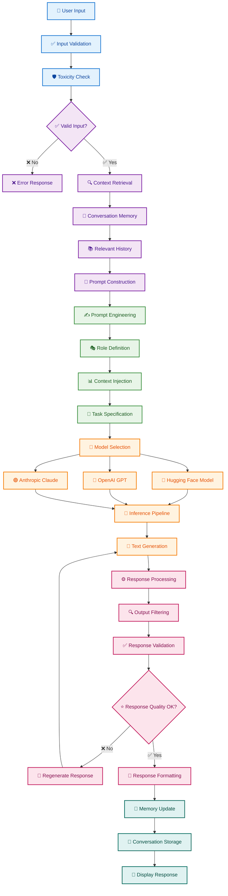
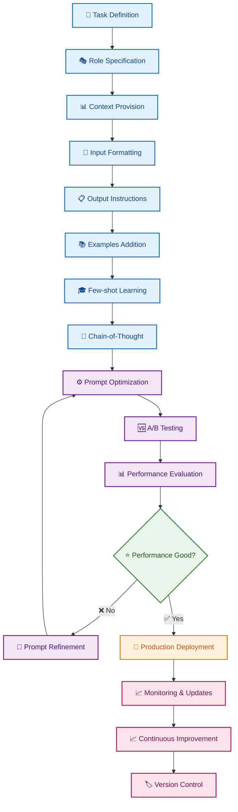
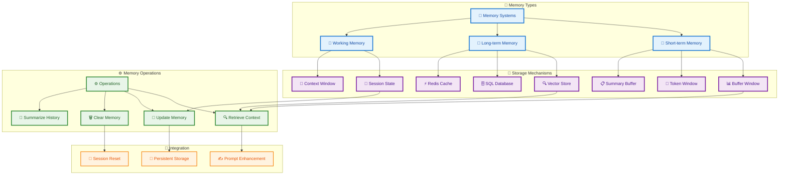
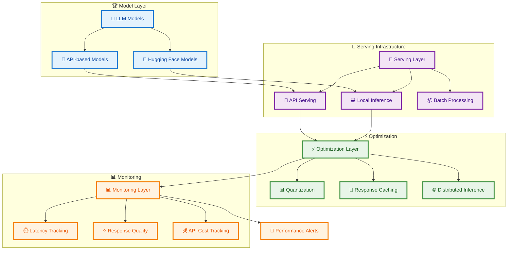
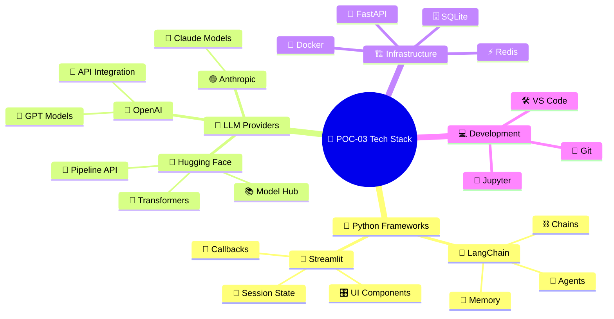
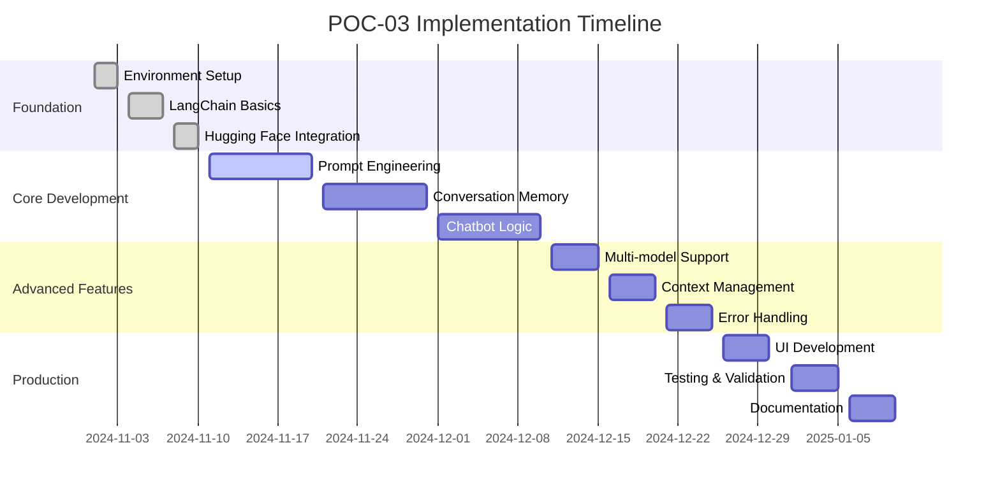
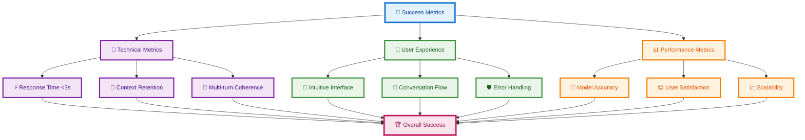

# POC-03 LLM Essentials Architecture Plan

## Overview
This POC builds a conversational chatbot using Large Language Models, demonstrating prompt engineering, conversation memory, and API integration with Hugging Face Transformers and LangChain.

## System Architecture

```mermaid
graph TB
    %% Define styles
    classDef frontendClass fill:#e3f2fd,stroke:#1976d2,stroke-width:3px,color:#0d47a1
    classDef appClass fill:#f3e5f5,stroke:#7b1fa2,stroke-width:3px,color:#4a148c
    classDef aiClass fill:#e8f5e8,stroke:#388e3c,stroke-width:3px,color:#1b5e20
    classDef dataClass fill:#fff3e0,stroke:#f57c00,stroke-width:3px,color:#e65100
    classDef externalClass fill:#fce4ec,stroke:#c2185b,stroke-width:3px,color:#880e4f
    classDef deployClass fill:#e0f2f1,stroke:#00695c,stroke-width:3px,color:#004d40

    subgraph "🤖 LLM Application Stack"
        subgraph "🎨 Frontend Layer"
            UI[🎨 Streamlit Interface]
            UI --> CHAT[💬 Chat Interface]
            CHAT --> HIST[📚 Conversation History]
        end

        subgraph "⚙️ Application Layer"
            APP[🚀 Flask/FastAPI Backend]
            APP --> LC[🔗 LangChain Framework]
            LC --> PE[✍️ Prompt Engineering]
            LC --> CM[🧠 Conversation Memory]
        end

        subgraph "🧠 AI/ML Layer"
            HF[🤗 Hugging Face Hub]
            HF --> TRANS[🔄 Transformers Library]
            TRANS --> MODEL[🏆 Pre-trained Models]
            MODEL --> GEN[📝 Text Generation]
        end

        subgraph "💾 Data Layer"
            DB[(💾 SQLite/Redis)]
            DB --> CONV[💬 Conversation Storage]
            DB --> PROMPTS[📋 Prompt Templates]
        end
    end

    subgraph "🌐 External Services"
        API1[🤗 Hugging Face API]
        API2[🔵 OpenAI API (Optional)]
        API3[🟣 Anthropic API (Optional)]
    end

    subgraph "🚀 Deployment"
        DOCKER[🐳 Docker Container]
        DOCKER --> DEPLOY[☁️ Cloud Deployment]
        DEPLOY --> MONITOR[📊 Application Monitoring]
    end

    %% Apply styles
    class UI,CHAT,HIST frontendClass
    class APP,LC,PE,CM appClass
    class HF,TRANS,MODEL,GEN aiClass
    class DB,CONV,PROMPTS dataClass
    class API1,API2,API3 externalClass
    class DOCKER,DEPLOY,MONITOR deployClass
```

## Detailed Chatbot Workflow



## LangChain Architecture

```mermaid
graph TD
    %% Define styles
    classDef coreClass fill:#e3f2fd,stroke:#1976d2,stroke-width:4px,color:#0d47a1
    classDef chainClass fill:#f3e5f5,stroke:#7b1fa2,stroke-width:3px,color:#4a148c
    classDef memoryClass fill:#e8f5e8,stroke:#388e3c,stroke-width:3px,color:#1b5e20
    classDef integrationClass fill:#fff3e0,stroke:#f57c00,stroke-width:2px,color:#e65100

    subgraph "🔗 LangChain Core"
        LC[🔗 LangChain Framework]
        LC --> LLM[🧠 LLM Interface]
        LC --> PROMPT[📝 Prompt Templates]
        LC --> CHAIN[⛓️ Chain Components]
        LC --> MEM[🧠 Memory Systems]
    end

    subgraph "⛓️ Chain Types"
        CHAIN --> SEQ[🔄 Sequential Chains]
        CHAIN --> PAR[⚡ Parallel Chains]
        CHAIN --> COND[🔀 Conditional Chains]
        CHAIN --> CUST[🎯 Custom Chains]
    end

    subgraph "🧠 Memory Systems"
        MEM --> CONV_MEM[💬 Conversation Memory]
        MEM --> BUF_MEM[📊 Buffer Memory]
        MEM --> SUM_MEM[📋 Summary Memory]
        MEM --> ENT_MEM[🏷️ Entity Memory]
    end

    subgraph "🔌 Integration Points"
        LLM --> HF_INT[🤗 Hugging Face]
        LLM --> OAI_INT[🔵 OpenAI]
        LLM --> ANT_INT[🟣 Anthropic]

        PROMPT --> JINJA[🎨 Jinja2 Templates]
        PROMPT --> FSTR[📝 F-String Templates]
    end

    %% Apply styles
    class LC,LLM,PROMPT,CHAIN,MEM coreClass
    class SEQ,PAR,COND,CUST chainClass
    class CONV_MEM,BUF_MEM,SUM_MEM,ENT_MEM memoryClass
    class HF_INT,OAI_INT,ANT_INT,JINJA,FSTR integrationClass
```



## Prompt Engineering Pipeline



## Conversation Memory Architecture



## Model Serving Architecture



## Data Flow Architecture

```mermaid
graph TD
    %% Define styles
    classDef inputClass fill:#e3f2fd,stroke:#1976d2,stroke-width:2px,color:#0d47a1
    classDef contextClass fill:#f3e5f5,stroke:#7b1fa2,stroke-width:2px,color:#4a148c
    classDef promptClass fill:#e8f5e8,stroke:#388e3c,stroke-width:2px,color:#1b5e20
    classDef inferenceClass fill:#fff3e0,stroke:#f57c00,stroke-width:2px,color:#e65100
    classDef outputClass fill:#fce4ec,stroke:#c2185b,stroke-width:2px,color:#880e4f

    subgraph "📥 Input Processing"
        IN[💬 User Input]
        IN --> VAL[✅ Validation]
        VAL --> CLEAN[🧹 Cleaning]
        CLEAN --> TOKEN[🔢 Tokenization]
    end

    subgraph "🧠 Context Management"
        TOKEN --> MEM_CHECK[🧠 Memory Check]
        MEM_CHECK --> RETRIEVE[🔍 Context Retrieval]
        RETRIEVE --> COMBINE[🔗 Context Combination]
    end

    subgraph "✍️ Prompt Engineering"
        COMBINE --> PROMPT_BUILD[📝 Prompt Construction]
        PROMPT_BUILD --> TEMPLATE[📋 Template Application]
        TEMPLATE --> FORMAT[🎨 Final Formatting]
    end

    subgraph "🔮 Inference"
        FORMAT --> MODEL[🧠 Model Inference]
        MODEL --> GEN[📝 Text Generation]
        GEN --> POST[⚙️ Post-processing]
    end

    subgraph "📤 Output Handling"
        POST --> FILTER[🔍 Content Filtering]
        FILTER --> FORMAT_OUT[🎨 Output Formatting]
        FORMAT_OUT --> STORE[🔄 Memory Update]
    end

    STORE --> DISPLAY[📱 User Display]
    DISPLAY --> LOG[📝 Interaction Logging]

    %% Apply styles
    class IN,VAL,CLEAN,TOKEN inputClass
    class MEM_CHECK,RETRIEVE,COMBINE contextClass
    class PROMPT_BUILD,TEMPLATE,FORMAT promptClass
    class MODEL,GEN,POST inferenceClass
    class FILTER,FORMAT_OUT,STORE,DISPLAY,LOG outputClass
```



## Technology Stack Visualization



## Implementation Phases



## Success Metrics Dashboard


