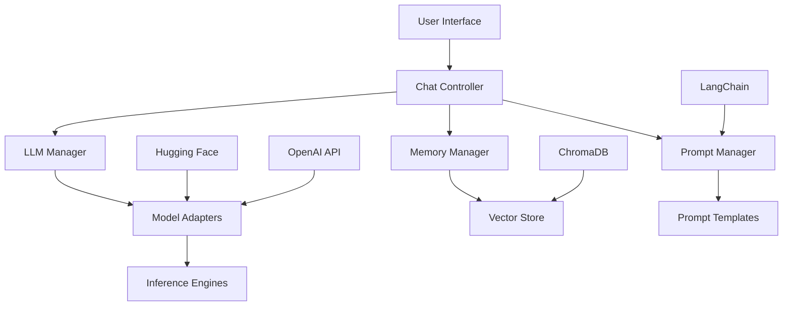
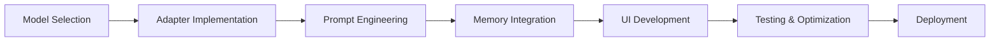
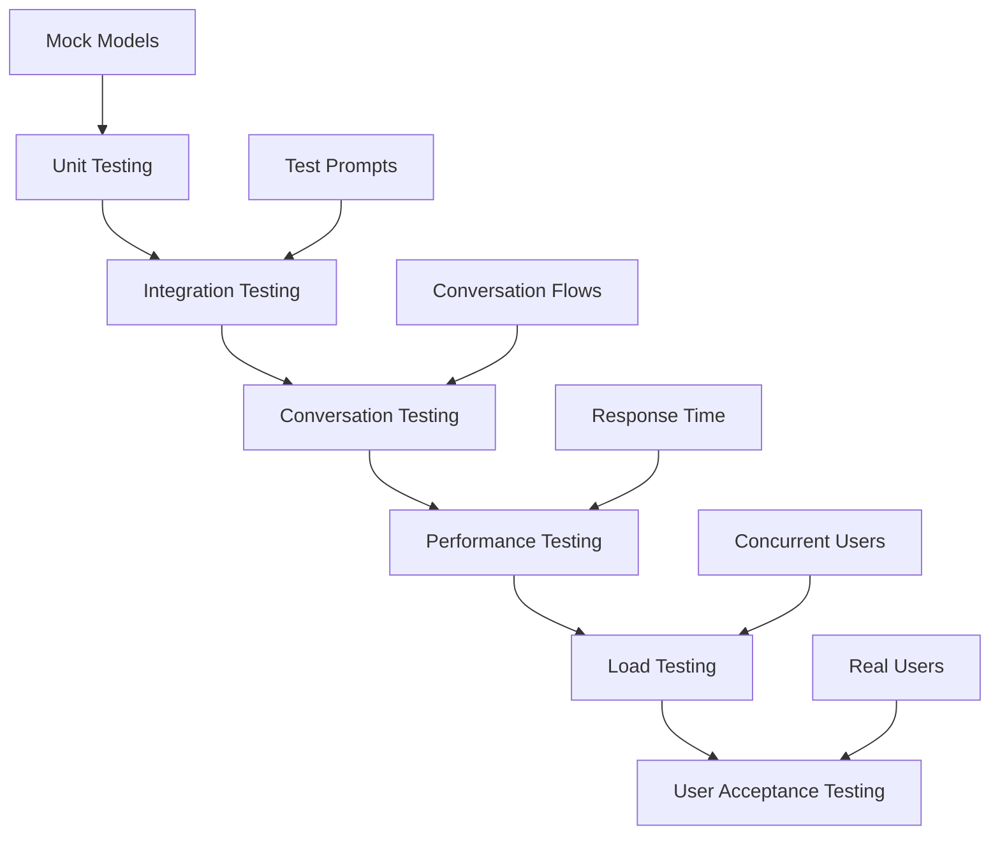
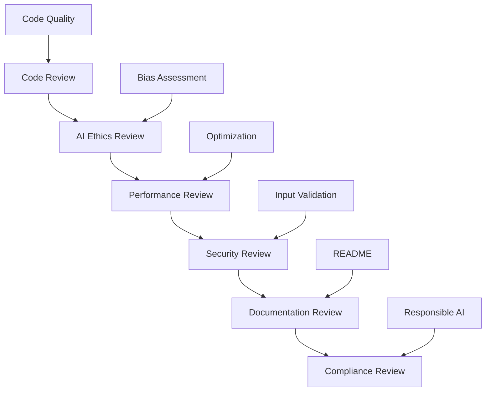
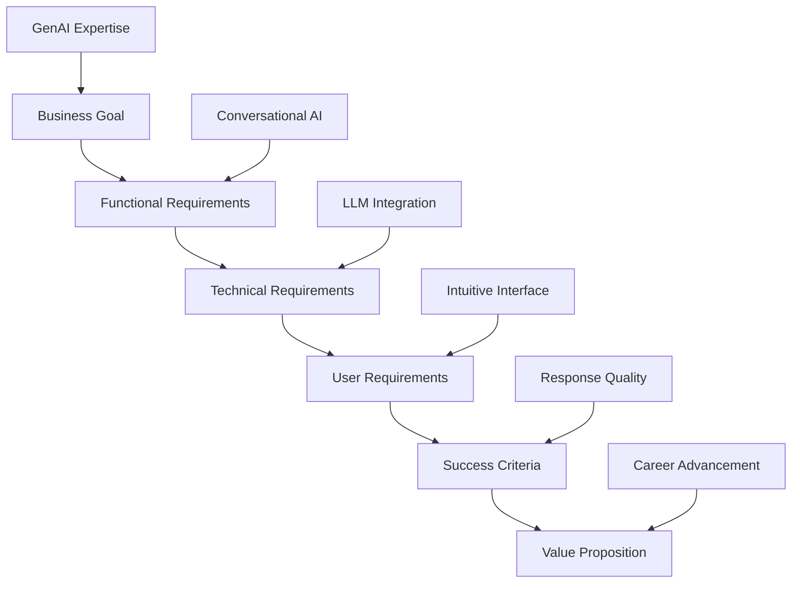
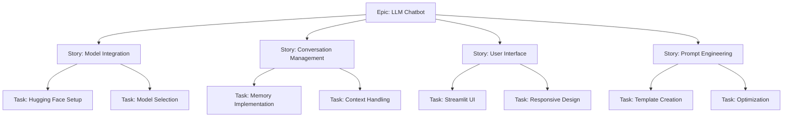
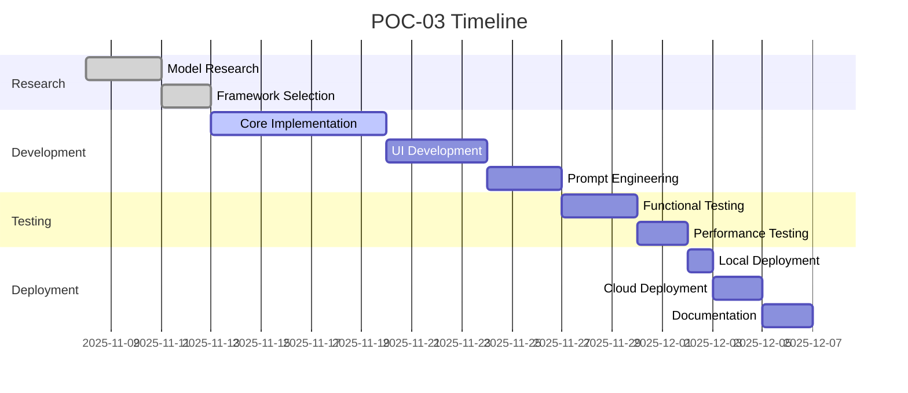

# POC-03: LLM Essentials - Chatbot Implementation Guide

## Agenda of POC
This Proof of Concept focuses on building foundational skills in Large Language Models (LLMs) by creating a simple chatbot application. The POC demonstrates understanding of LLM architecture, prompt engineering, and integration with modern NLP frameworks, establishing credibility in the rapidly growing GenAI space.

### Objectives:
- Understand LLM fundamentals and transformer architecture
- Implement effective prompt engineering techniques
- Build conversational AI using LangChain and Hugging Face
- Create user-friendly chatbot interface
- Learn model deployment and inference optimization

### Success Criteria:
- Chatbot provides coherent responses to 10 test queries
- Response time <5 seconds per query
- Proper error handling and conversation flow
- Clean, documented code with deployment instructions
- Demonstration of prompt engineering best practices

## Tech Stack
- **LLM Frameworks**:
  - Hugging Face Transformers: Model loading and inference
  - LangChain: LLM application development framework
- **Programming Language**: Python 3.8+
- **UI Frameworks**:
  - Streamlit: Web interface for chatbot
  - Gradio: Alternative lightweight interface
- **Model Options**:
  - Open-source: Llama 2, Mistral, or Falcon (via Hugging Face)
  - API-based: OpenAI GPT models (for comparison)
- **Supporting Libraries**:
  - torch: Deep learning framework
  - accelerate: Model optimization
  - sentence-transformers: Text embeddings
- **Deployment**:
  - Local: Streamlit run
  - Cloud: Hugging Face Spaces (free tier)

## How to Start
### Prerequisites:
1. Python environment with GPU support (recommended)
2. Hugging Face account and API token
3. Sufficient RAM (16GB+ for larger models)

### Initial Setup:
```bash
# Install dependencies
pip install transformers torch langchain streamlit huggingface_hub accelerate

# Login to Hugging Face
huggingface-cli login

# Optional: Install Gradio
pip install gradio
```

### Project Structure:
```
POC-03-LLM-Essentials/
├── app/
│   ├── chatbot.py
│   ├── prompts.py
│   └── config.py
├── models/
│   ├── llama_chatbot.py
│   ├── openai_chatbot.py
│   └── base_chatbot.py
├── ui/
│   ├── streamlit_app.py
│   ├── gradio_app.py
│   └── components.py
├── tests/
│   ├── test_chatbot.py
│   └── test_prompts.py
├── notebooks/
│   └── experimentation.ipynb
├── requirements.txt
└── README.md
```

### Getting Started:
1. Set up Hugging Face authentication
2. Choose and download a base model (start with smaller ones)
3. Implement basic text generation
4. Build conversation memory

## How to End
### Final Deliverables:
1. Functional chatbot application
2. Multiple model implementations (open-source + API)
3. Prompt engineering examples and templates
4. Performance benchmarks and comparisons
5. Deployment guide and live demo
6. Documentation with usage examples

### Completion Checklist:
- [ ] Basic chatbot responding to queries
- [ ] Prompt engineering demonstrated
- [ ] Multiple models integrated
- [ ] UI deployed and accessible
- [ ] Error handling implemented
- [ ] Performance optimized
- [ ] Documentation complete

## Architect View
As the AI Architect, I design a modular, scalable chatbot system that can evolve with LLM advancements.

### Architecture Overview:


### Design Principles:
- **Modularity**: Separate concerns for UI, logic, and models
- **Extensibility**: Easy addition of new models and features
- **Scalability**: Support for multiple concurrent users
- **Observability**: Comprehensive logging and monitoring
- **Security**: Input validation and rate limiting

### Technical Decisions:
- LangChain for framework consistency
- Abstract base classes for model adapters
- Conversation memory for context awareness
- Prompt templates for consistency
- Error boundaries for graceful failure handling

## Developer View
As the AI Developer, I implement the core chatbot logic using modern LLM development practices.

### Development Workflow:


### Key Implementation:
```python
# Example LangChain chatbot implementation
from langchain.llms import HuggingFacePipeline
from langchain.chains import ConversationChain
from langchain.memory import ConversationBufferMemory
from transformers import pipeline

class LLMChatbot:
    def __init__(self, model_name="microsoft/DialoGPT-medium"):
        # Initialize model
        self.pipeline = pipeline(
            "text-generation",
            model=model_name,
            device=0 if torch.cuda.is_available() else -1
        )

        # Create LangChain LLM
        self.llm = HuggingFacePipeline(pipeline=self.pipeline)

        # Set up memory
        self.memory = ConversationBufferMemory()

        # Create conversation chain
        self.chain = ConversationChain(
            llm=self.llm,
            memory=self.memory,
            verbose=True
        )

    def chat(self, user_input):
        try:
            response = self.chain.predict(input=user_input)
            return response
        except Exception as e:
            return f"Error: {str(e)}"
```

### Best Practices:
- Use quantization for memory efficiency
- Implement proper token limits
- Add conversation context management
- Include fallback responses for errors
- Log interactions for improvement

## Tester View
As the QA Engineer, I validate the chatbot's functionality, reliability, and user experience.

### Testing Strategy:


### Test Categories:
1. **Functional Tests**:
   - Model loading and initialization
   - Text generation quality
   - Conversation memory persistence
   - Error handling and recovery

2. **Conversation Tests**:
   - Context awareness in multi-turn conversations
   - Prompt injection prevention
   - Response relevance and coherence
   - Fallback behavior for unclear inputs

3. **Performance Tests**:
   - Response latency under normal load
   - Memory usage and GPU utilization
   - Throughput for concurrent requests
   - Model warm-up and cold start times

4. **User Experience Tests**:
   - Interface usability and accessibility
   - Error message clarity
   - Conversation flow naturalness
   - Mobile responsiveness

### Quality Metrics:
- Response coherence score >0.8
- Average response time <3 seconds
- Conversation success rate >90%
- User satisfaction rating >4/5

## Reviewer View
As the Technical Reviewer, I ensure the LLM implementation follows AI engineering best practices and ethical guidelines.

### Review Checklist:


### Key Review Areas:
1. **AI Ethics & Bias**:
   - Bias detection in training data
   - Fairness in response generation
   - Transparency in model decisions
   - User privacy protection

2. **Technical Excellence**:
   - Efficient model loading and inference
   - Proper memory management
   - Error handling and logging
   - Code modularity and reusability

3. **Security Considerations**:
   - Input sanitization and validation
   - Rate limiting and abuse prevention
   - Secure API key management
   - Data leakage prevention

4. **Performance & Scalability**:
   - Model size vs. performance trade-offs
   - Concurrent user handling
   - Resource utilization optimization
   - Caching strategies

### Feedback Framework:
- **Critical**: Security vulnerabilities, ethical concerns
- **Major**: Performance issues, architectural flaws
- **Minor**: Code style, documentation gaps
- **Enhancement**: Feature suggestions, optimizations

## Business Analyst View
As the Business Analyst, I ensure the POC demonstrates business value and market readiness for GenAI roles.

### Business Requirements:


### Business Value Proposition:
- **Problem**: Lack of hands-on GenAI experience for senior data engineers
- **Solution**: Practical LLM implementation showcasing integration skills
- **Impact**: Credible portfolio piece for ₹70L+ GenAI roles
- **Benefits**: Demonstrates cutting-edge AI capabilities, positions as LLM expert

### Success Metrics:
- **Technical**: Coherent responses, fast inference, error-free operation
- **User**: Intuitive interface, engaging conversations
- **Business**: Portfolio enhancement, interview differentiation
- **Learning**: Deep understanding of LLM architectures and prompt engineering

### Stakeholder Analysis:
- **Hiring Managers**: Proof of GenAI hands-on experience
- **Technical Teams**: Integration capabilities with existing systems
- **Product Teams**: Understanding of conversational AI applications
- **Career Advisors**: Demonstration of forward-thinking skills

## Product Owner View
As the Product Owner, I define the chatbot product vision and prioritize features for maximum career impact.

### Product Vision:
Create a sophisticated yet accessible LLM chatbot that showcases advanced AI integration skills, positioning me as a leader in Generative AI applications for enterprise data platforms.

### Product Backlog:


### Prioritization (MoSCoW):
- **Must Have**: Basic chatbot with coherent responses
- **Should Have**: Conversation memory and prompt engineering
- **Could Have**: Multiple model support and advanced UI
- **Won't Have**: Voice integration or multi-language support

### Definition of Done:
- [ ] Chatbot generates relevant responses
- [ ] Conversation context maintained
- [ ] UI is user-friendly and responsive
- [ ] Prompts are well-engineered and documented
- [ ] Performance meets requirements
- [ ] Code is production-ready

### Roadmap:


### KPIs:
- **Quality**: Response coherence and relevance
- **Performance**: Response time and resource usage
- **Usability**: User satisfaction and ease of use
- **Impact**: Portfolio value and career opportunities
- **Learning**: Skills acquired and knowledge gained

This comprehensive guide ensures POC-03 delivers a robust LLM chatbot that demonstrates advanced AI capabilities and supports the transition to high-value GenAI roles.