# POC-04 End-to-End ML Pipeline Architecture Plan

## Overview
This POC builds a complete machine learning pipeline for customer churn prediction, from real-time data ingestion through model deployment, demonstrating production-ready MLOps practices.

## System Architecture

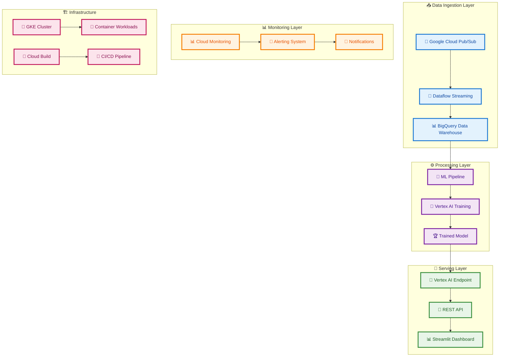

## Complete Data Pipeline Flow

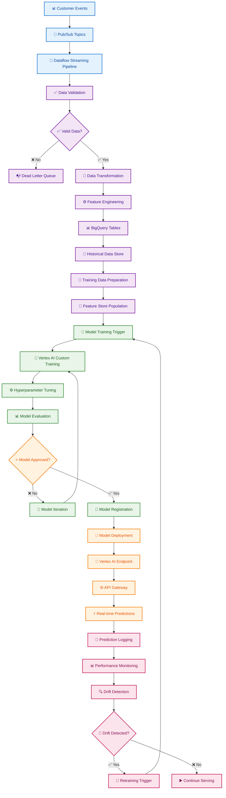

## Real-time Data Ingestion Architecture

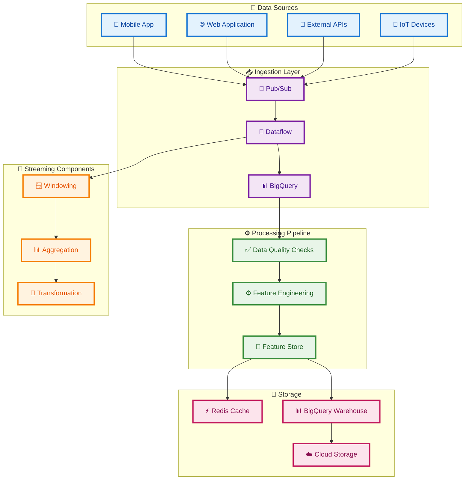

## ML Pipeline Architecture

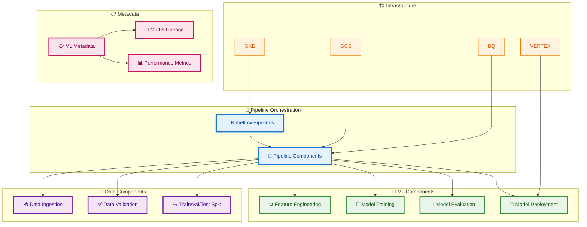

## Model Training and Evaluation Flow

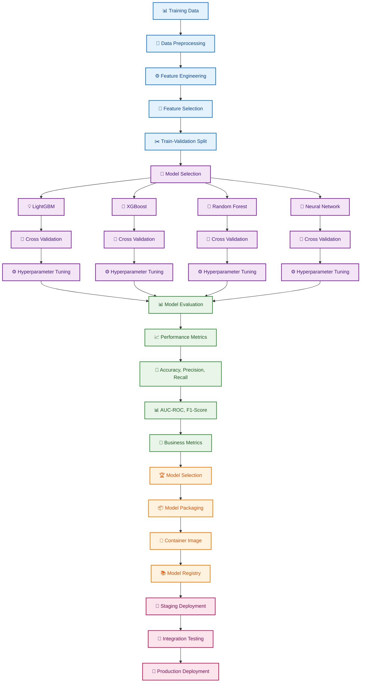

## Model Serving and API Architecture

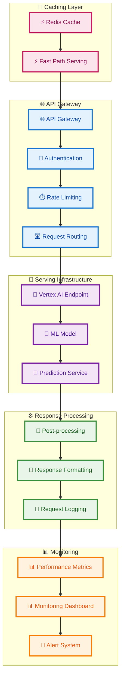

## Monitoring and Observability Architecture

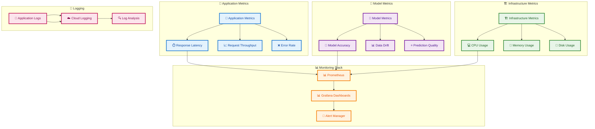

## CI/CD Pipeline Architecture

```mermaid
graph LR
    %% Define styles
    classDef sourceClass fill:#e3f2fd,stroke:#1976d2,stroke-width:3px,color:#0d47a1
    classDef buildClass fill:#f3e5f5,stroke:#7b1fa2,stroke-width:3px,color:#4a148c
    classDef testClass fill:#e8f5e8,stroke:#388e3c,stroke-width:3px,color:#1b5e20
    classDef deployClass fill:#fff3e0,stroke:#f57c00,stroke-width:3px,color:#e65100
    classDef monitorClass fill:#fce4ec,stroke:#c2185b,stroke-width:3px,color:#880e4f

    subgraph "📂 Source Control"
        GITHUB[📂 GitHub Repository]
        GITHUB --> WEBHOOK[🔗 Webhook Trigger]
    end

    subgraph "🏗️ Build Stage"
        CLOUDBUILD[🏗️ Cloud Build]
        CLOUDBUILD --> DOCKER[🐳 Docker Build]
        DOCKER --> ARTIFACTS[📦 Build Artifacts]
    end

    subgraph "🧪 Testing Stage"
        UNIT_TESTS[🧪 Unit Tests]
        INTEGRATION_TESTS[🔗 Integration Tests]
        MODEL_TESTS[🤖 Model Validation Tests]
    end

    subgraph "🚀 Deployment Stage"
        STAGING[🚀 Staging Environment]
        STAGING --> PRODUCTION[🎯 Production Environment]
        PRODUCTION --> ROLLBACK[↩️ Rollback Strategy]
    end

    subgraph "📊 Monitoring"
        HEALTH_CHECKS[💚 Health Checks]
        HEALTH_CHECKS --> METRICS[📊 Performance Metrics]
        METRICS --> ALERTS[🚨 Automated Alerts]
    end

    WEBHOOK --> CLOUDBUILD
    ARTIFACTS --> UNIT_TESTS
    UNIT_TESTS --> INTEGRATION_TESTS
    INTEGRATION_TESTS --> MODEL_TESTS
    MODEL_TESTS --> STAGING
    STAGING --> PRODUCTION
    PRODUCTION --> HEALTH_CHECKS

    %% Apply styles
    class GITHUB,WEBHOOK sourceClass
    class CLOUDBUILD,DOCKER,ARTIFACTS buildClass
    class UNIT_TESTS,INTEGRATION_TESTS,MODEL_TESTS testClass
    class STAGING,PRODUCTION,ROLLBACK deployClass
    class HEALTH_CHECKS,METRICS,ALERTS monitorClass
```

## Technology Stack

```mermaid
graph TD
    %% Define styles
    classDef dataClass fill:#e3f2fd,stroke:#1976d2,stroke-width:3px,color:#0d47a1
    classDef mlClass fill:#f3e5f5,stroke:#7b1fa2,stroke-width:3px,color:#4a148c
    classDef infraClass fill:#e8f5e8,stroke:#388e3c,stroke-width:3px,color:#1b5e20
    classDef devopsClass fill:#fff3e0,stroke:#f57c00,stroke-width:3px,color:#e65100
    classDef monitoringClass fill:#fce4ec,stroke:#c2185b,stroke-width:3px,color:#880e4f

    subgraph "📊 Data & Storage"
        BIGQUERY[📊 BigQuery]
        GCS[☁️ Cloud Storage]
        PUBSUB[📨 Pub/Sub]
        BIGTABLE[📋 Bigtable]
    end

    subgraph "🤖 ML & AI"
        VERTEX_AI[🤖 Vertex AI]
        TENSORFLOW[🧠 TensorFlow]
        SCIKIT_LEARN[🔬 Scikit-learn]
        KUBEFLOW[⚙️ Kubeflow]
    end

    subgraph "🏗️ Infrastructure"
        GCE[💻 Compute Engine]
        GKE[🚢 Kubernetes Engine]
        CLOUD_FUNCTIONS[⚡ Cloud Functions]
        API_GATEWAY[🌐 API Gateway]
    end

    subgraph "🔧 DevOps & CI/CD"
        CLOUDBUILD[🏗️ Cloud Build]
        CONTAINER_REGISTRY[🐳 Container Registry]
        TERRAFORM[🏗️ Terraform]
        GITHUB_ACTIONS[⚙️ GitHub Actions]
    end

    subgraph "📈 Monitoring & Logging"
        CLOUD_MONITORING[📊 Cloud Monitoring]
        CLOUD_LOGGING[📝 Cloud Logging]
        PROMETHEUS[📊 Prometheus]
        GRAFANA[📊 Grafana]
    end

    BIGQUERY --> VERTEX_AI
    GCS --> VERTEX_AI
    PUBSUB --> GCE
    VERTEX_AI --> GKE
    GKE --> API_GATEWAY
    CLOUDBUILD --> GKE
    CLOUD_MONITORING --> GKE

    %% Apply styles
    class BIGQUERY,GCS,PUBSUB,BIGTABLE dataClass
    class VERTEX_AI,TENSORFLOW,SCIKIT_LEARN,KUBEFLOW mlClass
    class GCE,GKE,CLOUD_FUNCTIONS,API_GATEWAY infraClass
    class CLOUDBUILD,CONTAINER_REGISTRY,TERRAFORM,GITHUB_ACTIONS devopsClass
    class CLOUD_MONITORING,CLOUD_LOGGING,PROMETHEUS,GRAFANA monitoringClass
```

## Implementation Phases

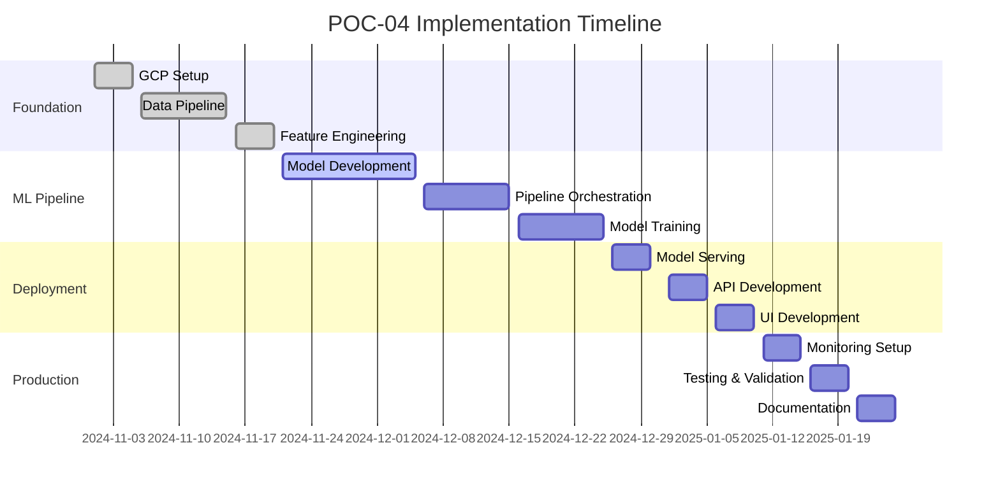

## Success Metrics Dashboard

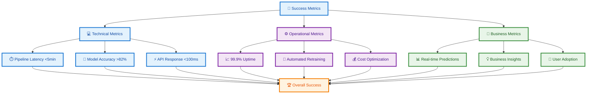
