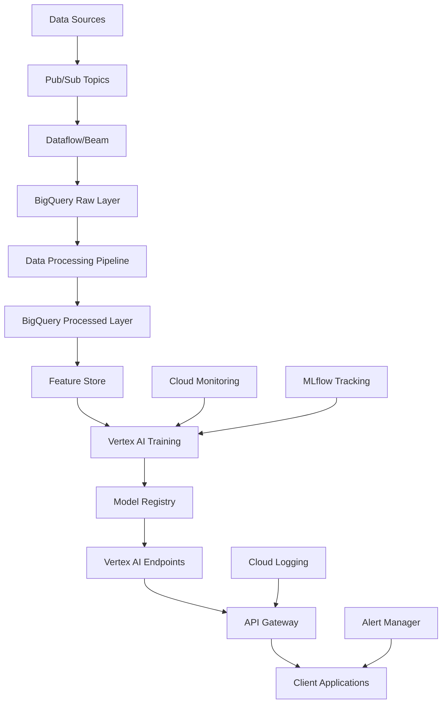
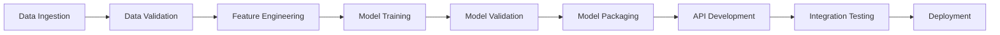
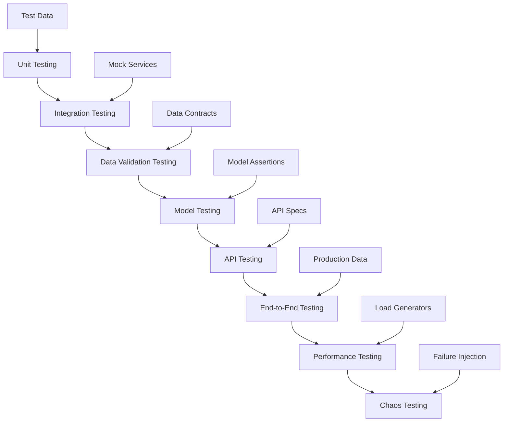
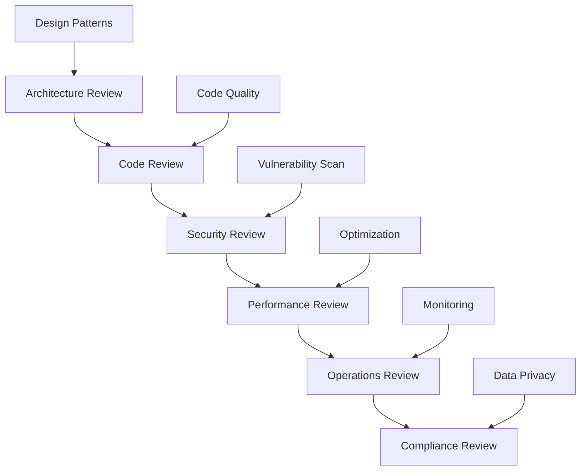
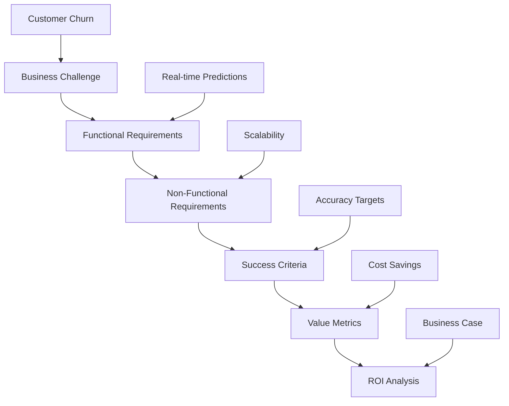
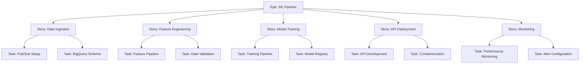
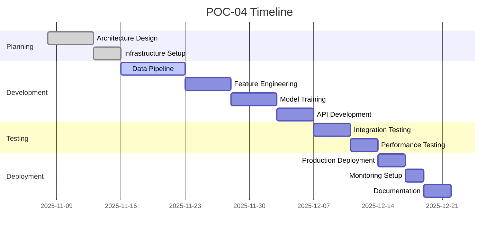

# POC-04: End-to-End ML Pipeline - Churn Prediction Implementation Guide

## Agenda of POC
This comprehensive Proof of Concept builds a production-grade ML pipeline for customer churn prediction, integrating real-time data streaming, model training, and API deployment. The POC demonstrates enterprise-level ML engineering skills, combining data engineering expertise with MLOps practices to create a scalable, monitored system.

### Objectives:
- Design and implement data ingestion pipeline with streaming data
- Build feature engineering and model training workflows
- Deploy model with real-time prediction capabilities
- Set up monitoring, logging, and automated retraining
- Demonstrate full ML lifecycle management
- Showcase cloud-native architecture patterns

### Success Criteria:
- Real-time predictions with <1 second latency
- Model accuracy >82% on production data
- Automated pipeline with CI/CD integration
- Comprehensive monitoring and alerting
- Containerized deployment ready for production
- Full documentation and deployment guides

## Tech Stack
- **Data Processing**:
  - Google BigQuery: Data warehouse and analytics
  - Google Pub/Sub: Real-time data streaming
  - Apache Spark: Large-scale data processing
- **ML Platform**:
  - Vertex AI: Model training, deployment, monitoring
  - MLflow: Experiment tracking and model registry
  - scikit-learn: ML algorithms and preprocessing
- **API & Deployment**:
  - Flask/FastAPI: REST API framework
  - Docker: Containerization
  - Google Cloud Run: Serverless deployment
- **CI/CD & Orchestration**:
  - GitHub Actions: Automated pipelines
  - Apache Airflow: Workflow orchestration
- **Monitoring & Observability**:
  - Google Cloud Monitoring: System metrics
  - Vertex AI Model Monitoring: Model performance
  - ELK Stack: Logging and visualization

## How to Start
### Prerequisites:
1. GCP project with necessary APIs enabled
2. Service account with appropriate permissions
3. GitHub repository for CI/CD
4. Docker installed locally

### Initial Setup:
```bash
# Enable required GCP APIs
gcloud services enable bigquery.googleapis.com
gcloud services enable pubsub.googleapis.com
gcloud services enable aiplatform.googleapis.com
gcloud services enable run.googleapis.com

# Create service account
gcloud iam service-accounts create ml-pipeline-sa
gcloud projects add-iam-policy-binding $PROJECT_ID \
  --member="serviceAccount:ml-pipeline-sa@$PROJECT_ID.iam.gserviceaccount.com" \
  --role="roles/bigquery.admin"
```

### Project Structure:
```
POC-04-End-to-End-ML-Pipeline/
├── data/
│   ├── raw/
│   ├── processed/
│   └── schemas/
├── src/
│   ├── ingestion/
│   │   ├── pubsub_publisher.py
│   │   └── bigquery_loader.py
│   ├── processing/
│   │   ├── feature_engineering.py
│   │   └── data_validation.py
│   ├── training/
│   │   ├── model_trainer.py
│   │   └── hyperparameter_tuning.py
│   ├── serving/
│   │   ├── api.py
│   │   └── model_server.py
│   └── monitoring/
│       ├── drift_detector.py
│       └── performance_monitor.py
├── infrastructure/
│   ├── terraform/
│   └── docker/
├── pipelines/
│   ├── airflow_dags/
│   └── github_workflows/
├── tests/
├── docs/
└── README.md
```

### Getting Started:
1. Set up BigQuery dataset and tables
2. Configure Pub/Sub topic and subscription
3. Implement data ingestion pipeline
4. Create initial feature engineering scripts

## How to End
### Final Deliverables:
1. Complete ML pipeline from data ingestion to prediction
2. Deployed REST API with real-time scoring
3. Automated training and deployment pipelines
4. Monitoring dashboards and alerting system
5. Comprehensive documentation and architecture diagrams
6. Performance benchmarks and cost analysis

### Completion Checklist:
- [ ] Data pipeline ingesting real-time data
- [ ] Feature engineering pipeline operational
- [ ] Model training automated and versioned
- [ ] API deployed and serving predictions
- [ ] Monitoring and alerting configured
- [ ] CI/CD pipeline fully automated
- [ ] Documentation complete and accessible

## Architect View
As the Enterprise Architect, I design a scalable, reliable ML platform that integrates seamlessly with existing data infrastructure.

### Architecture Overview:


### Design Principles:
- **Event-Driven**: Asynchronous processing for scalability
- **Layered Architecture**: Clear separation of concerns
- **Microservices**: Independent, deployable components
- **Observability**: Comprehensive monitoring and logging
- **Security**: Data encryption and access controls
- **Cost Optimization**: Right-sizing resources and auto-scaling

### Technical Decisions:
- BigQuery for data lakehouse architecture
- Pub/Sub for decoupling data producers/consumers
- Vertex AI for unified ML platform
- Cloud Run for cost-effective API deployment
- Terraform for infrastructure as code
- GitOps for deployment automation

## Developer View
As the ML Engineer, I implement the core pipeline components using best practices for production ML systems.

### Development Workflow:


### Key Implementation:
```python
# Example feature engineering pipeline
from google.cloud import bigquery
import pandas as pd
from sklearn.preprocessing import StandardScaler, OneHotEncoder
from sklearn.compose import ColumnTransformer

class FeaturePipeline:
    def __init__(self, project_id, dataset_id):
        self.client = bigquery.Client(project=project_id)
        self.dataset = dataset_id
        self.scaler = StandardScaler()
        self.encoder = OneHotEncoder(sparse=False, handle_unknown='ignore')

    def extract_features(self, table_name, date_column):
        query = f"""
        SELECT
            customer_id,
            {date_column} as event_date,
            tenure,
            monthly_charges,
            total_charges,
            contract_type,
            payment_method,
            churn_label
        FROM `{self.dataset}.{table_name}`
        WHERE {date_column} >= DATE_SUB(CURRENT_DATE(), INTERVAL 90 DAY)
        """
        return self.client.query(query).to_dataframe()

    def transform_features(self, df):
        # Handle missing values
        df = df.fillna({'total_charges': 0})

        # Create derived features
        df['charges_per_tenure'] = df['total_charges'] / (df['tenure'] + 1)
        df['is_high_value'] = (df['monthly_charges'] > df['monthly_charges'].quantile(0.75)).astype(int)

        # Define preprocessing
        numeric_features = ['tenure', 'monthly_charges', 'total_charges', 'charges_per_tenure']
        categorical_features = ['contract_type', 'payment_method']

        preprocessor = ColumnTransformer(
            transformers=[
                ('num', self.scaler, numeric_features),
                ('cat', self.encoder, categorical_features)
            ])

        # Fit and transform
        X = preprocessor.fit_transform(df)
        y = df['churn_label'].values

        return X, y, preprocessor
```

### Best Practices:
- Use typed configurations for pipeline parameters
- Implement comprehensive error handling and retries
- Add logging at appropriate levels
- Write unit tests for all components
- Use dependency injection for testability
- Follow twelve-factor app principles

## Tester View
As the QA Engineer, I ensure the ML pipeline meets production quality standards across all components.

### Testing Strategy:


### Test Categories:
1. **Data Pipeline Tests**:
   - Schema validation for BigQuery tables
   - Data quality checks (completeness, accuracy)
   - Streaming data ingestion verification
   - ETL transformation accuracy

2. **ML Model Tests**:
   - Feature engineering correctness
   - Model training reproducibility
   - Prediction accuracy and stability
   - Model serialization/deserialization

3. **API & Integration Tests**:
   - Endpoint functionality and error handling
   - Request/response validation
   - Authentication and authorization
   - Cross-component integration

4. **Performance & Reliability Tests**:
   - Throughput and latency benchmarks
   - Memory and CPU usage monitoring
   - Fault tolerance and recovery
   - Scalability under load

### Quality Gates:
- All unit tests pass (>90% coverage)
- Integration tests successful in staging
- Performance benchmarks met
- Security and compliance scans pass
- Manual QA sign-off for critical paths

## Reviewer View
As the Technical Reviewer, I ensure the pipeline implementation follows enterprise ML engineering standards.

### Review Checklist:


### Key Review Areas:
1. **Architecture & Design**:
   - Scalability and maintainability
   - Separation of concerns
   - Error handling and resilience
   - Technology choices justification

2. **Code Quality & Standards**:
   - Clean, documented code
   - Proper testing coverage
   - Performance optimizations
   - Security best practices

3. **ML Engineering Best Practices**:
   - Data versioning and lineage
   - Model reproducibility
   - Experiment tracking
   - Bias and fairness considerations

4. **Operational Excellence**:
   - Monitoring and alerting
   - Logging and observability
   - Disaster recovery
   - Cost optimization

### Feedback Framework:
- **Critical**: Security issues, data breaches, system failures
- **Major**: Performance degradation, architectural flaws
- **Minor**: Code style issues, documentation gaps
- **Enhancement**: Feature improvements, optimization opportunities

## Business Analyst View
As the Business Analyst, I ensure the ML pipeline delivers measurable business value and ROI.

### Business Requirements:


### Business Value Proposition:
- **Problem**: Reactive churn management leading to revenue loss
- **Solution**: Proactive churn prediction with real-time interventions
- **Impact**: 15-25% reduction in churn rate through targeted retention
- **Benefits**: Increased customer lifetime value, improved satisfaction, competitive advantage

### Success Metrics:
- **Model Performance**: >82% prediction accuracy, >80% precision/recall
- **Operational**: <1 second prediction latency, 99.9% uptime
- **Business**: Measurable churn reduction, positive ROI within 6 months
- **Technical**: Pipeline reliability, cost efficiency

### Stakeholder Analysis:
- **Business Leaders**: ROI and strategic impact
- **Data Teams**: Technical implementation and maintenance
- **Customer Success**: Actionable insights and intervention tools
- **IT Operations**: System reliability and scalability
- **Compliance**: Data privacy and regulatory requirements

## Product Owner View
As the Product Owner, I define the ML pipeline product vision and prioritize features for enterprise deployment.

### Product Vision:
Deliver a production-ready ML pipeline that demonstrates enterprise-grade ML engineering capabilities, enabling proactive customer retention and positioning me as a Cloud Data Architect + AI Integrator commanding ₹70L+ compensation.

### Product Backlog:


### Prioritization (MoSCoW):
- **Must Have**: Core pipeline from data to prediction
- **Should Have**: Monitoring and automated retraining
- **Could Have**: Advanced features like A/B testing
- **Won't Have**: Multi-tenant support (out of scope)

### Definition of Done:
- [ ] Data flows from source to BigQuery successfully
- [ ] Features engineered and validated
- [ ] Model trained and deployed to Vertex AI
- [ ] API serves predictions with proper error handling
- [ ] Monitoring alerts configured and tested
- [ ] Documentation complete for operations team
- [ ] Performance benchmarks met

### Roadmap:


### KPIs:
- **Technical**: Pipeline reliability, prediction accuracy, system performance
- **Business**: Churn reduction impact, ROI achievement
- **Operational**: Uptime, incident response time, cost efficiency
- **Quality**: Code coverage, test pass rate, documentation completeness
- **Career**: Portfolio value, interview success rate

This comprehensive guide ensures POC-04 delivers an enterprise-grade ML pipeline that demonstrates advanced data engineering and MLOps capabilities for high-value career positioning.