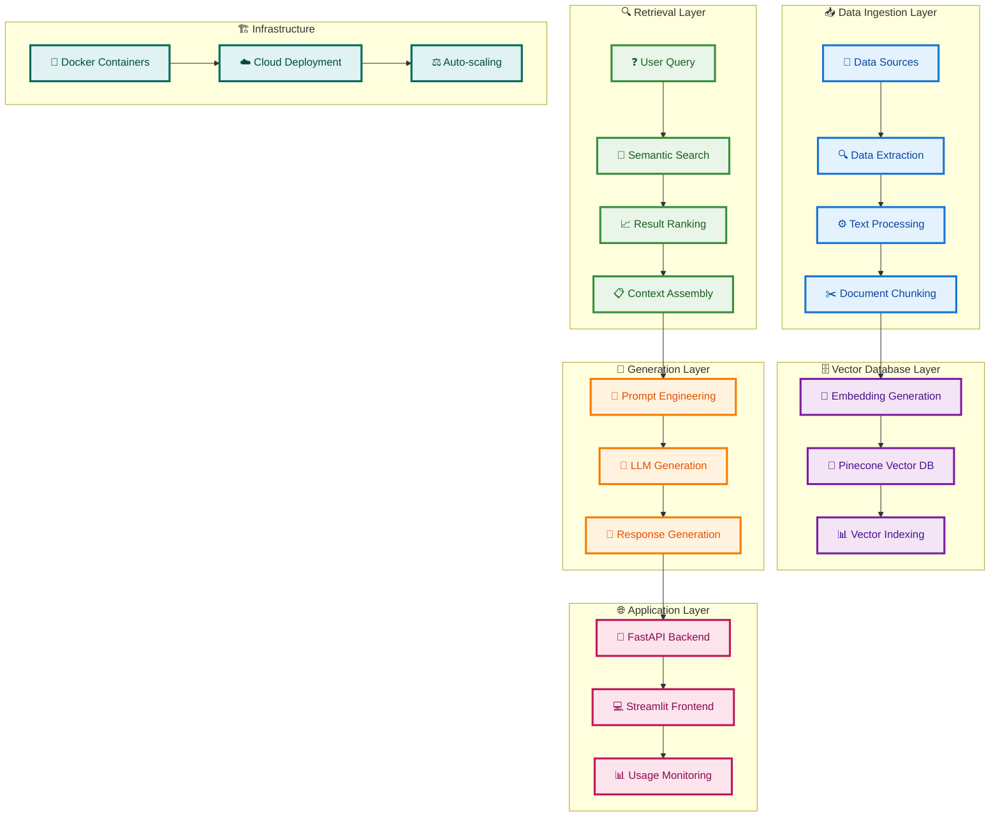
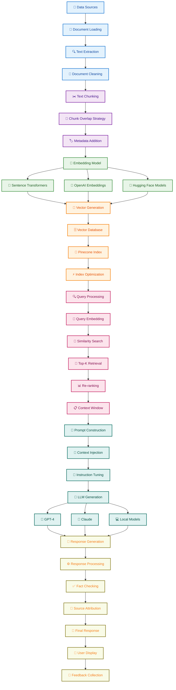
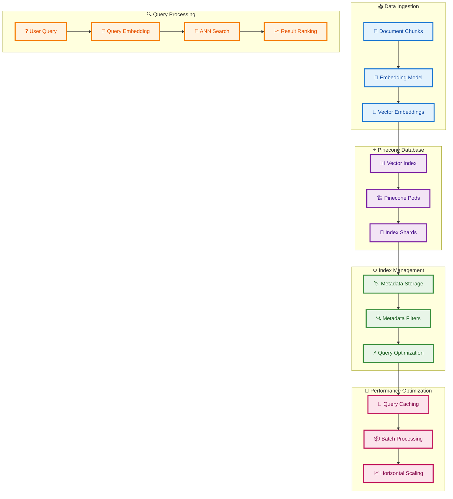
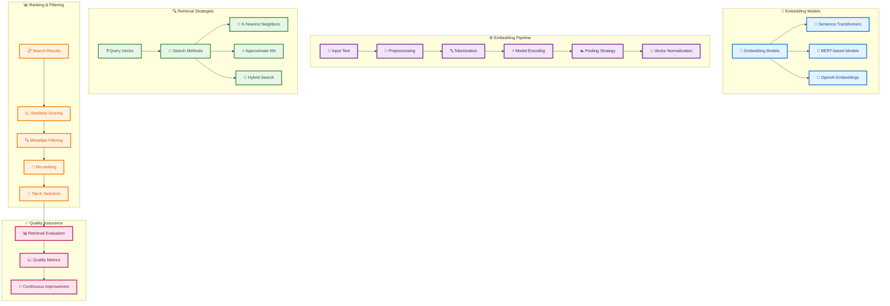
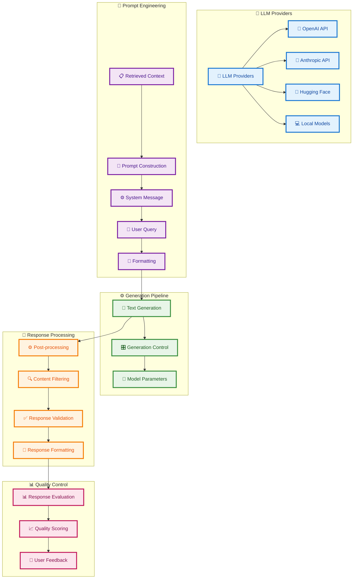
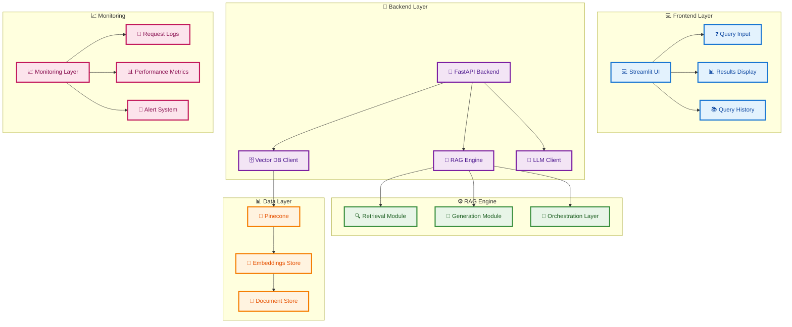
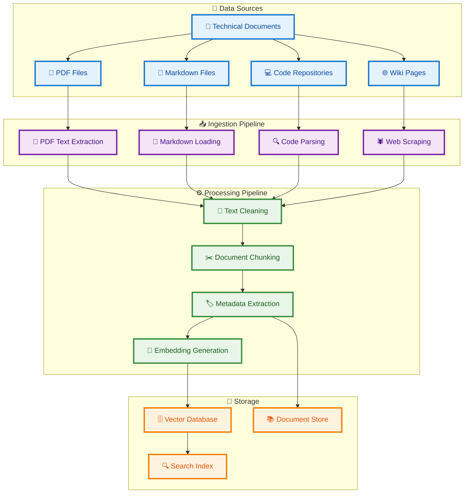
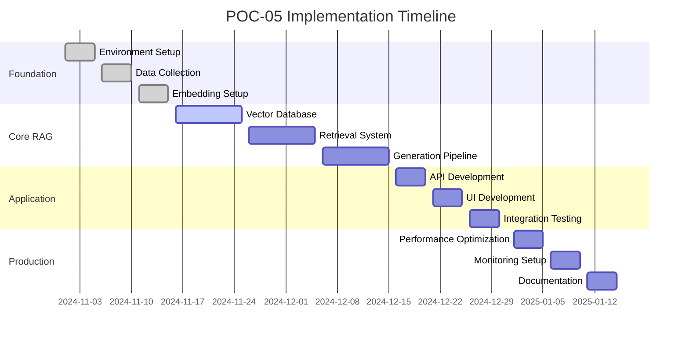
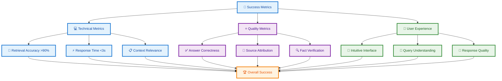

# POC-05 Generative AI RAG Architecture Plan

## Overview
This POC implements a Retrieval-Augmented Generation system for intelligent data documentation, combining vector search with LLM generation to create context-aware documentation from technical data sources.

## System Architecture

## Detailed RAG Pipeline Flow

## Vector Database Architecture

## Embedding and Retrieval Architecture

## LLM Integration Architecture

## Application Architecture

## Data Ingestion and Processing Flow

## Technology Stack

```mermaid
graph TD
    %% Define styles
    classDef vectorClass fill:#e3f2fd,stroke:#1976d2,stroke-width:3px,color:#0d47a1
    classDef llmClass fill:#f3e5f5,stroke:#7b1fa2,stroke-width:3px,color:#4a148c
    classDef frameworkClass fill:#e8f5e8,stroke:#388e3c,stroke-width:3px,color:#1b5e20
    classDef infraClass fill:#fff3e0,stroke:#f57c00,stroke-width:3px,color:#e65100
    classDef devClass fill:#fce4ec,stroke:#c2185b,stroke-width:3px,color:#880e4f

    subgraph "🗄️ Vector Databases"
        PINECONE[🌲 Pinecone]
        PINECONE --> VECTOR_SEARCH[🔍 Vector Search]
        PINECONE --> METADATA_FILTER[🏷️ Metadata Filtering]
        PINECONE --> INDEX_MGMT[📊 Index Management]
        ALTERNATIVES[🔄 Alternatives]
        ALTERNATIVES --> WEAVIATE[🕸️ Weaviate]
        ALTERNATIVES --> QDRANT[🎯 Qdrant]
        ALTERNATIVES --> CHROMADB[💾 ChromaDB]
    end

    subgraph "🤖 LLM Integration"
        OPENAI[🚀 OpenAI]
        OPENAI --> GPT4[🧠 GPT-4]
        OPENAI --> EMBEDDINGS_API[🔢 Embeddings API]
        ANTHROPIC[🧠 Anthropic]
        ANTHROPIC --> CLAUDE[🤖 Claude]
        ANTHROPIC --> API_INTEGRATION[🔗 API Integration]
        HUGGINGFACE[🤗 Hugging Face]
        HUGGINGFACE --> TRANSFORMERS[⚙️ Transformers]
        HUGGINGFACE --> INFERENCE_API[🚀 Inference API]
    end

    subgraph "🐍 Python Frameworks"
        LANGCHAIN[🔗 LangChain]
        LANGCHAIN --> RAG_CHAINS[🤖 RAG Chains]
        LANGCHAIN --> DOC_LOADERS[📄 Document Loaders]
        LANGCHAIN --> VECTOR_STORES[🗄️ Vector Stores]
        FASTAPI[🚀 FastAPI]
        FASTAPI --> REST_API[🌐 REST API]
        FASTAPI --> ASYNC_SUPPORT[⚡ Async Support]
        STREAMLIT[💻 Streamlit]
        STREAMLIT --> WEB_UI[🌐 Web UI]
        STREAMLIT --> INTERACTIVE_WIDGETS[🎮 Interactive Widgets]
    end

    subgraph "🏗️ Infrastructure"
        DOCKER[🐳 Docker]
        DOCKER --> CONTAINERS[📦 Containers]
        CLOUD_DEPLOY[☁️ Cloud Deployment]
        CLOUD_DEPLOY --> SCALING[📈 Auto-scaling]
        MONITORING_TOOLS[📊 Monitoring Tools]
        MONITORING_TOOLS --> PROMETHEUS[📊 Prometheus]
        MONITORING_TOOLS --> GRAFANA[📊 Grafana]
    end

    subgraph "💻 Development"
        VSCODE[💻 VS Code]
        VSCODE --> EDITOR[✏️ Code Editor]
        JUPYTER[📓 Jupyter]
        JUPYTER --> NOTEBOOKS[📝 Notebooks]
        GIT[🔄 Git]
        GIT --> VERSION_CONTROL[📋 Version Control]
    end

    %% Apply styles
    class PINECONE,VECTOR_SEARCH,METADATA_FILTER,INDEX_MGMT,ALTERNATIVES,WEAVIATE,QDRANT,CHROMADB vectorClass
    class OPENAI,GPT4,EMBEDDINGS_API,ANTHROPIC,CLAUDE,API_INTEGRATION,HUGGINGFACE,TRANSFORMERS,INFERENCE_API llmClass
    class LANGCHAIN,RAG_CHAINS,DOC_LOADERS,VECTOR_STORES,FASTAPI,REST_API,ASYNC_SUPPORT,STREAMLIT,WEB_UI,INTERACTIVE_WIDGETS frameworkClass
    class DOCKER,CONTAINERS,CLOUD_DEPLOY,SCALING,MONITORING_TOOLS,PROMETHEUS,GRAFANA infraClass
    class VSCODE,EDITOR,JUPYTER,NOTEBOOKS,GIT,VERSION_CONTROL devClass
```

## Implementation Phases

## Success Metrics Dashboard

