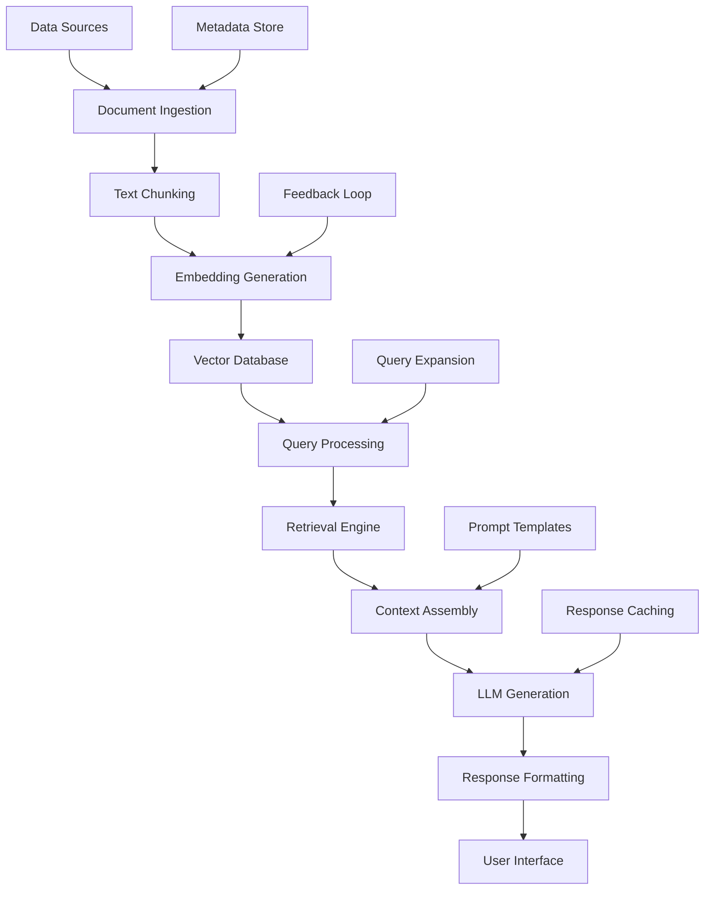
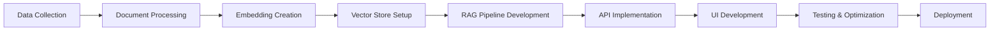
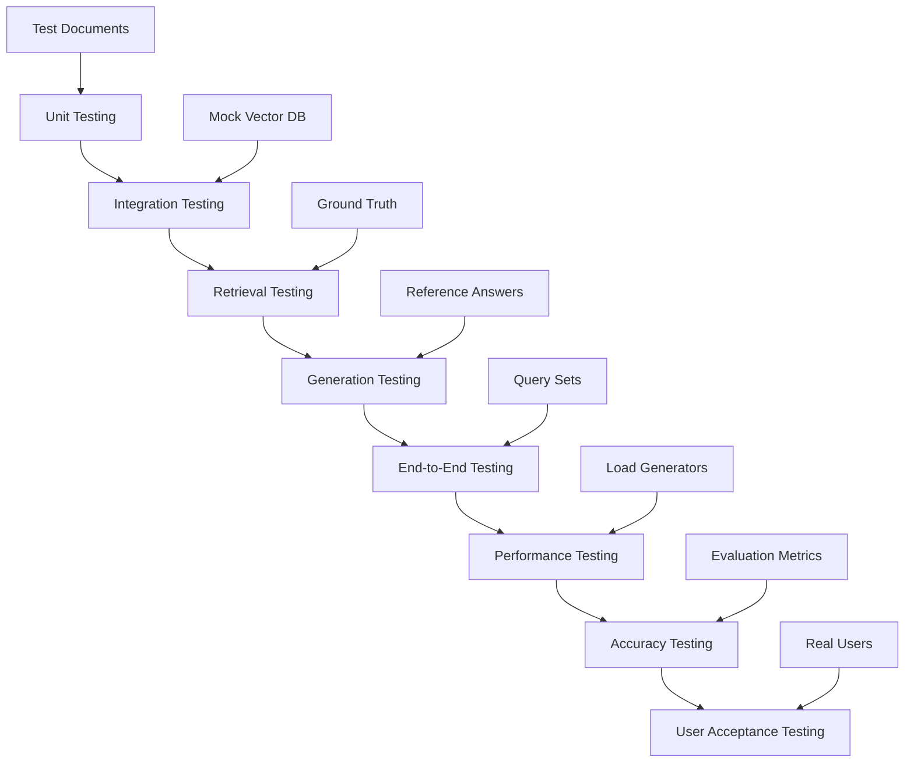
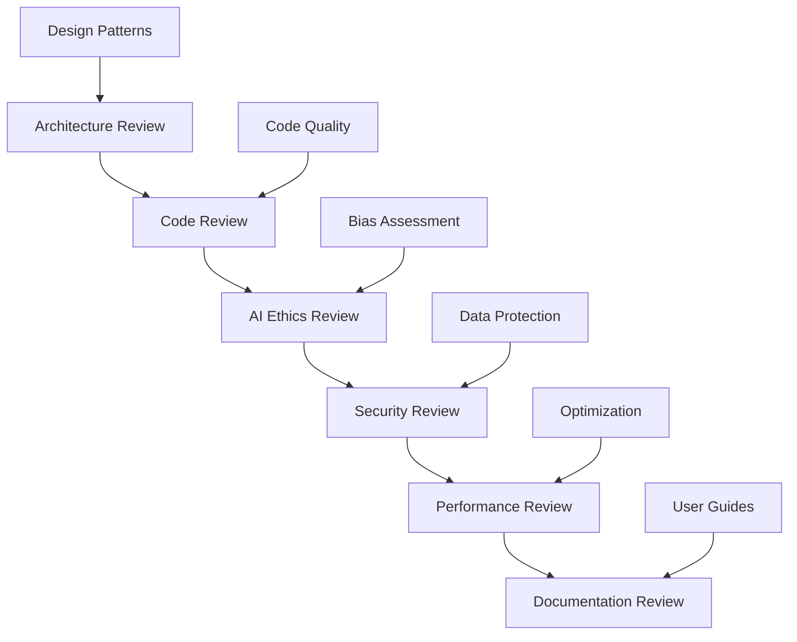
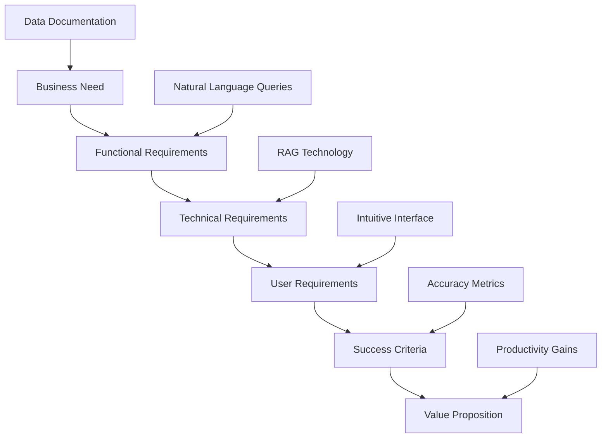
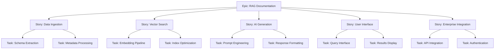
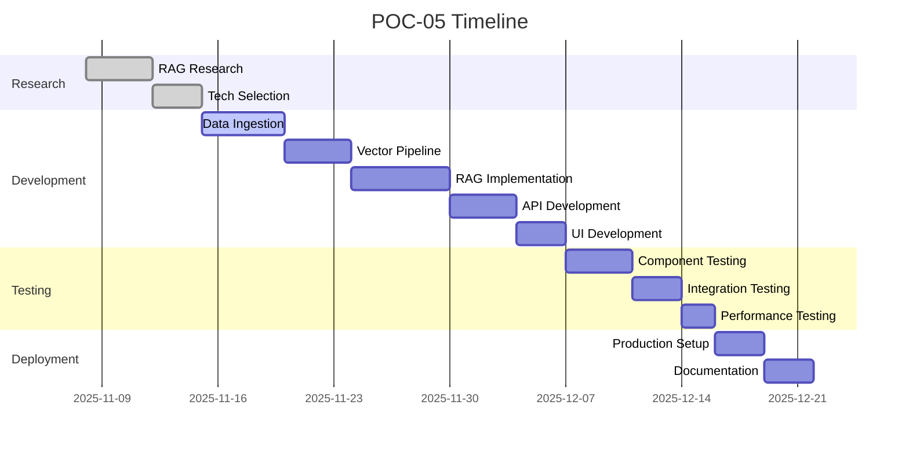

# POC-05: Generative AI RAG - Data Documentation Generator Implementation Guide

## Agenda of POC
This Proof of Concept builds an intelligent data documentation generator using Retrieval-Augmented Generation (RAG) technology. The system automatically documents data schemas, pipelines, and lineage using LLMs, integrating with enterprise knowledge systems via vector search. This POC demonstrates advanced GenAI integration with data engineering, showcasing the fusion of AI and data architecture skills.

### Objectives:
- Implement RAG architecture for enterprise data documentation
- Build vector database for semantic search of data assets
- Integrate LLM with enterprise knowledge retrieval
- Create user-friendly interface for documentation queries
- Demonstrate production-ready GenAI application
- Showcase data engineering + AI integration expertise

### Success Criteria:
- Accurate responses to 15/20 test queries about data documentation
- <3 second query response time
- Intuitive user interface with natural language queries
- Comprehensive documentation coverage of sample data estate
- Production-deployable application with proper error handling
- Demonstration of advanced prompt engineering and context management

## Tech Stack
- **LLM & AI Frameworks**:
  - LangChain: RAG implementation and LLM orchestration
  - OpenAI GPT-4: Primary LLM for generation (with Hugging Face alternative)
  - Hugging Face Transformers: Open-source model support
- **Vector Database**:
  - Pinecone: Managed vector database for embeddings
  - Weaviate: Alternative open-source option
  - FAISS: Local vector search for development
- **Embeddings & NLP**:
  - OpenAI Embeddings: High-quality text embeddings
  - Sentence Transformers: Open-source embedding models
- **Application Framework**:
  - FastAPI: High-performance API backend
  - Streamlit: Interactive web interface
  - Pydantic: Data validation and serialization
- **Data Processing**:
  - Pandas: Data manipulation and schema extraction
  - SQLAlchemy: Database connectivity
- **Deployment & Infrastructure**:
  - Docker: Containerization
  - GCP Cloud Run: Serverless deployment
  - GitHub Actions: CI/CD pipeline

## How to Start
### Prerequisites:
1. OpenAI API key (or Hugging Face token for open-source)
2. Pinecone account and API key
3. Python environment with required packages
4. Sample data sources for documentation

### Initial Setup:
```bash
# Install core dependencies
pip install langchain openai pinecone-client streamlit fastapi uvicorn
pip install sentence-transformers faiss-cpu pandas sqlalchemy

# Set up environment variables
export OPENAI_API_KEY="your-key-here"
export PINECONE_API_KEY="your-key-here"
export PINECONE_ENVIRONMENT="your-env"
```

### Project Structure:
```
POC-05-Generative-AI-RAG/
├── data/
│   ├── schemas/
│   ├── metadata/
│   └── samples/
├── src/
│   ├── ingestion/
│   │   ├── data_extractor.py
│   │   └── document_processor.py
│   ├── vector_store/
│   │   ├── embedding_manager.py
│   │   └── vector_db.py
│   ├── rag/
│   │   ├── retriever.py
│   │   ├── generator.py
│   │   └── rag_pipeline.py
│   ├── api/
│   │   ├── main.py
│   │   ├── routes.py
│   │   └── models.py
│   └── ui/
│       ├── app.py
│       └── components.py
├── tests/
│   ├── test_rag.py
│   ├── test_embeddings.py
│   └── test_api.py
├── config/
│   ├── settings.py
│   └── prompts.py
├── docs/
└── README.md
```

### Getting Started:
1. Set up vector database (Pinecone)
2. Extract metadata from sample data sources
3. Generate embeddings and populate vector store
4. Implement basic retrieval and generation
5. Build API and UI interfaces

## How to End
### Final Deliverables:
1. Fully functional RAG system for data documentation
2. Populated vector database with comprehensive data knowledge
3. REST API for programmatic access
4. Web interface for natural language queries
5. Performance benchmarks and accuracy metrics
6. Deployment guides and infrastructure code
7. Comprehensive documentation and demo materials

### Completion Checklist:
- [ ] Vector database populated with data documentation
- [ ] RAG pipeline retrieving and generating accurate responses
- [ ] API endpoints functional and documented
- [ ] UI providing intuitive query experience
- [ ] Performance meeting latency requirements
- [ ] Error handling and edge cases covered
- [ ] Production deployment ready

## Architect View
As the AI Solutions Architect, I design a scalable RAG system that integrates seamlessly with enterprise data platforms.

### Architecture Overview:


### Design Principles:
- **Modular Design**: Independent components for maintainability
- **Scalability**: Support for growing data volumes and user load
- **Reliability**: Fault-tolerant with comprehensive error handling
- **Observability**: Detailed logging and performance monitoring
- **Security**: Data encryption and access controls
- **Extensibility**: Easy addition of new data sources and models

### Technical Decisions:
- RAG over fine-tuning for cost-effectiveness and flexibility
- Pinecone for managed vector operations
- LangChain for framework consistency
- FastAPI for high-performance API
- Hybrid search (semantic + keyword) for accuracy
- Caching layer for performance optimization

## Developer View
As the AI Developer, I implement the RAG pipeline using modern GenAI development practices.

### Development Workflow:


### Key Implementation:
```python
# Example RAG pipeline implementation
from langchain.vectorstores import Pinecone
from langchain.embeddings import OpenAIEmbeddings
from langchain.llms import OpenAI
from langchain.chains import RetrievalQA
from langchain.text_splitter import RecursiveCharacterTextSplitter
import pinecone

class DataDocRAG:
    def __init__(self, openai_api_key, pinecone_api_key, pinecone_env):
        # Initialize Pinecone
        pinecone.init(api_key=pinecone_api_key, environment=pinecone_env)

        # Set up embeddings
        self.embeddings = OpenAIEmbeddings(openai_api_key=openai_api_key)

        # Initialize vector store
        self.vectorstore = Pinecone.from_existing_index(
            index_name="data-docs",
            embedding=self.embeddings
        )

        # Set up LLM
        self.llm = OpenAI(temperature=0, openai_api_key=openai_api_key)

        # Create RAG chain
        self.qa_chain = RetrievalQA.from_chain_type(
            llm=self.llm,
            chain_type="stuff",
            retriever=self.vectorstore.as_retriever(search_kwargs={"k": 3}),
            return_source_documents=True
        )

    def add_documents(self, documents):
        """Add new documents to the vector store"""
        text_splitter = RecursiveCharacterTextSplitter(
            chunk_size=1000,
            chunk_overlap=200
        )
        texts = text_splitter.split_documents(documents)

        self.vectorstore.add_documents(texts)

    def query(self, question):
        """Query the RAG system"""
        result = self.qa_chain({"query": question})
        return {
            "answer": result["result"],
            "sources": [doc.page_content for doc in result["source_documents"]]
        }

    def evaluate_response(self, question, expected_answer):
        """Evaluate response quality"""
        response = self.query(question)
        # Implement evaluation metrics
        return self._calculate_metrics(response, expected_answer)
```

### Best Practices:
- Use meaningful chunk sizes for data documentation
- Implement metadata filtering for precise retrieval
- Add query expansion for better semantic matching
- Include source attribution for transparency
- Implement response caching for performance
- Use streaming for large document processing

## Tester View
As the QA Engineer, I validate the RAG system's accuracy, performance, and reliability.

### Testing Strategy:


### Test Categories:
1. **Retrieval Tests**:
   - Document chunking accuracy
   - Embedding quality and similarity
   - Vector search precision and recall
   - Metadata filtering correctness

2. **Generation Tests**:
   - Response relevance and coherence
   - Factual accuracy against source documents
   - Context utilization effectiveness
   - Prompt engineering validation

3. **Integration Tests**:
   - API endpoint functionality
   - UI interaction flows
   - Error handling and recovery
   - Cross-component data flow

4. **Performance Tests**:
   - Query response latency
   - Concurrent user handling
   - Memory and compute resource usage
   - Scalability under load

### Quality Metrics:
- Retrieval precision@3 >0.8, recall@5 >0.9
- Response accuracy >85% against ground truth
- Average response time <3 seconds
- System uptime >99.5%
- User satisfaction score >4.2/5

## Reviewer View
As the Technical Reviewer, I ensure the RAG implementation follows AI engineering best practices and ethical guidelines.

### Review Checklist:


### Key Review Areas:
1. **AI Ethics & Bias**:
   - Bias in retrieval and generation
   - Fairness in response distribution
   - Transparency in source attribution
   - User privacy and data protection

2. **Technical Excellence**:
   - Efficient vector operations
   - Optimal chunking strategies
   - Effective prompt engineering
   - Robust error handling

3. **Security Considerations**:
   - API key management
   - Input validation and sanitization
   - Rate limiting and abuse prevention
   - Data encryption in transit/storage

4. **Performance & Scalability**:
   - Vector database optimization
   - LLM inference efficiency
   - Caching strategies
   - Resource utilization monitoring

### Feedback Framework:
- **Critical**: Security vulnerabilities, ethical concerns, data breaches
- **Major**: Performance bottlenecks, architectural flaws, accuracy issues
- **Minor**: Code style issues, documentation gaps
- **Enhancement**: Feature suggestions, optimization opportunities

## Business Analyst View
As the Business Analyst, I ensure the RAG system delivers business value and supports enterprise data management goals.

### Business Requirements:


### Business Value Proposition:
- **Problem**: Manual data documentation is time-consuming and error-prone
- **Solution**: AI-powered documentation generator with natural language access
- **Impact**: 70% reduction in documentation time, improved data governance
- **Benefits**: Faster onboarding, better data discovery, enhanced compliance

### Success Metrics:
- **Accuracy**: >85% correct responses to documentation queries
- **Performance**: <3 second response time for complex queries
- **Adoption**: User satisfaction >4.2/5, regular usage by data teams
- **Business**: Measurable time savings, improved data quality

### Stakeholder Analysis:
- **Data Engineers**: Accurate documentation, easy access to schemas
- **Data Scientists**: Quick understanding of available data assets
- **Business Analysts**: Natural language data discovery
- **IT Leadership**: Cost reduction, compliance improvement
- **Compliance Teams**: Automated documentation, audit trails

## Product Owner View
As the Product Owner, I define the RAG documentation generator vision and prioritize features for enterprise adoption.

### Product Vision:
Create an intelligent data documentation platform that revolutionizes how organizations discover, understand, and document their data assets, positioning me as a leader in AI-powered data architecture solutions.

### Product Backlog:


### Prioritization (MoSCoW):
- **Must Have**: Core RAG functionality with accurate responses
- **Should Have**: User-friendly interface and API access
- **Could Have**: Advanced features like multi-modal search
- **Won't Have**: Real-time data synchronization (future phase)

### Definition of Done:
- [ ] Data documentation ingested and indexed
- [ ] Vector search returning relevant results
- [ ] LLM generating accurate, contextual responses
- [ ] UI allowing natural language queries
- [ ] API providing programmatic access
- [ ] Performance meeting all requirements
- [ ] Documentation complete for users and developers

### Roadmap:


### KPIs:
- **Quality**: Response accuracy, retrieval precision, user satisfaction
- **Performance**: Query latency, system throughput, resource efficiency
- **Adoption**: User engagement, feature utilization, API usage
- **Business**: Time savings, error reduction, compliance improvement
- **Technical**: Code quality, test coverage, deployment success

This comprehensive guide ensures POC-05 delivers a cutting-edge RAG system that demonstrates advanced GenAI integration with enterprise data platforms, establishing expertise in AI-powered data solutions.