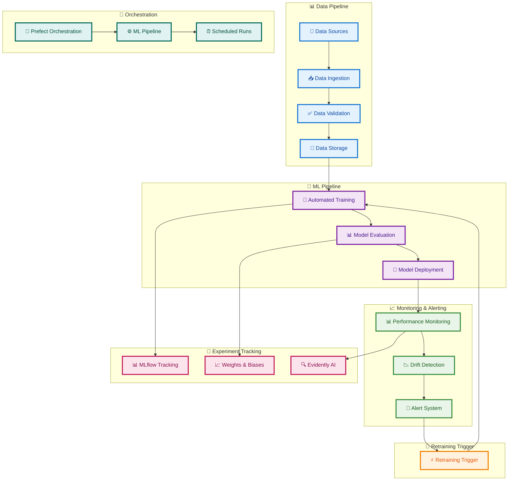
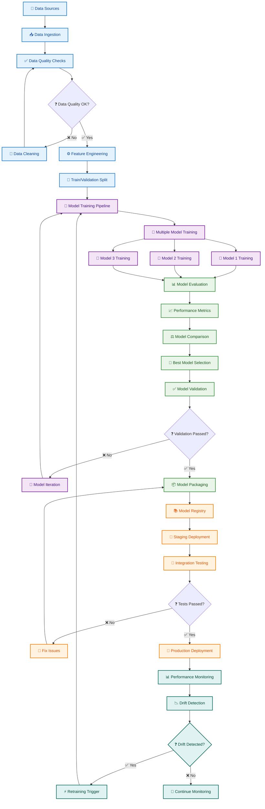
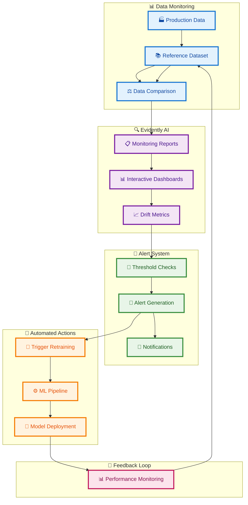
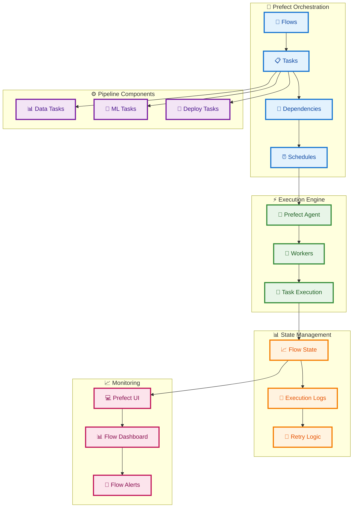
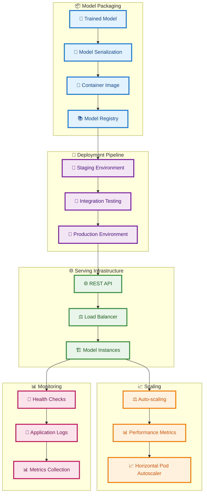
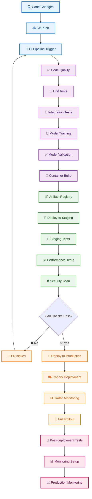
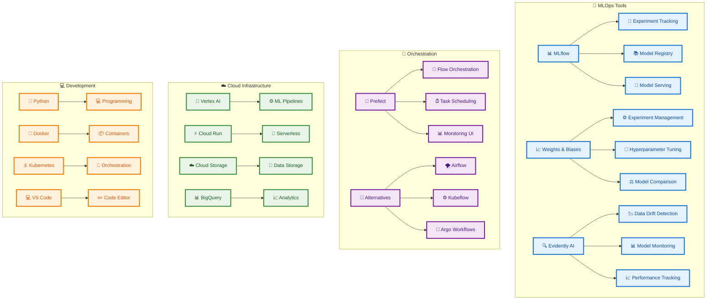
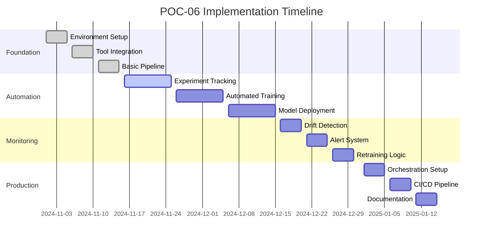
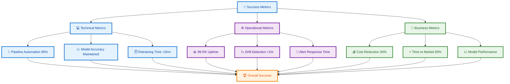

# POC-06 MLOps Automation Architecture Plan

## Overview
This POC implements automated machine learning operations with continuous model retraining, drift detection, and performance monitoring using MLflow, Weights & Biases, and Evidently AI.

## System Architecture



## Automated ML Pipeline Flow



## Experiment Tracking Architecture

```mermaid
graph TD
    %% Define styles
    classDef mlflowClass fill:#e3f2fd,stroke:#1976d2,stroke-width:3px,color:#0d47a1
    classDef wandbClass fill:#f3e5f5,stroke:#7b1fa2,stroke-width:3px,color:#4a148c
    classDef registryClass fill:#e8f5e8,stroke:#388e3c,stroke-width:3px,color:#1b5e20
    classDef integrationClass fill:#fff3e0,stroke:#f57c00,stroke-width:3px,color:#e65100

    subgraph "📊 MLflow Tracking"
        EXP[🧪 Experiments]
        EXP --> RUNS[🏃 Runs]
        RUNS --> PARAMS[⚙️ Parameters]
        PARAMS --> METRICS[📈 Metrics]
        METRICS --> ARTIFACTS[📦 Artifacts]
    end

    subgraph "📈 Weights & Biases"
        WANDB[📊 W&B Dashboard]
        WANDB --> PROJECTS[📁 Projects]
        PROJECTS --> SWEEPS[🔄 Hyperparameter Sweeps]
        SWEEPS --> REPORTS[📋 Reports]
    end

    subgraph "📚 Model Registry"
        REGISTRY[📚 Model Registry]
        REGISTRY --> VERSIONS[🏷️ Model Versions]
        VERSIONS --> STAGES[🎭 Model Stages]
        STAGES --> TRANSITIONS[🔄 Stage Transitions]
    end

    subgraph "🔗 Integration"
        EXP --> WANDB
        RUNS --> REGISTRY
        METRICS --> REPORTS
    end

    %% Apply styles
    class EXP,RUNS,PARAMS,METRICS,ARTIFACTS mlflowClass
    class WANDB,PROJECTS,SWEEPS,REPORTS wandbClass
    class REGISTRY,VERSIONS,STAGES,TRANSITIONS registryClass
    class integrationClass
```

## Drift Detection and Monitoring Architecture



## Orchestration and Scheduling Architecture



## Model Serving and Deployment Architecture



## CI/CD Pipeline Architecture



## Technology Stack



## Implementation Phases



## Success Metrics Dashboard


