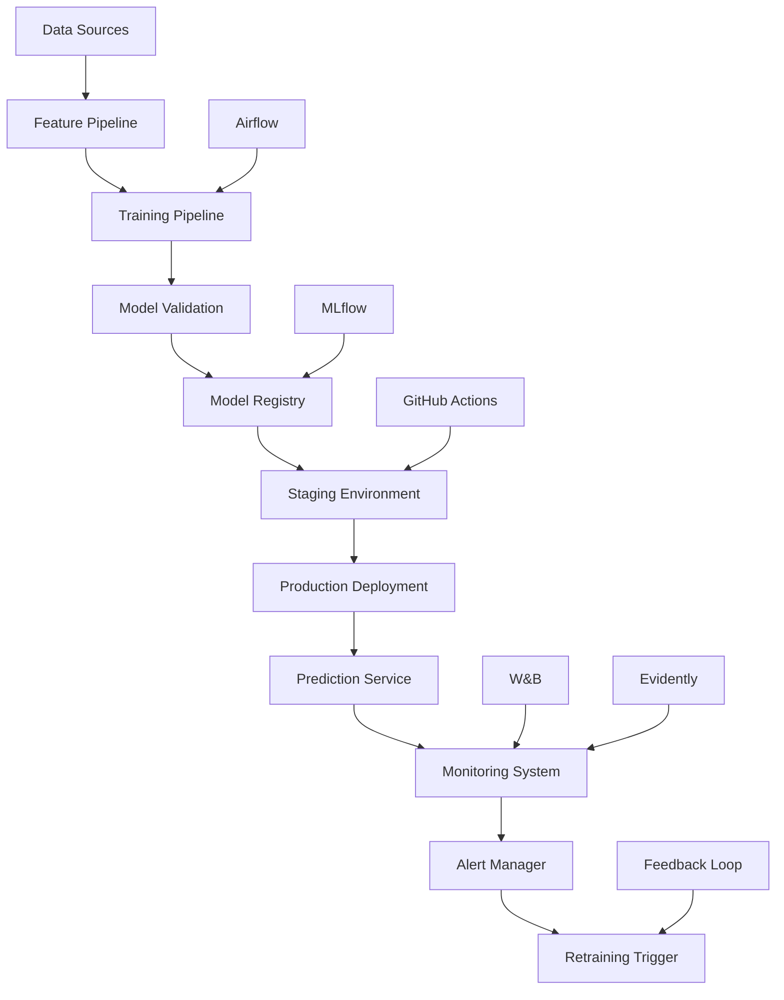
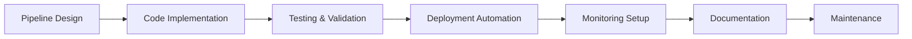
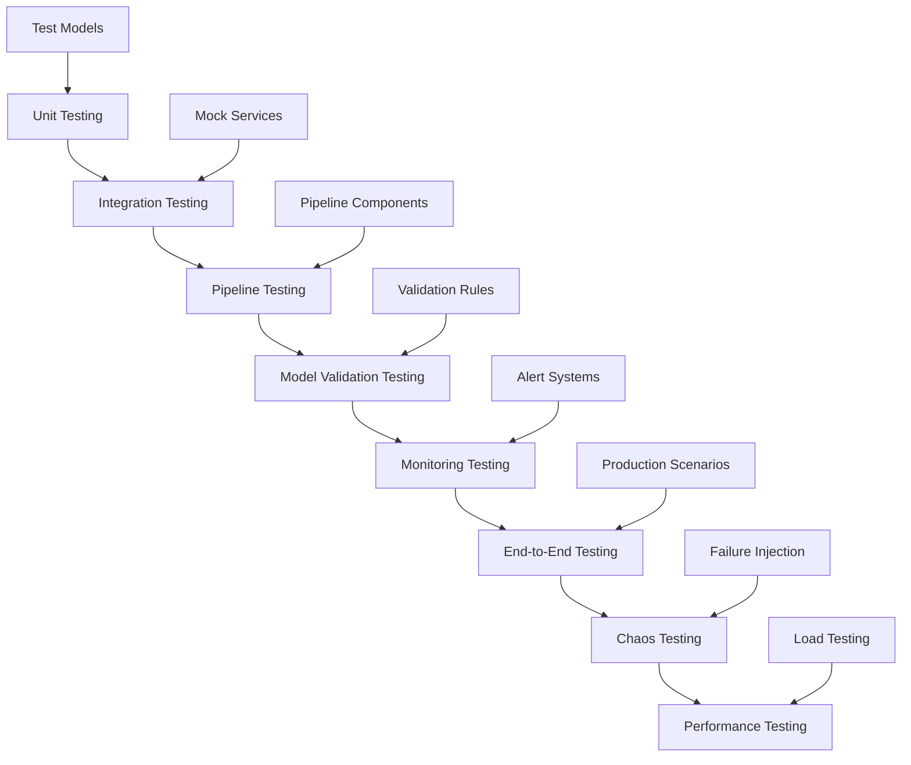
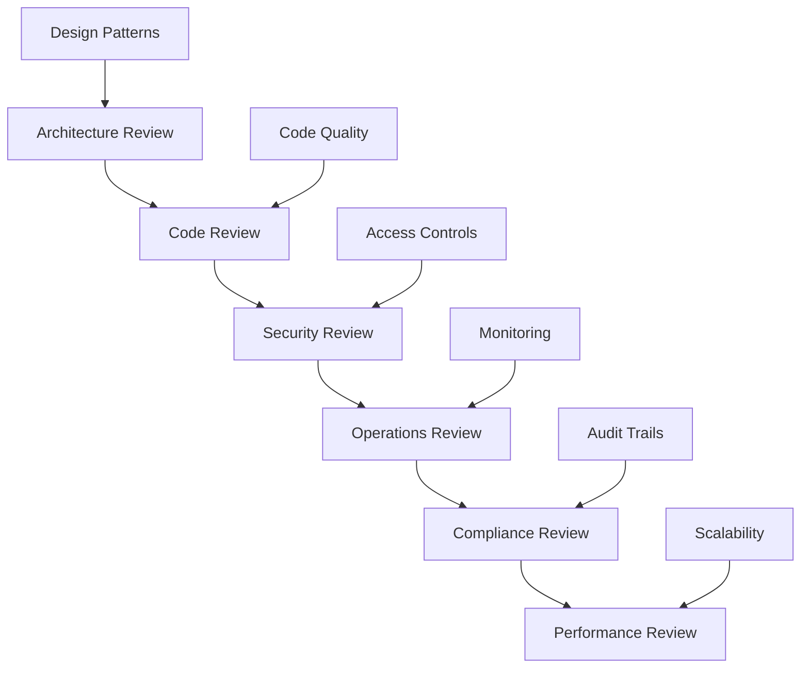
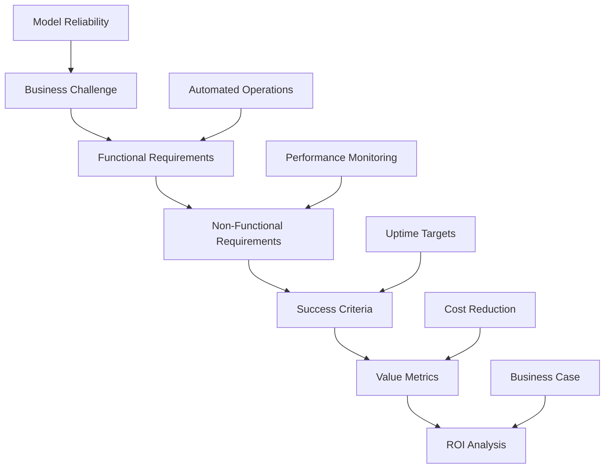
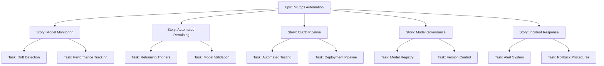
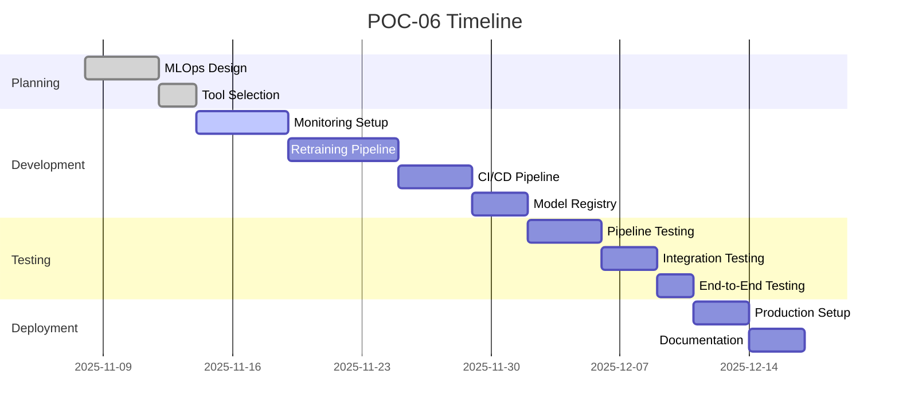

# POC-06: MLOps Automation - Model Retraining Pipeline Implementation Guide

## Agenda of POC
This Proof of Concept implements a comprehensive MLOps automation system that extends the ML pipeline with continuous monitoring, automated retraining, and production model management. The POC demonstrates enterprise-grade MLOps practices, showcasing the ability to maintain model performance in production environments through automated workflows.

### Objectives:
- Implement automated model retraining pipelines
- Set up comprehensive model monitoring and drift detection
- Build CI/CD pipelines for ML model deployment
- Create model versioning and rollback capabilities
- Demonstrate production ML lifecycle management
- Showcase MLOps best practices for scalable AI systems

### Success Criteria:
- Automated pipeline runs weekly maintaining >80% accuracy
- Drift detection alerts triggered for simulated drift scenarios
- Model versioning with automatic rollback on performance degradation
- CI/CD pipeline deploying models without manual intervention
- Comprehensive monitoring dashboard with key metrics
- Documentation of MLOps processes and incident response

## Tech Stack
- **MLOps Platforms**:
  - MLflow: Experiment tracking, model registry, and serving
  - Weights & Biases (W&B): Advanced monitoring and visualization
  - Evidently AI: Model monitoring and drift detection
- **Workflow Orchestration**:
  - Apache Airflow: Complex pipeline orchestration
  - Prefect: Modern workflow orchestration (alternative)
  - GitHub Actions: CI/CD for model deployment
- **Monitoring & Alerting**:
  - Prometheus: Metrics collection
  - Grafana: Dashboard visualization
  - Slack/Email: Alert notifications
- **Model Serving**:
  - MLflow Model Serving: REST API for models
  - Seldon Core: Advanced serving with A/B testing
- **Infrastructure**:
  - Docker: Containerization of ML pipelines
  - Kubernetes: Orchestration (optional for advanced setup)
  - Cloud Storage: Model artifact storage
- **Development Tools**:
  - Python: Core implementation
  - Jupyter: Experimentation and monitoring
  - Git: Version control for models and code

## How to Start
### Prerequisites:
1. Running ML pipeline from POC-04
2. MLflow server set up (local or cloud)
3. Monitoring tools configured
4. GitHub repository with CI/CD enabled

### Initial Setup:
```bash
# Install MLOps tools
pip install mlflow evidently wandb prefect

# Set up MLflow
mlflow server --backend-store-uri sqlite:///mlflow.db --default-artifact-root ./artifacts --host 0.0.0.0

# Initialize W&B
wandb login

# Set up Prefect (optional alternative to Airflow)
prefect server start
```

### Project Structure:
```
POC-06-MLOps-Automation/
├── pipelines/
│   ├── training_pipeline.py
│   ├── monitoring_pipeline.py
│   ├── retraining_pipeline.py
│   └── deployment_pipeline.py
├── monitoring/
│   ├── drift_detector.py
│   ├── performance_monitor.py
│   ├── data_drift.py
│   └── model_drift.py
├── models/
│   ├── registry.py
│   ├── versioning.py
│   └── validation.py
├── ci_cd/
│   ├── github_workflows/
│   └── docker/
├── tests/
│   ├── test_monitoring.py
│   ├── test_retraining.py
│   └── test_deployment.py
├── config/
│   ├── mlflow_config.py
│   ├── monitoring_config.py
│   └── pipeline_config.py
├── dashboards/
│   └── grafana_dashboards/
└── README.md
```

### Getting Started:
1. Set up MLflow tracking for existing models
2. Implement basic drift detection
3. Create automated retraining triggers
4. Build CI/CD pipeline for model deployment

## How to End
### Final Deliverables:
1. Automated MLOps pipeline running end-to-end
2. Model monitoring system with drift detection
3. CI/CD pipeline for seamless model deployment
4. Model registry with versioning and staging
5. Monitoring dashboards and alerting system
6. Incident response playbooks and rollback procedures
7. Comprehensive documentation and training materials

### Completion Checklist:
- [ ] MLflow tracking integrated with training pipeline
- [ ] Drift detection monitoring production predictions
- [ ] Automated retraining triggered by performance thresholds
- [ ] CI/CD pipeline deploying models automatically
- [ ] Model registry managing versions and staging
- [ ] Monitoring dashboards displaying key metrics
- [ ] Alert system notifying of issues and recoveries

## Architect View
As the MLOps Architect, I design a robust, automated system for production ML model management.

### Architecture Overview:


### Design Principles:
- **Automation First**: Minimize manual intervention in ML lifecycle
- **Observability**: Comprehensive monitoring and alerting
- **Reliability**: Fault-tolerant with automatic recovery
- **Scalability**: Handle increasing model complexity and volume
- **Governance**: Proper versioning, approval workflows, and audit trails
- **Security**: Secure model artifacts and prediction endpoints

### Technical Decisions:
- MLflow for unified MLOps platform
- Airflow for complex workflow orchestration
- Evidently for specialized drift detection
- GitOps for model deployment automation
- Multi-stage model promotion (dev → staging → prod)
- Automated rollback on performance degradation

## Developer View
As the MLOps Engineer, I implement automated pipelines and monitoring systems using industry best practices.

### Development Workflow:


### Key Implementation:
```python
# Example automated retraining pipeline
import mlflow
import mlflow.sklearn
from evidently.report import Report
from evidently.metric_preset import DataDriftPreset, RegressionPreset
import pandas as pd
from datetime import datetime, timedelta

class MLOpsPipeline:
    def __init__(self, model_name, drift_threshold=0.1):
        self.model_name = model_name
        self.drift_threshold = drift_threshold
        mlflow.set_tracking_uri("sqlite:///mlflow.db")

    def check_model_drift(self, reference_data, current_data):
        """Check for data and model drift"""
        report = Report(metrics=[
            DataDriftPreset(),
            RegressionPreset()
        ])

        report.run(reference_data=reference_data,
                  current_data=current_data)

        drift_score = report.as_dict()["metrics"][0]["result"]["drift_score"]

        return drift_score > self.drift_threshold, drift_score

    def retrain_model(self, training_data):
        """Automated model retraining"""
        with mlflow.start_run() as run:
            # Load current production model
            model_uri = f"models:/{self.model_name}/Production"
            current_model = mlflow.sklearn.load_model(model_uri)

            # Retrain with new data
            X, y = self.prepare_features(training_data)
            new_model = self.train_model(X, y)

            # Validate new model
            metrics = self.evaluate_model(new_model, X, y)

            # Log to MLflow
            mlflow.log_metrics(metrics)
            mlflow.sklearn.log_model(new_model, "model")

            # Register new model version
            model_version = mlflow.register_model(
                f"runs:/{run.info.run_id}/model",
                self.model_name
            )

            return model_version

    def promote_to_production(self, model_version):
        """Promote model to production with validation"""
        # Transition to Staging first
        client = mlflow.tracking.MlflowClient()
        client.transition_model_version_stage(
            name=self.model_name,
            version=model_version.version,
            stage="Staging"
        )

        # Run validation tests
        if self.validate_staging_model(model_version):
            # Promote to Production
            client.transition_model_version_stage(
                name=self.model_name,
                version=model_version.version,
                stage="Production"
            )

            # Update production endpoint
            self.deploy_model(model_version)

            return True
        return False

    def monitor_predictions(self, predictions, actuals):
        """Monitor prediction performance"""
        # Calculate metrics
        metrics = self.calculate_performance_metrics(predictions, actuals)

        # Log to W&B
        wandb.log(metrics)

        # Check for performance degradation
        if metrics['accuracy'] < 0.8:  # Threshold
            self.trigger_alert("Model performance degraded")
            self.initiate_rollback()

    def trigger_alert(self, message):
        """Send alerts for issues"""
        # Implement Slack/email alerts
        print(f"ALERT: {message}")
        # Integration with alerting system

    def initiate_rollback(self):
        """Rollback to previous stable model"""
        # Get previous production version
        prev_version = self.get_previous_production_version()

        # Rollback deployment
        self.rollback_deployment(prev_version)

        # Log incident
        self.log_incident("Automatic rollback due to performance degradation")
```

### Best Practices:
- Use experiment tracking for all model training runs
- Implement proper model versioning and lineage
- Set up automated testing for model validation
- Use feature stores for consistent feature serving
- Implement gradual rollout with canary deployments
- Maintain comprehensive logging and monitoring

## Tester View
As the QA Engineer, I validate the MLOps automation system for reliability, accuracy, and production readiness.

### Testing Strategy:


### Test Categories:
1. **Pipeline Tests**:
   - Automated retraining triggers correctly
   - Model promotion workflows function properly
   - Rollback procedures work as expected
   - CI/CD pipelines deploy successfully

2. **Monitoring Tests**:
   - Drift detection accuracy and timeliness
   - Alert system triggers appropriate notifications
   - Dashboard displays correct metrics
   - Logging captures all relevant events

3. **Model Validation Tests**:
   - New models pass quality gates
   - Performance comparisons are accurate
   - A/B testing functionality works
   - Model serving endpoints are reliable

4. **Integration Tests**:
   - MLflow integration with training pipelines
   - Monitoring tools capture all events
   - Alert systems integrate with notification channels
   - Deployment automation works end-to-end

### Quality Gates:
- All automated tests pass (>95% success rate)
- Pipeline reliability >99% uptime
- Alert system false positive rate <5%
- Model deployment success rate >98%
- Rollback procedures tested and documented

## Reviewer View
As the Technical Reviewer, I ensure the MLOps implementation follows industry standards and best practices.

### Review Checklist:


### Key Review Areas:
1. **Architecture & Design**:
   - Pipeline scalability and maintainability
   - Error handling and recovery mechanisms
   - Separation of concerns and modularity
   - Technology stack appropriateness

2. **Code Quality & Standards**:
   - Clean, well-documented code
   - Proper testing coverage and practices
   - Logging and monitoring implementation
   - Configuration management

3. **Security & Compliance**:
   - Model artifact security
   - Access controls for model registry
   - Data privacy in monitoring
   - Regulatory compliance (GDPR, etc.)

4. **Operations & Reliability**:
   - Automated deployment processes
   - Incident response procedures
   - Backup and disaster recovery
   - Cost optimization strategies

### Feedback Framework:
- **Critical**: Security vulnerabilities, data loss risks, system failures
- **Major**: Performance issues, architectural flaws, compliance gaps
- **Minor**: Code style issues, documentation gaps
- **Enhancement**: Optimization opportunities, additional features

## Business Analyst View
As the Business Analyst, I ensure the MLOps automation delivers sustained business value through reliable AI systems.

### Business Requirements:


### Business Value Proposition:
- **Problem**: Manual ML operations lead to model degradation and business risk
- **Solution**: Automated MLOps pipeline ensuring continuous model performance
- **Impact**: 90% reduction in manual ML operations, improved model reliability
- **Benefits**: Consistent prediction quality, faster issue resolution, cost optimization

### Success Metrics:
- **Reliability**: Model accuracy maintained >80% through automation
- **Efficiency**: 95% reduction in manual model management tasks
- **Performance**: <4 hour incident response time
- **Business**: Positive ROI within 3 months of implementation

### Stakeholder Analysis:
- **ML Engineers**: Reduced operational burden, focus on innovation
- **Business Users**: Reliable model predictions, consistent performance
- **IT Operations**: Automated deployments, reduced incidents
- **Executives**: Cost savings, risk reduction, compliance assurance
- **Regulators**: Audit trails, model governance, transparency

## Product Owner View
As the Product Owner, I define the MLOps automation vision and prioritize features for production ML excellence.

### Product Vision:
Build a world-class MLOps platform that automates the entire ML lifecycle, ensuring reliable, scalable, and governable AI systems that drive business value while positioning me as an MLOps expert in high-demand AI roles.

### Product Backlog:


### Prioritization (MoSCoW):
- **Must Have**: Automated retraining and basic monitoring
- **Should Have**: CI/CD pipeline and model registry
- **Could Have**: Advanced monitoring and A/B testing
- **Won't Have**: Multi-cloud deployment (future scope)

### Definition of Done:
- [ ] Model monitoring detecting drift accurately
- [ ] Automated retraining triggered and executed
- [ ] CI/CD pipeline deploying models seamlessly
- [ ] Model registry managing versions properly
- [ ] Alert system notifying stakeholders
- [ ] Rollback procedures tested and documented
- [ ] Operations team trained on processes

### Roadmap:


### KPIs:
- **Reliability**: Pipeline success rate, model uptime, incident response time
- **Efficiency**: Automation coverage, manual intervention reduction
- **Quality**: Model performance consistency, false positive rates
- **Business**: Cost savings, risk reduction, compliance improvement
- **Adoption**: Team satisfaction, process adherence, feature utilization

This comprehensive guide ensures POC-06 delivers a production-ready MLOps automation system that demonstrates enterprise-grade ML operations expertise for career advancement in AI/ML engineering roles.