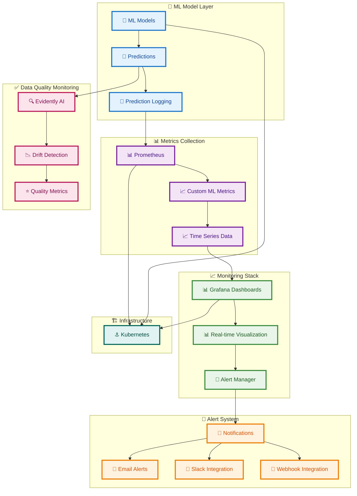
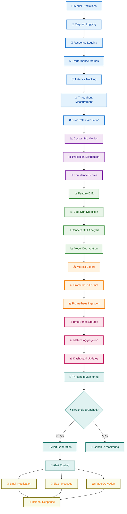
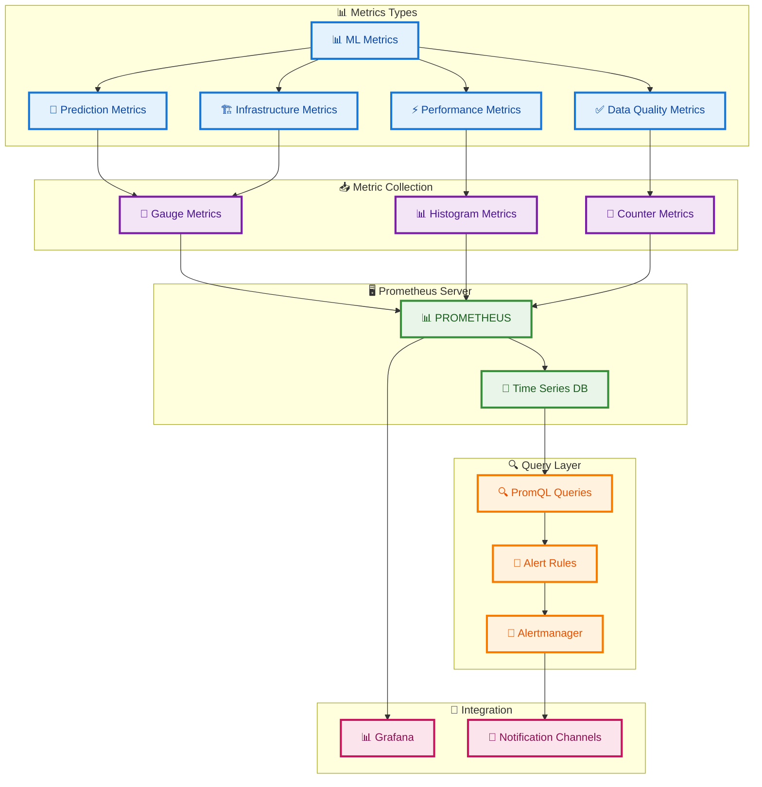
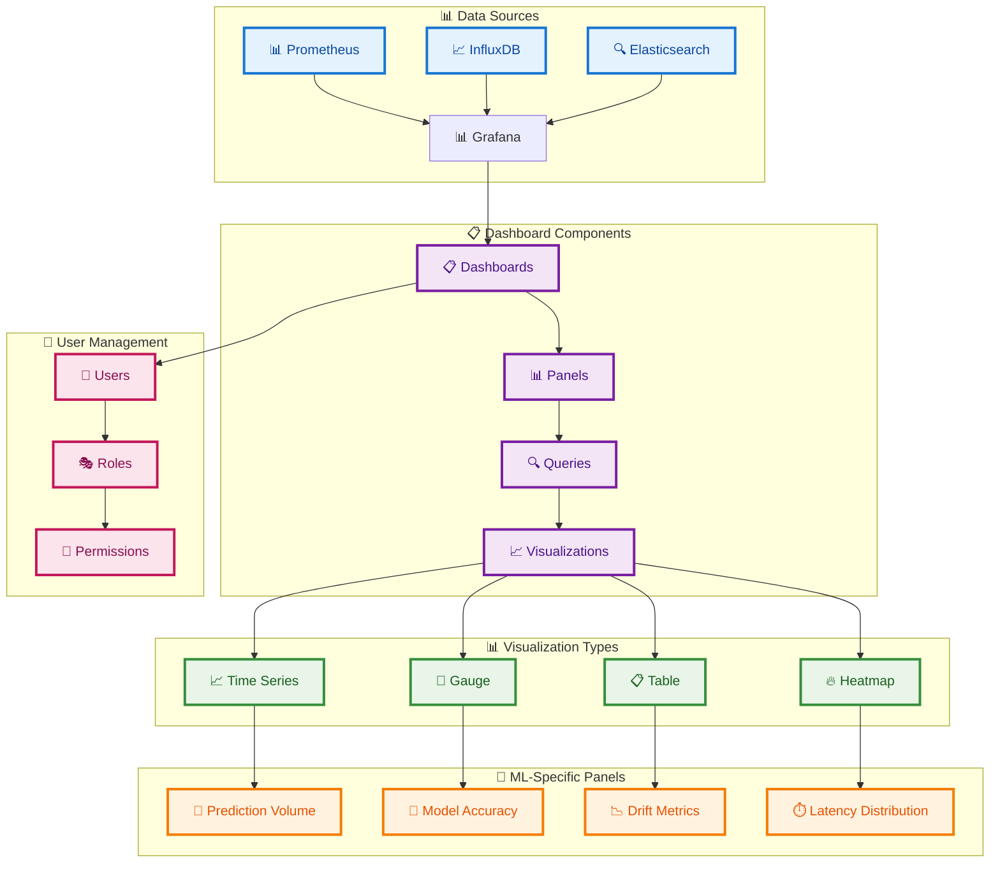
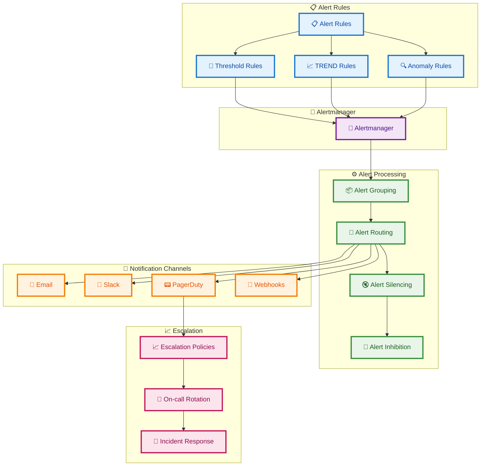
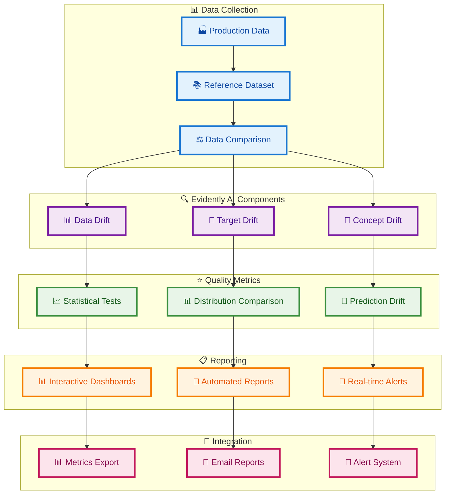
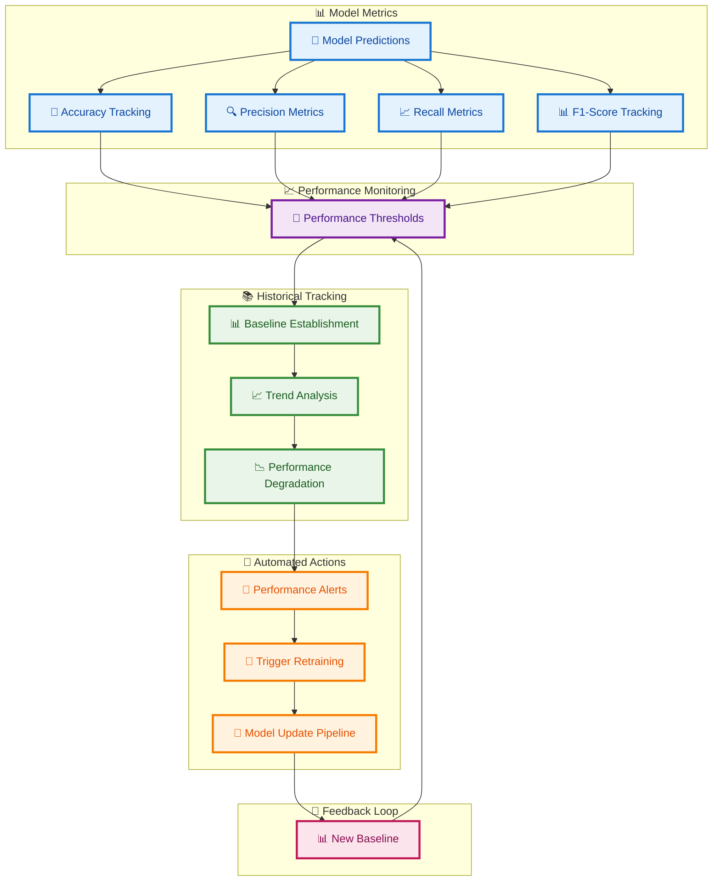
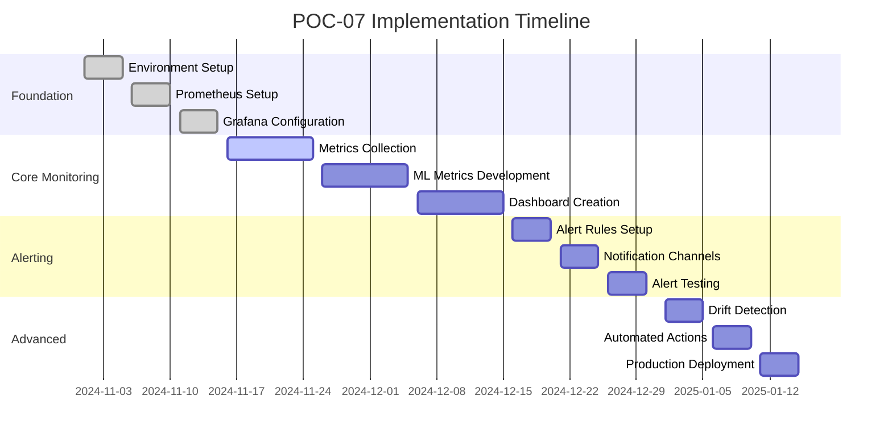
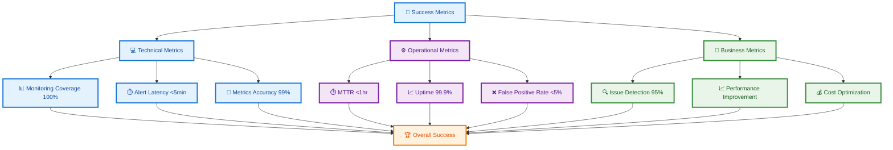

# POC-07 MLOps Specialization Architecture Plan

## Overview
This POC builds a comprehensive production monitoring system for ML models, implementing advanced monitoring, alerting, and dashboard visualization using Prometheus, Grafana, and custom ML metrics.

## System Architecture



## Detailed Monitoring Pipeline



## Prometheus Metrics Architecture



## Grafana Dashboard Architecture



## Alert Management Architecture



## Data Quality Monitoring Architecture



## Model Performance Tracking Architecture



## Technology Stack

```mermaid
graph TD
    %% Define styles
    classDef monitoringClass fill:#e3f2fd,stroke:#1976d2,stroke-width:3px,color:#0d47a1
    classDef mlClass fill:#f3e5f5,stroke:#7b1fa2,stroke-width:3px,color:#4a148c
    classDef infraClass fill:#e8f5e8,stroke:#388e3c,stroke-width:3px,color:#1b5e20
    classDef devClass fill:#fff3e0,stroke:#f57c00,stroke-width:3px,color:#e65100

    subgraph "📊 Monitoring Stack"
        PROMETHEUS[📊 Prometheus]
        PROMETHEUS --> METRICS_COLL[📈 Metrics Collection]
        PROMETHEUS --> ALERT_RULES[🚨 Alert Rules]
        PROMETHEUS --> TIME_SERIES_DB[💾 Time Series DB]
        GRAFANA[📊 Grafana]
        GRAFANA --> DASHBOARDS[📋 Dashboards]
        GRAFANA --> VISUALIZATION[📊 Visualization]
        GRAFANA --> ALERT_INTEGRATION[🚨 Alert Integration]
        ALERTMANAGER[🚨 Alertmanager]
        ALERTMANAGER --> ALERT_ROUTING[📨 Alert Routing]
        ALERTMANAGER --> NOTIFICATION_CHANNELS[📢 Notification Channels]
        ALERTMANAGER --> ESCALATION_POLICIES[📈 Escalation Policies]
    end

    subgraph "🤖 ML Monitoring"
        EVIDENTLY[🔍 Evidently AI]
        EVIDENTLY --> DRIFT_DETECT[📉 Data Drift Detection]
        EVIDENTLY --> MODEL_PERF[📊 Model Performance]
        EVIDENTLY --> QUALITY_METRICS[⭐ Quality Metrics]
        CUSTOM_METRICS[📈 Custom Metrics]
        CUSTOM_METRICS --> PRED_METRICS[🔮 Prediction Metrics]
        CUSTOM_METRICS --> FEATURE_DRIFT[📉 Feature Drift]
        CUSTOM_METRICS --> MODEL_DEGRADATION[📉 Model Degradation]
    end

    subgraph "🏗️ Infrastructure"
        KUBERNETES[⚓ Kubernetes]
        KUBERNETES --> POD_MONITORING[📊 Pod Monitoring]
        KUBERNETES --> SERVICE_DISCOVERY[🔍 Service Discovery]
        KUBERNETES --> AUTO_SCALING[📈 Auto-scaling]
        DOCKER[🐳 Docker]
        DOCKER --> CONTAINER_METRICS[📦 Container Metrics]
        DOCKER --> HEALTH_CHECKS[💚 Health Checks]
    end

    subgraph "💻 Development"
        PYTHON[🐍 Python]
        PYTHON --> PROGRAMMING[💻 Programming]
        GO[🐹 Go (Prometheus)]
        GO --> SYSTEMS[⚙️ Systems Programming]
        YAML[📄 YAML (Configuration)]
        YAML --> CONFIG[⚙️ Configuration]
        VSCODE[💻 VS Code]
        VSCODE --> EDITOR[✏️ Code Editor]
    end

    %% Apply styles
    class PROMETHEUS,METRICS_COLL,ALERT_RULES,TIME_SERIES_DB,GRAFANA,DASHBOARDS,VISUALIZATION,ALERT_INTEGRATION,ALERTMANAGER,ALERT_ROUTING,NOTIFICATION_CHANNELS,ESCALATION_POLICIES monitoringClass
    class EVIDENTLY,DRIFT_DETECT,MODEL_PERF,QUALITY_METRICS,CUSTOM_METRICS,PRED_METRICS,FEATURE_DRIFT,MODEL_DEGRADATION mlClass
    class KUBERNETES,POD_MONITORING,SERVICE_DISCOVERY,AUTO_SCALING,DOCKER,CONTAINER_METRICS,HEALTH_CHECKS infraClass
    class PYTHON,PROGRAMMING,GO,SYSTEMS,YAML,CONFIG,VSCODE,EDITOR devClass
```

## Implementation Phases



## Success Metrics Dashboard


