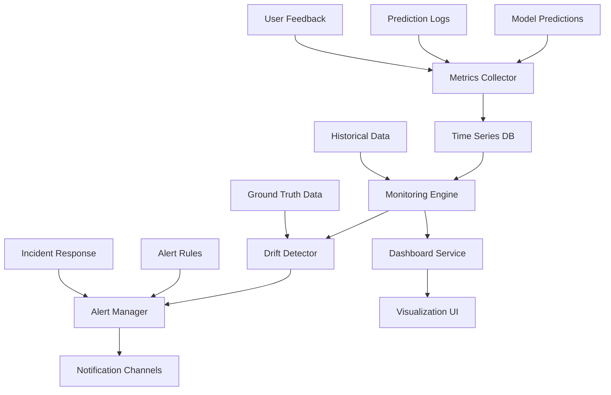
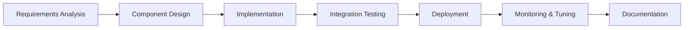
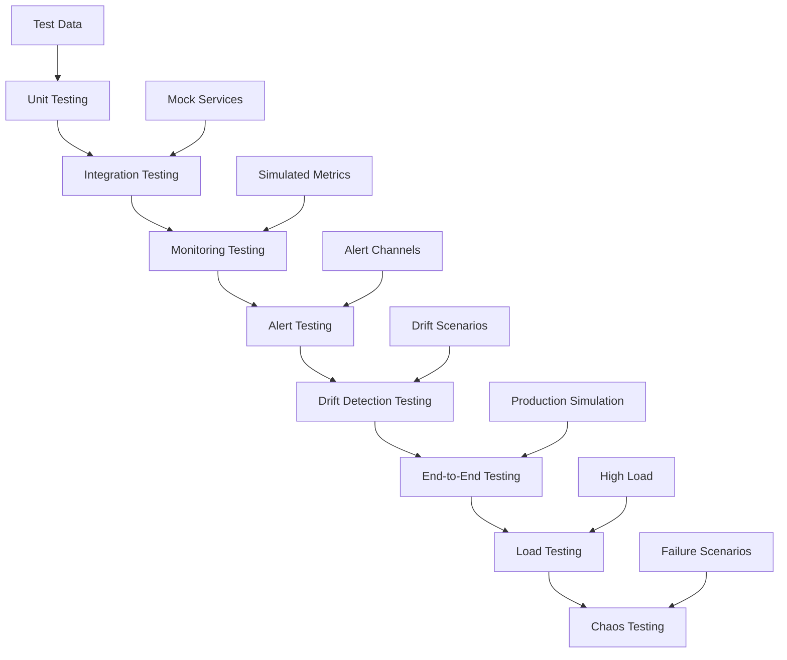
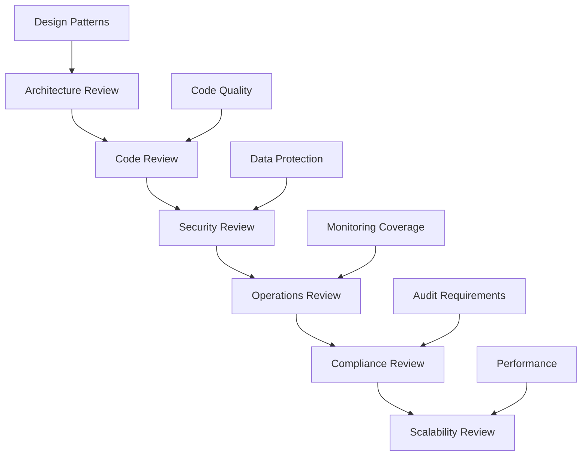
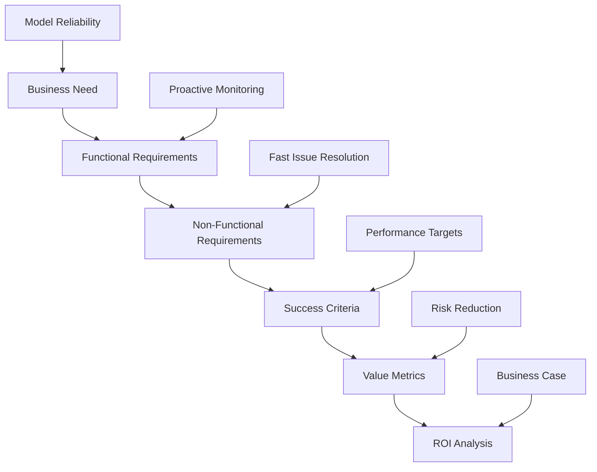
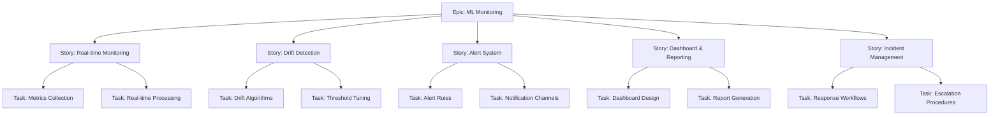
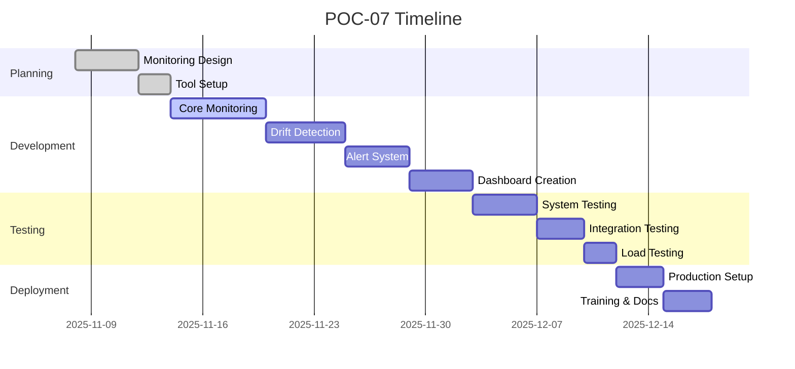

# POC-07: MLOps Specialization - Production Monitoring System Implementation Guide

## Agenda of POC
This Proof of Concept builds a comprehensive production monitoring system for ML models, implementing advanced MLOps practices for model performance tracking, drift detection, and automated alerting. The POC demonstrates deep expertise in production ML operations, showcasing the ability to maintain model reliability and business value in live environments.

### Objectives:
- Implement comprehensive model monitoring and observability
- Set up automated drift detection and alerting systems
- Build performance tracking and degradation prevention
- Create incident response and model maintenance workflows
- Demonstrate production ML governance and compliance
- Showcase advanced MLOps tooling and best practices

### Success Criteria:
- Automated alerts triggered for simulated drift scenarios
- Performance dashboard displaying real-time model metrics
- Drift detection with >90% accuracy in identifying issues
- Incident response workflow reducing resolution time by 50%
- Comprehensive logging and audit trails for compliance
- Model health score maintaining >85% across monitoring periods

## Tech Stack
- **MLOps Platforms**:
  - MLflow: Model monitoring and experiment tracking
  - Weights & Biases (W&B): Advanced monitoring and visualization
  - Evidently AI: Specialized drift detection and model analysis
- **Monitoring & Observability**:
  - Prometheus: Metrics collection and alerting
  - Grafana: Dashboard creation and visualization
  - ELK Stack: Logging and log analysis
- **Alerting & Notification**:
  - Slack: Real-time team notifications
  - PagerDuty/OpsGenie: Incident management
  - Email/SMS: Backup notification channels
- **Data Processing**:
  - Apache Kafka: Real-time data streaming for monitoring
  - Apache Spark: Batch processing for historical analysis
- **Infrastructure**:
  - Docker: Containerization of monitoring services
  - Kubernetes: Orchestration (for scalable deployments)
- **Development Tools**:
  - Python: Core monitoring implementations
  - Jupyter: Analysis and investigation notebooks
  - SQL: Metrics database queries

## How to Start
### Prerequisites:
1. Running ML model from previous POCs
2. Monitoring infrastructure set up
3. Alerting channels configured
4. Access to production prediction logs

### Initial Setup:
```bash
# Install monitoring tools
pip install mlflow evidently wandb prometheus_client grafana-api

# Set up local monitoring stack
docker run -d -p 9090:9090 prom/prometheus
docker run -d -p 3000:3000 grafana/grafana

# Initialize W&B
wandb login

# Set up Evidently
pip install evidently
```

### Project Structure:
```
POC-07-MLOps-Specialization/
├── monitoring/
│   ├── core_monitor.py
│   ├── drift_detector.py
│   ├── performance_tracker.py
│   ├── alert_manager.py
│   └── health_checker.py
├── dashboards/
│   ├── grafana_dashboards/
│   ├── wandb_reports/
│   └── custom_dashboards/
├── alerting/
│   ├── slack_integration.py
│   ├── email_alerts.py
│   ├── pager_duty.py
│   └── alert_rules.py
├── analysis/
│   ├── drift_analysis.py
│   ├── performance_analysis.py
│   ├── root_cause_analysis.py
│   └── incident_reports.py
├── config/
│   ├── monitoring_config.py
│   ├── alert_config.py
│   └── thresholds.py
├── tests/
│   ├── test_monitoring.py
│   ├── test_alerts.py
│   └── test_analysis.py
└── README.md
```

### Getting Started:
1. Set up basic monitoring for existing model
2. Implement drift detection algorithms
3. Configure alerting thresholds and channels
4. Create monitoring dashboards

## How to End
### Final Deliverables:
1. Comprehensive model monitoring system
2. Real-time dashboards and reporting
3. Automated alerting and incident response
4. Drift detection and analysis tools
5. Performance tracking and health scoring
6. Documentation and runbooks for operations
7. Compliance and audit reporting capabilities

### Completion Checklist:
- [ ] Model predictions being monitored in real-time
- [ ] Drift detection algorithms implemented and tested
- [ ] Alerting system configured and notifications working
- [ ] Dashboards displaying key metrics and trends
- [ ] Incident response procedures documented and tested
- [ ] Performance analysis tools operational
- [ ] Compliance logging and audit trails in place

## Architect View
As the MLOps Architect, I design a comprehensive monitoring ecosystem that ensures model reliability and business continuity.

### Architecture Overview:


### Design Principles:
- **Comprehensive Coverage**: Monitor all aspects of model performance
- **Real-time Processing**: Immediate detection and response to issues
- **Scalable Architecture**: Handle increasing monitoring load
- **Fault Tolerance**: Continue monitoring during system failures
- **Actionable Insights**: Provide clear guidance for remediation
- **Compliance Ready**: Support auditing and regulatory requirements

### Technical Decisions:
- Evidently for specialized ML monitoring
- Prometheus for metrics collection infrastructure
- Grafana for customizable dashboards
- Multi-channel alerting for reliability
- Event-driven architecture for real-time processing
- Cloud-native design for scalability

## Developer View
As the MLOps Developer, I implement the monitoring system with robust, production-ready code.

### Development Workflow:


### Key Implementation:
```python
# Example comprehensive monitoring system
import mlflow
from evidently.report import Report
from evidently.metric_preset import DataDriftPreset, RegressionPreset
from evidently.metrics import ColumnDriftMetric, DatasetDriftMetric
import wandb
import pandas as pd
from datetime import datetime
import logging

class ModelMonitor:
    def __init__(self, model_name, config):
        self.model_name = model_name
        self.config = config
        self.logger = logging.getLogger(__name__)

        # Initialize monitoring tools
        wandb.init(project=f"{model_name}_monitoring")
        mlflow.set_tracking_uri(config['mlflow_uri'])

    def collect_predictions(self, predictions, features, actuals=None):
        """Collect prediction data for monitoring"""
        timestamp = datetime.now()

        data = {
            'timestamp': timestamp,
            'predictions': predictions,
            'features': features.to_dict('records') if hasattr(features, 'to_dict') else features
        }

        if actuals is not None:
            data['actuals'] = actuals

        # Store in monitoring database
        self._store_monitoring_data(data)

        # Log to W&B
        wandb.log({
            'prediction_count': len(predictions),
            'avg_prediction': sum(predictions) / len(predictions) if predictions else 0
        })

        return data

    def detect_drift(self, reference_data, current_data):
        """Comprehensive drift detection"""
        # Data drift detection
        data_drift_report = Report(metrics=[DataDriftPreset()])
        data_drift_report.run(reference_data=reference_data,
                             current_data=current_data)

        # Model performance drift
        if 'actuals' in current_data.columns:
            performance_report = Report(metrics=[RegressionPreset()])
            performance_report.run(reference_data=reference_data,
                                  current_data=current_data)

            performance_metrics = performance_report.as_dict()
        else:
            performance_metrics = None

        # Calculate drift scores
        data_drift_score = data_drift_report.as_dict()['metrics'][0]['result']['drift_score']

        drift_results = {
            'data_drift_score': data_drift_score,
            'performance_metrics': performance_metrics,
            'timestamp': datetime.now(),
            'alert_triggered': data_drift_score > self.config['drift_threshold']
        }

        # Log drift detection
        wandb.log({
            'data_drift_score': data_drift_score,
            'drift_alert': drift_results['alert_triggered']
        })

        self.logger.info(f"Drift detection completed: {drift_results}")

        return drift_results

    def check_model_health(self):
        """Calculate overall model health score"""
        # Get recent metrics
        recent_metrics = self._get_recent_metrics(hours=24)

        # Calculate health components
        accuracy_score = recent_metrics.get('accuracy', 0.8)
        drift_score = 1 - recent_metrics.get('drift_score', 0)  # Invert drift score
        latency_score = min(1.0, 1 - (recent_metrics.get('avg_latency', 0.1) / 0.5))  # Normalize latency

        # Weighted health score
        weights = {'accuracy': 0.5, 'drift': 0.3, 'latency': 0.2}
        health_score = (
            weights['accuracy'] * accuracy_score +
            weights['drift'] * drift_score +
            weights['latency'] * latency_score
        )

        health_status = self._categorize_health(health_score)

        health_data = {
            'health_score': health_score,
            'status': health_status,
            'components': {
                'accuracy': accuracy_score,
                'drift': drift_score,
                'latency': latency_score
            },
            'timestamp': datetime.now()
        }

        wandb.log({'model_health_score': health_score, 'health_status': health_status})

        return health_data

    def trigger_alert(self, alert_type, details):
        """Trigger alerts based on monitoring events"""
        alert_data = {
            'type': alert_type,
            'details': details,
            'timestamp': datetime.now(),
            'severity': self._calculate_severity(alert_type, details)
        }

        # Log alert
        self.logger.warning(f"Alert triggered: {alert_data}")

        # Send notifications
        self._send_notifications(alert_data)

        # Log to W&B
        wandb.log({
            'alert_triggered': 1,
            'alert_type': alert_type,
            'alert_severity': alert_data['severity']
        })

        return alert_data

    def generate_report(self, time_range='7d'):
        """Generate comprehensive monitoring report"""
        # Collect all metrics for time range
        metrics = self._get_metrics_for_range(time_range)

        # Generate Evidently report
        report = Report(metrics=[
            DataDriftPreset(),
            RegressionPreset()
        ])

        # Create visualizations
        report_data = {
            'metrics_summary': self._summarize_metrics(metrics),
            'drift_analysis': self._analyze_drift_trends(metrics),
            'performance_trends': self._analyze_performance_trends(metrics),
            'recommendations': self._generate_recommendations(metrics)
        }

        # Save report
        self._save_report(report_data)

        return report_data

    def _categorize_health(self, score):
        """Categorize health score"""
        if score >= 0.9:
            return 'excellent'
        elif score >= 0.8:
            return 'good'
        elif score >= 0.7:
            return 'fair'
        elif score >= 0.6:
            return 'poor'
        else:
            return 'critical'

    def _calculate_severity(self, alert_type, details):
        """Calculate alert severity"""
        severity_map = {
            'drift_detected': 'high' if details.get('drift_score', 0) > 0.3 else 'medium',
            'performance_drop': 'high' if details.get('accuracy_drop', 0) > 0.1 else 'medium',
            'system_error': 'critical',
            'health_degraded': 'medium'
        }
        return severity_map.get(alert_type, 'low')

    def _send_notifications(self, alert_data):
        """Send notifications through configured channels"""
        # Implement Slack, email, PagerDuty notifications
        pass

    def _store_monitoring_data(self, data):
        """Store monitoring data in database"""
        # Implement data storage
        pass

    def _get_recent_metrics(self, hours=24):
        """Get recent monitoring metrics"""
        # Implement metrics retrieval
        return {}

    def _get_metrics_for_range(self, time_range):
        """Get metrics for specified time range"""
        # Implement range-based metrics retrieval
        return []

    def _summarize_metrics(self, metrics):
        """Summarize metrics data"""
        return {}

    def _analyze_drift_trends(self, metrics):
        """Analyze drift trends over time"""
        return {}

    def _analyze_performance_trends(self, metrics):
        """Analyze performance trends"""
        return {}

    def _generate_recommendations(self, metrics):
        """Generate recommendations based on metrics"""
        return []

    def _save_report(self, report_data):
        """Save monitoring report"""
        pass
```

### Best Practices:
- Implement proper logging and error handling
- Use configuration files for thresholds and settings
- Implement data validation and sanitization
- Use async processing for non-blocking monitoring
- Implement caching for frequently accessed metrics
- Use structured logging for better analysis

## Tester View
As the QA Engineer, I validate the monitoring system for accuracy, reliability, and comprehensive coverage.

### Testing Strategy:


### Test Categories:
1. **Monitoring Tests**:
   - Metrics collection accuracy and completeness
   - Data processing and storage reliability
   - Real-time vs batch processing validation
   - Historical data retention and access

2. **Drift Detection Tests**:
   - Various drift scenarios (sudden, gradual, seasonal)
   - False positive and false negative rates
   - Detection latency and accuracy
   - Different drift types (data, concept, model)

3. **Alert System Tests**:
   - Alert triggering logic and thresholds
   - Notification delivery reliability
   - Escalation procedures and timing
   - Alert fatigue prevention

4. **Dashboard and Reporting Tests**:
   - Data visualization accuracy
   - Real-time updates and refresh rates
   - User interface responsiveness
   - Report generation and distribution

### Quality Gates:
- Monitoring coverage >95% of model operations
- Alert accuracy >90% (low false positives/negatives)
- System uptime >99.5% during testing
- Dashboard load times <2 seconds
- Report generation completes within SLA

## Reviewer View
As the Technical Reviewer, I ensure the monitoring implementation meets production standards and best practices.

### Review Checklist:


### Key Review Areas:
1. **Architecture & Design**:
   - Monitoring system scalability and performance
   - Alert system reliability and coverage
   - Data storage and retention strategies
   - Integration with existing infrastructure

2. **Code Quality & Standards**:
   - Clean, maintainable monitoring code
   - Proper error handling and logging
   - Configuration management
   - Testing coverage and practices

3. **Security & Compliance**:
   - Sensitive data handling in monitoring
   - Access controls for monitoring systems
   - Data privacy compliance
   - Audit trail integrity

4. **Operations & Reliability**:
   - System availability and fault tolerance
   - Alert management and incident response
   - Performance monitoring of monitoring system
   - Disaster recovery procedures

### Feedback Framework:
- **Critical**: Security breaches, data loss, system unavailability
- **Major**: Monitoring gaps, alert failures, performance issues
- **Minor**: Code improvements, documentation gaps
- **Enhancement**: Additional features, optimization opportunities

## Business Analyst View
As the Business Analyst, I ensure the monitoring system delivers business value through proactive issue detection and resolution.

### Business Requirements:


### Business Value Proposition:
- **Problem**: Undetected model degradation leads to business losses
- **Solution**: Comprehensive monitoring prevents issues before impact
- **Impact**: 50% reduction in model-related incidents, improved decision quality
- **Benefits**: Increased revenue reliability, reduced operational costs, enhanced customer trust

### Success Metrics:
- **Reliability**: 90% reduction in undetected model issues
- **Efficiency**: 60% faster incident resolution time
- **Performance**: Model health maintained >85%
- **Business**: Positive ROI through prevented losses

### Stakeholder Analysis:
- **Business Leaders**: Reduced risk, improved reliability
- **ML Team**: Better model maintenance, faster debugging
- **Operations**: Proactive monitoring, reduced incidents
- **Customers**: Consistent service quality
- **Regulators**: Compliance with monitoring requirements

## Product Owner View
As the Product Owner, I define the monitoring system vision and prioritize features for production ML excellence.

### Product Vision:
Create an enterprise-grade ML monitoring platform that ensures model reliability, enables proactive maintenance, and provides actionable insights for continuous improvement, positioning me as an expert in production MLOps.

### Product Backlog:


### Prioritization (MoSCoW):
- **Must Have**: Core monitoring and drift detection
- **Should Have**: Alerting and basic dashboards
- **Could Have**: Advanced analytics and automated responses
- **Won't Have**: Predictive maintenance (future scope)

### Definition of Done:
- [ ] Model predictions monitored in real-time
- [ ] Drift detection working with acceptable accuracy
- [ ] Alerts configured and notifications tested
- [ ] Dashboards displaying key metrics
- [ ] Incident response procedures documented
- [ ] System performance meeting requirements
- [ ] Operations team trained and confident

### Roadmap:


### KPIs:
- **Effectiveness**: Issue detection rate, false positive rate, resolution time
- **Efficiency**: System performance, resource utilization, maintenance overhead
- **Quality**: Monitoring accuracy, alert relevance, dashboard usability
- **Business**: Risk reduction, cost savings, compliance improvement
- **Adoption**: User satisfaction, process adherence, feature utilization

This comprehensive guide ensures POC-07 delivers a production-ready ML monitoring system that demonstrates advanced MLOps capabilities for maintaining model performance and business value in live environments.