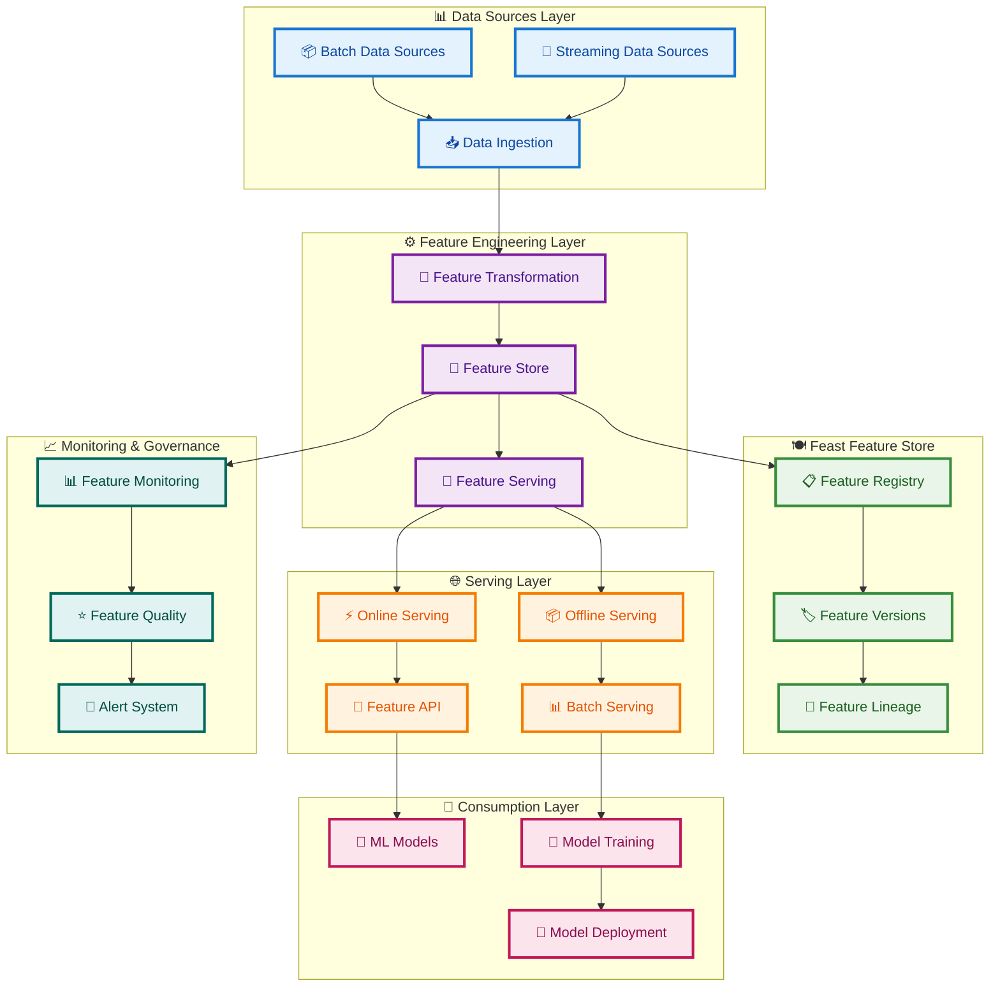
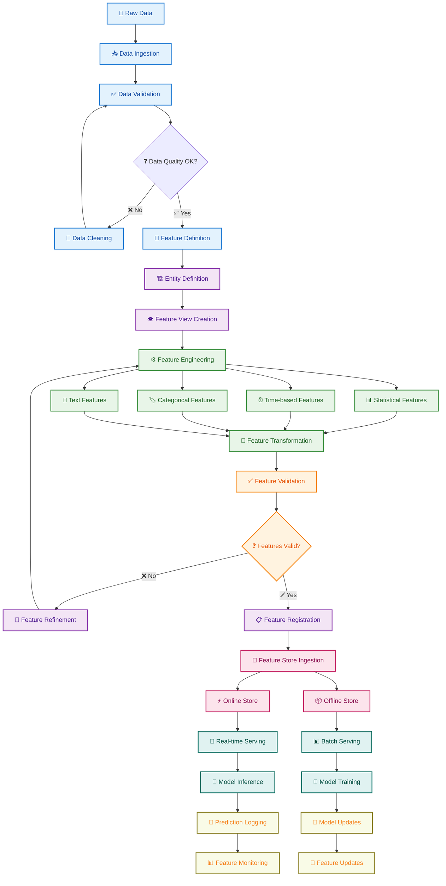
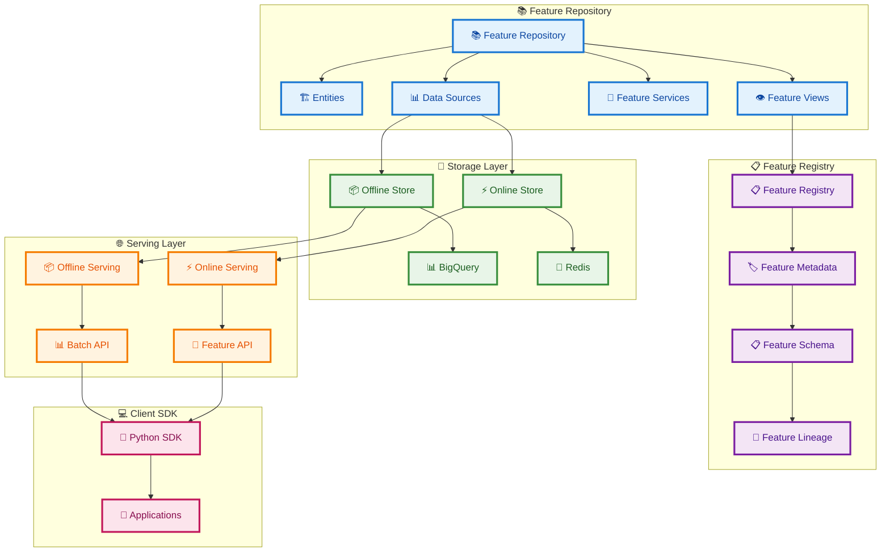
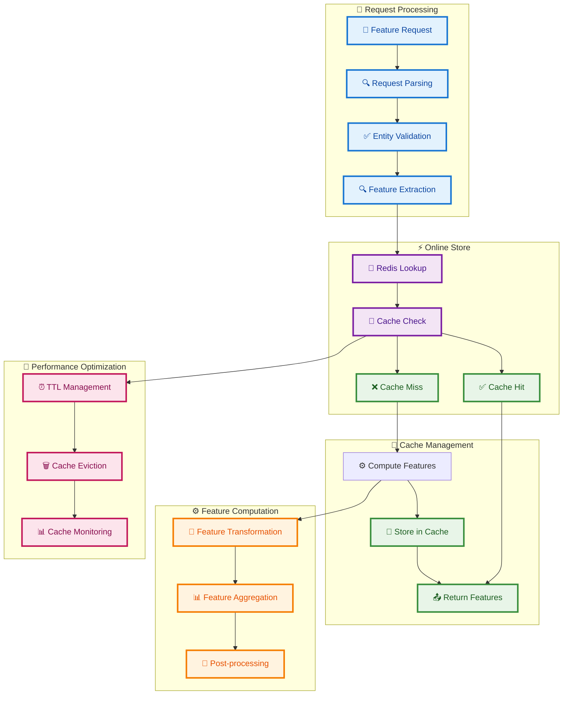
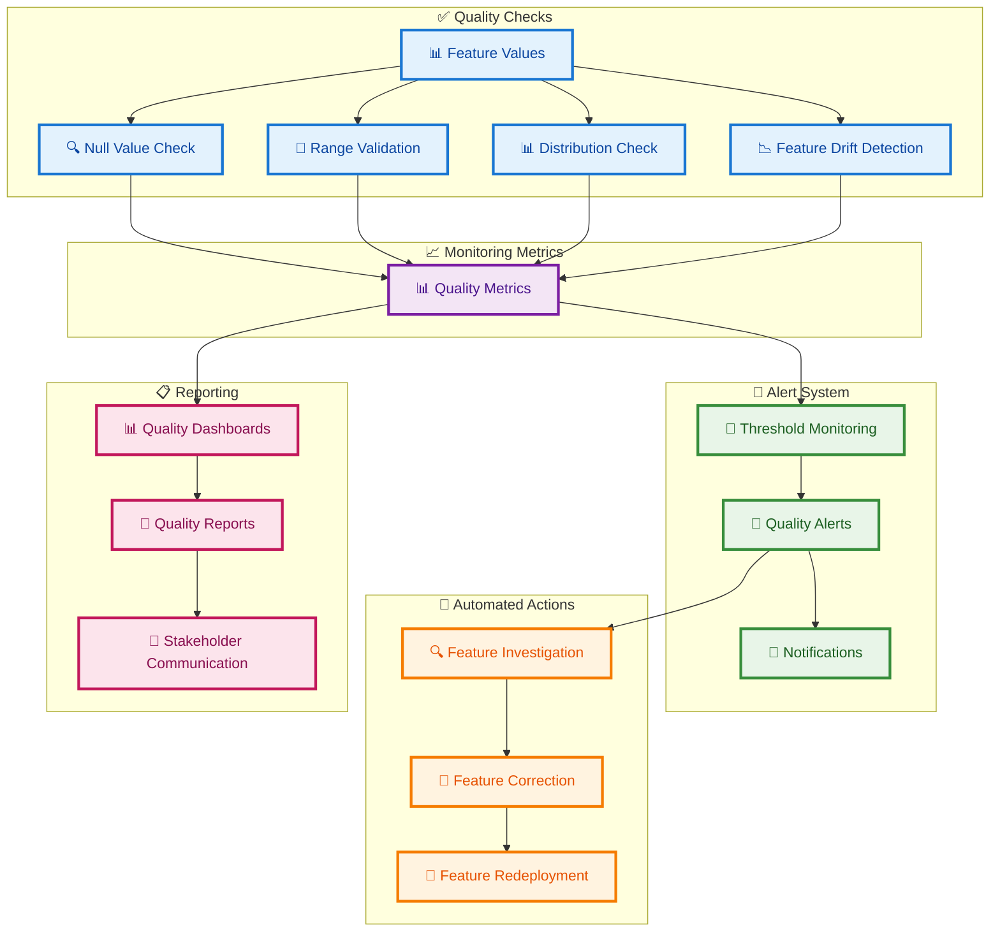
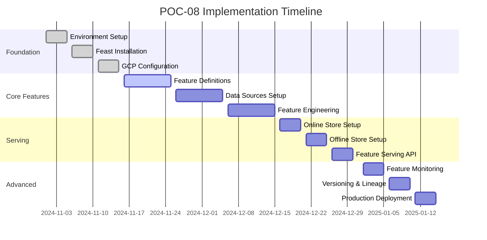
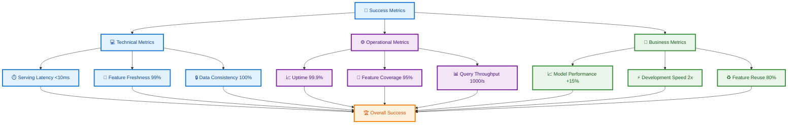

# POC-08 Advanced Feature Engineering Architecture Plan

## Overview
This POC implements a comprehensive feature engineering platform using Feast feature store on Google Cloud, demonstrating advanced feature engineering techniques, real-time serving, and feature versioning.

## System Architecture

## Detailed Feature Engineering Pipeline

## Feast Feature Store Architecture

## Advanced Feature Engineering Techniques

```mermaid
graph TD
    %% Define styles
    classDef mainClass fill:#e3f2fd,stroke:#1976d2,stroke-width:3px,color:#0d47a1
    classDef statisticalClass fill:#f3e5f5,stroke:#7b1fa2,stroke-width:3px,color:#4a148c
    classDef temporalClass fill:#e8f5e8,stroke:#388e3c,stroke-width:3px,color:#1b5e20
    classDef categoricalClass fill:#fff3e0,stroke:#f57c00,stroke-width:3px,color:#e65100
    classDef textClass fill:#fce4ec,stroke:#c2185b,stroke-width:3px,color:#880e4f

    subgraph "⚙️ Feature Types"
        FEATURES[⚙️ Feature Engineering]
        FEATURES --> STATISTICAL[📊 Statistical Features]
        FEATURES --> TEMPORAL[⏰ Temporal Features]
        FEATURES --> CATEGORICAL[🏷️ Categorical Features]
        FEATURES --> TEXT[📝 Text Features]
    end

    subgraph "📊 Statistical Features"
        STATISTICAL --> MEAN[📈 Mean]
        STATISTICAL --> MEDIAN[📊 Median]
        STATISTICAL --> STD[📏 Standard Deviation]
        STATISTICAL --> SKEWNESS[📉 Skewness]
        STATISTICAL --> KURTOSIS[📊 Kurtosis]
    end

    subgraph "⏰ Temporal Features"
        TEMPORAL --> TIME_DIFF[⏱️ Time Differences]
        TEMPORAL --> LAGS[🔄 Lag Features]
        TEMPORAL --> ROLLING[📈 Rolling Statistics]
        TEMPORAL --> SEASONAL[🌊 Seasonal Features]
        TEMPORAL --> TREND[📈 Trend Features]
    end

    subgraph "🏷️ Categorical Features"
        CATEGORICAL --> ONEHOT[🔥 One-hot Encoding]
        CATEGORICAL --> TARGET[🎯 Target Encoding]
        CATEGORICAL --> FREQUENCY[🔢 Frequency Encoding]
        CATEGORICAL --> EMBEDDING[🧠 Entity Embeddings]
    end

    subgraph "📝 Text Features"
        TEXT --> TFIDF[📊 TF-IDF]
        TEXT --> EMBEDDINGS[🧠 Word Embeddings]
        TEXT --> TOPICS[🎭 Topic Modeling]
        TEXT --> SENTIMENT[😊 Sentiment Features]
    end

    %% Apply styles
    class FEATURES mainClass
    class STATISTICAL,MEAN,MEDIAN,STD,SKEWNESS,KURTOSIS statisticalClass
    class TEMPORAL,TIME_DIFF,LAGS,ROLLING,SEASONAL,TREND temporalClass
    class CATEGORICAL,ONEHOT,TARGET,FREQUENCY,EMBEDDING categoricalClass
    class TEXT,TFIDF,EMBEDDINGS,TOPICS,SENTIMENT textClass
```

## Real-time Feature Serving Architecture

## Feature Versioning and Lineage

```mermaid
graph TD
    %% Define styles
    classDef versionClass fill:#e3f2fd,stroke:#1976d2,stroke-width:3px,color:#0d47a1
    classDef lineageClass fill:#f3e5f5,stroke:#7b1fa2,stroke-width:3px,color:#4a148c
    classDef metadataClass fill:#e8f5e8,stroke:#388e3c,stroke-width:3px,color:#1b5e20
    classDef governanceClass fill:#fff3e0,stroke:#f57c00,stroke-width:3px,color:#e65100
    classDef auditClass fill:#fce4ec,stroke:#c2185b,stroke-width:3px,color:#880e4f

    subgraph "🔄 Version Control"
        FEATURE[📝 Feature Definition]
        FEATURE --> VERSION[🏷️ Version Creation]
        VERSION --> GIT[📋 Git-based Versioning]
        GIT --> HISTORY[📚 Version History]
    end

    subgraph "🔗 Lineage Tracking"
        HISTORY --> DEPENDENCIES[🔗 Feature Dependencies]
        DEPENDENCIES --> DATA_SOURCES[📊 Data Source Tracking]
        DATA_SOURCES --> TRANSFORMATIONS[⚙️ Transformation Tracking]
    end

    subgraph "📊 Metadata Management"
        TRANSFORMATIONS --> METADATA[🏷️ Feature Metadata]
        METADATA --> SCHEMA[📋 Schema Information]
        SCHEMA --> STATISTICS[📈 Feature Statistics]
        STATISTICS --> QUALITY[⭐ Quality Metrics]
    end

    subgraph "🛡️ Governance"
        QUALITY --> VALIDATION[✅ Feature Validation]
        VALIDATION --> APPROVAL[👍 Feature Approval]
        APPROVAL --> PUBLISHING[📢 Feature Publishing]
    end

    subgraph "📝 Audit Trail"
        PUBLISHING --> AUDIT[📝 Audit Logging]
        AUDIT --> COMPLIANCE[📋 Compliance Reporting]
        COMPLIANCE --> RETENTION[💾 Data Retention]
    end

    %% Apply styles
    class FEATURE,VERSION,GIT,HISTORY versionClass
    class DEPENDENCIES,DATA_SOURCES,TRANSFORMATIONS lineageClass
    class METADATA,SCHEMA,STATISTICS,QUALITY metadataClass
    class VALIDATION,APPROVAL,PUBLISHING governanceClass
    class AUDIT,COMPLIANCE,RETENTION auditClass
```

## Feature Quality Monitoring

## Technology Stack

```mermaid
graph TD
    %% Define styles
    classDef feastClass fill:#e3f2fd,stroke:#1976d2,stroke-width:3px,color:#0d47a1
    classDef gcpClass fill:#f3e5f5,stroke:#7b1fa2,stroke-width:3px,color:#4a148c
    classDef pythonClass fill:#e8f5e8,stroke:#388e3c,stroke-width:3px,color:#1b5e20
    classDef infraClass fill:#fff3e0,stroke:#f57c00,stroke-width:3px,color:#e65100
    classDef devClass fill:#fce4ec,stroke:#c2185b,stroke-width:3px,color:#880e4f

    subgraph "🍽️ Feast Feature Store"
        REGISTRY[📋 Feature Registry]
        REGISTRY --> FEATURE_DEFS[📝 Feature Definitions]
        REGISTRY --> VERSION_CONTROL[🔄 Version Control]
        REGISTRY --> LINEAGE_TRACKING[🔗 Lineage Tracking]
        ONLINE_STORE[⚡ Online Store]
        ONLINE_STORE --> REDIS[🔴 Redis]
        ONLINE_STORE --> REAL_TIME_SERVING[🚀 Real-time Serving]
        ONLINE_STORE --> LOW_LATENCY_ACCESS[⚡ Low-latency Access]
        OFFLINE_STORE[📦 Offline Store]
        OFFLINE_STORE --> BIGQUERY[📊 BigQuery]
        OFFLINE_STORE --> HISTORICAL_FEATURES[📚 Historical Features]
        OFFLINE_STORE --> BATCH_SERVING[📊 Batch Serving]
    end

    subgraph "☁️ Google Cloud Platform"
        BIGQUERY_GCP[📊 BigQuery]
        BIGQUERY_GCP --> DATA_WAREHOUSING[🏗️ Data Warehousing]
        BIGQUERY_GCP --> FEATURE_STORAGE[💾 Feature Storage]
        BIGQUERY_GCP --> ANALYTICS[📈 Analytics]
        CLOUD_STORAGE[☁️ Cloud Storage]
        CLOUD_STORAGE --> RAW_DATA_STORAGE[💾 Raw Data Storage]
        CLOUD_STORAGE --> FEATURE_ARTIFACTS[📦 Feature Artifacts]
        VERTEX_AI[🤖 Vertex AI]
        VERTEX_AI --> FEATURE_ENGINEERING[⚙️ Feature Engineering]
        VERTEX_AI --> MODEL_TRAINING[🚀 Model Training]
    end

    subgraph "🐍 Python Libraries"
        FEAST_SDK[🍽️ Feast SDK]
        FEAST_SDK --> FEATURE_DEFINITIONS[📝 Feature Definitions]
        FEAST_SDK --> FEATURE_SERVING[🚀 Feature Serving]
        FEAST_SDK --> CLIENT_LIBRARIES[📚 Client Libraries]
        PANDAS[🐼 Pandas]
        PANDAS --> DATA_PROCESSING[⚙️ Data Processing]
        PANDAS --> FEATURE_ENGINEERING[⚙️ Feature Engineering]
        FEATURETOOLS[🔧 Featuretools]
        FEATURETOOLS --> AUTOMATED_FE[🤖 Automated Feature Engineering]
        FEATURETOOLS --> DEEP_FEATURE_SYNTHESIS[🔬 Deep Feature Synthesis]
    end

    subgraph "🏗️ Infrastructure"
        KUBERNETES[⚓ Kubernetes]
        KUBERNETES --> FEAST_DEPLOYMENT[🍽️ Feast Deployment]
        KUBERNETES --> AUTO_SCALING[📈 Auto-scaling]
        DOCKER[🐳 Docker]
        DOCKER --> CONTAINERIZATION[📦 Containerization]
        DOCKER --> ENVIRONMENT_CONSISTENCY[🔧 Environment Consistency]
    end

    subgraph "💻 Development"
        VSCODE[💻 VS Code]
        VSCODE --> CODE_EDITOR[✏️ Code Editor]
        JUPYTER[📓 Jupyter Notebooks]
        JUPYTER --> NOTEBOOKS[📝 Notebooks]
        GIT[🔄 Git]
        GIT --> VERSION_CONTROL_DEV[📋 Version Control]
    end

    %% Apply styles
    class REGISTRY,FEATURE_DEFS,VERSION_CONTROL,LINEAGE_TRACKING,ONLINE_STORE,REDIS,REAL_TIME_SERVING,LOW_LATENCY_ACCESS,OFFLINE_STORE,HISTORICAL_FEATURES,BATCH_SERVING feastClass
    class BIGQUERY_GCP,DATA_WAREHOUSING,FEATURE_STORAGE,ANALYTICS,CLOUD_STORAGE,RAW_DATA_STORAGE,FEATURE_ARTIFACTS,VERTEX_AI,FEATURE_ENGINEERING,MODEL_TRAINING gcpClass
    class FEAST_SDK,FEATURE_DEFINITIONS,FEATURE_SERVING,CLIENT_LIBRARIES,PANDAS,DATA_PROCESSING,FEATURETOOLS,AUTOMATED_FE,DEEP_FEATURE_SYNTHESIS pythonClass
    class KUBERNETES,FEAST_DEPLOYMENT,AUTO_SCALING,DOCKER,CONTAINERIZATION,ENVIRONMENT_CONSISTENCY infraClass
    class VSCODE,CODE_EDITOR,JUPYTER,NOTEBOOKS,GIT,VERSION_CONTROL_DEV devClass
```

## Implementation Phases

## Success Metrics Dashboard

