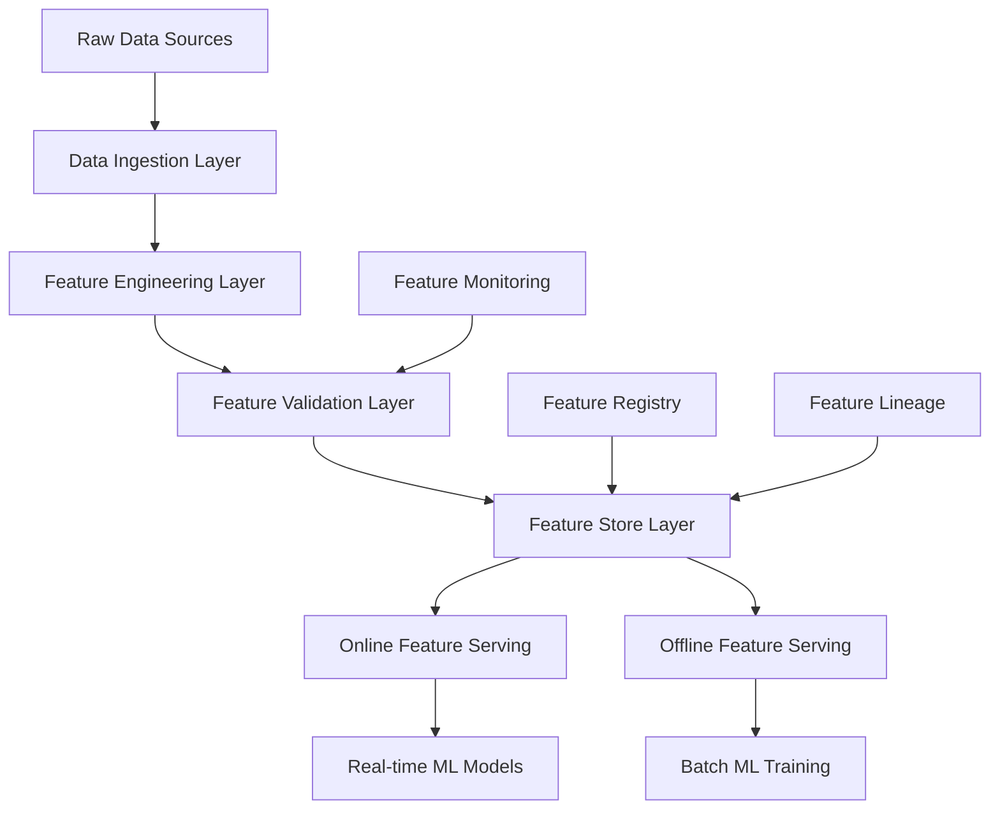
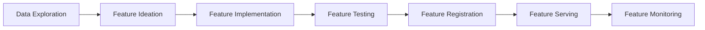
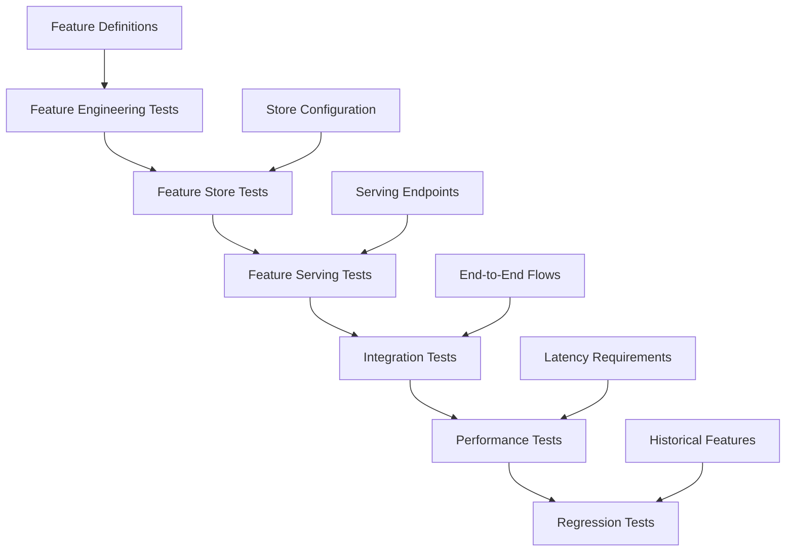
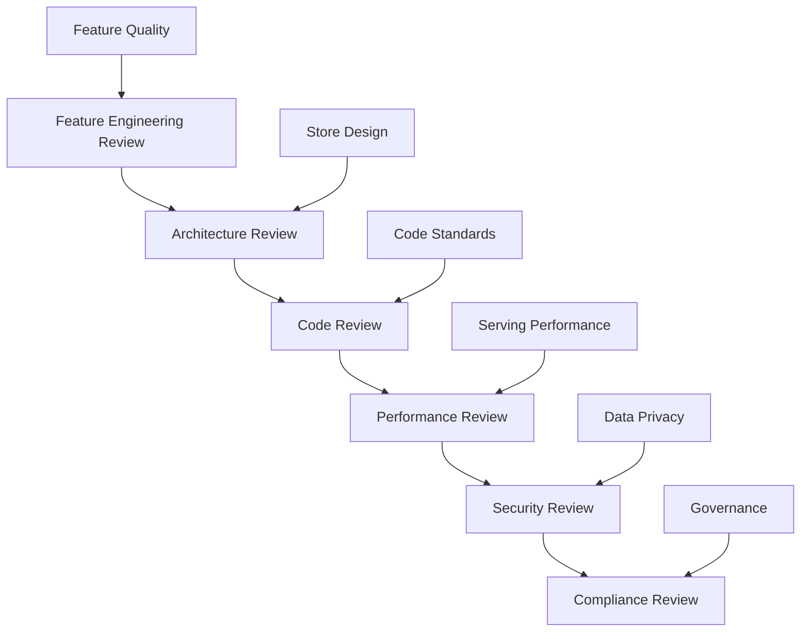
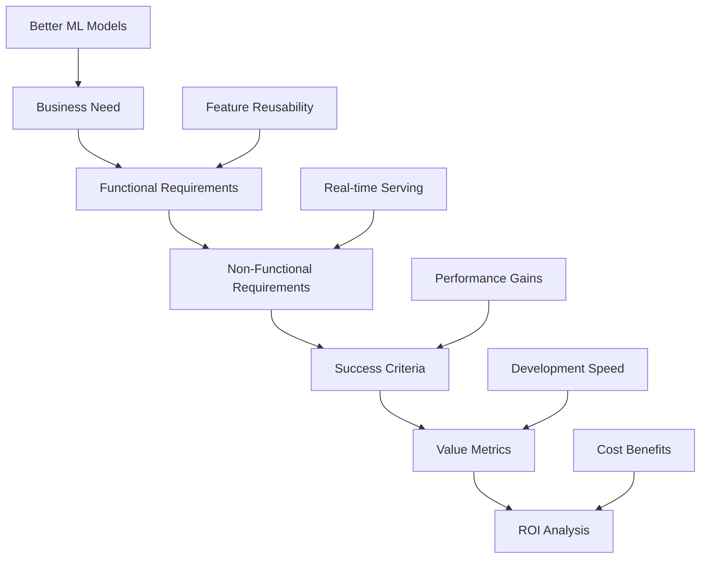
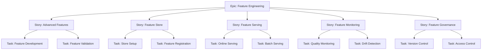
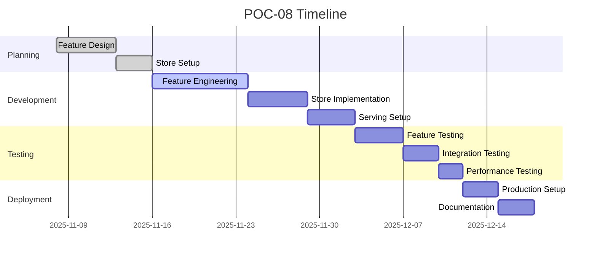

# 08: Advanced Feature Engineering - Feature Store Implementation Guide

## Agenda of POC
This Proof of Concept implements advanced feature engineering techniques with a production-ready feature store. The POC demonstrates sophisticated ML feature development, feature versioning, lineage tracking, and serving patterns for enterprise-scale ML systems.

### Objectives:
- Implement advanced feature engineering pipelines
- Build feature store with Feast framework
- Enable feature versioning and lineage
- Set up real-time and batch feature serving
- Demonstrate feature monitoring and validation
- Showcase feature reusability across models

### Success Criteria:
- Feature store operational with versioning
- Real-time feature serving <50ms latency
- Feature quality validation >95% pass rate
- Feature lineage tracking fully implemented
- Feature reusability demonstrated across 2+ models

## Tech Stack
- **Feature Engineering**:
  - pandas: Data manipulation and feature creation
  - scikit-learn: Feature preprocessing and transformation
  - Featuretools: Automated feature engineering
- **Feature Store**:
  - Feast: Open-source feature store framework
  - Redis/PostgreSQL: Online/offline stores
  - Parquet: Feature storage format
- **Infrastructure**:
  - Docker: Containerization
  - Kubernetes: Orchestration (optional)
  - Cloud Storage: Feature artifact storage
- **Development Tools**:
  - Python 3.8+
  - Jupyter: Feature experimentation
  - SQL: Feature computation queries

## How to Start
### Prerequisites:
1. Python environment with required packages
2. Docker for containerized services
3. Sample datasets for feature engineering
4. Basic understanding of feature engineering concepts

### Initial Setup:
```bash
# Install dependencies
pip install feast pandas scikit-learn featuretools redis

# Set up feature store
feast init feature_store
cd feature_store

# Initialize Feast project
feast apply
```

### Project Structure:
```
08-Advanced-Feature-Engineering/
├── feature_store/
│   ├── feature_store.yaml    # Feature store config
│   ├── features.py          # Feature definitions
│   ├── entities.py          # Entity definitions
│   └── data_sources.py      # Data source configs
├── src/
│   ├── feature_engineering/
│   │   ├── advanced_features.py
│   │   ├── temporal_features.py
│   │   └── categorical_features.py
│   ├── feature_validation/
│   │   ├── quality_checks.py
│   │   └── drift_detection.py
│   └── feature_serving/
│       ├── online_serving.py
│       └── batch_serving.py
├── data/
│   ├── raw/                 # Raw datasets
│   ├── processed/           # Processed features
│   └── metadata/            # Feature metadata
├── tests/
│   ├── test_features.py
│   ├── test_store.py
│   └── test_serving.py
├── notebooks/
│   └── feature_exploration.ipynb
└── docker/
    └── Dockerfile
```

### Getting Started:
1. Set up Feast feature store
2. Define entities and features
3. Implement advanced feature engineering
4. Configure online and offline stores
5. Test feature serving

## How to End
### Final Deliverables:
1. Operational feature store with Feast
2. Advanced feature engineering pipelines
3. Real-time and batch feature serving
4. Feature versioning and lineage tracking
5. Feature quality monitoring and validation
6. Documentation and usage examples

### Completion Checklist:
- [ ] Feature store initialized and configured
- [ ] Advanced features implemented and tested
- [ ] Feature serving operational
- [ ] Feature versioning working
- [ ] Quality validation implemented
- [ ] Documentation complete

## Architect View
As the Data Architect, I design a scalable feature engineering platform that supports advanced ML feature development and serving.

### Architecture Overview:


### Design Principles:
- **Modularity**: Separate concerns for engineering, validation, and serving
- **Scalability**: Support for large-scale feature computation and serving
- **Consistency**: Standardized feature definitions and serving patterns
- **Governance**: Feature versioning, lineage, and access control
- **Observability**: Comprehensive monitoring and quality metrics

### Technical Decisions:
- Feast as the feature store framework for its maturity and ecosystem
- Redis for online serving due to low latency requirements
- Parquet for offline storage due to columnar efficiency
- Docker for consistent deployment across environments
- Python-based feature definitions for flexibility

## Developer View
As the ML Engineer, I implement advanced feature engineering techniques and integrate them with the feature store.

### Development Workflow:


### Key Implementation:
```python
# Example advanced feature engineering with Feast
from feast import FeatureStore
from feast.data_source import FileSource
from feast.value_type import ValueType
from feast.entity import Entity
from feast.feature import Feature
from feast.feature_view import FeatureView
import pandas as pd
from datetime import datetime, timedelta

# Define entity
customer_entity = Entity(
    name="customer",
    value_type=ValueType.INT64,
    description="Customer ID"
)

# Define data source
customer_source = FileSource(
    path="data/customer_features.parquet",
    event_timestamp_column="event_timestamp"
)

# Advanced feature engineering
def create_advanced_features(df):
    """Create sophisticated features"""
    # Temporal features
    df['days_since_last_purchase'] = (
        datetime.now() - pd.to_datetime(df['last_purchase_date'])
    ).dt.days

    # Rolling statistics
    df['purchase_amount_rolling_mean_30d'] = df.groupby('customer_id')[
        'purchase_amount'
    ].rolling('30D').mean().reset_index(0, drop=True)

    # Categorical encoding with frequency
    category_freq = df['product_category'].value_counts()
    df['category_frequency'] = df['product_category'].map(category_freq)

    # Interaction features
    df['price_sensitivity'] = df['purchase_amount'] / (df['product_price'] + 1)

    # Domain-specific features
    df['customer_lifetime_value'] = df['total_purchase_amount'] * df['customer_tenure']

    return df

# Define feature view
customer_features = FeatureView(
    name="customer_features",
    entities=["customer"],
    ttl=timedelta(days=30),
    features=[
        Feature(name="days_since_last_purchase", dtype=ValueType.INT64),
        Feature(name="purchase_amount_rolling_mean_30d", dtype=ValueType.FLOAT),
        Feature(name="category_frequency", dtype=ValueType.INT64),
        Feature(name="price_sensitivity", dtype=ValueType.FLOAT),
        Feature(name="customer_lifetime_value", dtype=ValueType.FLOAT),
    ],
    online=True,
    input=customer_source,
)

# Initialize feature store
store = FeatureStore(repo_path=".")

# Register features
store.apply([customer_entity, customer_features])

# Materialize features
store.materialize(
    start_date=datetime.now() - timedelta(days=30),
    end_date=datetime.now()
)

# Retrieve features for inference
customer_features = store.get_online_features(
    features=[
        "customer_features:days_since_last_purchase",
        "customer_features:purchase_amount_rolling_mean_30d",
        "customer_features:category_frequency",
        "customer_features:price_sensitivity",
        "customer_features:customer_lifetime_value",
    ],
    entity_rows=[{"customer": 12345}]
).to_dict()

print(customer_features)
```

### Best Practices:
- Use descriptive feature names with clear business meaning
- Implement feature validation before registration
- Document feature engineering logic and assumptions
- Use feature versioning for iterative improvements
- Monitor feature distributions and drift
- Implement feature importance analysis

## Tester View
As the QA Engineer, I validate feature engineering quality, feature store functionality, and serving reliability.

### Testing Strategy:


### Test Categories:
1. **Feature Engineering Tests**:
   - Feature computation accuracy
   - Edge case handling
   - Data type validation
   - Feature correlation analysis

2. **Feature Store Tests**:
   - Feature registration and retrieval
   - Versioning and lineage tracking
   - Store consistency and durability
   - Access control and permissions

3. **Feature Serving Tests**:
   - Online serving latency and throughput
   - Batch serving performance
   - Feature freshness and staleness
   - Error handling and fallback

4. **Quality Assurance Tests**:
   - Feature drift detection
   - Data quality validation
   - Feature importance stability
   - Model performance correlation

### Quality Gates:
- All feature computations pass validation tests
- Feature store operations successful >99.9% of time
- Feature serving latency within SLAs
- Feature quality metrics meet thresholds
- No regressions in existing features

## Reviewer View
As the Technical Reviewer, I ensure the feature engineering implementation follows best practices and enterprise standards.

### Review Checklist:


### Key Review Areas:
1. **Feature Engineering Quality**:
   - Business relevance and predictive power
   - Computational efficiency and scalability
   - Robustness to data changes
   - Documentation and maintainability

2. **Feature Store Implementation**:
   - Proper entity and feature definitions
   - Efficient storage and retrieval patterns
   - Versioning and lineage capabilities
   - Integration with ML pipelines

3. **Production Readiness**:
   - Error handling and monitoring
   - Performance optimization
   - Security and access controls
   - Operational procedures

4. **Compliance and Governance**:
   - Data privacy and protection
   - Feature usage auditing
   - Regulatory compliance
   - Ethical AI considerations

### Feedback Framework:
- **Critical**: Data privacy violations, security issues
- **Major**: Performance bottlenecks, architectural flaws
- **Minor**: Code style issues, documentation gaps
- **Enhancement**: Optimization opportunities, additional features

## Business Analyst View
As the Business Analyst, I ensure the feature engineering delivers measurable business value and supports ML model performance.

### Business Requirements:


### Business Value Proposition:
- **Problem**: Inconsistent and hard-to-maintain feature engineering
- **Solution**: Centralized feature store with advanced engineering
- **Impact**: 20-30% improvement in model performance, faster development
- **Benefits**: Feature reusability, consistent serving, reduced technical debt

### Success Metrics:
- **Performance**: Model accuracy improvement >15%
- **Efficiency**: Feature development time reduced by 40%
- **Quality**: Feature consistency across models >95%
- **Business**: Faster time-to-market for ML features

### Stakeholder Analysis:
- **Data Scientists**: Better features, faster experimentation
- **ML Engineers**: Reusable components, consistent serving
- **Product Teams**: Reliable features for production models
- **Business Users**: Improved model predictions and insights
- **IT Operations**: Scalable infrastructure, monitoring capabilities

## Product Owner View
As the Product Owner, I define the feature engineering platform vision and prioritize features for ML excellence.

### Product Vision:
Build an enterprise-grade feature engineering platform that accelerates ML development, ensures feature quality, and enables scalable ML operations across the organization.

### Product Backlog:


### Prioritization (MoSCoW):
- **Must Have**: Core feature engineering and basic store
- **Should Have**: Feature serving and monitoring
- **Could Have**: Advanced governance features
- **Won't Have**: Multi-cloud support (future scope)

### Definition of Done:
- [ ] Advanced features implemented and tested
- [ ] Feature store operational with versioning
- [ ] Feature serving working for online and batch
- [ ] Feature quality monitoring in place
- [ ] Documentation complete for data science teams
- [ ] Performance benchmarks met

### Roadmap:


### KPIs:
- **Quality**: Feature accuracy, consistency, and predictive power
- **Performance**: Feature computation speed, serving latency
- **Efficiency**: Development time, reusability metrics
- **Business**: Model performance improvement, time-to-market
- **Adoption**: Feature usage across teams, user satisfaction

This comprehensive guide ensures POC-08 delivers advanced feature engineering capabilities with a production-ready feature store, establishing expertise in ML feature development and management.
