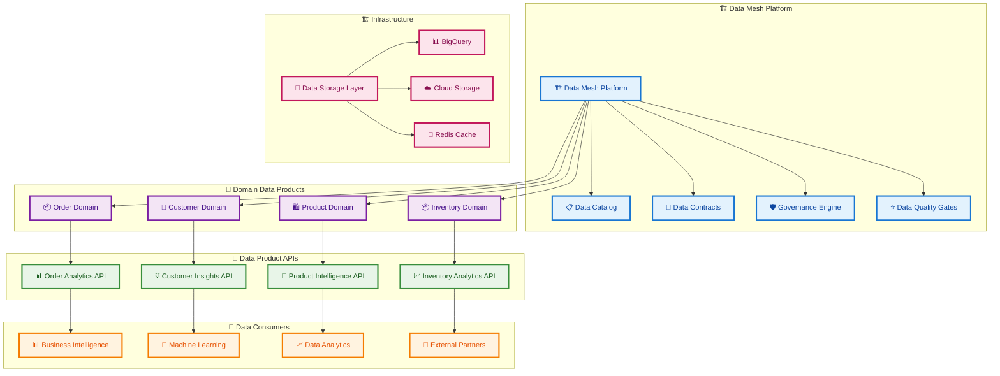
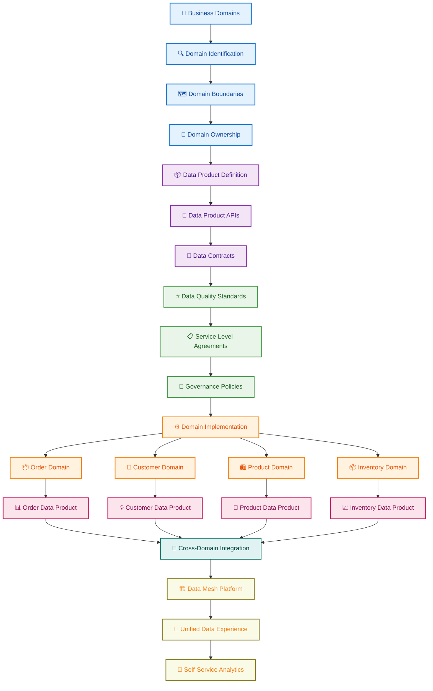
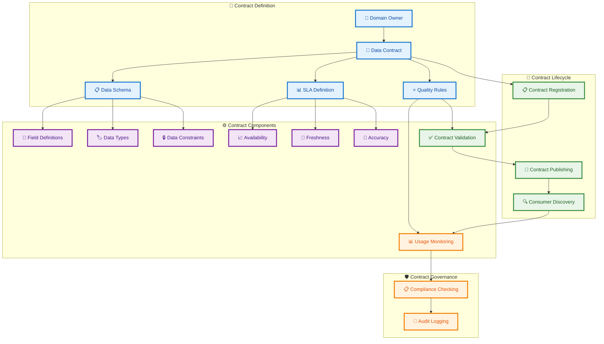
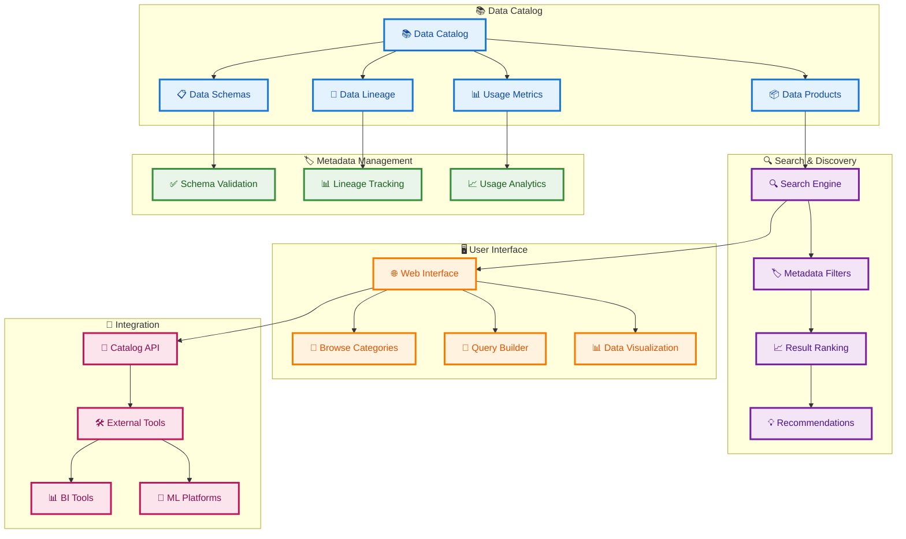
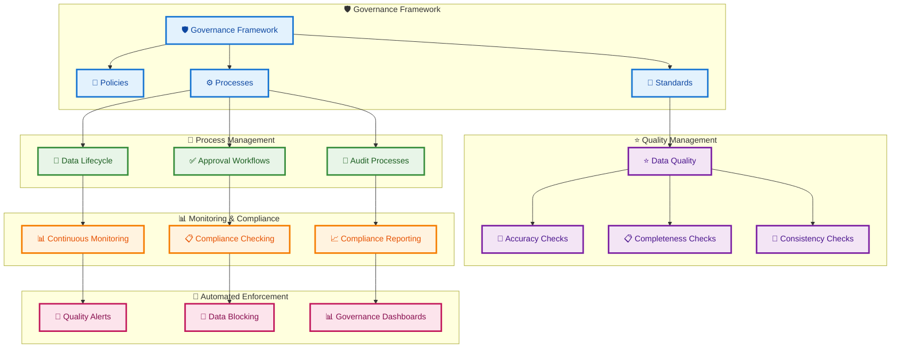
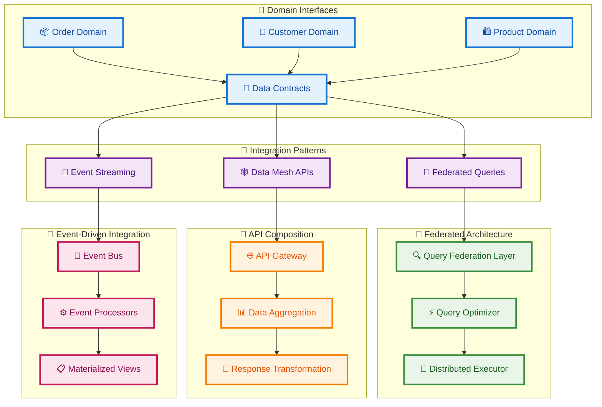
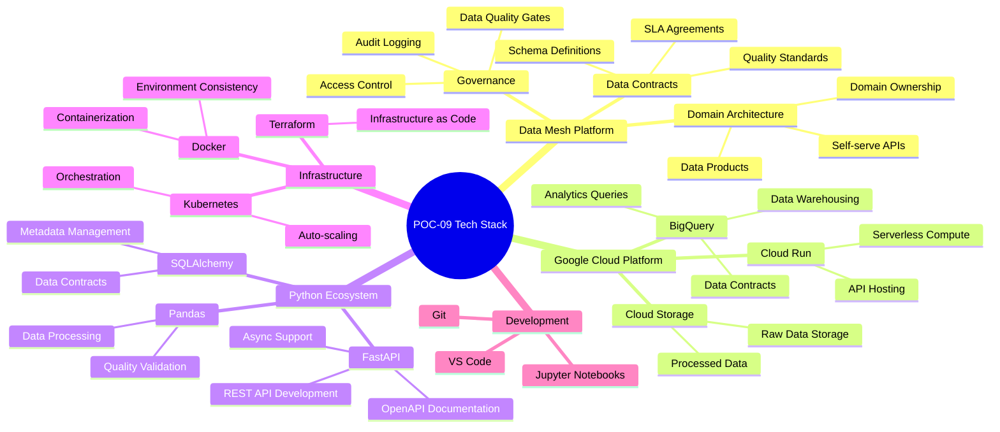
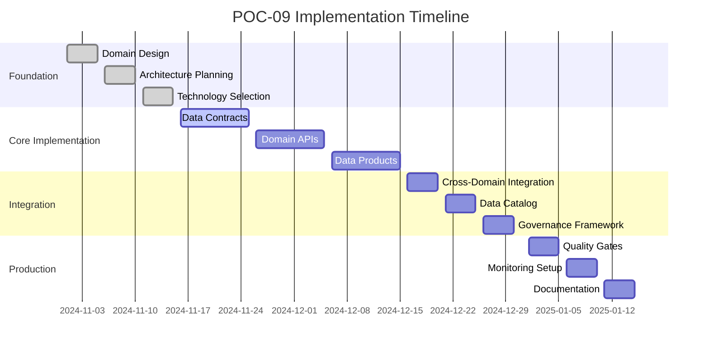
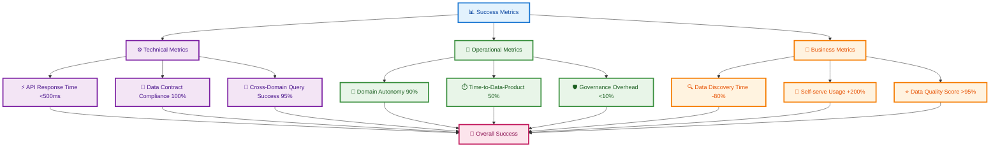

# POC-09 Data Mesh Architecture Plan

## Overview
This POC designs and implements a data mesh architecture for a fictional e-commerce company, demonstrating domain-driven data ownership, data contracts, and decentralized data governance with sample data products.

## System Architecture

## Domain-Driven Data Architecture

## Data Contract Architecture

## Data Product Implementation Architecture

```mermaid
graph TD
    %% Define styles
    classDef structureClass fill:#e3f2fd,stroke:#1976d2,stroke-width:3px,color:#0d47a1
    classDef inputClass fill:#f3e5f5,stroke:#7b1fa2,stroke-width:3px,color:#4a148c
    classDef outputClass fill:#e8f5e8,stroke:#388e3c,stroke-width:3px,color:#1b5e20
    classDef transformationClass fill:#fff3e0,stroke:#f57c00,stroke-width:3px,color:#e65100
    classDef metadataClass fill:#fce4ec,stroke:#c2185b,stroke-width:3px,color:#880e4f
    classDef governanceClass fill:#e0f2f1,stroke:#00695c,stroke-width:3px,color:#004d40

    subgraph "🏗️ Data Product Structure"
        PRODUCT[📦 Data Product]
        PRODUCT --> INPUT_PORTS[📥 Input Ports]
        PRODUCT --> OUTPUT_PORTS[📤 Output Ports]
        PRODUCT --> CODE[💻 Transformation Code]
        PRODUCT --> METADATA[🏷️ Metadata]
    end

    subgraph "📥 Input Ports"
        INPUT_PORTS --> BATCH_INPUTS[📦 Batch Data Sources]
        INPUT_PORTS --> STREAM_INPUTS[🌊 Streaming Data Sources]
        INPUT_PORTS --> API_INPUTS[🔌 API Data Sources]
    end

    subgraph "📤 Output Ports"
        OUTPUT_PORTS --> API_OUTPUTS[🌐 REST APIs]
        OUTPUT_PORTS --> BATCH_OUTPUTS[📦 Batch Exports]
        OUTPUT_PORTS --> STREAM_OUTPUTS[📡 Event Streams]
    end

    subgraph "⚙️ Transformation Layer"
        CODE --> INGESTION[📥 Data Ingestion]
        INGESTION --> PROCESSING[⚙️ Data Processing]
        PROCESSING --> TRANSFORMATION[🔄 Data Transformation]
        TRANSFORMATION --> VALIDATION[✅ Data Validation]
    end

    subgraph "🏷️ Metadata Layer"
        METADATA --> SCHEMA[📋 Data Schema]
        METADATA --> LINEAGE[🔗 Data Lineage]
        METADATA --> QUALITY[⭐ Data Quality]
        METADATA --> USAGE[📊 Usage Statistics]
    end

    subgraph "🛡️ Governance"
        PRODUCT --> POLICIES[📜 Governance Policies]
        POLICIES --> ACCESS[🔐 Access Control]
        POLICIES --> AUDIT[📝 Audit Trails]
        POLICIES --> COMPLIANCE[📋 Compliance Rules]
    end

    %% Apply styles
    class PRODUCT,INPUT_PORTS,OUTPUT_PORTS,CODE,METADATA structureClass
    class BATCH_INPUTS,STREAM_INPUTS,API_INPUTS inputClass
    class API_OUTPUTS,BATCH_OUTPUTS,STREAM_OUTPUTS outputClass
    class INGESTION,PROCESSING,TRANSFORMATION,VALIDATION transformationClass
    class SCHEMA,LINEAGE,QUALITY,USAGE metadataClass
    class POLICIES,ACCESS,AUDIT,COMPLIANCE governanceClass
```

## Data Catalog and Discovery Architecture

## Governance and Quality Architecture

## Cross-Domain Data Integration

## Technology Stack Visualization

## Implementation Phases

## Success Metrics Dashboard

