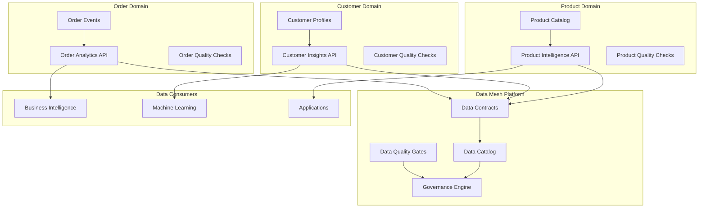
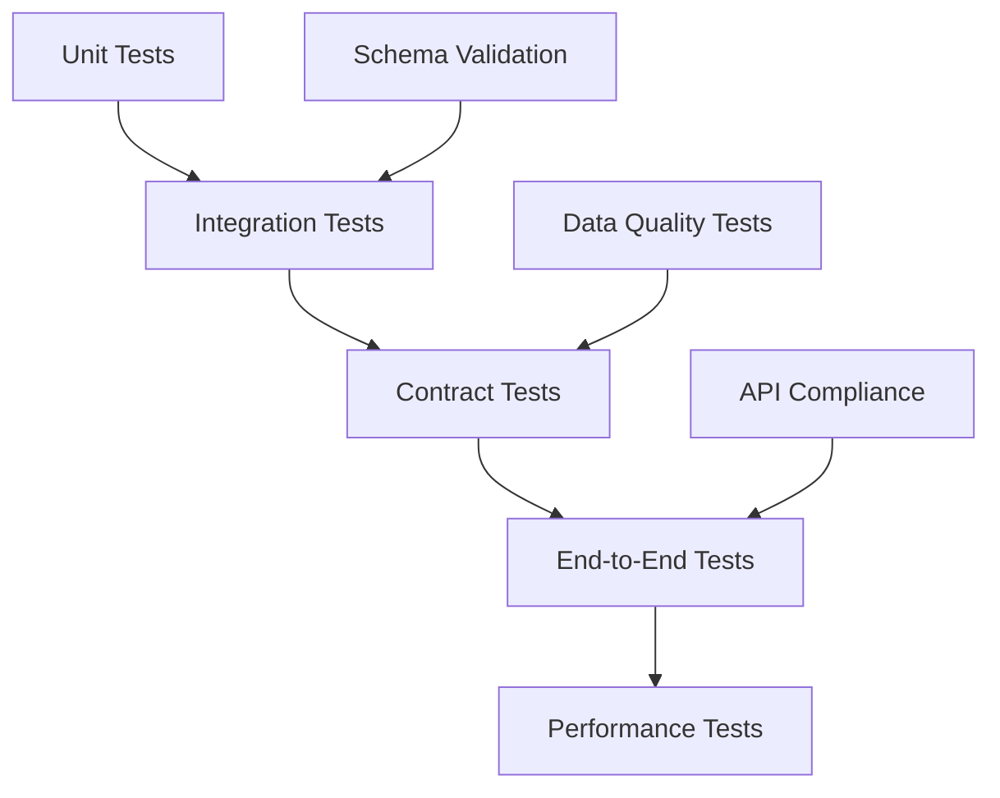
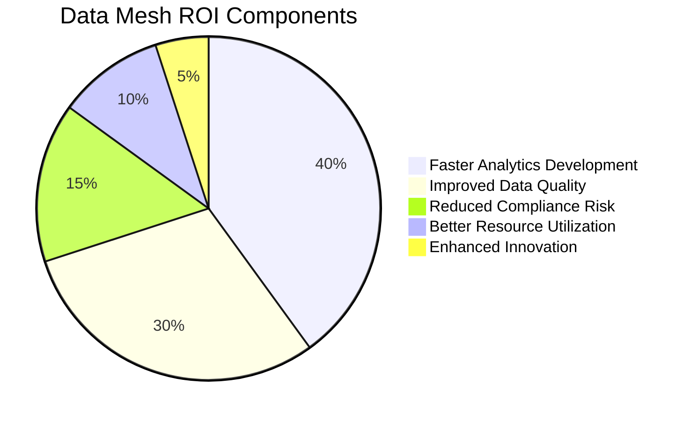
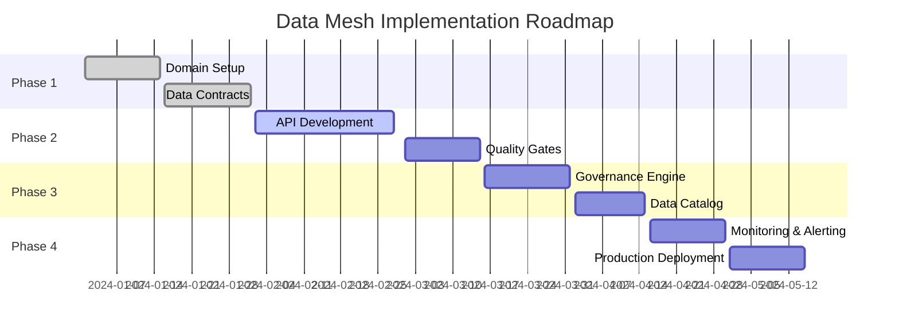

# Data Mesh POC Implementation Guide

## Agenda
This POC demonstrates the design and implementation of a data mesh architecture for a fictional e-commerce company called "ShopFlow". The implementation covers:

1. **Domain-Driven Design**: Establishing data domains and ownership
2. **Data Contracts**: Defining interfaces between data producers and consumers
3. **Data Products**: Building self-serve data APIs with quality guarantees
4. **Governance Framework**: Implementing data quality, security, and compliance
5. **Data Catalog**: Creating discoverability and documentation systems

## Tech Stack
- **Core**: Python 3.8+, FastAPI, SQLAlchemy, PostgreSQL
- **Infrastructure**: Docker, Docker Compose, Nginx (reverse proxy)
- **Data Quality**: Great Expectations, Pandera
- **Documentation**: OpenAPI/Swagger, MkDocs
- **Monitoring**: Prometheus, Grafana
- **Testing**: pytest, pytest-asyncio, httpx

## How to Start
1. **Environment Setup**:
   ```bash
   cd 09-Data-Mesh
   python -m venv venv
   source venv/bin/activate  # On Windows: venv\Scripts\activate
   pip install -r requirements.txt
   ```

2. **Database Setup**:
   ```bash
   docker run -d --name datamesh-db -p 5432:5432 -e POSTGRES_PASSWORD=password postgres:13
   python -c "from src.database import init_db; init_db()"
   ```

3. **Run Data Products**:
   ```bash
   # Order Analytics API
   python -m uvicorn src.domains.order.api:app --reload --port 8001

   # Customer Insights API (new terminal)
   python -m uvicorn src.domains.customer.api:app --reload --port 8002

   # Product Catalog API (new terminal)
   python -m uvicorn src.domains.product.api:app --reload --port 8003
   ```

## How to End
1. **Stop Services**: `docker-compose down`
2. **Clean Up**: `docker system prune -f`
3. **Documentation**: Update data contracts and API docs
4. **Quality Gates**: Run data quality checks before deployment

## Architect Perspective

### System Architecture


### Design Decisions
- **Domain Boundaries**: Clear separation by business capability
- **Data Contracts**: Schema evolution with backward compatibility
- **Quality Gates**: Automated validation before data publication
- **Self-Serve Access**: REST APIs with OpenAPI documentation
- **Observability**: Metrics, logging, and tracing across domains

### Scalability Considerations
- Horizontal scaling of domain services
- Event-driven architecture for real-time updates
- Caching layer for frequently accessed data
- Multi-region deployment for global availability

## Developer Perspective

### Code Structure
```
src/
├── domains/
│   ├── order/
│   │   ├── api.py          # FastAPI application
│   │   ├── models.py       # SQLAlchemy models
│   │   ├── schemas.py      # Pydantic schemas
│   │   └── quality.py      # Data quality checks
│   ├── customer/
│   │   └── ...            # Similar structure
│   └── product/
│       └── ...            # Similar structure
├── shared/
│   ├── database.py        # Database connection
│   ├── contracts.py       # Data contract validation
│   ├── catalog.py         # Data catalog interface
│   └── governance.py      # Governance engine
└── config/
    └── settings.py        # Configuration management
```

### Key Implementation Details
```python
# Data Contract Example
@dataclass
class DataContract:
    domain: str
    dataset: str
    version: str
    schema: Dict[str, Any]
    quality_rules: List[QualityRule]
    sla: SLACommitment

# API Implementation
@app.get("/orders/analytics/daily")
async def get_daily_order_analytics(
    date: date,
    db: Session = Depends(get_db)
) -> OrderAnalytics:
    """Get daily order analytics with data contract validation."""
    # Validate data contract
    contract = await validate_contract("order", "daily_analytics", "v1.0")

    # Query with quality checks
    result = await db.execute(
        select(OrderAnalytics).where(OrderAnalytics.date == date)
    )

    analytics = result.scalar_one()

    # Apply quality gates
    await apply_quality_gates(analytics, contract.quality_rules)

    return analytics
```

### Development Workflow
1. **Domain Development**: Implement domain-specific logic
2. **Contract Definition**: Define data contracts and schemas
3. **Quality Implementation**: Add data quality checks
4. **API Development**: Build REST APIs with documentation
5. **Testing**: Unit, integration, and contract tests
6. **Deployment**: Containerize and deploy to platform

## Tester Perspective

### Testing Strategy


### Test Categories
- **Unit Tests**: Individual functions and classes
- **Integration Tests**: Cross-domain data flows
- **Contract Tests**: Data contract compliance
- **Quality Tests**: Data validation rules
- **Performance Tests**: API response times and throughput

### Sample Test Implementation
```python
class TestDataContracts:
    def test_contract_validation(self):
        """Test data contract validation."""
        contract = DataContract(
            domain="order",
            dataset="daily_analytics",
            version="v1.0",
            schema={"date": "string", "total_orders": "integer"},
            quality_rules=[NotNullRule("date"), RangeRule("total_orders", 0, 10000)]
        )

        # Valid data
        valid_data = {"date": "2024-01-01", "total_orders": 150}
        assert validate_data_contract(valid_data, contract)

        # Invalid data
        invalid_data = {"date": None, "total_orders": -1}
        assert not validate_data_contract(invalid_data, contract)

    @pytest.mark.asyncio
    async def test_api_contract_compliance(self, client):
        """Test API compliance with data contracts."""
        response = await client.get("/orders/analytics/daily?date=2024-01-01")
        assert response.status_code == 200

        data = response.json()
        contract = await get_contract("order", "daily_analytics", "v1.0")
        assert validate_response_contract(data, contract)
```

### Quality Assurance Process
1. **Automated Testing**: CI/CD pipeline with comprehensive test coverage
2. **Data Quality Gates**: Automated validation before deployment
3. **Contract Testing**: Consumer-driven contract tests
4. **Performance Benchmarking**: Load testing and monitoring
5. **Security Testing**: Vulnerability scanning and compliance checks

## Reviewer Perspective

### Code Review Checklist
- [ ] Domain boundaries clearly defined and documented
- [ ] Data contracts properly versioned and validated
- [ ] API endpoints follow REST principles
- [ ] Error handling and logging implemented
- [ ] Data quality checks comprehensive
- [ ] Security measures in place (authentication, authorization)
- [ ] Performance considerations addressed
- [ ] Documentation complete and accurate

### Security Considerations
- **Authentication**: JWT tokens for API access
- **Authorization**: Role-based access control (RBAC)
- **Data Privacy**: GDPR/CCPA compliance for PII data
- **Encryption**: Data at rest and in transit
- **Audit Logging**: All data access logged for compliance

### Performance Review Points
- **Query Optimization**: Efficient database queries
- **Caching Strategy**: Appropriate use of Redis/cache layers
- **Async Processing**: Non-blocking I/O operations
- **Resource Limits**: Memory and CPU usage monitoring
- **Scalability**: Horizontal scaling capabilities

### Maintainability Assessment
- **Code Organization**: Clear separation of concerns
- **Documentation**: Comprehensive API and code documentation
- **Testing Coverage**: >80% code coverage
- **Error Handling**: Graceful error handling and recovery
- **Monitoring**: Proper logging and metrics collection

## Business Analyst Perspective

### Business Requirements
The data mesh implementation addresses key business needs:

1. **Faster Time-to-Insight**: Self-serve access to domain data
2. **Improved Data Quality**: Domain ownership and accountability
3. **Regulatory Compliance**: Better control over sensitive data
4. **Innovation Enablement**: Reduced dependencies between teams
5. **Cost Optimization**: Efficient resource utilization

### Success Metrics
- **Data Discovery Time**: Reduced from weeks to hours
- **Data Quality Score**: >95% accuracy and completeness
- **Time-to-Market**: 40% faster for new analytics features
- **Compliance Coverage**: 100% audit-ready data processes
- **User Satisfaction**: >4.5/5 rating from data consumers

### ROI Analysis


### Business Value Realization
- **Revenue Impact**: Faster insights drive better business decisions
- **Cost Savings**: Reduced data engineering bottlenecks
- **Risk Reduction**: Better compliance and data governance
- **Competitive Advantage**: More agile data-driven organization

## Product Owner Perspective

### Product Vision
"Democratize data access while maintaining quality and governance"

### User Stories
- **As a data analyst**, I want to discover and access domain data easily so that I can create insights faster
- **As a data engineer**, I want to publish data products with quality guarantees so that consumers trust the data
- **As a compliance officer**, I want to track data usage and ensure regulatory compliance so that we avoid penalties
- **As a product manager**, I want to understand data dependencies so that I can plan releases effectively

### Roadmap


### Acceptance Criteria
- [ ] All domain APIs return data within 2 seconds
- [ ] Data quality score >95% across all domains
- [ ] 100% of data contracts validated automatically
- [ ] Self-serve data discovery working for all users
- [ ] Governance policies enforced automatically
- [ ] Comprehensive monitoring and alerting in place

### Stakeholder Management
- **Data Teams**: Regular demos and feedback sessions
- **Business Users**: Training sessions and documentation
- **IT Security**: Security reviews and compliance audits
- **Executive Team**: ROI reporting and strategic alignment

### Risk Management
- **Technical Risks**: Domain coupling, performance bottlenecks
- **Organizational Risks**: Resistance to change, skill gaps
- **Compliance Risks**: Data privacy and security concerns
- **Business Risks**: Misalignment with business objectives

### Success Measures
- **Adoption Rate**: Percentage of users actively using data mesh
- **Data Products**: Number of published data products
- **Quality Metrics**: Data quality and freshness scores
- **User Feedback**: Satisfaction surveys and usage analytics
- **Business Impact**: Measurable improvements in decision-making speed
