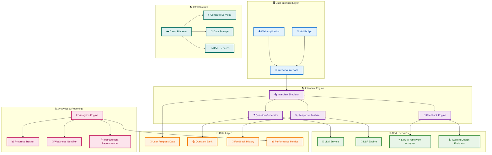
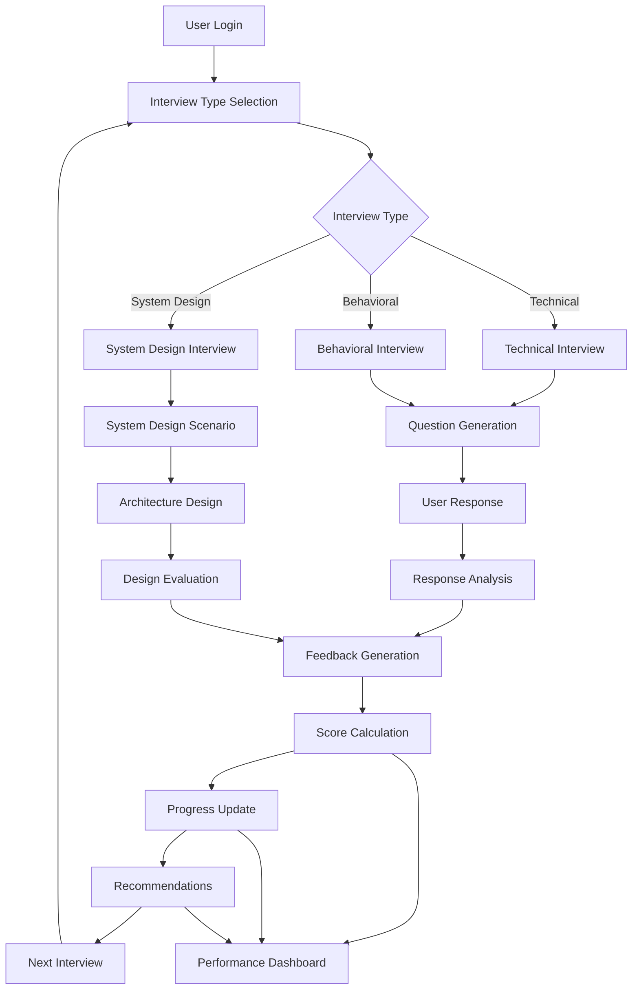
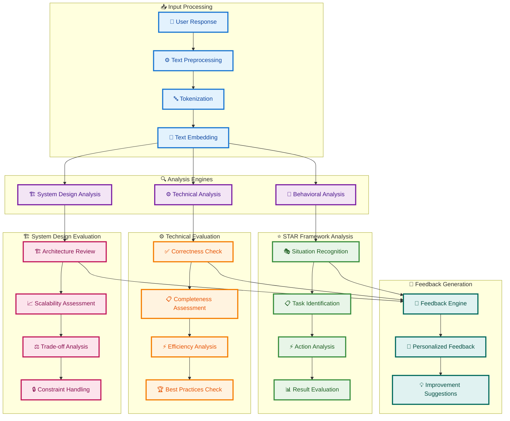
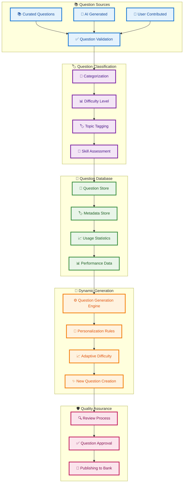
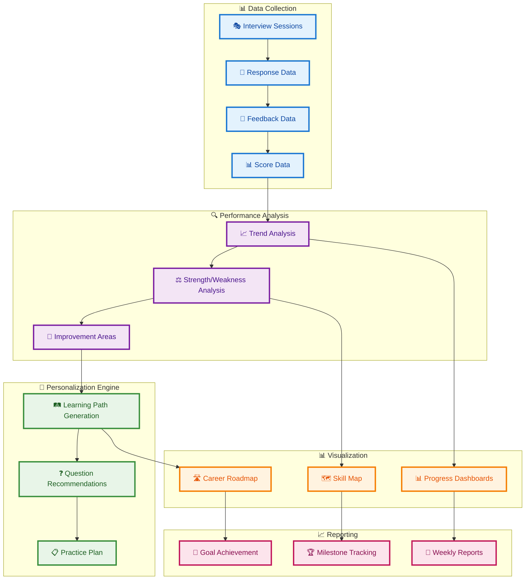
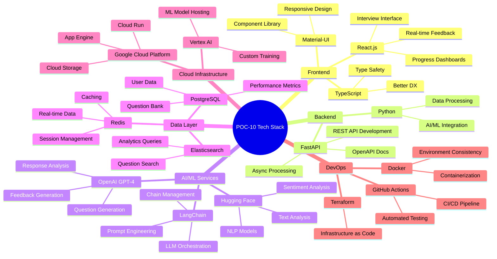
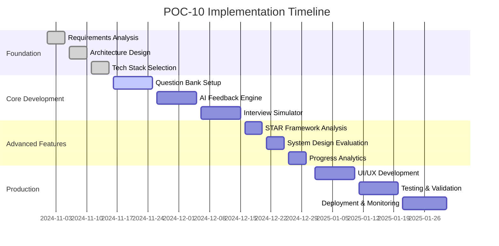
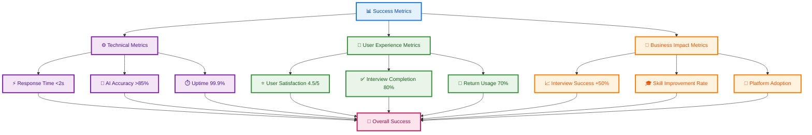

# POC-10 Interview Preparation Architecture Plan

## Overview
This POC builds an AI-powered interview preparation platform that simulates technical interviews, provides personalized feedback, and tracks progress using STAR framework analysis and system design walkthroughs.

## System Architecture

## Interview Simulation Flow

## AI-Powered Feedback Architecture

## Question Bank Management

## Progress Tracking and Analytics

## Real-time Interview Simulation

```mermaid
graph TD
    %% Define styles
    classDef sessionClass fill:#e3f2fd,stroke:#1976d2,stroke-width:3px,color:#0d47a1
    classDef processingClass fill:#f3e5f5,stroke:#7b1fa2,stroke-width:3px,color:#4a148c
    classDef responseClass fill:#e8f5e8,stroke:#388e3c,stroke-width:3px,color:#1b5e20
    classDef adaptiveClass fill:#fff3e0,stroke:#f57c00,stroke-width:3px,color:#e65100
    classDef controlClass fill:#fce4ec,stroke:#c2185b,stroke-width:3px,color:#880e4f

    subgraph "🎯 Session Management"
        SESSION_INIT[🚀 Session Initialization]
        SESSION_INIT --> USER_PROFILE[👤 User Profile Loading]
        USER_PROFILE --> DIFFICULTY_SETTING[📊 Difficulty Setting]
        DIFFICULTY_SETTING --> QUESTION_SEQUENCE[📋 Question Sequence Planning]
    end

    subgraph "⚡ Real-time Processing"
        QUESTION_SEQUENCE --> QUESTION_PRESENTATION[❓ Question Presentation]
        QUESTION_PRESENTATION --> TIMER_START[⏱️ Timer Start]
        TIMER_START --> RESPONSE_CAPTURE[🎤 Response Capture]
    end

    subgraph "🔄 Response Processing"
        RESPONSE_CAPTURE --> REAL_TIME_ANALYSIS[🔍 Real-time Analysis]
        REAL_TIME_ANALYSIS --> HINT_GENERATION[💡 Hint Generation]
        HINT_GENERATION --> FEEDBACK_STREAM[💬 Feedback Stream]
    end

    subgraph "🎛️ Adaptive System"
        FEEDBACK_STREAM --> PERFORMANCE_ADAPTATION[📈 Performance Adaptation]
        PERFORMANCE_ADAPTATION --> DIFFICULTY_ADJUSTMENT[⚖️ Difficulty Adjustment]
        DIFFICULTY_ADJUSTMENT --> QUESTION_ADAPTATION[🔄 Question Adaptation]
    end

    subgraph "🎮 Session Control"
        QUESTION_ADAPTATION --> NEXT_QUESTION[❓ Next Question]
        NEXT_QUESTION --> SESSION_PROGRESS[📊 Session Progress Tracking]
        SESSION_PROGRESS --> COMPLETION_CHECK[✅ Completion Check]
    end

    COMPLETION_CHECK -->|Continue| QUESTION_PRESENTATION
    COMPLETION_CHECK -->|Complete| SESSION_SUMMARY[📋 Session Summary]
    SESSION_SUMMARY --> PERFORMANCE_UPDATE[📈 Performance Update]

    %% Apply styles
    class SESSION_INIT,USER_PROFILE,DIFFICULTY_SETTING,QUESTION_SEQUENCE sessionClass
    class QUESTION_PRESENTATION,TIMER_START,RESPONSE_CAPTURE processingClass
    class REAL_TIME_ANALYSIS,HINT_GENERATION,FEEDBACK_STREAM responseClass
    class PERFORMANCE_ADAPTATION,DIFFICULTY_ADJUSTMENT,QUESTION_ADAPTATION adaptiveClass
    class NEXT_QUESTION,SESSION_PROGRESS,COMPLETION_CHECK,SESSION_SUMMARY,PERFORMANCE_UPDATE controlClass
```

## Technology Stack Visualization

## Implementation Phases

## Success Metrics Dashboard

