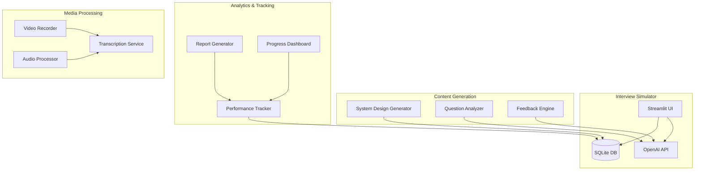
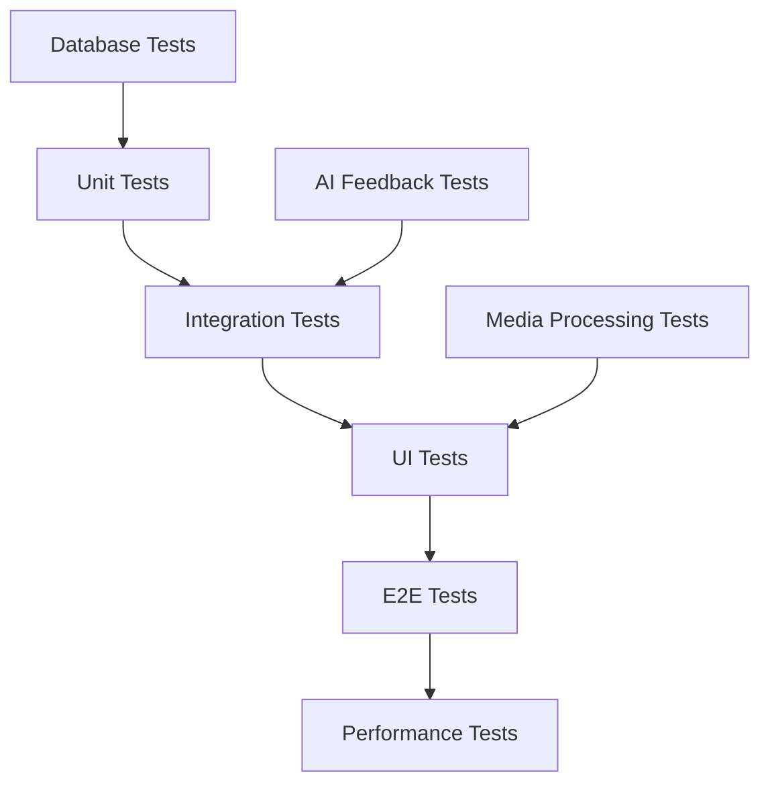
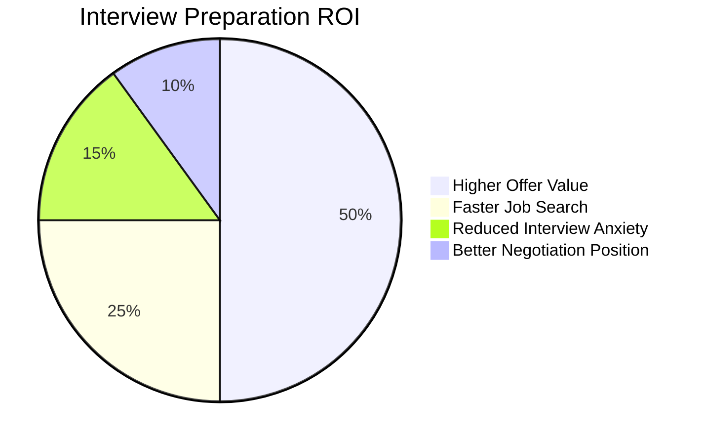
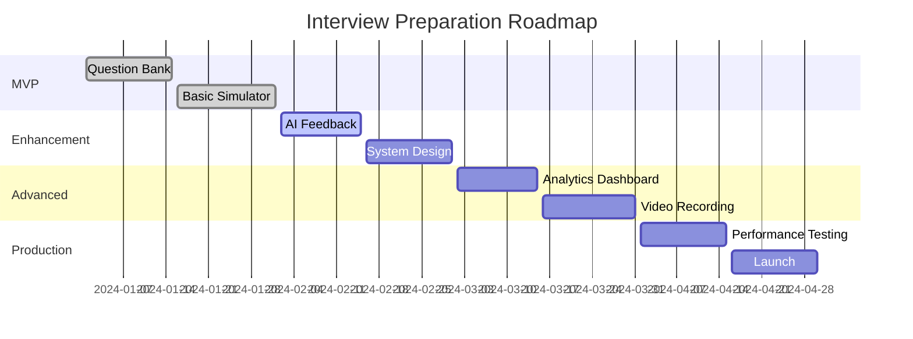

# Interview Preparation POC Implementation Guide

## Agenda
This POC focuses on comprehensive interview preparation for AI/Data Architect roles. The implementation includes:

1. **Mock Interview System**: Interactive platform for practice interviews
2. **System Design Walkthroughs**: Detailed architecture explanations of your POCs
3. **STAR Framework Practice**: Behavioral question preparation
4. **Performance Analytics**: Track improvement over time
5. **Question Bank**: Curated technical and behavioral questions

## Tech Stack
- **Frontend**: Streamlit, Plotly for analytics
- **Backend**: Python 3.8+, FastAPI (optional)
- **Database**: SQLite for questions and responses
- **AI/ML**: OpenAI API for feedback generation
- **Media**: Video recording capabilities, audio processing
- **Documentation**: Markdown, Jupyter for walkthroughs

## How to Start
1. **Environment Setup**:
   ```bash
   cd 10-Interview-Preparation
   python -m venv venv
   source venv/bin/activate
   pip install -r requirements.txt
   ```

2. **Database Initialization**:
   ```bash
   python src/init_db.py
   ```

3. **Run Interview Simulator**:
   ```bash
   streamlit run src/app.py
   ```

4. **Generate Practice Content**:
   ```bash
   # Create system design walkthrough
   python src/generate_walkthrough.py --poc ml-fundamentals

   # Practice behavioral questions
   python src/star_practice.py
   ```

## How to End
1. **Export Progress**: Generate performance reports
2. **Review Recordings**: Analyze interview recordings
3. **Update Question Bank**: Add new questions encountered
4. **Final Assessment**: Complete mock interview evaluation

## Architect Perspective

### System Architecture


### Design Decisions
- **Modular Architecture**: Separate concerns for different interview types
- **AI-Powered Feedback**: Automated analysis of responses
- **Progress Tracking**: Comprehensive analytics and improvement metrics
- **Multi-Modal Input**: Support for text, audio, and video responses
- **Scalable Question Bank**: Easy addition of new questions and categories

### Scalability Considerations
- Cloud deployment for video processing
- Database optimization for large question banks
- Caching for frequently accessed content
- Horizontal scaling for concurrent users

## Developer Perspective

### Code Structure
```
src/
├── app.py                 # Main Streamlit application
├── models/
│   ├── interview.py       # Interview data models
│   ├── question.py        # Question data models
│   └── response.py        # Response data models
├── services/
│   ├── interview_service.py    # Interview logic
│   ├── feedback_service.py     # AI feedback generation
│   ├── analytics_service.py    # Performance analytics
│   └── media_service.py        # Audio/video processing
├── utils/
│   ├── database.py        # Database operations
│   ├── openai_client.py   # OpenAI API client
│   └── file_handler.py    # File operations
└── data/
    ├── questions.json     # Question bank
    └── walkthroughs/      # System design content
```

### Key Implementation Details
```python
# Interview Session Management
class InterviewSession:
    def __init__(self, interview_type: str, candidate_id: str):
        self.session_id = str(uuid.uuid4())
        self.type = interview_type
        self.candidate_id = candidate_id
        self.questions = []
        self.responses = []
        self.start_time = datetime.now()
        self.status = "active"

    async def add_response(self, question_id: str, response: str):
        """Add response and generate feedback."""
        response_obj = Response(
            question_id=question_id,
            response=response,
            timestamp=datetime.now()
        )

        # Generate AI feedback
        feedback = await self._generate_feedback(response)
        response_obj.feedback = feedback

        self.responses.append(response_obj)

    async def _generate_feedback(self, response: str) -> Feedback:
        """Generate AI-powered feedback."""
        prompt = f"""
        Analyze this interview response and provide constructive feedback:

        Response: {response}

        Provide feedback on:
        1. Technical accuracy
        2. Communication clarity
        3. Structure and organization
        4. Areas for improvement
        """

        ai_response = await openai_client.generate_feedback(prompt)
        return parse_feedback(ai_response)
```

### Development Workflow
1. **Question Bank Development**: Curate and organize interview questions
2. **UI/UX Design**: Create intuitive interview interfaces
3. **AI Integration**: Implement feedback generation
4. **Analytics Implementation**: Build performance tracking
5. **Testing**: Comprehensive testing of all features
6. **Deployment**: Containerize and deploy application

## Tester Perspective

### Testing Strategy


### Test Categories
- **Unit Tests**: Individual functions and services
- **Integration Tests**: AI service and database interactions
- **UI Tests**: Streamlit interface functionality
- **E2E Tests**: Complete interview workflows
- **Performance Tests**: Response times and scalability

### Sample Test Implementation
```python
class TestInterviewSession:
    @pytest.fixture
    async def interview_session(self):
        return InterviewSession("system_design", "test_candidate")

    @pytest.mark.asyncio
    async def test_add_response(self, interview_session):
        """Test adding response to interview session."""
        question_id = "sd_001"
        response = "For this system design, I would use microservices..."

        await interview_session.add_response(question_id, response)

        assert len(interview_session.responses) == 1
        assert interview_session.responses[0].question_id == question_id
        assert interview_session.responses[0].feedback is not None

    @pytest.mark.asyncio
    async def test_feedback_generation(self, interview_session):
        """Test AI feedback generation."""
        response = "I think we should use a relational database."

        feedback = await interview_session._generate_feedback(response)

        assert feedback.technical_score >= 0
        assert feedback.technical_score <= 10
        assert len(feedback.comments) > 0
        assert len(feedback.improvements) > 0
```

### Quality Assurance Process
1. **Automated Testing**: CI/CD with comprehensive test coverage
2. **AI Feedback Validation**: Manual review of AI-generated feedback
3. **User Experience Testing**: Usability testing with target users
4. **Performance Benchmarking**: Load testing and optimization
5. **Security Testing**: Input validation and data protection

## Reviewer Perspective

### Code Review Checklist
- [ ] Interview logic correctly implemented
- [ ] AI feedback generation working accurately
- [ ] Database operations secure and efficient
- [ ] UI responsive and user-friendly
- [ ] Error handling comprehensive
- [ ] Performance optimized for real-time feedback
- [ ] Security measures in place for user data
- [ ] Documentation complete and accurate

### Security Considerations
- **Data Privacy**: Secure storage of interview responses
- **API Security**: Secure OpenAI API key management
- **Input Validation**: Sanitization of all user inputs
- **Access Control**: User authentication and authorization
- [ ] Audit Logging**: Track all interview activities

### Performance Review Points
- **Response Times**: AI feedback generation <5 seconds
- **Concurrent Users**: Support for multiple simultaneous interviews
- **Database Queries**: Optimized for large question banks
- **Memory Usage**: Efficient handling of media files
- **Scalability**: Cloud-ready architecture

### Maintainability Assessment
- **Code Organization**: Clear separation of concerns
- **Documentation**: Comprehensive API and user documentation
- **Testing Coverage**: >85% code coverage
- **Error Handling**: Graceful degradation and recovery
- **Monitoring**: Proper logging and metrics collection

## Business Analyst Perspective

### Business Requirements
The interview preparation system addresses key needs for career transition:

1. **Structured Practice**: Consistent interview preparation methodology
2. **Performance Tracking**: Measurable improvement over time
3. **Real-world Scenarios**: Practice with actual POC architectures
4. **AI-Powered Insights**: Automated feedback and recommendations
5. **Comprehensive Coverage**: Technical, behavioral, and leadership questions

### Success Metrics
- **Interview Confidence**: 80%+ comfort level in technical discussions
- **Response Quality**: Average feedback score >7/10
- **Practice Consistency**: 3-5 practice sessions per week
- **Question Coverage**: 100+ questions practiced across categories
- **Improvement Rate**: 15%+ improvement in scores over 4 weeks

### ROI Analysis


### Business Value Realization
- **Career Advancement**: Higher salary and better roles
- **Time Savings**: More efficient interview preparation
- **Confidence Building**: Better performance in interviews
- **Skill Development**: Improved technical communication
- **Market Positioning**: Competitive advantage in job market

## Product Owner Perspective

### Product Vision
"Transform interview preparation from stressful obligation to confident skill-building experience"

### User Stories
- **As a job seeker**, I want to practice technical interviews so that I can perform confidently
- **As a career changer**, I want to understand my strengths and weaknesses so that I can improve systematically
- **As a busy professional**, I want flexible practice sessions so that I can fit preparation into my schedule
- **As someone preparing for leadership roles**, I want to practice behavioral questions so that I can demonstrate my capabilities

### Roadmap


### Acceptance Criteria
- [ ] All major interview types supported (technical, behavioral, system design)
- [ ] AI feedback generation working for 90%+ of responses
- [ ] Performance analytics showing clear improvement trends
- [ ] User interface intuitive and responsive
- [ ] Question bank covering 100+ scenarios
- [ ] System stable under concurrent usage
- [ ] Data privacy and security requirements met

### Stakeholder Management
- **End Users**: Regular feedback collection and feature prioritization
- **Career Coaches**: Partnership for content validation
- **Technical Experts**: Review of question accuracy and solutions
- **Product Team**: Sprint planning and delivery coordination

### Risk Management
- **Technical Risks**: AI feedback accuracy, system performance
- **Content Risks**: Question quality and relevance
- **Privacy Risks**: Secure handling of personal interview data
- **Adoption Risks**: User engagement and retention

### Success Measures
- **User Engagement**: Daily/weekly active users
- **Interview Success**: User-reported interview outcomes
- **Feature Usage**: Most-used features and workflows
- **User Satisfaction**: Net Promoter Score and feedback ratings
- **Business Impact**: Time-to-offer reduction and offer value improvement
