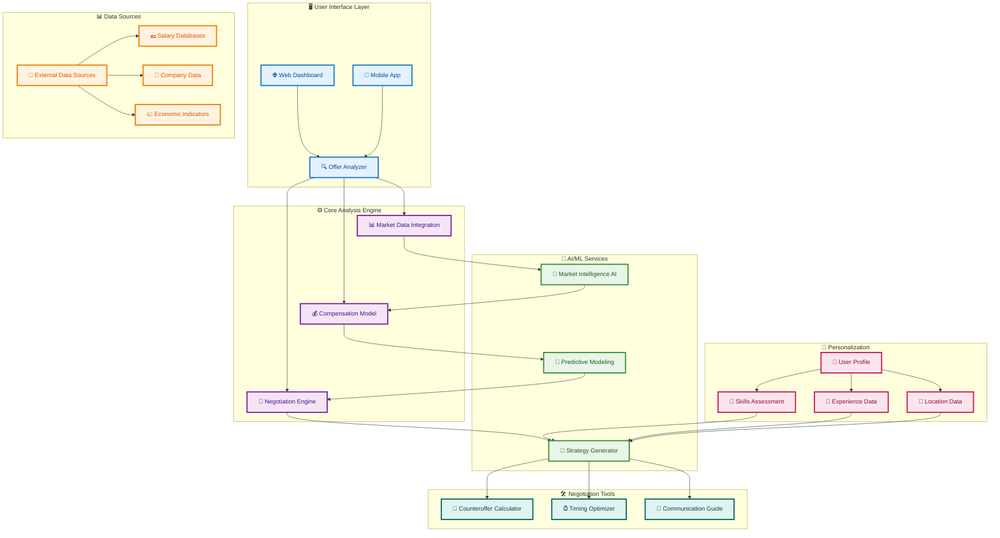
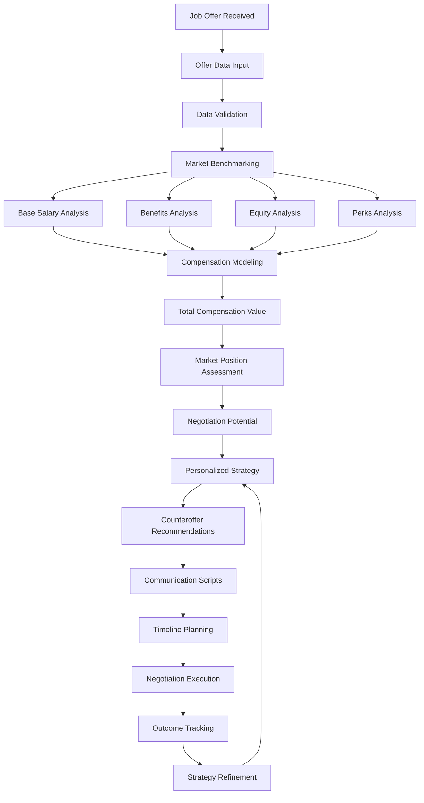
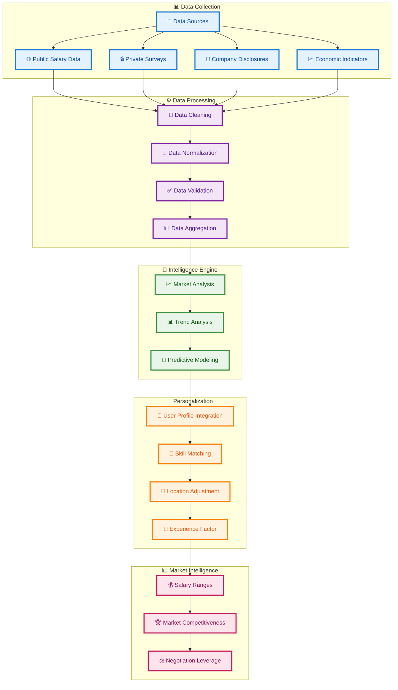
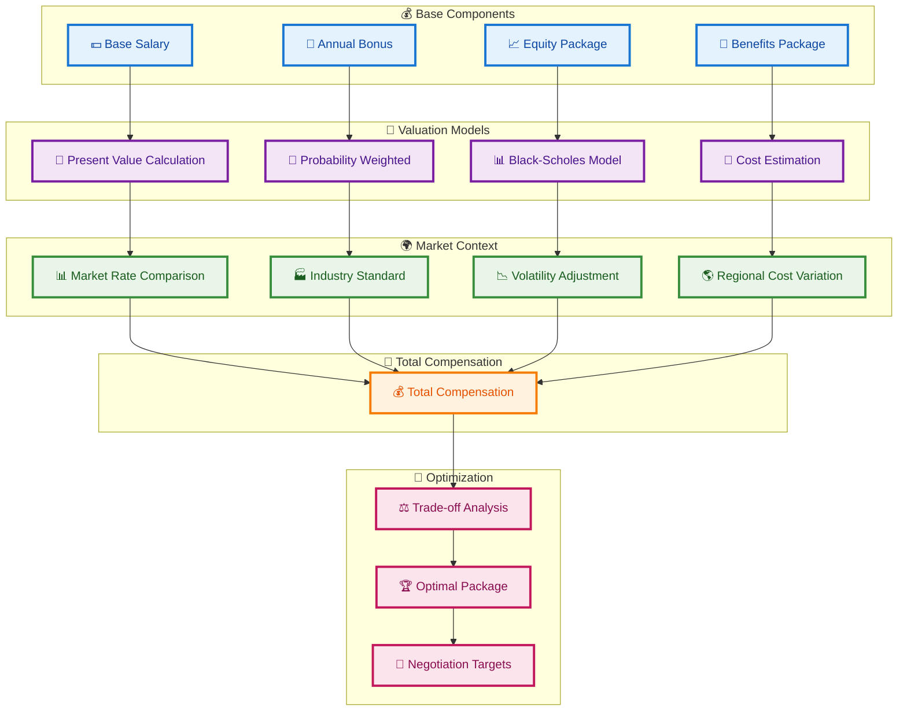
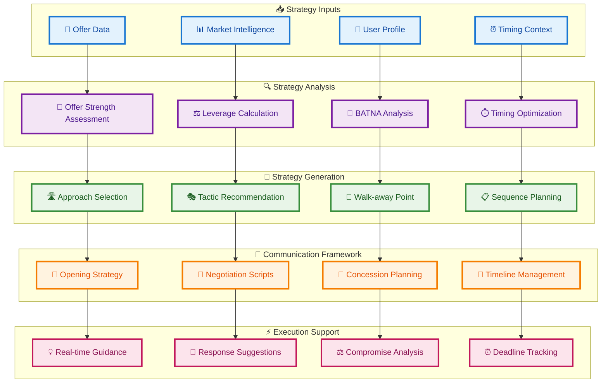
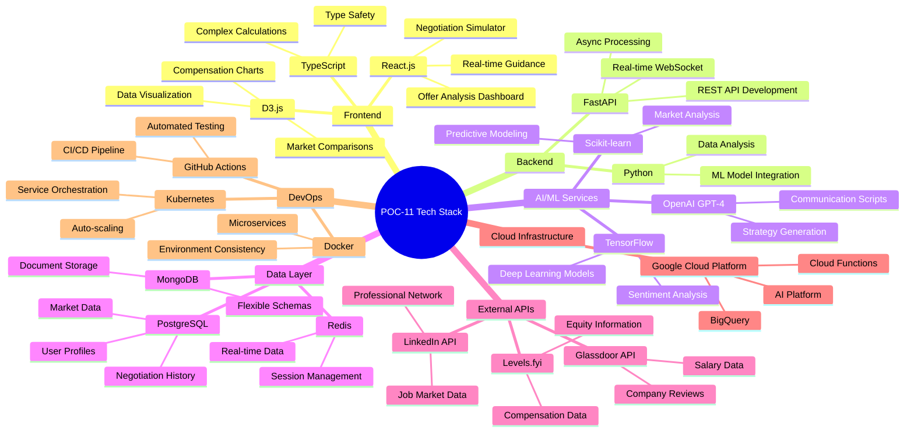
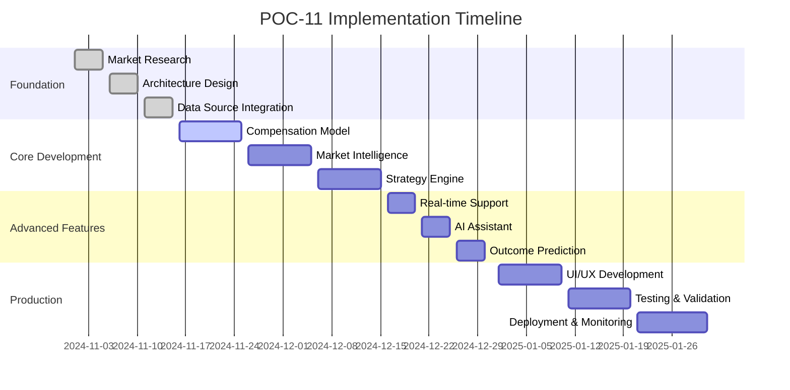
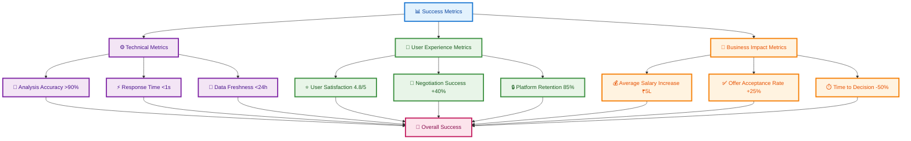

# POC-11 Negotiation Framework Architecture Plan

## Overview
This POC develops an AI-powered negotiation framework that analyzes job offers, provides market intelligence, and guides users through salary negotiation using data-driven insights and personalized strategies.

## System Architecture

## Offer Analysis Flow

## Market Intelligence Architecture

## Compensation Modeling Architecture

## Negotiation Strategy Engine

## Real-time Negotiation Support

```mermaid
graph TD
    %% Define styles
    classDef liveClass fill:#e3f2fd,stroke:#1976d2,stroke-width:3px,color:#0d47a1
    classDef aiClass fill:#f3e5f5,stroke:#7b1fa2,stroke-width:3px,color:#4a148c
    classDef decisionClass fill:#e8f5e8,stroke:#388e3c,stroke-width:3px,color:#1b5e20
    classDef uiClass fill:#fff3e0,stroke:#f57c00,stroke-width:3px,color:#e65100
    classDef postClass fill:#fce4ec,stroke:#c2185b,stroke-width:3px,color:#880e4f

    subgraph "🎭 Live Negotiation"
        NEGOTIATION_SESSION[🎭 Negotiation Session]
        NEGOTIATION_SESSION --> MESSAGE_CAPTURE[🎤 Message Capture]
        MESSAGE_CAPTURE --> SENTIMENT_ANALYSIS[😊 Sentiment Analysis]
        SENTIMENT_ANALYSIS --> INTENT_RECOGNITION[🎯 Intent Recognition]
    end

    subgraph "🤖 AI Assistant"
        INTENT_RECOGNITION --> STRATEGY_ADJUSTMENT[🔄 Strategy Adjustment]
        STRATEGY_ADJUSTMENT --> RESPONSE_GENERATION[💬 Response Generation]
        RESPONSE_GENERATION --> CONFIDENCE_SCORING[📊 Confidence Scoring]
    end

    subgraph "🧠 Decision Support"
        CONFIDENCE_SCORING --> RECOMMENDATION_ENGINE[💡 Recommendation Engine]
        RECOMMENDATION_ENGINE --> RISK_ASSESSMENT[⚠️ Risk Assessment]
        RISK_ASSESSMENT --> OUTCOME_PREDICTION[🔮 Outcome Prediction]
    end

    subgraph "🖥️ User Interface"
        OUTCOME_PREDICTION --> LIVE_DASHBOARD[📊 Live Dashboard]
        LIVE_DASHBOARD --> SUGGESTED_RESPONSES[💭 Suggested Responses]
        SUGGESTED_RESPONSES --> NEGOTIATION_HISTORY[📝 Negotiation History]
        NEGOTIATION_HISTORY --> PROGRESS_TRACKING[📈 Progress Tracking]
    end

    subgraph "📊 Post-Negotiation"
        PROGRESS_TRACKING --> OUTCOME_ANALYSIS[📊 Outcome Analysis]
        OUTCOME_ANALYSIS --> LESSON_LEARNED[📚 Lesson Learned]
        LESSON_LEARNED --> STRATEGY_IMPROVEMENT[🚀 Strategy Improvement]
    end

    %% Apply styles
    class NEGOTIATION_SESSION,MESSAGE_CAPTURE,SENTIMENT_ANALYSIS,INTENT_RECOGNITION liveClass
    class STRATEGY_ADJUSTMENT,RESPONSE_GENERATION,CONFIDENCE_SCORING aiClass
    class RECOMMENDATION_ENGINE,RISK_ASSESSMENT,OUTCOME_PREDICTION decisionClass
    class LIVE_DASHBOARD,SUGGESTED_RESPONSES,NEGOTIATION_HISTORY,PROGRESS_TRACKING uiClass
    class OUTCOME_ANALYSIS,LESSON_LEARNED,STRATEGY_IMPROVEMENT postClass
```

## Technology Stack Visualization

## Implementation Phases

## Success Metrics Dashboard

