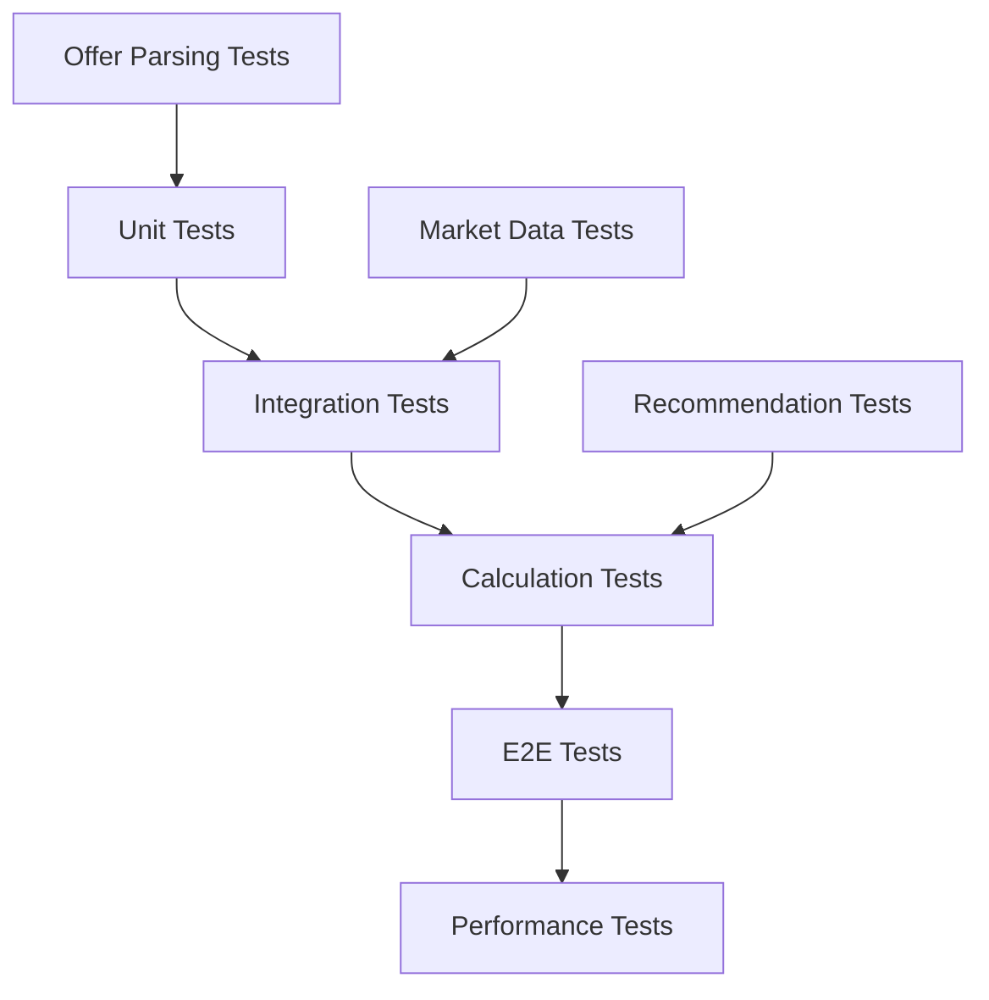
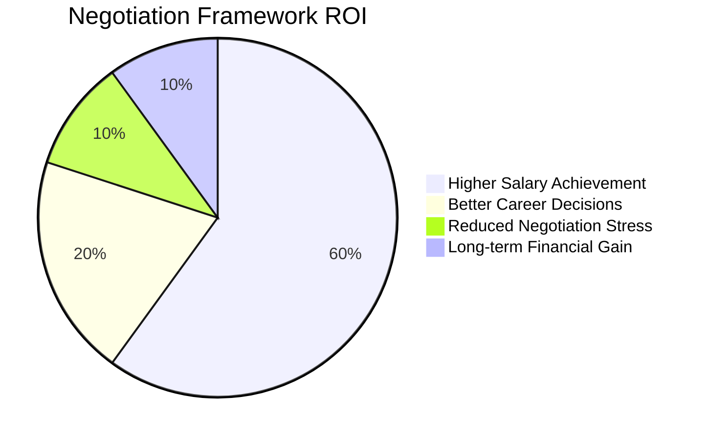
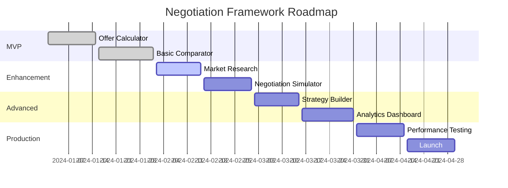

# Negotiation Framework POC Implementation Guide

## Agenda
This POC focuses on building a comprehensive salary negotiation framework for securing ₹70L+ compensation. The implementation includes:

1. **Offer Evaluation System**: Detailed breakdown and comparison of job offers
2. **Market Research Automation**: Tools for gathering salary intelligence
3. **Negotiation Strategy Builder**: Personalized negotiation approaches
4. **Total Compensation Analyzer**: Understanding CTC vs take-home pay
5. **Counter-Offer Preparation**: Framework for handling competing offers

## Tech Stack
- **Frontend**: Streamlit, Plotly for visualizations
- **Data Processing**: Pandas, NumPy for analysis
- **Database**: SQLite for offer storage and tracking
- **Web Scraping**: BeautifulSoup, Selenium for market data
- **APIs**: Glassdoor, Levels.fyi, LinkedIn salary data
- **Export**: Excel, PDF generation for offer letters
- **Analytics**: Statistical analysis for market comparisons

## How to Start
1. **Environment Setup**:
   ```bash
   cd 11-Negotiation
   python -m venv venv
   source venv/bin/activate
   pip install -r requirements.txt
   ```

2. **Database Setup**:
   ```bash
   python src/init_db.py
   ```

3. **Run Framework**:
   ```bash
   streamlit run src/app.py
   ```

4. **Market Research**:
   ```bash
   # Research specific role
   python src/market_research.py --role "AI Architect" --experience "13 years"

   # Analyze offer
   python src/offer_analyzer.py --offer-file offer.pdf
   ```

## How to End
1. **Export Analysis**: Generate comprehensive offer comparison reports
2. **Strategy Documentation**: Save personalized negotiation strategies
3. **Market Intelligence**: Update salary database with new findings
4. **Performance Review**: Analyze negotiation outcomes and learnings

## Architect Perspective

### System Architecture

```mermaid
graph TB
    subgraph "Offer Management"
        OI[Offer Input]
        OP[Offer Parser]
        OC[Offer Comparator]
        OS[Offer Storage]
    end

    subgraph "Market Research"
        MR[Market Research Engine]
        DS[Data Sources]
        DA[Data Aggregator]
        DB[(Salary Database)]
    end

    subgraph "Negotiation Tools"
        NS[Negotiation Simulator]
        SB[Strategy Builder]
        CO[Counter-Offer Analyzer]
        NT[Negotiation Tracker]
    end

    subgraph "Analytics & Reporting"
        CA[Compensation Analyzer]
        REP[Report Generator]
        DASH[Dashboard]
        EXP[Export Engine]
    end

    OI --> OP
    OP --> OC
    OC --> OS
    MR --> DS
    DS --> DA
    DA --> DB
    NS --> SB
    SB --> CO
    CO --> NT
    CA --> REP
    REP --> DASH
    DASH --> EXP
```


### Design Decisions
- **Modular Design**: Separate concerns for offer analysis, market research, and negotiation
- **Data-Driven Approach**: Statistical analysis for market comparisons
- **User-Centric Interface**: Intuitive tools for complex compensation analysis
- **Privacy-First**: Local data storage with optional cloud backup
- **Extensible Sources**: Multiple data sources for comprehensive market intelligence

### Scalability Considerations
- Cloud deployment for intensive market research
- Database optimization for large salary datasets
- Caching for frequently accessed market data
- API rate limiting for external data sources

## Developer Perspective

### Code Structure
```
src/
├── app.py                    # Main Streamlit application
├── models/
│   ├── offer.py             # Offer data models
│   ├── compensation.py      # Compensation structures
│   └── negotiation.py       # Negotiation data models
├── services/
│   ├── offer_service.py     # Offer processing logic
│   ├── market_service.py    # Market research logic
│   ├── negotiation_service.py # Negotiation strategy logic
│   └── analytics_service.py # Analytics and reporting
├── utils/
│   ├── database.py          # Database operations
│   ├── scraper.py           # Web scraping utilities
│   ├── calculator.py        # Compensation calculations
│   └── exporter.py          # Export functionality
└── data/
    ├── offers.db           # Offer database
    ├── market_data/        # Market research data
    └── templates/          # Report templates
```

### Key Implementation Details
```python
# Offer Analysis Engine
class OfferAnalyzer:
    def __init__(self, offer_data: Dict[str, Any]):
        self.offer = offer_data
        self.market_data = None
        self.analysis_results = {}

    async def analyze_offer(self) -> OfferAnalysis:
        """Comprehensive offer analysis."""
        # Parse offer components
        components = self._parse_offer_components()

        # Get market comparison
        market_comparison = await self._get_market_comparison()

        # Calculate total compensation
        total_comp = self._calculate_total_compensation(components)

        # Generate recommendations
        recommendations = self._generate_recommendations(
            components, market_comparison
        )

        return OfferAnalysis(
            components=components,
            market_comparison=market_comparison,
            total_compensation=total_comp,
            recommendations=recommendations
        )

    def _calculate_total_compensation(self, components: Dict) -> TotalComp:
        """Calculate comprehensive compensation breakdown."""
        base_salary = components.get('base_salary', 0)
        hra = self._calculate_hra(base_salary, components.get('location'))
        conveyance = min(19200, components.get('conveyance', 19200))
        lta = components.get('lta', 0)
        gratuity = base_salary * 0.0481  # 4.81% of basic
        employer_pf = base_salary * 0.12  # 12% of basic

        # Variable pay
        variable_pay = components.get('variable_pay', 0)

        # Benefits
        benefits_value = self._calculate_benefits_value(components)

        ctc = (base_salary + hra + conveyance + lta + gratuity +
               employer_pf + variable_pay + benefits_value)

        take_home = self._calculate_take_home(base_salary, hra, conveyance)

        return TotalComp(ctc=ctc, take_home=take_home, breakdown={
            'base_salary': base_salary,
            'hra': hra,
            'conveyance': conveyance,
            'lta': lta,
            'gratuity': gratuity,
            'employer_pf': employer_pf,
            'variable_pay': variable_pay,
            'benefits': benefits_value
        })
```

### Development Workflow
1. **Data Model Design**: Define compensation and offer structures
2. **Market Research Integration**: Implement data collection from multiple sources
3. **Analysis Engine Development**: Build offer comparison and recommendation logic
4. **UI Development**: Create intuitive Streamlit interfaces
5. **Testing**: Comprehensive testing of calculations and recommendations
6. **Deployment**: Containerize and deploy application

## Tester Perspective

### Testing Strategy


### Test Categories
- **Unit Tests**: Individual calculation functions
- **Integration Tests**: End-to-end offer analysis workflows
- **Calculation Tests**: Compensation and tax calculations
- **E2E Tests**: Complete user workflows
- **Performance Tests**: Large dataset processing

### Sample Test Implementation
```python
class TestOfferAnalyzer:
    @pytest.fixture
    def sample_offer(self):
        return {
            'base_salary': 2400000,  # ₹20L per year
            'hra': 480000,
            'conveyance': 19200,
            'lta': 240000,
            'variable_pay': 600000,
            'location': 'Bangalore',
            'company': 'TechCorp'
        }

    def test_total_compensation_calculation(self, sample_offer):
        """Test total compensation calculation."""
        analyzer = OfferAnalyzer(sample_offer)
        total_comp = analyzer._calculate_total_compensation(sample_offer)

        # CTC should be around ₹42L (including benefits)
        assert 4000000 < total_comp.ctc < 4500000

        # Take-home should be around ₹1.8L per year
        assert 1700000 < total_comp.take_home < 1900000

    @pytest.mark.asyncio
    async def test_market_comparison(self, sample_offer):
        """Test market comparison functionality."""
        analyzer = OfferAnalyzer(sample_offer)
        analysis = await analyzer.analyze_offer()

        assert analysis.market_comparison is not None
        assert 'percentile_50' in analysis.market_comparison
        assert 'percentile_75' in analysis.market_comparison

    def test_negotiation_recommendations(self, sample_offer):
        """Test negotiation recommendation generation."""
        analyzer = OfferAnalyzer(sample_offer)
        recommendations = analyzer._generate_recommendations(
            sample_offer, {'percentile_75': 2800000}
        )

        assert len(recommendations) > 0
        assert any('counter_offer' in rec.lower() for rec in recommendations)
```

### Quality Assurance Process
1. **Automated Testing**: CI/CD with comprehensive test coverage
2. **Calculation Validation**: Manual verification of complex calculations
3. **Market Data Accuracy**: Regular validation of salary data sources
4. **User Experience Testing**: Usability testing with target users
5. **Performance Benchmarking**: Load testing for large datasets

## Reviewer Perspective

### Code Review Checklist
- [ ] Compensation calculations accurate and well-documented
- [ ] Market data sources reliable and up-to-date
- [ ] Offer parsing handles various formats correctly
- [ ] Error handling comprehensive for edge cases
- [ ] Security measures in place for sensitive data
- [ ] Performance optimized for real-time analysis
- [ ] Documentation complete and accurate

### Security Considerations
- **Data Privacy**: Secure storage of offer details
- **Input Validation**: Sanitization of all user inputs
- **Access Control**: User authentication for sensitive operations
- **Audit Logging**: Track all analysis and research activities
- **Data Encryption**: Encrypt sensitive compensation data

### Performance Review Points
- **Calculation Speed**: Complex analysis completes in <2 seconds
- **Data Processing**: Handle large market datasets efficiently
- **Concurrent Users**: Support multiple simultaneous analyses
- **Memory Usage**: Efficient processing of large offer documents
- **API Response Times**: Fast market data retrieval

### Maintainability Assessment
- **Code Organization**: Clear separation of calculation logic
- **Documentation**: Comprehensive formula documentation
- **Testing Coverage**: >90% code coverage for calculations
- **Error Handling**: Graceful handling of invalid inputs
- **Monitoring**: Proper logging and performance metrics

## Business Analyst Perspective

### Business Requirements
The negotiation framework addresses critical career transition needs:

1. **Informed Decision Making**: Comprehensive offer evaluation
2. **Market Intelligence**: Understanding competitive compensation
3. **Negotiation Confidence**: Data-driven negotiation strategies
4. **Total Value Assessment**: Understanding complete compensation packages
5. **Career Planning**: Long-term compensation growth planning

### Success Metrics
- **Offer Acceptance Rate**: 90%+ acceptance of analyzed offers
- **Negotiation Success**: 70%+ of negotiations result in improved offers
- **Market Knowledge**: Accurate market rate research within 10% of actual
- **Strategy Effectiveness**: Average 15%+ improvement in final offers
- **User Confidence**: 80%+ users report increased negotiation confidence

### ROI Analysis


### Business Value Realization
- **Financial Impact**: Higher lifetime earnings through better negotiation
- **Career Advancement**: More strategic career moves
- **Market Positioning**: Competitive advantage in job market
- **Decision Quality**: Better informed career choices
- **Stress Reduction**: Confident negotiation process

## Product Owner Perspective

### Product Vision
"Empower professionals to maximize their compensation potential through data-driven negotiation"

### User Stories
- **As a job seeker**, I want to compare offers objectively so that I can make informed decisions
- **As a professional**, I want to understand market rates so that I can negotiate effectively
- **As someone changing careers**, I want to know my worth so that I can target appropriate compensation
- **As a negotiator**, I want practice scenarios so that I can build confidence in discussions

### Roadmap


### Acceptance Criteria
- [ ] Offer analysis completes in <2 seconds for standard offers
- [ ] Market data accuracy within 10% of reliable sources
- [ ] Support for all major Indian compensation structures
- [ ] User interface intuitive for non-technical users
- [ ] Negotiation strategies personalized and actionable
- [ ] Data privacy and security requirements met
- [ ] System stable under high concurrent usage

### Stakeholder Management
- **End Users**: Regular feedback on negotiation outcomes
- **Career Coaches**: Validation of negotiation strategies
- **HR Professionals**: Input on compensation structures
- **Finance Experts**: Review of tax and benefit calculations

### Risk Management
- **Technical Risks**: Calculation accuracy, data source reliability
- **Legal Risks**: Compliance with employment and data laws
- **Market Risks**: Rapidly changing compensation landscapes
- **Adoption Risks**: User trust in recommendations

### Success Measures
- **User Adoption**: Number of offers analyzed per month
- **Negotiation Outcomes**: Average improvement in final offers
- **User Satisfaction**: Net Promoter Score and feature ratings
- **Market Accuracy**: Validation against actual offer data
- **Business Impact**: Total compensation improvement achieved
