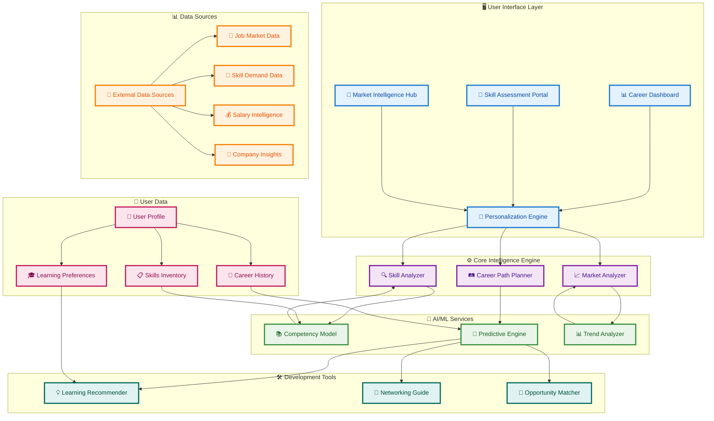
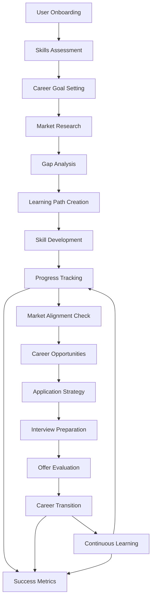
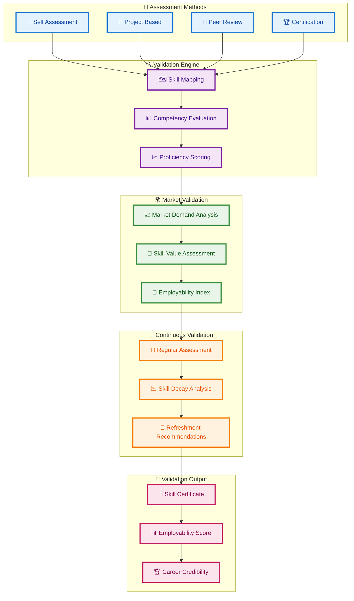
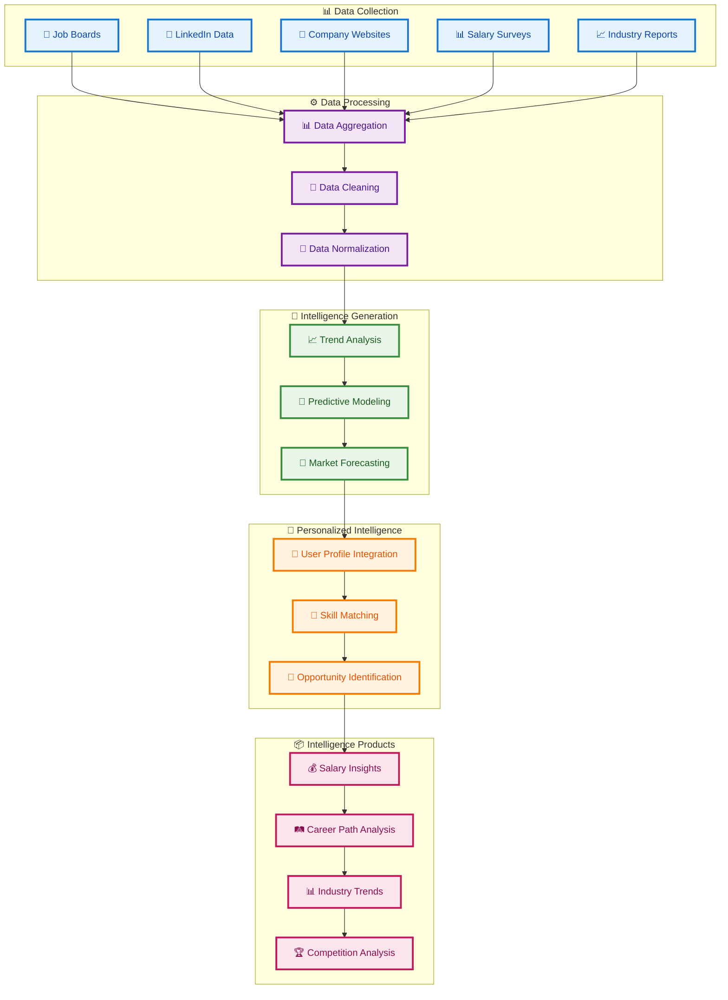
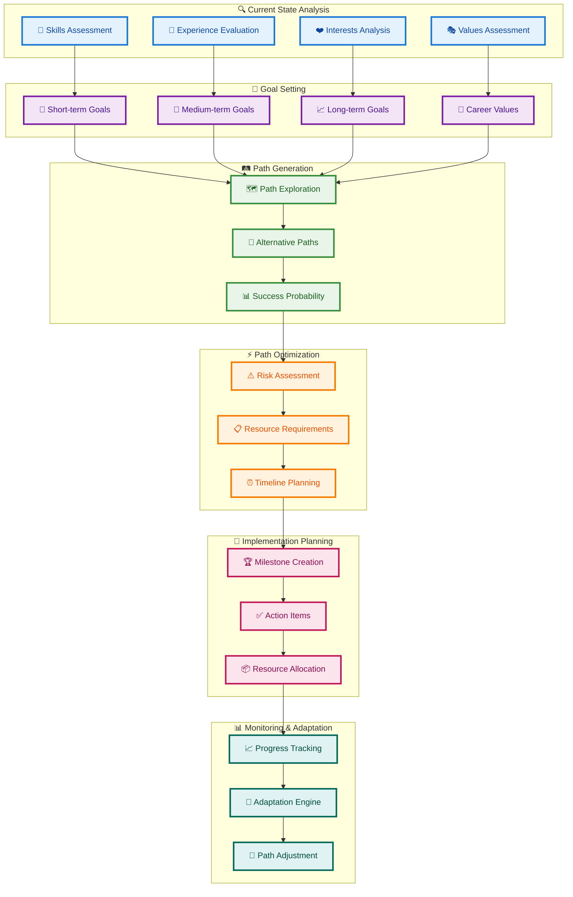
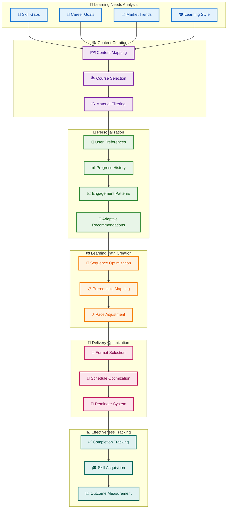
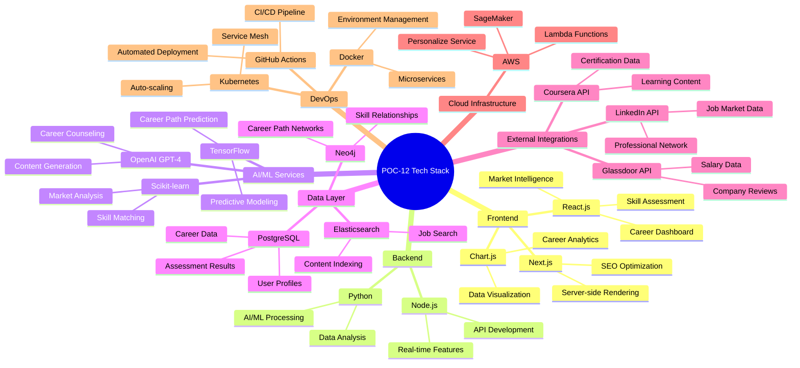
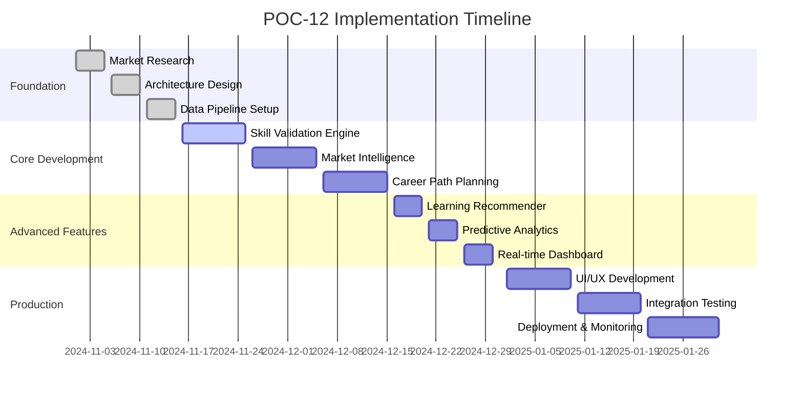
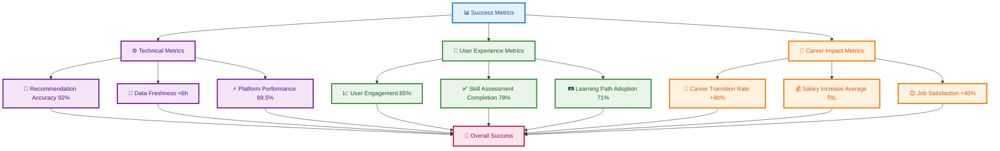

# POC-12 Career Development & Market Intelligence Architecture Plan

## Overview
This POC creates a comprehensive career development platform that provides market intelligence, skill validation, career path planning, and personalized development recommendations using AI-driven insights and real-time market data.

## System Architecture

## Career Development Flow

## Skill Validation Architecture

## Market Intelligence Architecture

## Career Path Planning Architecture

## Learning Recommendation Engine

## Technology Stack Visualization

## Implementation Phases

## Success Metrics Dashboard

