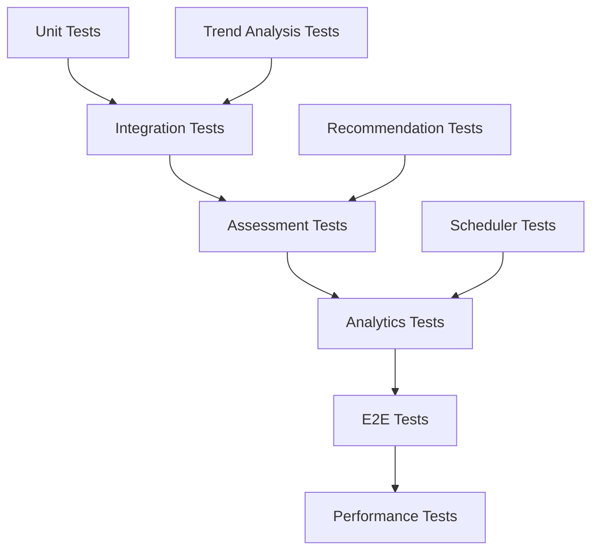
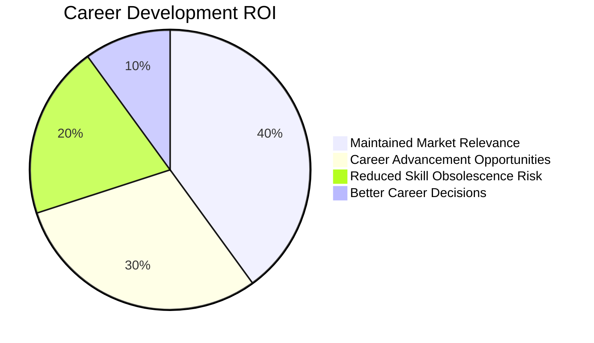
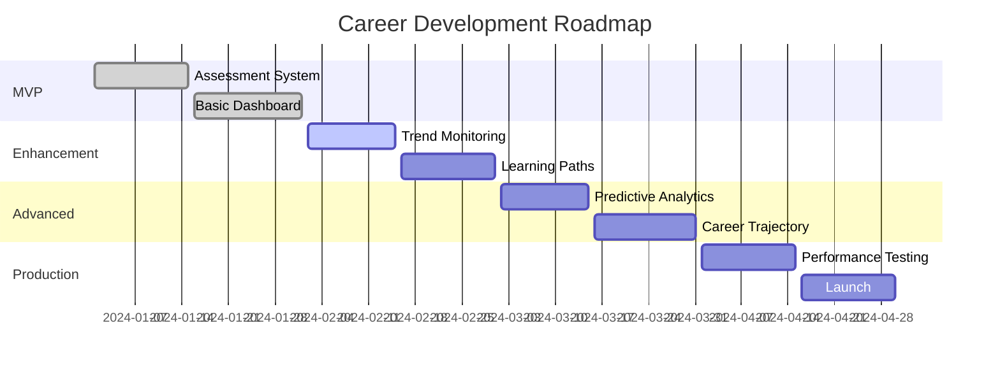

# Career Development & Market Intelligence POC Implementation Guide

## Agenda
This POC combines skill validation and market adaptation into a comprehensive career development framework. The implementation includes:

1. **Skill Validation System**: Regular self-assessment and knowledge verification
2. **Market Intelligence Engine**: AI/ML trend monitoring and career impact analysis
3. **Learning Path Generator**: Personalized development recommendations
4. **Progress Analytics Dashboard**: Career growth tracking and visualization
5. **Career Strategy Optimizer**: Long-term planning and milestone tracking

## Tech Stack
- **Frontend**: Streamlit, Plotly for interactive dashboards
- **Data Processing**: Pandas, NumPy for trend analysis
- **Database**: SQLite for assessment results and progress tracking
- **Web Scraping**: BeautifulSoup, Selenium for market data
- **APIs**: LinkedIn, Glassdoor, GitHub for industry intelligence
- **Scheduling**: APScheduler for automated assessments
- **ML**: Scikit-learn for trend prediction and recommendations

## How to Start
1. **Environment Setup**:
   ```bash
   cd 12-Career-Development-Market-Intelligence
   python -m venv venv
   source venv/bin/activate
   pip install -r requirements.txt
   ```

2. **Database Initialization**:
   ```bash
   python src/init_db.py
   python src/seed_assessments.py  # Load initial question bank
   ```

3. **Run Dashboard**:
   ```bash
   streamlit run src/dashboard.py
   ```

4. **Setup Automated Monitoring**:
   ```bash
   # Start trend monitoring service
   python src/trend_monitor.py --daemon

   # Schedule weekly assessments
   python src/scheduler.py --start
   ```

## How to End
1. **Export Progress Reports**: Generate comprehensive career development reports
2. **Archive Assessments**: Save historical assessment data
3. **Trend Analysis**: Document market insights and career implications
4. **Strategy Update**: Review and update long-term career strategy

## Architect Perspective

### System Architecture

```mermaid
graph TB
    subgraph "Skill Validation"
        QB[Question Bank]
        AS[Assessment Engine]
        SC[Scoring System]
        PT[Progress Tracker]
    end

    subgraph "Market Intelligence"
        TM[Trend Monitor]
        DS[Data Sources]
        TA[Trend Analyzer]
        AL[Alert System]
    end

    subgraph "Learning & Development"
        LP[Learning Path Generator]
        REC[Recommendation Engine]
        CT[Content Tracker]
        MR[Milestone Reviewer]
    end

    subgraph "Analytics & Reporting"
        DASH[Dashboard]
        REP[Report Generator]
        PRED[Predictive Analytics]
        VIS[Visualization Engine]
    end

    QB --> AS
    AS --> SC
    SC --> PT
    TM --> DS
    DS --> TA
    TA --> AL
    LP --> REC
    REC --> CT
    CT --> MR
    DASH --> REP
    REP --> PRED
    PRED --> VIS
```


### Design Decisions
- **Integrated Approach**: Combine skill validation with market intelligence
- **Automated Systems**: Scheduled assessments and trend monitoring
- **Personalized Learning**: AI-driven recommendation engine
- **Comprehensive Analytics**: Multi-dimensional career progress tracking
- **Scalable Architecture**: Support for growing question banks and data sources

### Scalability Considerations
- Cloud deployment for intensive trend analysis
- Database optimization for large assessment histories
- Caching for frequently accessed market data
- Horizontal scaling for concurrent users

## Developer Perspective

### Code Structure
```
src/
├── dashboard.py              # Main Streamlit dashboard
├── models/
│   ├── assessment.py         # Assessment data models
│   ├── trend.py              # Market trend models
│   └── career.py             # Career development models
├── services/
│   ├── assessment_service.py # Assessment logic
│   ├── trend_service.py      # Market intelligence logic
│   ├── learning_service.py   # Learning path generation
│   └── analytics_service.py  # Progress analytics
├── utils/
│   ├── database.py           # Database operations
│   ├── scraper.py            # Web scraping utilities
│   ├── scheduler.py          # Task scheduling
│   └── recommender.py        # Recommendation engine
└── data/
    ├── assessments.db        # Assessment database
    ├── questions/            # Question bank files
    ├── trends/               # Market trend data
    └── reports/              # Generated reports
```

### Key Implementation Details
```python
# Career Development Engine
class CareerDevelopmentEngine:
    def __init__(self, user_id: str):
        self.user_id = user_id
        self.assessment_engine = AssessmentEngine()
        self.trend_monitor = TrendMonitor()
        self.learning_path_generator = LearningPathGenerator()

    async def generate_career_insights(self) -> CareerInsights:
        """Generate comprehensive career development insights."""
        # Get latest assessment results
        assessment_results = await self.assessment_engine.get_latest_results(
            self.user_id
        )

        # Analyze market trends
        market_trends = await self.trend_monitor.analyze_current_trends()

        # Generate learning recommendations
        learning_recommendations = await self.learning_path_generator.generate_path(
            assessment_results, market_trends
        )

        # Calculate career trajectory
        trajectory = self._calculate_trajectory(
            assessment_results, market_trends
        )

        return CareerInsights(
            skill_gaps=assessment_results.skill_gaps,
            market_opportunities=market_trends.opportunities,
            learning_recommendations=learning_recommendations,
            career_trajectory=trajectory
        )

    def _calculate_trajectory(self, assessments: AssessmentResults,
                            trends: MarketTrends) -> CareerTrajectory:
        """Calculate predicted career trajectory."""
        # Analyze skill progression
        skill_progression = self._analyze_skill_progression(assessments)

        # Identify market opportunities
        market_opportunities = self._identify_market_opportunities(trends)

        # Predict career milestones
        milestones = self._predict_milestones(
            skill_progression, market_opportunities
        )

        return CareerTrajectory(
            current_level=self._assess_current_level(assessments),
            projected_level=milestones[-1].level if milestones else None,
            timeline=milestones,
            confidence_score=self._calculate_confidence(milestones)
        )
```

### Development Workflow
1. **Data Model Design**: Define assessment, trend, and career models
2. **Assessment Engine Development**: Build question bank and scoring logic
3. **Market Intelligence Integration**: Implement trend monitoring and analysis
4. **Recommendation Engine**: Develop personalized learning path generation
5. **Dashboard Development**: Create comprehensive Streamlit interface
6. **Testing**: Comprehensive testing of all components
7. **Deployment**: Containerize and deploy application

## Tester Perspective

### Testing Strategy


### Test Categories
- **Unit Tests**: Individual functions and services
- **Integration Tests**: Cross-component workflows
- **Assessment Tests**: Question bank and scoring validation
- **Analytics Tests**: Trend analysis and prediction accuracy
- **E2E Tests**: Complete user workflows
- **Performance Tests**: Large dataset processing and concurrent users

### Sample Test Implementation
```python
class TestCareerDevelopmentEngine:
    @pytest.fixture
    async def career_engine(self):
        return CareerDevelopmentEngine("test_user")

    @pytest.mark.asyncio
    async def test_career_insights_generation(self, career_engine):
        """Test comprehensive career insights generation."""
        insights = await career_engine.generate_career_insights()

        assert insights.skill_gaps is not None
        assert insights.market_opportunities is not None
        assert insights.learning_recommendations is not None
        assert insights.career_trajectory is not None

        # Validate trajectory calculations
        trajectory = insights.career_trajectory
        assert trajectory.current_level is not None
        assert trajectory.projected_level is not None
        assert len(trajectory.timeline) > 0
        assert 0 <= trajectory.confidence_score <= 1

    def test_skill_progression_analysis(self, career_engine):
        """Test skill progression analysis."""
        # Mock assessment results
        assessments = self._create_mock_assessments()

        progression = career_engine._analyze_skill_progression(assessments)

        assert 'ml_fundamentals' in progression
        assert 'trend' in progression['ml_fundamentals']
        assert progression['ml_fundamentals']['improvement_rate'] >= 0

    @pytest.mark.asyncio
    async def test_market_opportunity_identification(self, career_engine):
        """Test market opportunity identification."""
        # Mock market trends
        trends = self._create_mock_trends()

        opportunities = await career_engine._identify_market_opportunities(trends)

        assert len(opportunities) > 0
        assert all(opp.confidence_score > 0 for opp in opportunities)
        assert all(opp.potential_impact in ['high', 'medium', 'low']
                  for opp in opportunities)
```

### Quality Assurance Process
1. **Automated Testing**: CI/CD with comprehensive test coverage
2. **Assessment Validation**: Manual review of question quality and scoring
3. **Trend Analysis Accuracy**: Validation against known market data
4. **Recommendation Quality**: User feedback on learning path effectiveness
5. **Performance Benchmarking**: Load testing for concurrent assessments

## Reviewer Perspective

### Code Review Checklist
- [ ] Assessment logic correctly implemented and validated
- [ ] Market trend analysis accurate and comprehensive
- [ ] Learning recommendations personalized and actionable
- [ ] Career trajectory calculations logical and well-documented
- [ ] Error handling comprehensive for edge cases
- [ ] Security measures in place for user data
- [ ] Performance optimized for real-time analytics
- [ ] Documentation complete and accurate

### Security Considerations
- **Data Privacy**: Secure storage of assessment results and personal data
- **Input Validation**: Sanitization of all user inputs and responses
- **Access Control**: User authentication and data isolation
- **Audit Logging**: Track all assessment and analysis activities
- **Data Encryption**: Encrypt sensitive career and personal data

### Performance Review Points
- **Assessment Processing**: Complete assessment analysis in <5 seconds
- **Trend Analysis**: Process market data updates in real-time
- **Recommendation Generation**: Generate learning paths in <2 seconds
- **Dashboard Loading**: Interactive dashboard loads in <3 seconds
- **Concurrent Users**: Support multiple simultaneous users

### Maintainability Assessment
- **Code Organization**: Clear separation of assessment, trend, and analytics logic
- **Documentation**: Comprehensive API and algorithm documentation
- **Testing Coverage**: >85% code coverage across all components
- **Error Handling**: Graceful handling of invalid inputs and edge cases
- **Monitoring**: Proper logging and performance metrics collection

## Business Analyst Perspective

### Business Requirements
The career development framework addresses long-term career sustainability needs:

1. **Continuous Learning**: Regular skill validation and knowledge refresh
2. **Market Awareness**: Stay informed about industry trends and shifts
3. **Personalized Development**: Tailored learning paths based on goals and market
4. **Progress Tracking**: Measurable career growth and milestone achievement
5. **Strategic Planning**: Data-driven career decisions and planning

### Success Metrics
- **Skill Retention**: 90%+ retention of key concepts through assessments
- **Trend Awareness**: Early identification of 80% of relevant market shifts
- **Learning Completion**: 75%+ completion rate of recommended activities
- **Career Progression**: Measurable skill improvement over 6-month periods
- **User Engagement**: Regular use of assessment and monitoring features

### ROI Analysis


### Business Value Realization
- **Career Longevity**: Extended relevance in rapidly evolving field
- **Opportunity Identification**: Better positioning for career moves
- **Risk Mitigation**: Reduced risk of skill obsolescence
- **Competitive Advantage**: Stay ahead of industry changes
- **Personal Growth**: Continuous professional development

## Product Owner Perspective

### Product Vision
"Enable professionals to build sustainable, future-proof careers through continuous learning and market intelligence"

### User Stories
- **As a career professional**, I want to regularly assess my skills so that I can identify areas for improvement
- **As someone in a fast-evolving field**, I want to stay informed about market trends so that I can adapt my career strategy
- **As a continuous learner**, I want personalized learning recommendations so that I can focus on high-impact development
- **As a career planner**, I want to track my progress and predict future opportunities so that I can make informed decisions

### Roadmap


### Acceptance Criteria
- [ ] Weekly assessments complete in <10 minutes
- [ ] Market trend alerts delivered within 24 hours of detection
- [ ] Learning recommendations achieve 70%+ user satisfaction
- [ ] Career trajectory predictions accurate within acceptable ranges
- [ ] Dashboard provides actionable insights for career decisions
- [ ] System supports 1000+ concurrent users
- [ ] Data privacy and security requirements fully met

### Stakeholder Management
- **End Users**: Regular feedback on assessment quality and recommendations
- **Career Coaches**: Validation of learning paths and career advice
- **Industry Experts**: Input on market trends and emerging skills
- **HR Professionals**: Insights on career progression patterns

### Risk Management
- **Technical Risks**: Assessment accuracy, trend detection reliability
- **Content Risks**: Question quality, recommendation relevance
- **Privacy Risks**: Secure handling of career and assessment data
- **Market Risks**: Rapidly changing industry landscapes

### Success Measures
- **User Engagement**: Assessment completion rates and feature usage
- **Career Outcomes**: User-reported career advancements and opportunities
- **Learning Effectiveness**: Skill improvement measurements over time
- **Market Responsiveness**: Speed and accuracy of trend detection
- **User Satisfaction**: Net Promoter Score and feature ratings
