# MLflow Visual Architecture and Workflows

## MLflow System Architecture

### Core Components Overview
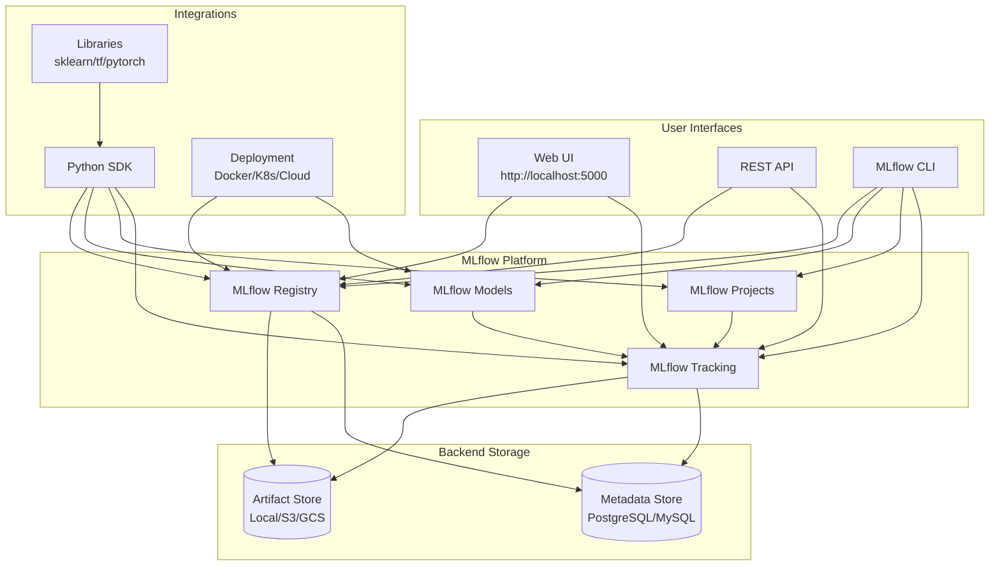

### MLflow Tracking Architecture
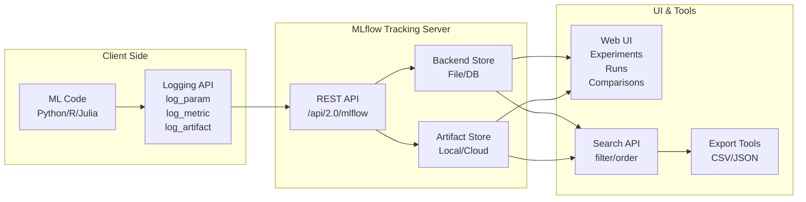

## Experiment Tracking Workflow

### Run Lifecycle
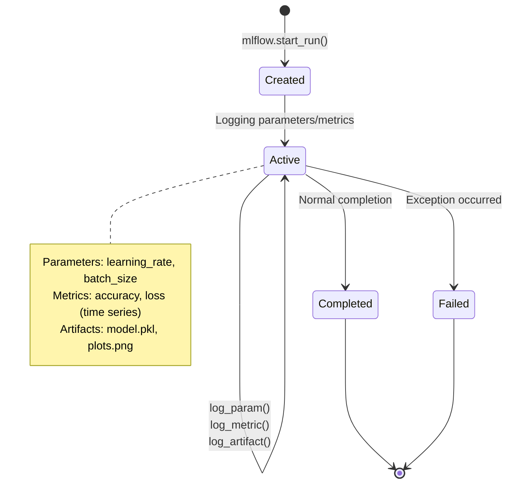

### Experiment Organization
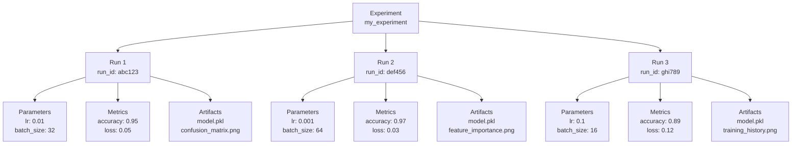

### Hyperparameter Tuning Visualization
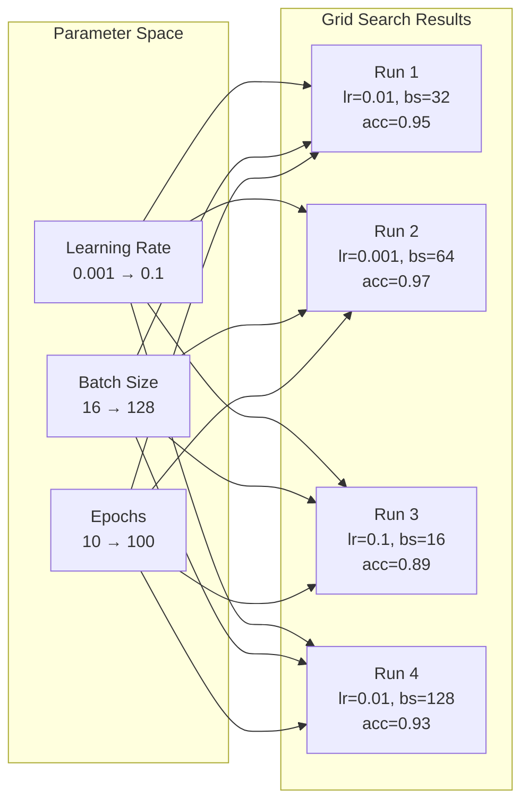

## MLflow Projects Architecture

### Project Structure and Execution
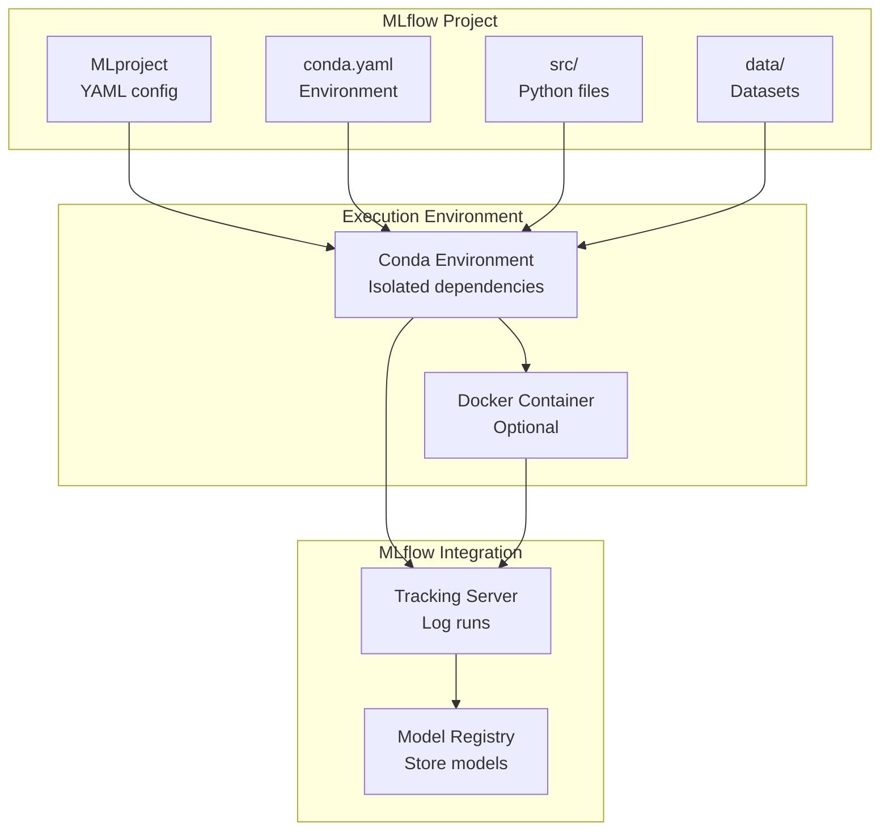

### Project Execution Flow
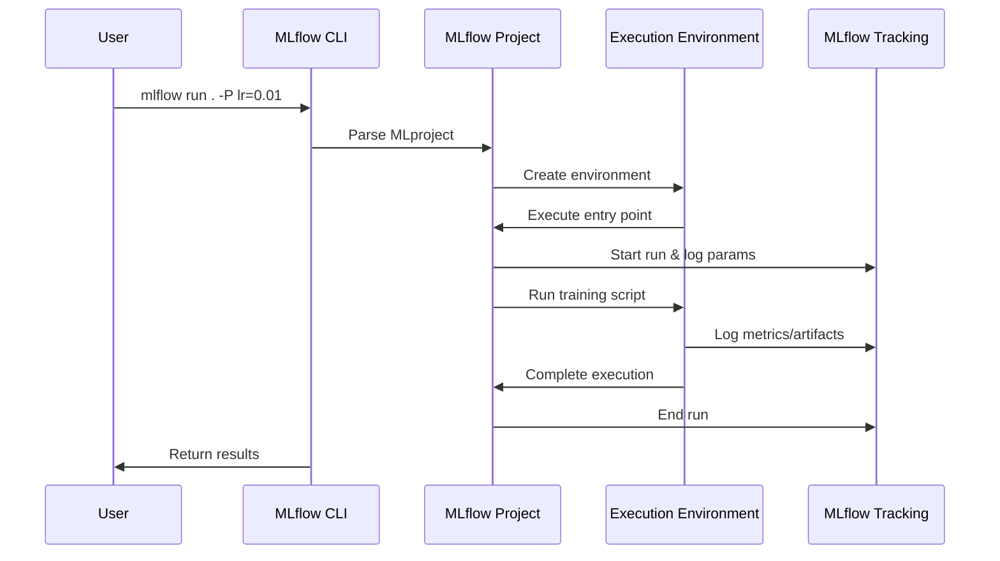

## MLflow Models Architecture

### Model Packaging Flow
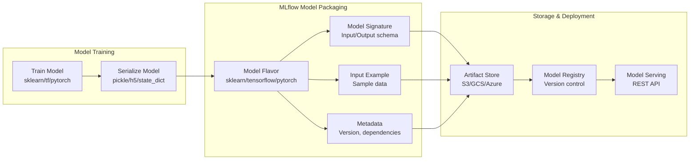

### Model Flavor Architecture
```mermaid
graph TD
    MODEL[Trained Model] --> FLAVORS{Model Type}

    FLAVORS -->|Scikit-learn| SKLEARN[sklearn flavor<br/>log_model()]
    FLAVORS -->|TensorFlow| TENSORFLOW[tensorflow flavor<br/>log_model()]
    FLAVORS -->|PyTorch| PYTORCH[pytorch flavor<br/>log_model()]
    FLAVORS -->|Spark ML| SPARK[spark flavor<br/>log_model()]
    FLAVORS -->|Custom| CUSTOM[pyfunc flavor<br/>PythonModel class]

    SKLEARN --> PYFUNC[Universal PyFunc<br/>predict() method]
    TENSORFLOW --> PYFUNC
    PYTORCH --> PYFUNC
    SPARK --> PYFUNC
    CUSTOM --> PYFUNC

    PYFUNC --> SERVE[Model Serving<br/>mlflow models serve]
    PYFUNC --> BATCH[Batch Inference<br/>mlflow models predict]
    PYFUNC --> DEPLOY[Cloud Deployment<br/>SageMaker/Azure ML]
```

## MLflow Model Registry

### Model Lifecycle Management
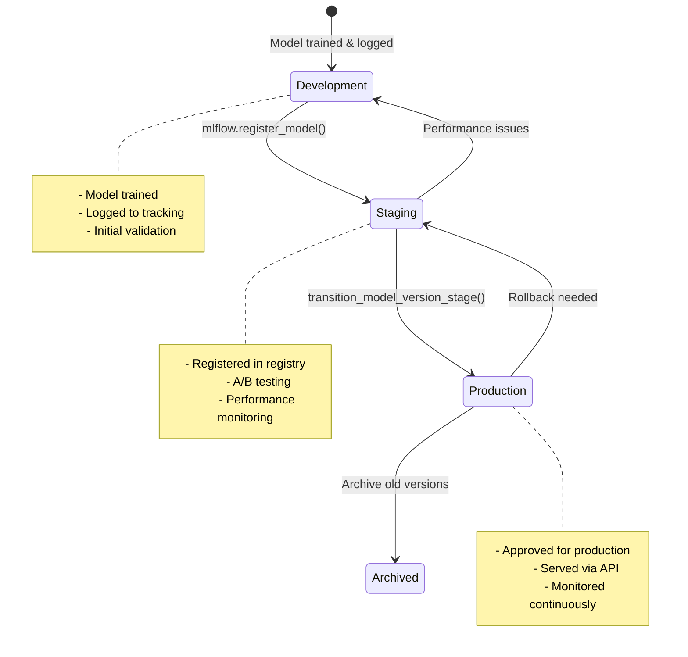

### Model Version Control
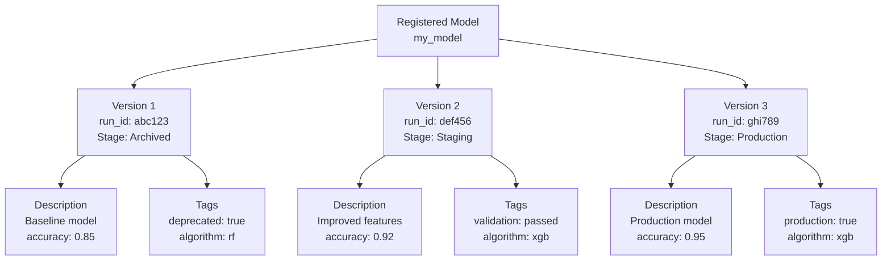

### Registry Operations Flow
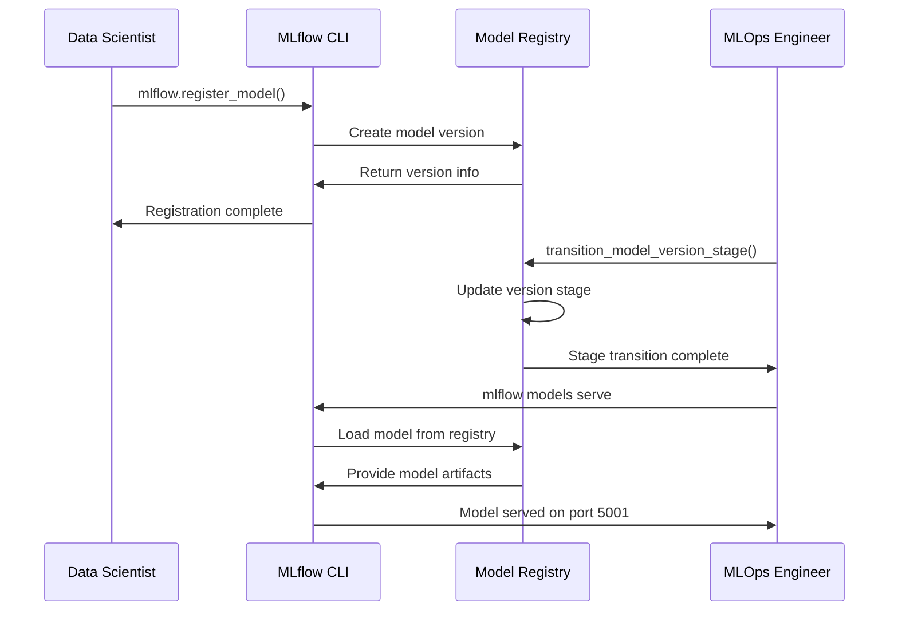

## Deployment and Serving Architecture

### Local Model Serving
```mermaid
graph LR
    subgraph "MLflow Models Serve"
        API[REST API<br/>POST /invocations]
        LOAD[Model Loading<br/>pyfunc.load_model()]
        PREDICT[Prediction<br/>model.predict()]
        FORMAT[Response Format<br/>JSON/Pandas]
    end

    subgraph "Client Applications"
        HTTP[HTTP Client<br/>curl/python requests]
        SDK[MLflow Python SDK<br/>mlflow.pyfunc.load_model()]
    end

    subgraph "Model Storage"
        REGISTRY[Model Registry<br/>models:/my_model/1]
        ARTIFACTS[Artifact Store<br/>S3/GCS/Local]
    end

    HTTP --> API
    SDK --> LOAD

    API --> LOAD
    LOAD --> PREDICT
    PREDICT --> FORMAT

    LOAD --> REGISTRY
    REGISTRY --> ARTIFACTS
```

### Cloud Deployment Architecture
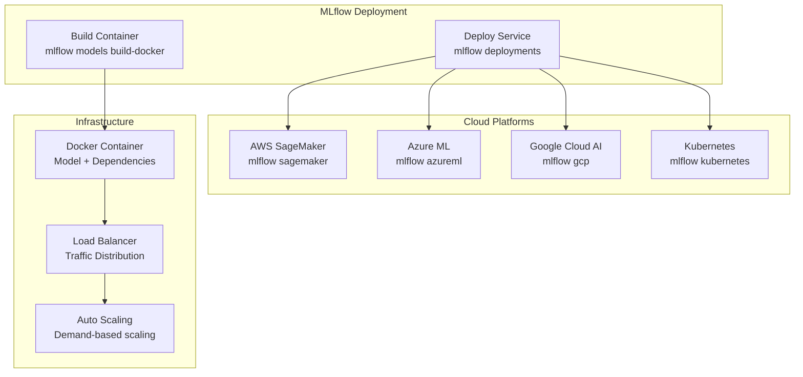

### MLOps Pipeline Integration
```mermaid
graph LR
    subgraph "Development"
        TRAIN[Model Training<br/>Experiment tracking]
        VALIDATE[Model Validation<br/>Cross-validation]
        REGISTER[Model Registration<br/>Version control]
    end

    subgraph "CI/CD Pipeline"
        TEST[Automated Testing<br/>Unit/Integration]
        BUILD[Model Building<br/>Containerization]
        DEPLOY_STAGING[Staging Deployment<br/>A/B Testing]
    end

    subgraph "Production"
        MONITOR[Performance Monitoring<br/>Metrics/Drift]
        RETRAIN[Automated Retraining<br/>Data drift triggers]
        DEPLOY_PROD[Production Deployment<br/>Blue-green deployment]
    end

    TRAIN --> VALIDATE
    VALIDATE --> REGISTER
    REGISTER --> TEST
    TEST --> BUILD
    BUILD --> DEPLOY_STAGING
    DEPLOY_STAGING --> MONITOR
    MONITOR --> RETRAIN
    RETRAIN --> DEPLOY_PROD
    DEPLOY_PROD --> MONITOR

    style TRAIN fill:#e1f5fe
    style VALIDATE fill:#e1f5fe
    style REGISTER fill:#e1f5fe
    style TEST fill:#f3e5f5
    style BUILD fill:#f3e5f5
    style DEPLOY_STAGING fill:#f3e5f5
    style MONITOR fill:#e8f5e8
    style RETRAIN fill:#e8f5e8
    style DEPLOY_PROD fill:#e8f5e8
```

## Multi-Environment Setup

### Environment Configuration
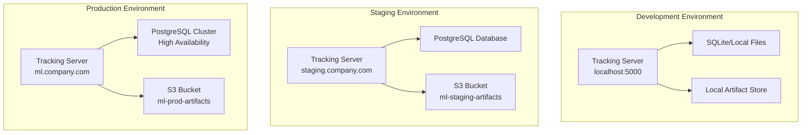

### Cross-Environment Model Promotion
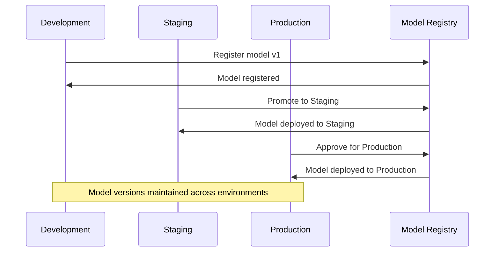

## Security and Access Control

### Authentication Architecture
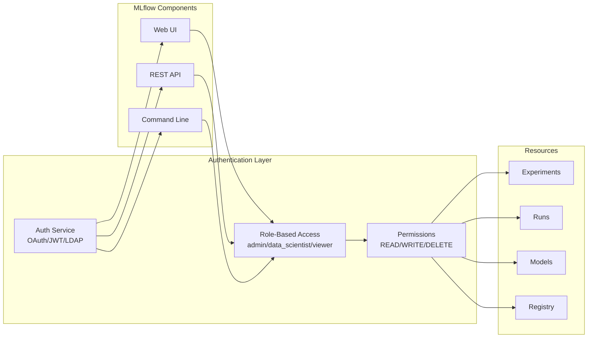

### Audit Logging
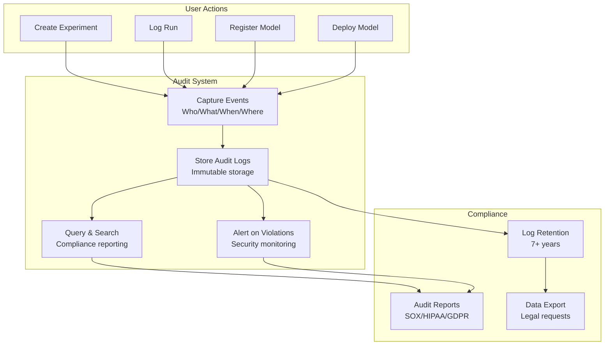

## Performance and Scaling

### Backend Scaling Architecture
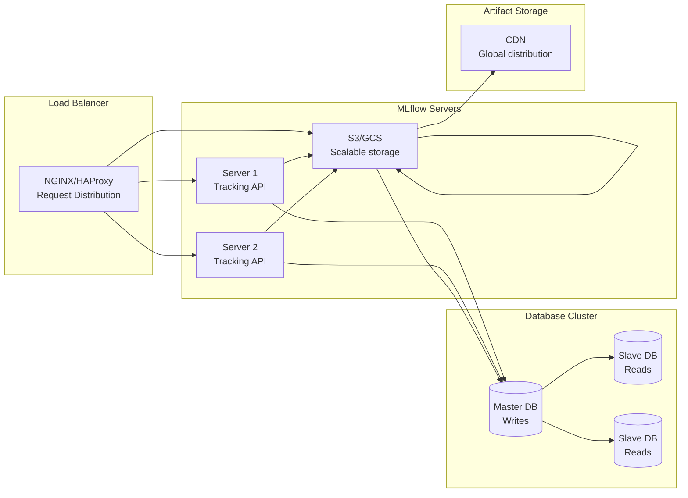

### Caching Strategy
```mermaid
graph TD
    subgraph "Caching Layers"
        APP[Application Cache<br/>Redis/Memcached]
        DB[Database Cache<br/>Query result cache]
        ARTIFACT[Artifact Cache<br/>Local/S3 cache]
    end

    subgraph "Data Flow"
        REQUEST[API Request]
        CACHE_CHECK{Cache Hit?}
        DB_QUERY[Database Query]
        ARTIFACT_FETCH[Artifact Download]
        RESPONSE[API Response]
    end

    REQUEST --> CACHE_CHECK
    CACHE_CHECK -->|Yes| RESPONSE
    CACHE_CHECK -->|No| DB_QUERY
    DB_QUERY --> ARTIFACT_FETCH
    ARTIFACT_FETCH --> RESPONSE
    RESPONSE --> APP
```

This visual architecture overview demonstrates how MLflow components work together to provide a comprehensive MLOps platform. The diagrams show the flow of data, the relationships between components, and how MLflow integrates with various deployment targets and scales for production use.
