# PyTorch Visual Architecture and Diagrams

## Core PyTorch Architecture

### PyTorch Ecosystem Overview

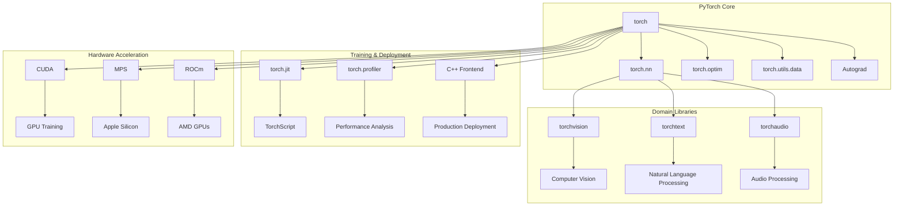

### Dynamic Computation Graph

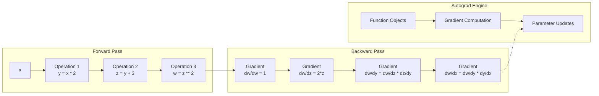

### Tensor Operations Flow

```mermaid
graph TD
    A[Input Tensor<br/>Shape: (32, 784)] --> B[Linear Layer<br/>784 → 128]
    B --> C[ReLU<br/>Activation]
    C --> D[Dropout<br/>p=0.2]
    D --> E[Linear Layer<br/>128 → 64]
    E --> F[ReLU<br/>Activation]
    F --> G[Linear Layer<br/>64 → 10]
    G --> H[Softmax<br/>Output]

    I[Weights<br/>Trainable] -.-> B
    J[Biases<br/>Trainable] -.-> B
    K[Weights<br/>Trainable] -.-> E
    L[Biases<br/>Trainable] -.-> E
    M[Weights<br/>Trainable] -.-> G
    N[Biases<br/>Trainable] -.-> G

    O[Loss Function] --> P[Backward Pass]
    P --> Q[Gradient Flow]
    Q --> R[Optimizer Update]
    R --> I
    R --> J
    R --> K
    R --> L
    R --> M
    R --> N
```

## Neural Network Architectures

### Convolutional Neural Network (CNN)

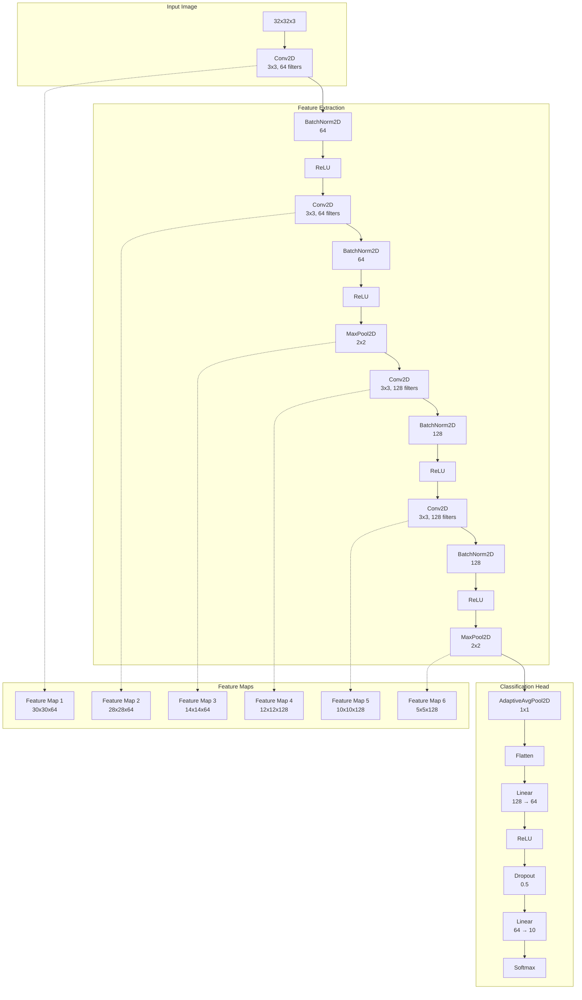

### Recurrent Neural Network (RNN)

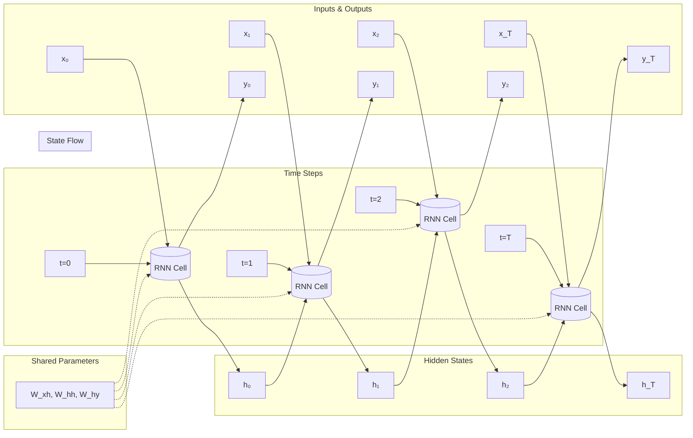

### Long Short-Term Memory (LSTM)

```mermaid
graph TB
    subgraph "LSTM Cell Architecture"
        A[Input Gate<br/>i_t = σ(W_i·[h_{t-1}, x_t] + b_i)]
        B[Forget Gate<br/>f_t = σ(W_f·[h_{t-1}, x_t] + b_f)]
        C[Output Gate<br/>o_t = σ(W_o·[h_{t-1}, x_t] + b_o)]
        D[Candidate Values<br/>~C_t = tanh(W_C·[h_{t-1}, x_t] + b_C)]
    end

    subgraph "Cell State Update"
        E[Previous Cell State<br/>C_{t-1}] --> F[Forget Gate Application<br/>f_t * C_{t-1}]
        D --> G[Input Gate Application<br/>i_t * ~C_t]
        F --> H[New Cell State<br/>C_t = f_t*C_{t-1} + i_t*~C_t]
    end

    subgraph "Hidden State Output"
        H --> I[Cell State Activation<br/>tanh(C_t)]
        C --> J[Output Gate Application<br/>o_t * tanh(C_t)]
        J --> K[Hidden State<br/>h_t]
    end

    subgraph "Gates Logic"
        A --> L[Controls what to store]
        B --> M[Controls what to forget]
        C --> N[Controls what to output]
    end
```

### Transformer Architecture

```mermaid
graph TB
    subgraph "Input Processing"
        A[Input Sequence<br/>x₁, x₂, ..., x_n] --> B[Token Embedding<br/>d_model dimensions]
        B --> C[Positional Encoding<br/>Added to embeddings]
        C --> D[Multi-Head Attention<br/>Self-Attention]
    end

    subgraph "Encoder Block"
        D --> E[Add & Norm<br/>Residual + Layer Norm]
        E --> F[Feed Forward<br/>Position-wise FFN]
        F --> G[Add & Norm<br/>Residual + Layer Norm]
        G --> H[Output<br/>Encoder Representations]
    end

    subgraph "Decoder Block"
        I[Target Sequence<br/>y₁, y₂, ..., y_m] --> J[Token Embedding]
        J --> K[Positional Encoding]
        K --> L[Masked Multi-Head Attention<br/>Causal Self-Attention]
        L --> M[Add & Norm]
        H --> N[Multi-Head Attention<br/>Cross-Attention]
        M --> N
        N --> O[Add & Norm]
        O --> P[Feed Forward]
        P --> Q[Add & Norm]
        Q --> R[Linear Layer<br/>d_model → vocab_size]
        R --> S[Softmax<br/>Output Probabilities]
    end

    subgraph "Attention Mechanism"
        T[Query<br/>Q = W_Q·X] --> U[Scaled Dot-Product<br/>Attention(Q,K,V)]
        V[Key<br/>K = W_K·X] --> U
        W[Value<br/>V = W_V·X] --> U
        U --> X[Concatenate<br/>Heads]
        X --> Y[Linear<br/>W_O]
        Y --> Z[Multi-Head Output]
    end
```

## Training Pipeline

### Complete Training Workflow

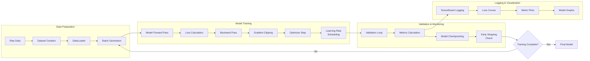

### Gradient Flow and Optimization

```mermaid
graph TD
    A[Input Batch<br/>X] --> B[Model Forward<br/>ŷ = f(X; θ)]

    B --> C[Loss Function<br/>L = l(ŷ, y)]

    C --> D[Backward Pass<br/>∂L/∂θ]

    D --> E{Gradient Clipping?}
    E -->|Yes| F[Clip Gradients<br/>||g|| ≤ max_norm]
    E -->|No| G[Raw Gradients]

    F --> H[Optimizer Update]
    G --> H

    H --> I[Parameter Update<br/>θ ← θ - α·g]

    I --> J[Learning Rate<br/>Decay]

    J --> K[Next Batch]
    K --> A

    subgraph "Optimizer Types"
        L[SGD<br/>θ -= α·g]
        M[Adam<br/>Adaptive moments]
        N[AdamW<br/>Decoupled weight decay]
    end

    H --> L
    H --> M
    H --> N
```

## Data Processing Pipeline

### torch.utils.data Workflow

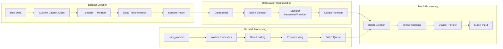

### Data Augmentation Pipeline

```mermaid
graph LR
    subgraph "Image Augmentation"
        A[Original Image] --> B[RandomResizedCrop<br/>224x224]
        B --> C[RandomHorizontalFlip<br/>p=0.5]
        C --> D[ColorJitter<br/>brightness, contrast, saturation]
        D --> E[RandomRotation<br/>±15°]
        E --> F[ToTensor<br/>[0,1] range]
        F --> G[Normalize<br/>mean=[0.485,0.456,0.406]<br/>std=[0.229,0.224,0.225]]
    end

    subgraph "Text Augmentation"
        H[Original Text] --> I[Tokenization]
        I --> J[Random Deletion<br/>p=0.1]
        J --> K[Random Swap<br/>n=2]
        K --> L[Synonym Replacement<br/>p=0.1]
        L --> M[Vocabulary Lookup]
        M --> N[Tensor Conversion]
    end

    subgraph "Combined Pipeline"
        G --> O[Vision Model]
        N --> P[Language Model]
        O --> Q[Multi-modal<br/>Model]
        P --> Q
    end
```

## Distributed Training Architecture

### DataParallel (Single Machine)

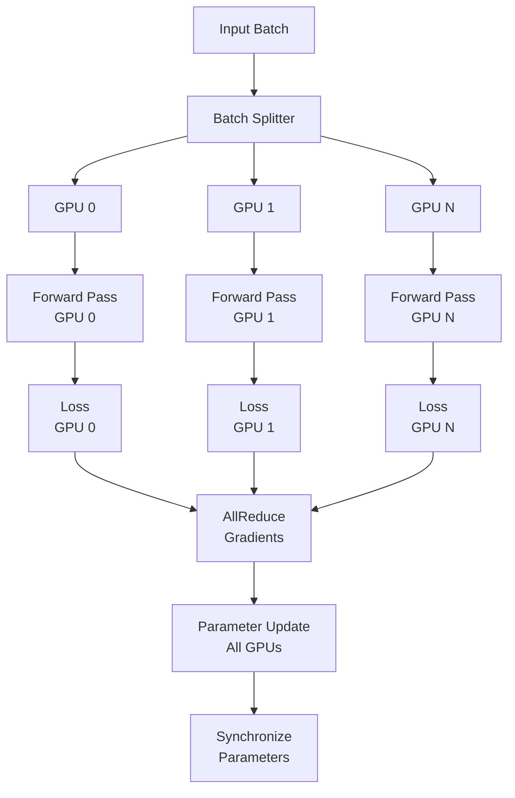

### DistributedDataParallel (Multi-Machine)

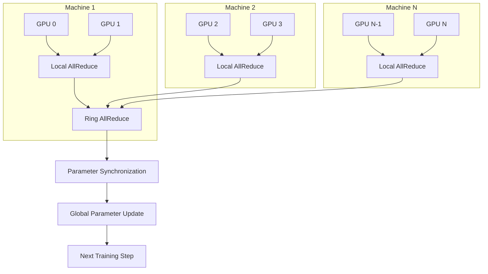

## Model Deployment Architecture

### TorchScript Compilation

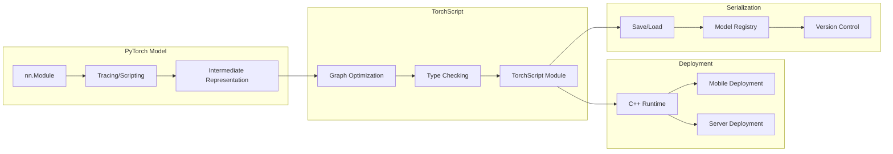

### Model Optimization Pipeline

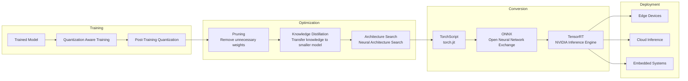

## Performance Monitoring

### Training Metrics Dashboard

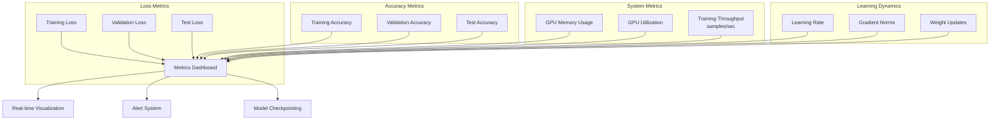

### Profiling and Bottleneck Analysis

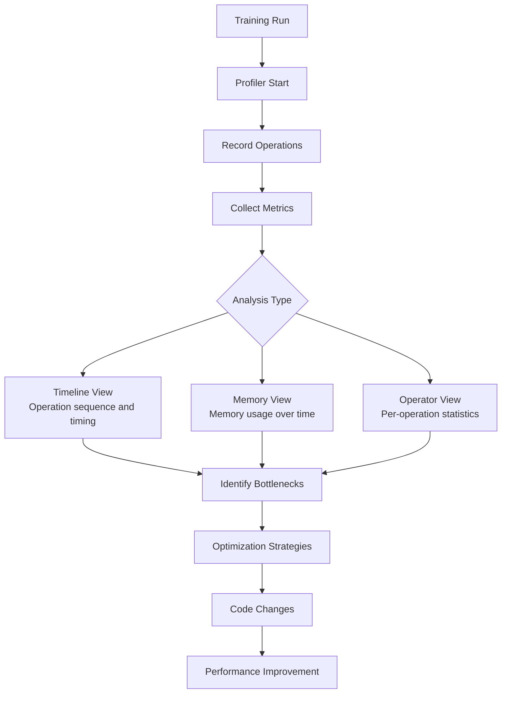

## Memory Management

### GPU Memory Optimization

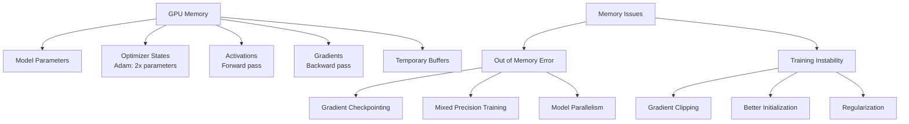

### Memory-Efficient Training Techniques

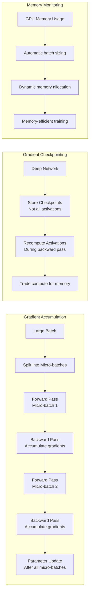

## Integration Patterns

### MLflow Integration

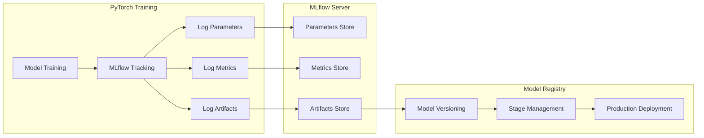

### Kubernetes Deployment

```mermaid
graph TB
    subgraph "Training Job"
        A[PyTorchJob<br/>Kubeflow] --> B[Pod Group]
        B --> C[Master Pod<br/>Parameter Server]
        B --> D[Worker Pods<br/>GPU Training]
    end

    subgraph "Distributed Training"
        C --> E[NCCL Communication]
        D --> E
        E --> F[Ring AllReduce]
        F --> G[Synchronized Updates]
    end

    subgraph "Storage"
        H[Persistent Volumes] --> I[Dataset Storage]
        I --> J[Checkpoint Storage]
        J --> K[Model Registry]
    end

    G --> K
```

## Best Practices Architecture

### Experiment Management

```mermaid
graph LR
    subgraph "Experiment Setup"
        A[Configuration] --> B[Hyperparameters]
        B --> C[Random Seeds]
        C --> D[Environment Setup]
    end

    subgraph "Training Execution"
        D --> E[Model Training]
        E --> F[Validation]
        F --> G[Metrics Logging]
    end

    subgraph "Result Management"
        G --> H[Model Checkpointing]
        H --> I[Artifact Storage]
        I --> J[Experiment Registry]
    end

    subgraph "Analysis"
        J --> K[Hyperparameter Tuning]
        K --> L[Model Comparison]
        L --> M[Best Model Selection]
    end

    M --> N[Production Deployment]
```

### Production ML Pipeline

```mermaid
graph LR
    subgraph "Development"
        A[Model Development] --> B[Unit Testing]
        B --> C[Integration Testing]
        C --> D[Performance Testing]
    end

    subgraph "Staging"
        D --> E[Load Testing]
        E --> F[A/B Testing]
        F --> G[Canary Deployment]
    end

    subgraph "Production"
        G --> H[Model Serving]
        H --> I[Monitoring]
        I --> J[Feedback Loop]
        J --> K[Model Retraining]
    end

    K --> A
```

This comprehensive visual architecture covers PyTorch's core components, neural network architectures, training pipelines, distributed training, deployment strategies, and best practices for building scalable deep learning systems.
