# TensorFlow Visual Architecture and Diagrams

## Core TensorFlow Architecture

### TensorFlow 2.x Architecture

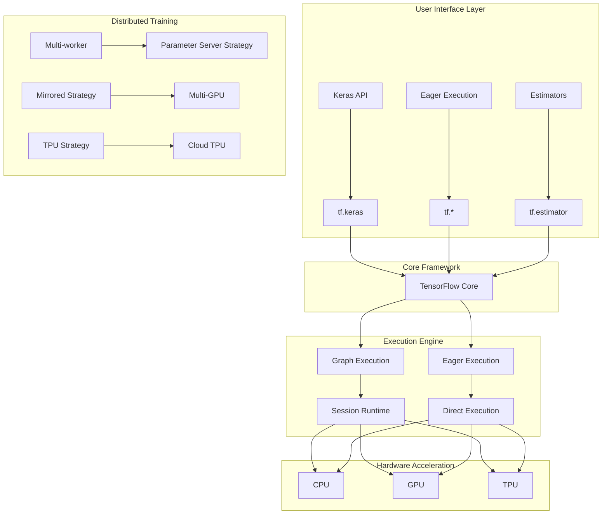

### Tensor Computation Graph

```mermaid
graph LR
    subgraph "Input Tensors"
        A[x: [2, 3]] --> C[MatMul]
        B[W: [3, 4]] --> C
    end

    subgraph "Operations"
        C --> D[Add]
        E[b: [4]] --> D
        D --> F[ReLU]
    end

    subgraph "Output Tensor"
        F --> G[y: [2, 4]]
    end

    subgraph "Graph Metadata"
        H[GraphDef] --> I[Nodes]
        H --> J[Edges]
        H --> K[Metadata]
    end
```

## Neural Network Architectures

### Feedforward Neural Network

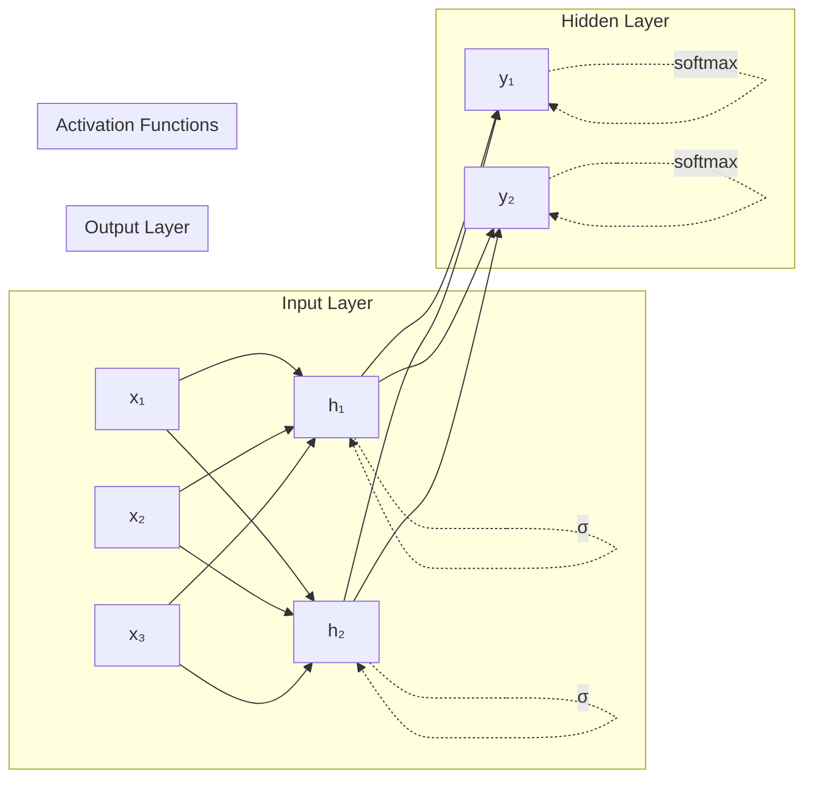

### Convolutional Neural Network (CNN)

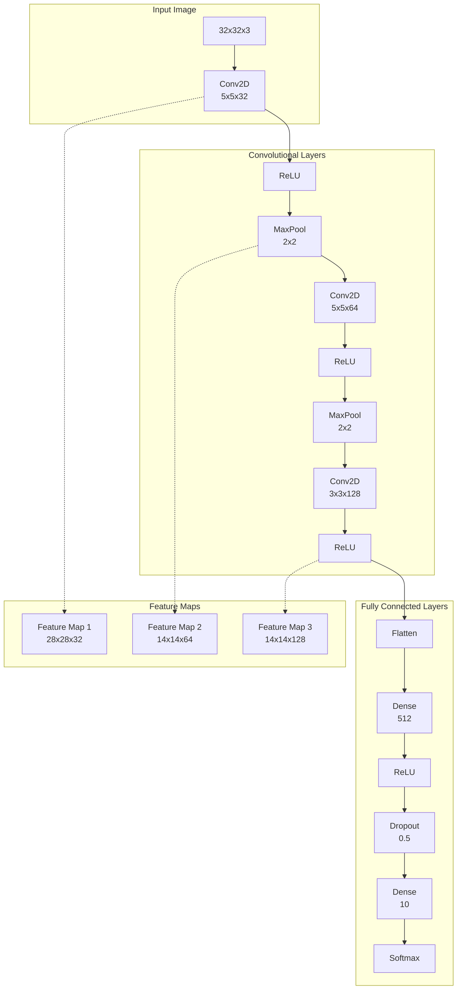

### Recurrent Neural Network (RNN)

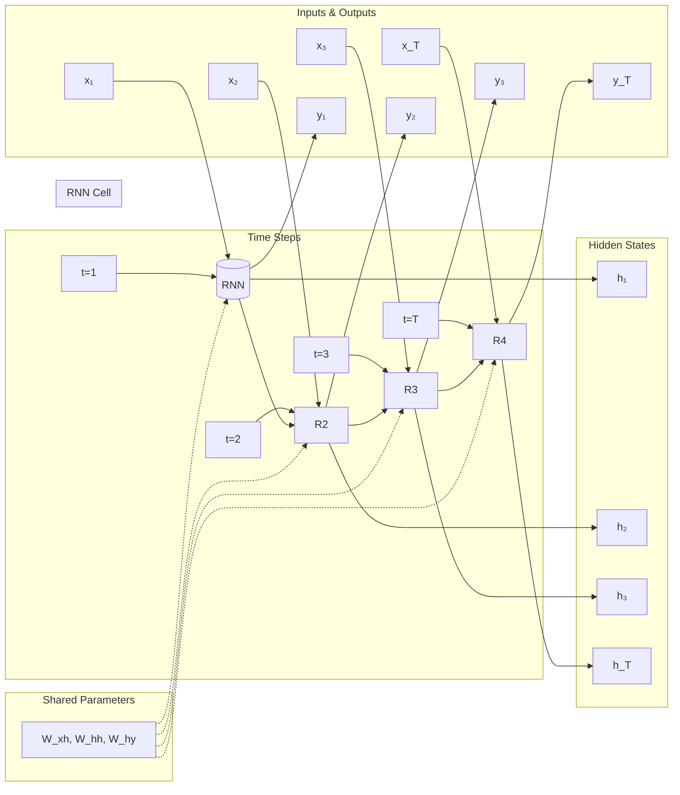

### Long Short-Term Memory (LSTM)

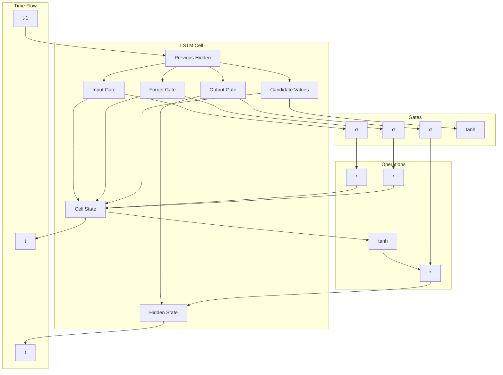

### Transformer Architecture

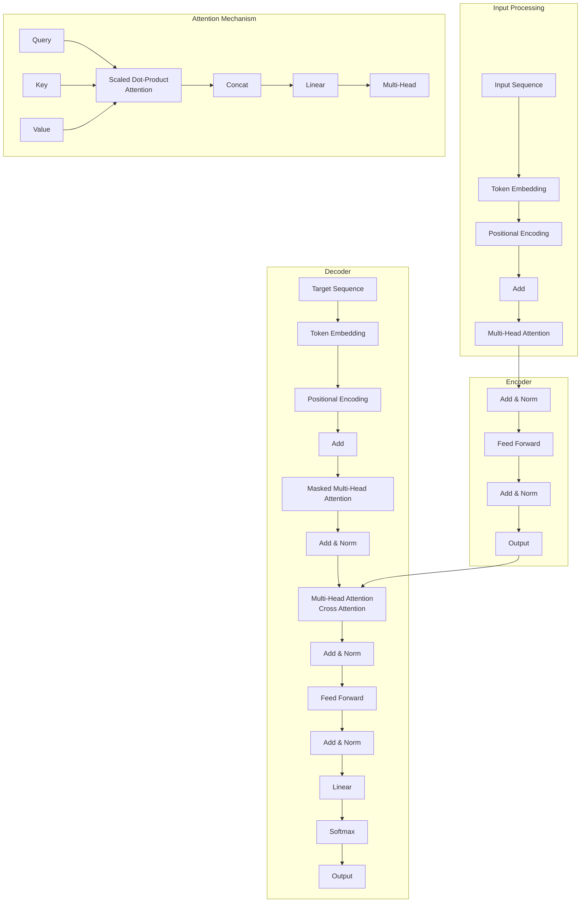

## Training Pipeline

### Model Training Workflow

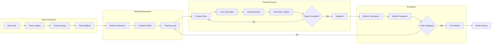

### Gradient Descent Optimization

```mermaid
graph TD
    A[Initialize Parameters<br/>θ = θ₀] --> B[Compute Loss<br/>L(θ)]

    B --> C[Compute Gradients<br/>∇L(θ)]

    C --> D{Choose Optimizer}

    D --> E[Stochastic GD<br/>θ = θ - α∇L(θ)]
    D --> F[Momentum<br/>θ = θ - α∇L(θ) + βv]
    D --> G[Adam<br/>Adaptive moments]
    D --> H[RMSProp<br/>Adaptive learning rate]

    E --> I[Update Parameters]
    F --> I
    G --> I
    H --> I

    I --> J{Convergence?}
    J -->|No| B
    J -->|Yes| K[Optimal Parameters<br/>θ*]
```

## Data Pipeline Architecture

### tf.data Pipeline

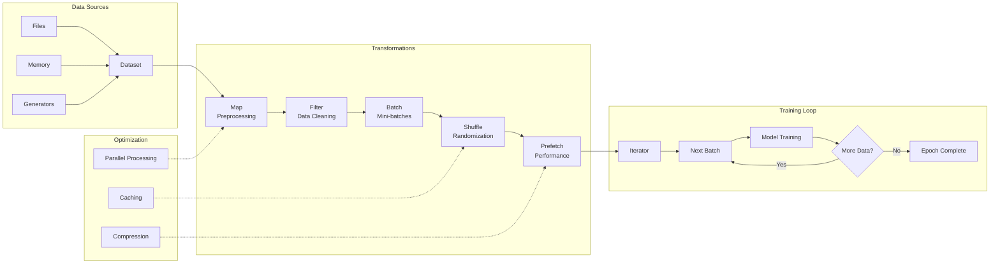

### Distributed Training Strategies

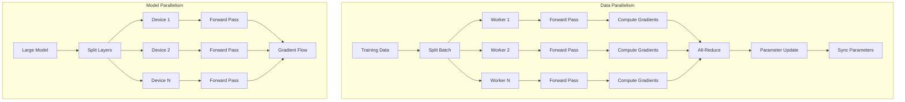

## Model Deployment Architecture

### TensorFlow Serving

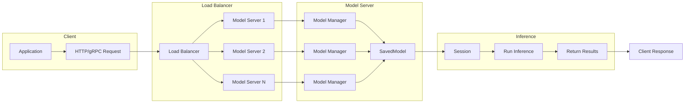

### TensorFlow Lite Pipeline

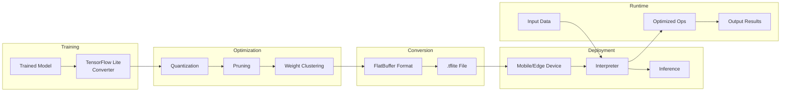

## TensorFlow Extended (TFX)

### ML Pipeline Architecture

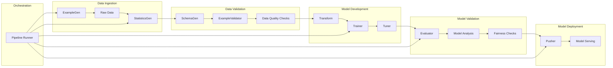

### Component Interactions

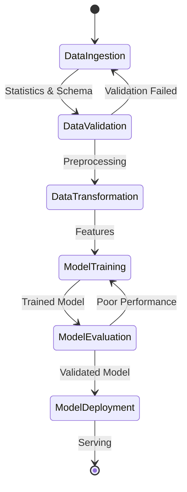

## Performance Optimization

### XLA Compilation

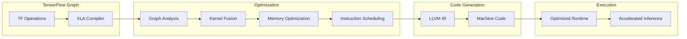

### Mixed Precision Training

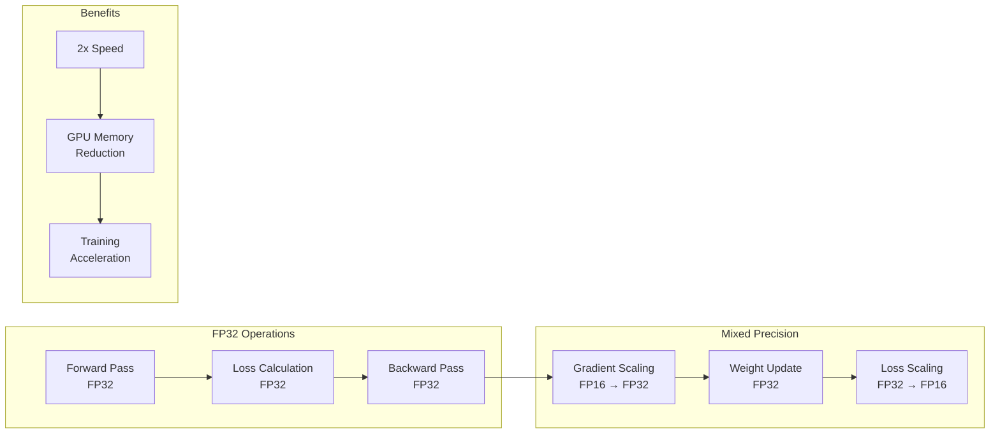

## Hardware Acceleration

### GPU/TPU Architecture

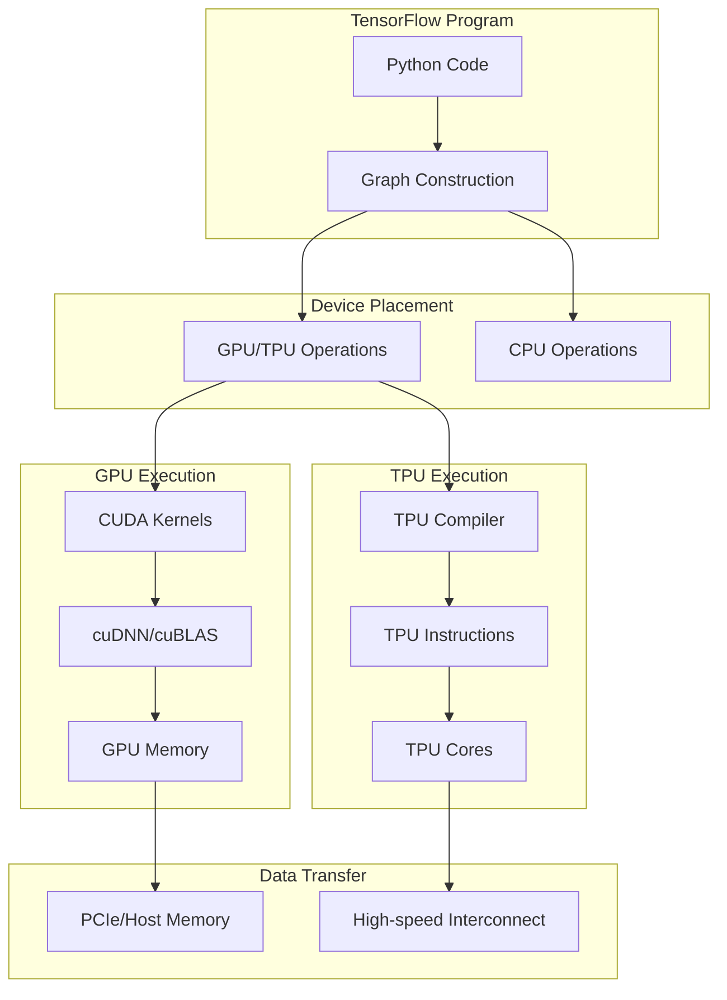

### Memory Hierarchy

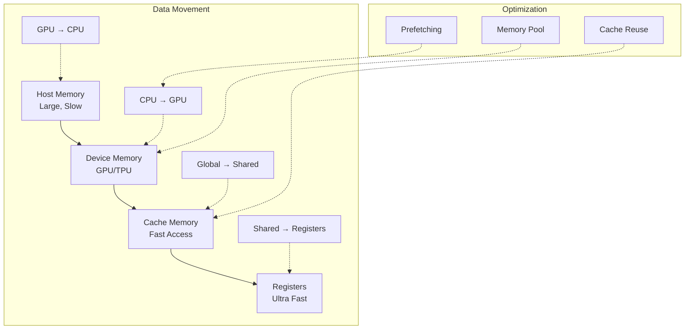

## Monitoring and Debugging

### TensorBoard Architecture

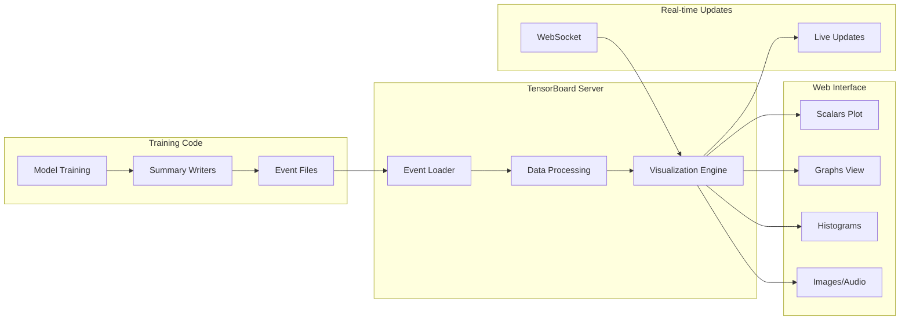

### Profiling and Optimization

```mermaid
graph TD
    A[Training Run] --> B[Profiler Hook]
    B --> C[Performance Data]

    C --> D[Timeline View]
    C --> E[Memory Profile]
    C --> F[Operation Stats]

    D --> G[Bottleneck Analysis]
    E --> H[Memory Optimization]
    F --> I[Operation Fusion]

    G --> J[Optimization Strategies]
    H --> J
    I --> J

    J --> K[Improved Performance]
```

## Integration Patterns

### MLflow Integration

```mermaid
graph LR
    subgraph "TensorFlow Training"
        A[Model Training] --> B[MLflow Tracking]
        B --> C[Log Parameters]
        B --> D[Log Metrics]
        B --> E[Log Artifacts]
    end

    subgraph "MLflow Server"
        C --> F[Parameters Store]
        D --> G[Metrics Store]
        E --> H[Artifacts Store]
    end

    subgraph "Model Registry"
        I[Model Versioning] --> J[Stage Management]
        J --> K[Production Deployment]
    end

    H --> I
```

### Kubernetes Deployment

```mermaid
graph TB
    subgraph "Kubernetes Cluster"
        A[Load Balancer] --> B[TF Serving Pod 1]
        A --> C[TF Serving Pod 2]
        A --> D[TF Serving Pod N]
    end

    subgraph "TF Serving Container"
        B --> E[Model Server]
        C --> F[Model Server]
        D --> G[Model Server]
    end

    subgraph "Model Management"
        E --> H[ConfigMap]
        F --> H
        G --> H
        H --> I[Model Files]
    end

    subgraph "Auto-scaling"
        J[HPA] --> K[CPU/Memory Metrics]
        K --> L[Scale Pods]
    end
```

## Best Practices Architecture

### Model Development Workflow

```mermaid
graph LR
    subgraph "Development"
        A[Experiment<br/>Tracking] --> B[Code<br/>Versioning]
        B --> C[Data<br/>Versioning]
        C --> D[Model<br/>Versioning]
    end

    subgraph "Testing"
        D --> E[Unit Tests]
        E --> F[Integration Tests]
        F --> G[Performance Tests]
    end

    subgraph "Production"
        G --> H[CI/CD Pipeline]
        H --> I[Model Registry]
        I --> J[Automated<br/>Deployment]
        J --> K[Monitoring<br/>& Alerting]
    end

    subgraph "Feedback Loop"
        K --> L[Model<br/>Retraining]
        L --> A
    end
```

### Production ML System

```mermaid
graph TB
    subgraph "Data Pipeline"
        A[Data Ingestion] --> B[Feature Store]
        B --> C[Online/Offline<br/>Features]
    end

    subgraph "Model Pipeline"
        C --> D[Model Training]
        D --> E[Model Validation]
        E --> F[Model Deployment]
    end

    subgraph "Serving Pipeline"
        F --> G[Model Serving]
        C --> G
        G --> H[Prediction Service]
    end

    subgraph "Monitoring"
        H --> I[Performance<br/>Monitoring]
        H --> J[Data Drift<br/>Detection]
        H --> K[Model<br/>Retraining]
    end

    K --> D
```

This comprehensive visual architecture covers TensorFlow's core components, neural network architectures, training pipelines, deployment strategies, and best practices for building scalable ML systems.
