# Weights & Biases Visual Architecture and Workflows

## W&B Platform Architecture

### Core System Components
```mermaid
graph TB
    subgraph "W&B Platform"
        SDK[W&B Python SDK<br/>wandb.init(), log()]
        API[REST API<br/>HTTP/HTTPS]
        WEB[Web Dashboard<br/>wandb.ai/app]
        DB[(Metadata Database<br/>PostgreSQL)]
        STORE[(Artifact Store<br/>S3/GCS/Azure)]
    end

    subgraph "User Environments"
        COLAB[Google Colab]
        JUPYTER[Jupyter Notebook]
        SCRIPT[Python Scripts]
        CLUSTER[Training Clusters]
    end

    subgraph "Integrations"
        PYTORCH[PyTorch Lightning]
        TENSORFLOW[TensorFlow/Keras]
        HUGGINGFACE[Hugging Face]
        KERAS[Keras Callbacks]
    end

    USER[Data Scientist/ML Engineer] --> SDK
    SDK --> API
    API --> DB
    API --> STORE
    API --> WEB

    COLAB --> SDK
    JUPYTER --> SDK
    SCRIPT --> SDK
    CLUSTER --> SDK

    PYTORCH --> SDK
    TENSORFLOW --> SDK
    HUGGINGFACE --> SDK
    KERAS --> SDK
```

### Experiment Tracking Flow
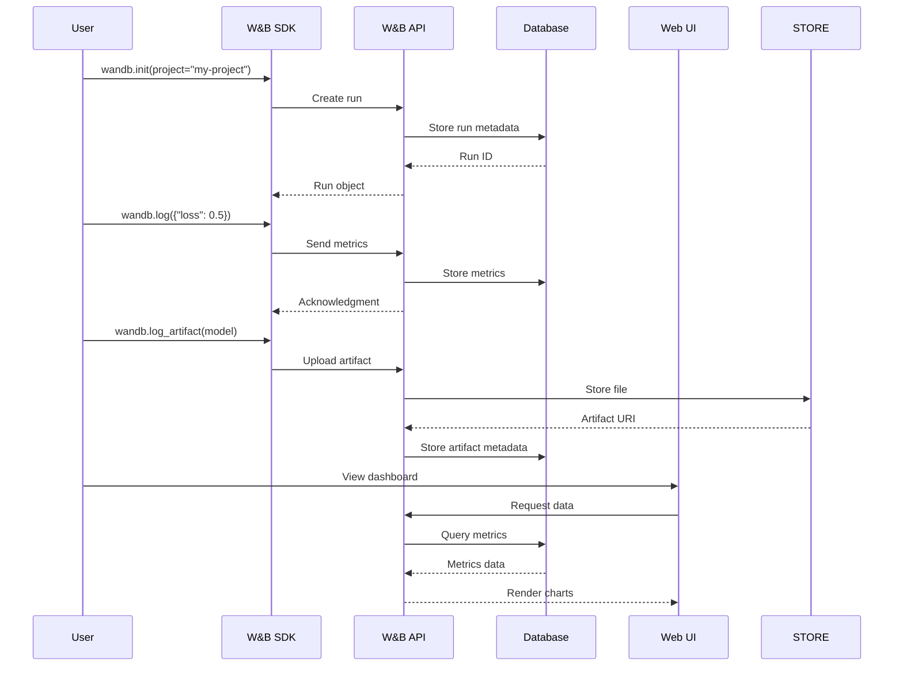

## Experiment Management Workflows

### Run Lifecycle
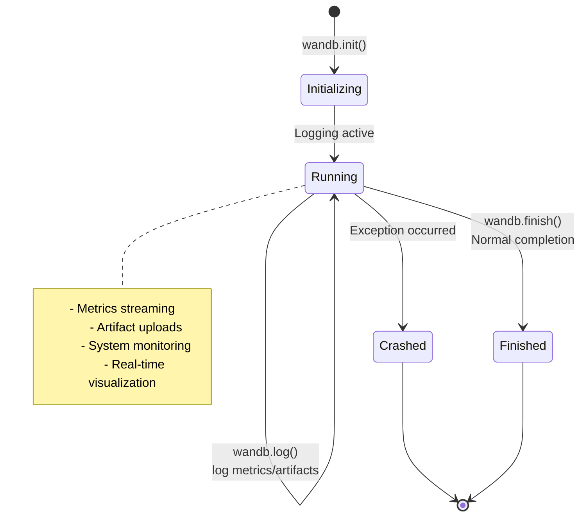

### Project Organization
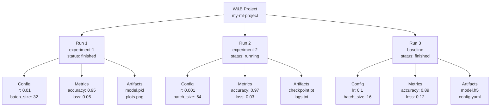

### Hyperparameter Sweep Architecture
```mermaid
graph LR
    subgraph "Sweep Controller"
        CONFIG[Sweep Config<br/>method: bayes<br/>parameters: {...}]
        AGENT[Sweep Agent<br/>wandb.agent()]
        SCHEDULER[Scheduler<br/>Bayesian Optimization]
    end

    subgraph "Worker Nodes"
        WORKER1[Worker 1<br/>GPU Node]
        WORKER2[Worker 2<br/>CPU Node]
        WORKER3[Worker 3<br/>Cloud Instance]
    end

    subgraph "W&B Backend"
        TRACKER[Run Tracker]
        OPTIMIZER[Parameter Optimizer]
        RESULTS[Results Aggregator]
    end

    CONFIG --> AGENT
    AGENT --> SCHEDULER
    SCHEDULER --> WORKER1
    SCHEDULER --> WORKER2
    SCHEDULER --> WORKER3

    WORKER1 --> TRACKER
    WORKER2 --> TRACKER
    WORKER3 --> TRACKER

    TRACKER --> OPTIMIZER
    OPTIMIZER --> SCHEDULER
    TRACKER --> RESULTS
```

## Model Registry and Versioning

### Model Lifecycle Management
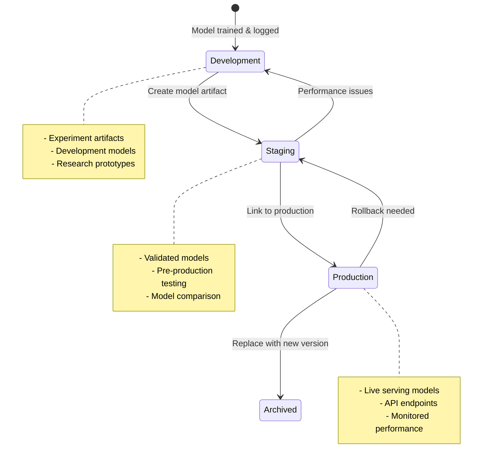

### Artifact Version Control
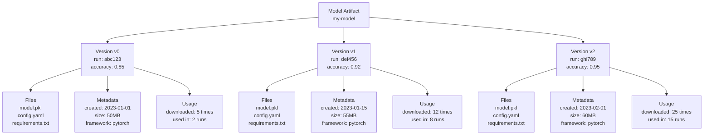

### Model Lineage Tracking
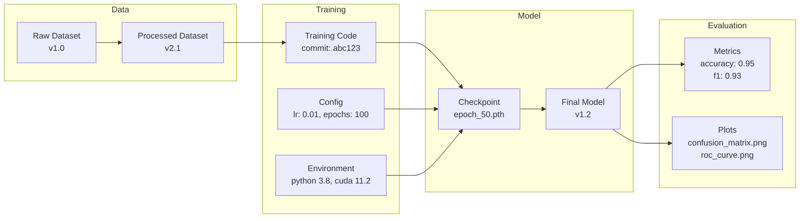

## Team Collaboration Features

### Workspace Organization
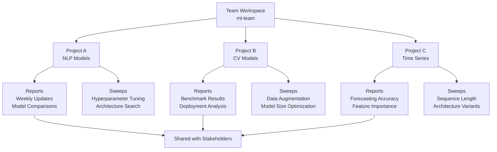

### Access Control Architecture
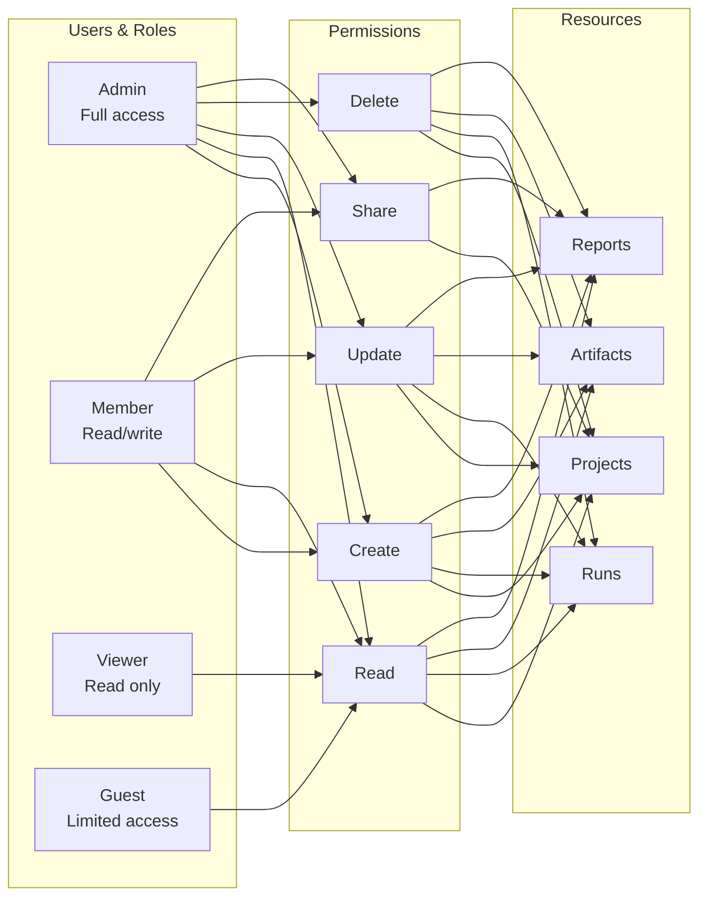

## Integration Workflows

### PyTorch Lightning Integration
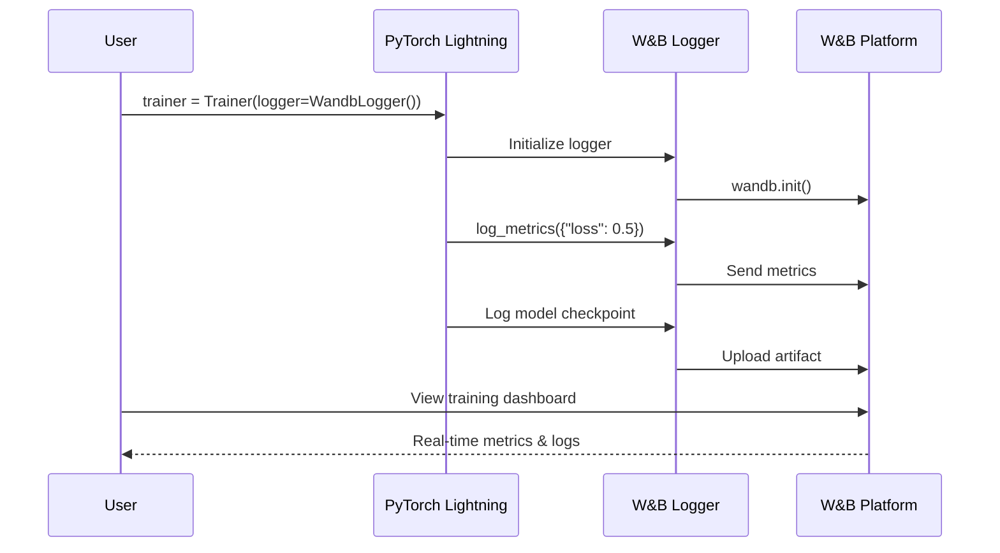

### CI/CD Pipeline Integration
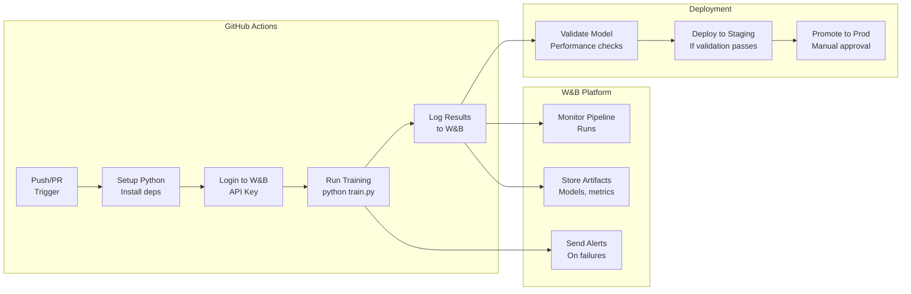

### Distributed Training Setup
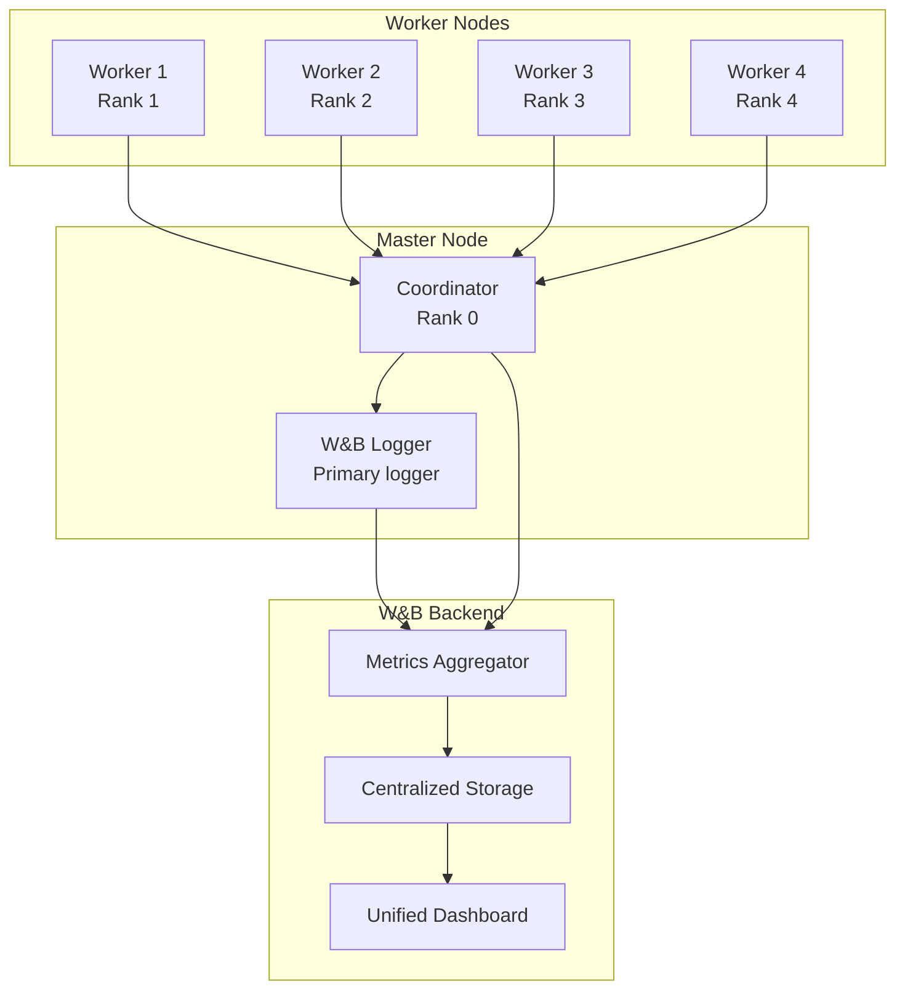

## Advanced Features

### Automated Experiment Tracking
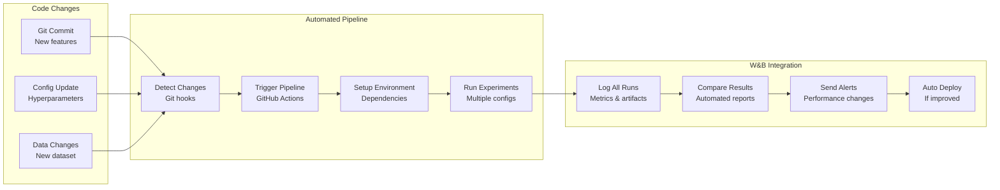

### Model Monitoring and Drift Detection
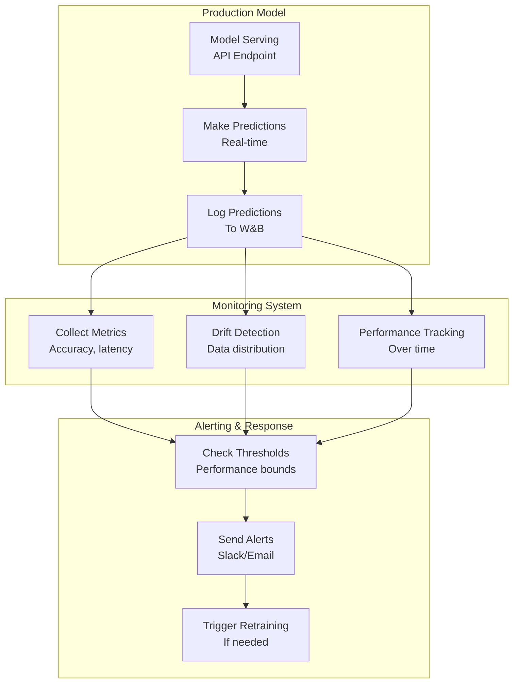

### Custom Dashboard Creation
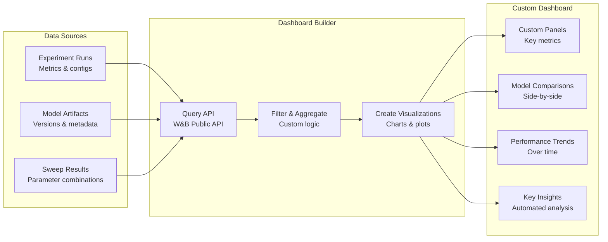

## Security and Compliance

### Data Privacy Architecture
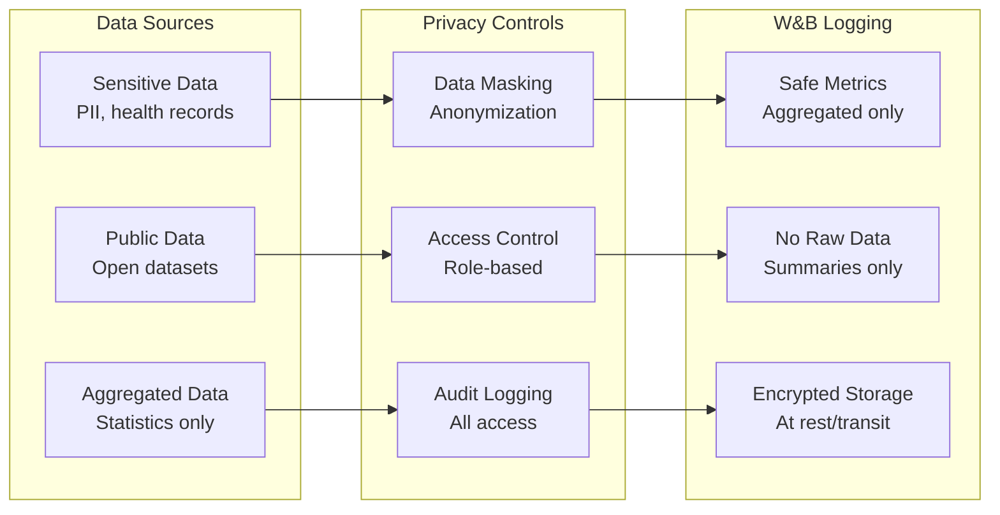

### Enterprise Deployment
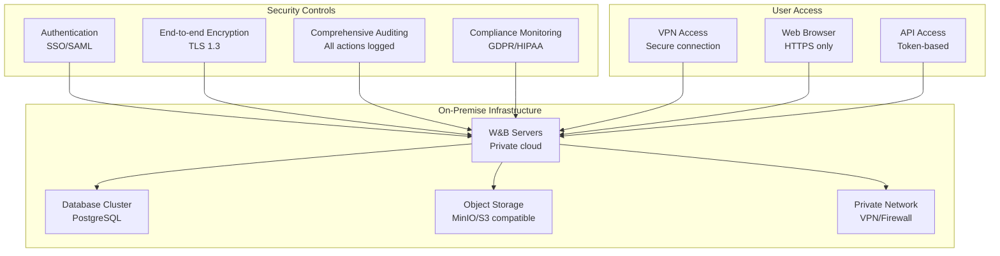

This visual architecture demonstrates how Weights & Biases integrates with ML workflows, providing comprehensive experiment tracking, model management, and team collaboration capabilities. The diagrams show the flow of data, component interactions, and integration patterns that make W&B a powerful platform for modern machine learning development.
