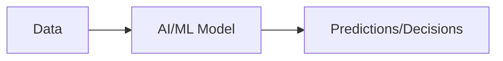
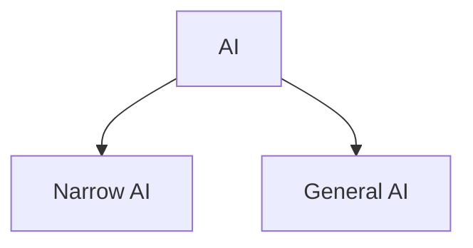
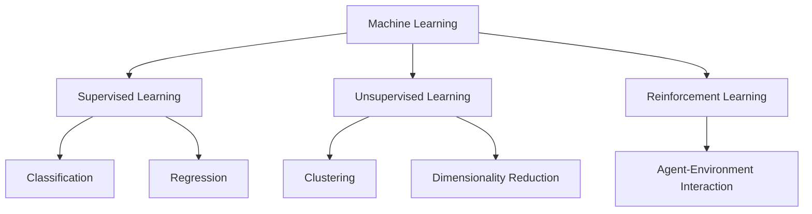
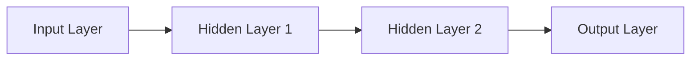
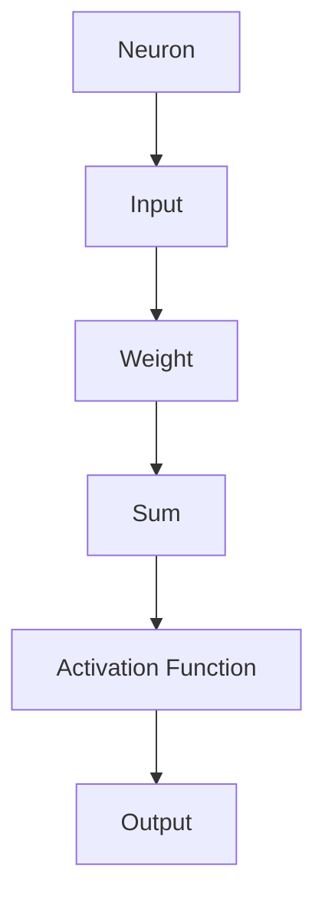
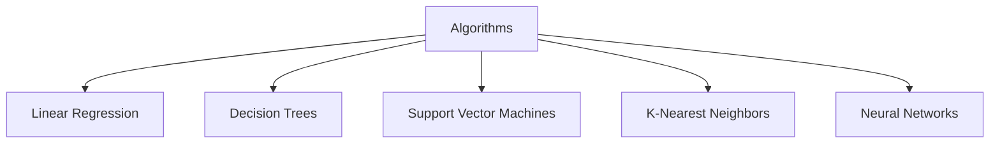
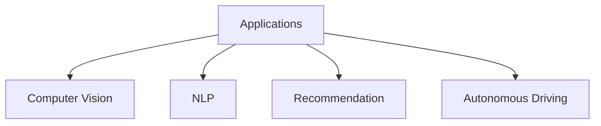
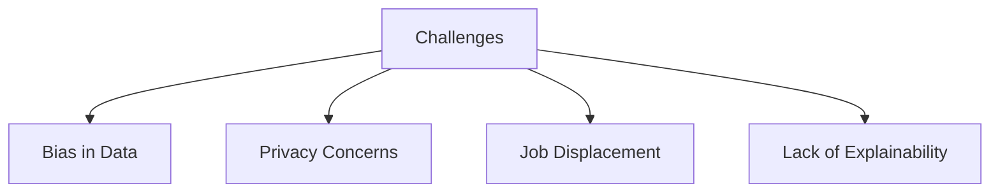

# AI-ML Technology Guide

## Table of Contents

1. [Introduction](#introduction)
2. [Artificial Intelligence](#artificial-intelligence)
3. [Machine Learning](#machine-learning)
4. [Deep Learning](#deep-learning)
5. [Neural Networks](#neural-networks)
6. [Common Algorithms](#common-algorithms)
7. [Applications](#applications)
8. [Ethics and Challenges](#ethics-and-challenges)

## Introduction

AI-ML combines artificial intelligence and machine learning to create systems that learn from data.

## Artificial Intelligence

AI is the simulation of human intelligence in machines.

Types:
- Narrow AI: Task-specific
- General AI: Human-like

## Machine Learning

ML is a subset of AI where systems learn from data without explicit programming.

Types:
- Supervised: Labeled data
- Unsupervised: Unlabeled data
- Reinforcement: Learn through rewards

## Deep Learning

DL uses neural networks with multiple layers.

## Neural Networks

Inspired by brain neurons.

Components: Neurons, Weights, Activation Functions.

## Common Algorithms

- Linear Regression
- Decision Trees
- SVM
- KNN
- Neural Networks

## Applications

- Image Recognition
- Natural Language Processing
- Recommendation Systems
- Autonomous Vehicles

## Ethics and Challenges

- Bias
- Privacy
- Job displacement
- Explainability

