# Scikit-learn Visual Architecture and Diagrams

## Core Architecture Overview

### Scikit-learn Ecosystem

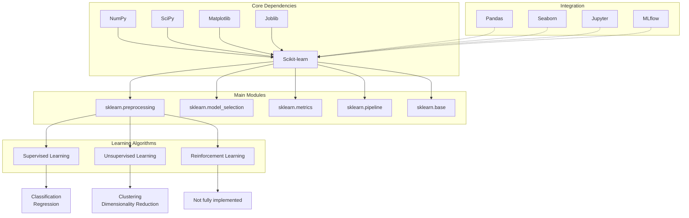

### Estimator API Architecture

```mermaid
graph TD
    A[BaseEstimator] --> B[Mixin Classes]
    B --> C[ClassifierMixin]
    B --> D[RegressorMixin]
    B --> E[TransformerMixin]
    B --> F[ClusterMixin]

    G[Custom Estimator] --> H[fit(X, y=None)]
    G --> I[predict(X)]
    G --> J[transform(X)]
    G --> K[score(X, y)]

    H --> L[Training Logic]
    I --> M[Prediction Logic]
    J --> N[Transformation Logic]
    K --> O[Scoring Logic]

    P[Hyperparameters] -.-> G
    Q[Internal State] -.-> G
    R[Validation] -.-> G
```

## Data Preprocessing Pipeline

### Complete Data Processing Workflow

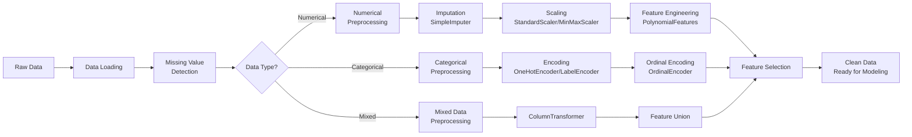

### Feature Scaling Methods

```mermaid
graph TD
    A[Raw Features] --> B[StandardScaler<br/>Z-score normalization]
    A --> C[MinMaxScaler<br/>[0,1] scaling]
    A --> D[RobustScaler<br/>Median & IQR based]
    A --> E[MaxAbsScaler<br/>Signed data]
    A --> F[Normalizer<br/>Row-wise normalization]

    B --> G[μ = 0, σ = 1]
    C --> H[Min = 0, Max = 1]
    D --> I[Robust to outliers]
    E --> J[Preserves sign]
    F --> K[Unit norm vectors]

    G --> L[Normally distributed data]
    H --> M[Bounded data needed]
    I --> N[Outlier-prone data]
    J --> L
    K --> O[Text classification<br/>Neural networks]
```

### Categorical Encoding Strategies

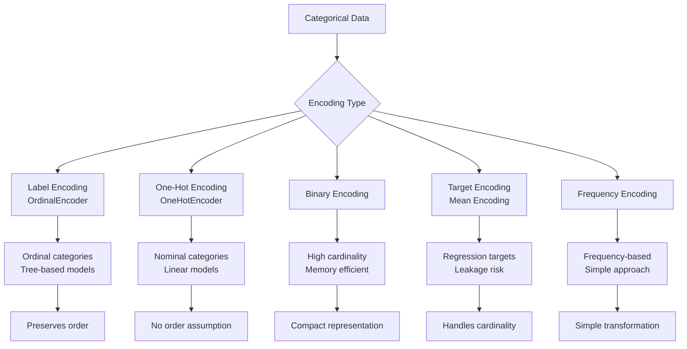

## Supervised Learning Algorithms

### Algorithm Taxonomy

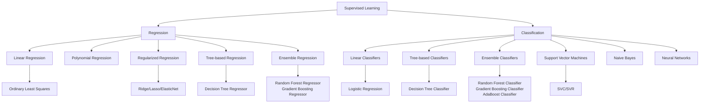

### Ensemble Methods Architecture

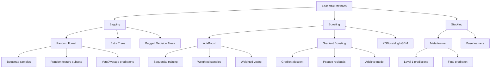

### Support Vector Machine Geometry

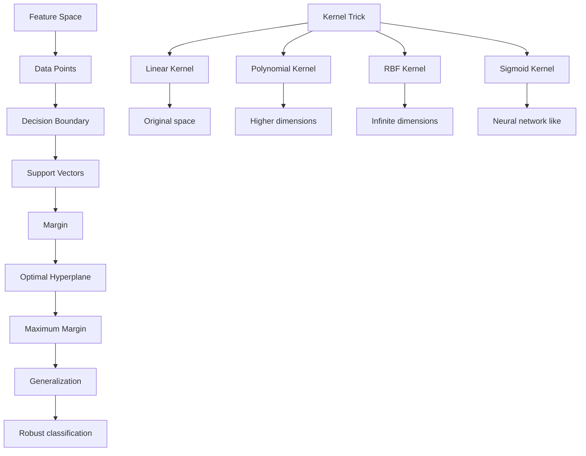

## Unsupervised Learning

### Clustering Algorithm Comparison

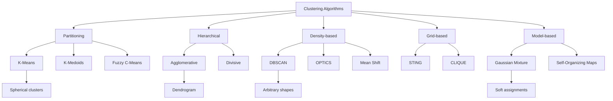

### Dimensionality Reduction Techniques

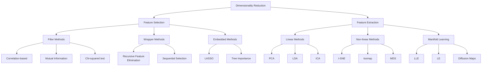

### Principal Component Analysis (PCA)

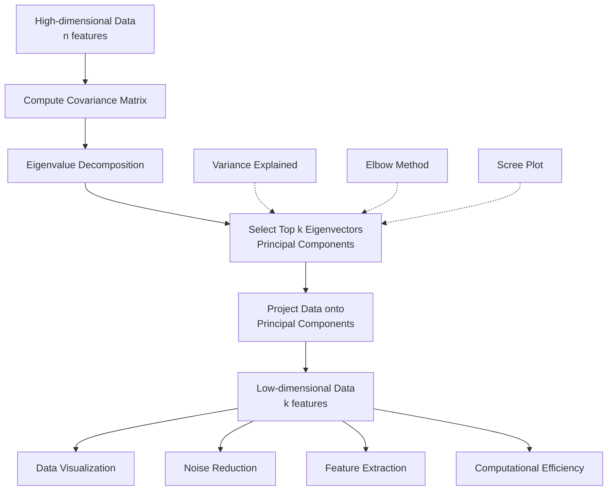

## Model Evaluation Framework

### Cross-Validation Strategies

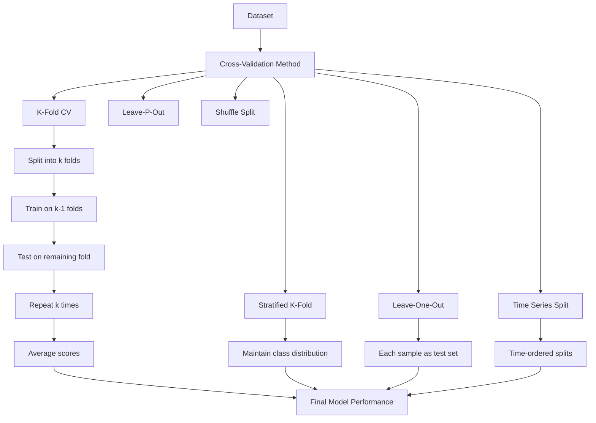

### Classification Metrics Visualization

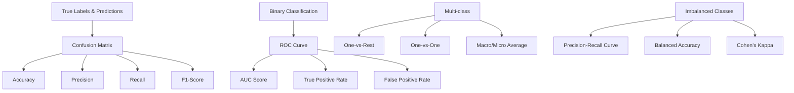

### Hyperparameter Tuning Visualization

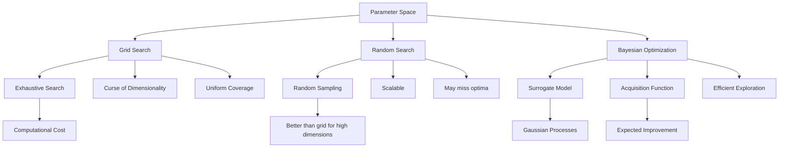

## Pipeline Architecture

### Scikit-learn Pipeline Flow

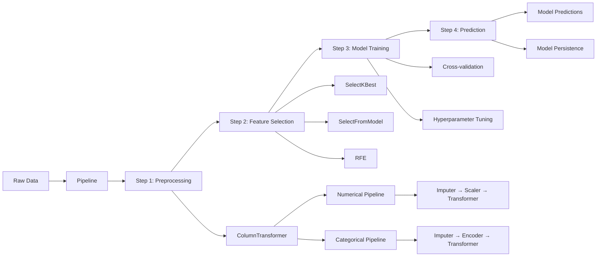

### ColumnTransformer Architecture

```mermaid
graph TD
    A[Mixed DataFrame] --> B[ColumnTransformer]

    B --> C[Transformers List]
    C --> D[('num', numeric_pipeline, numeric_cols)]
    C --> E[('cat', categorical_pipeline, categorical_cols)]
    C --> F[('passthrough', 'passthrough', passthrough_cols)]

    D --> G[Numerical Pipeline]
    G --> H[SimpleImputer(strategy='median')]
    G --> I[StandardScaler()]

    E --> J[Categorical Pipeline]
    J --> K[SimpleImputer(strategy='constant')]
    J --> L[OneHotEncoder(handle_unknown='ignore')]

    F --> M[No transformation]

    H --> N[Concatenated Output]
    I --> N
    K --> N
    L --> N
    M --> N

    N --> O[Final Feature Matrix]
```

## Model Selection and Validation

### Model Comparison Workflow

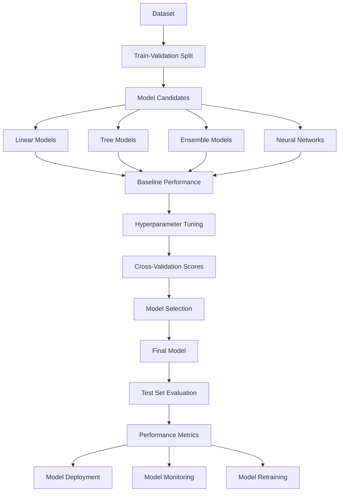

### Learning Curve Analysis

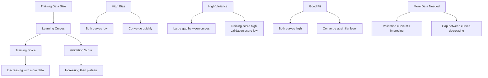

## Advanced Topics

### Handling Imbalanced Data

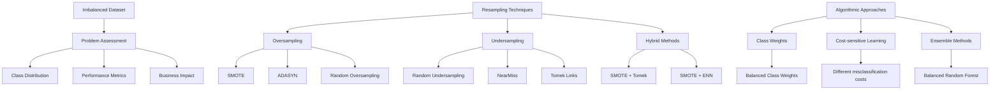

### Feature Engineering Pipeline

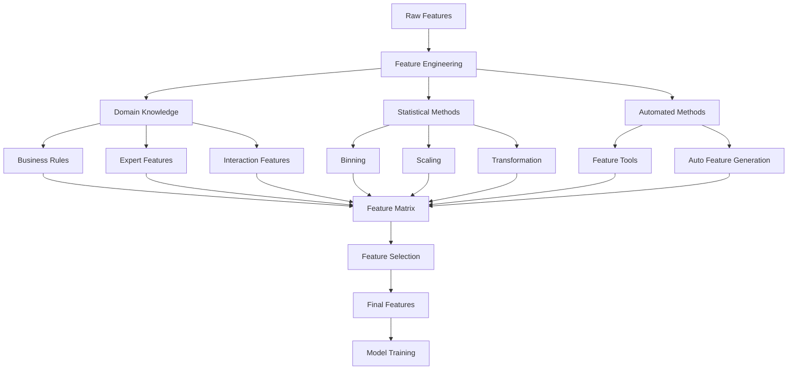

### Model Interpretability

```mermaid
graph TD
    A[Trained Model] --> B[Global Interpretability]
    A --> C[Local Interpretability]

    B --> D[Feature Importance]
    B --> E[Partial Dependence]
    B --> F[Permutation Importance]

    C --> G[LIME]
    C --> H[SHAP]
    C --> I[Anchors]

    D --> J[Tree-based models]
    D --> K[Linear models]
    D --> L[Permutation feature<br/>importance]

    E --> M[PDP plots]
    E --> N[ICE plots]

    F --> O[Model-agnostic]

    G --> P[Local explanations]
    H --> Q[Shapley values]
    I --> R[High-precision rules]
```

## Production Deployment

### Model Serving Architecture

```mermaid
graph TD
    A[Training Environment] --> B[Model Training]
    B --> C[Model Validation]
    C --> D[Model Serialization]

    D --> E[Model Registry]
    E --> F[Model Serving]

    F --> G[REST API]
    F --> H[Batch Prediction]
    F --> I[Streaming Prediction]

    G --> J[Flask/FastAPI]
    G --> K[Docker Container]
    G --> L[Kubernetes]

    M[Monitoring] --> N[Performance Metrics]
    M --> O[Data Drift Detection]
    M --> P[Model Retraining]

    N --> Q[Accuracy]
    N --> R[Latency]
    N --> S[Throughput]

    O --> T[Statistical Tests]
    O --> U[Distribution Comparison]
```

### MLOps Pipeline

```mermaid
graph LR
    A[Data Collection] --> B[Data Validation]
    B --> C[Data Preparation]
    C --> D[Model Training]
    D --> E[Model Validation]
    E --> F[Model Testing]
    F --> G[Model Deployment]
    G --> H[Model Monitoring]
    H --> I[Model Retraining]

    J[Version Control] -.-> B
    J -.-> C
    J -.-> D
    J -.-> E
    J -.-> F
    J -.-> G

    K[CI/CD] -.-> D
    K -.-> F
    K -.-> G

    L[Experiment Tracking] -.-> D
    L -.-> E

    M[Model Registry] -.-> E
    M -.-> G
```

This comprehensive visual architecture covers Scikit-learn's core components, data processing pipelines, machine learning algorithms, evaluation frameworks, and production deployment patterns. The diagrams illustrate the relationships between different components and provide a clear understanding of how Scikit-learn organizes machine learning workflows.
