# Apache Kafka: Visual Guide

## Architecture Diagrams

### Kafka Cluster Architecture

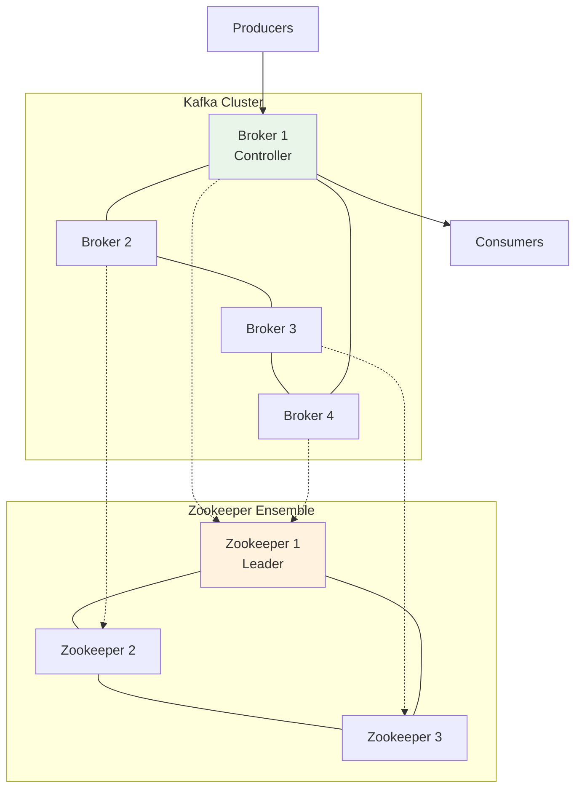

### Topic Partitioning and Replication

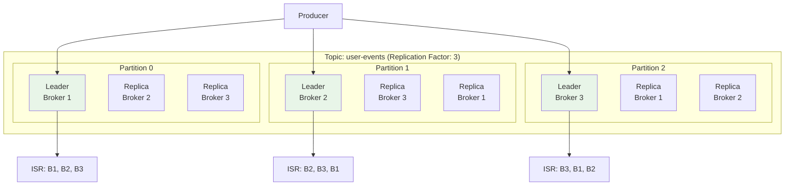

### Producer-Consumer Flow

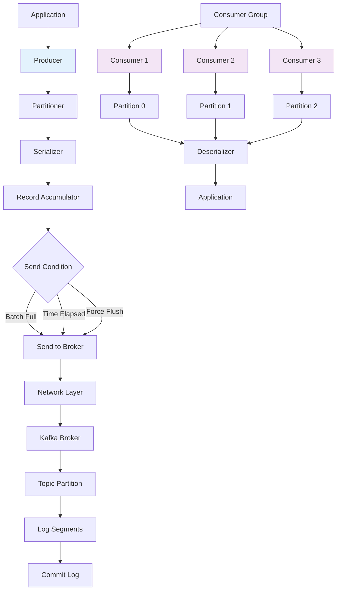

## Consumer Patterns

### Consumer Group Rebalancing

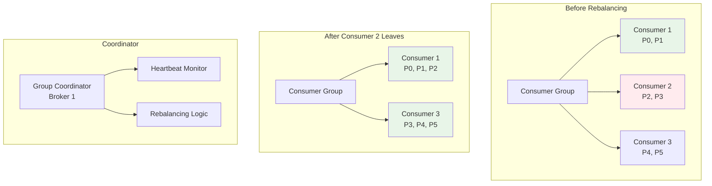

### Consumer Offset Management

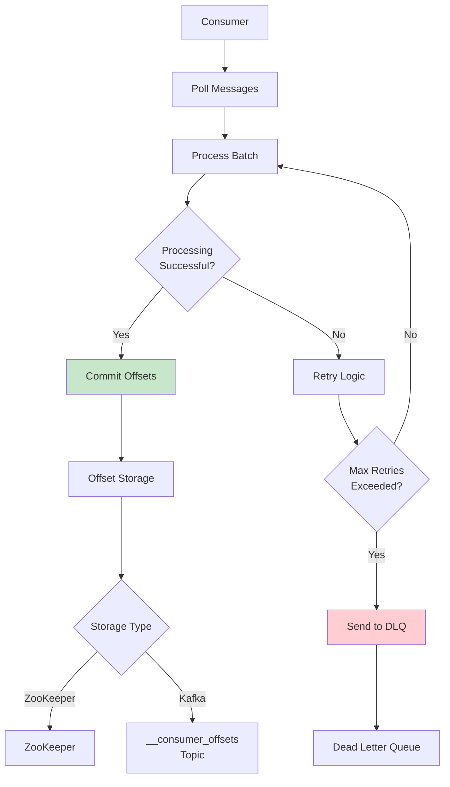

## Stream Processing

### Kafka Streams Topology

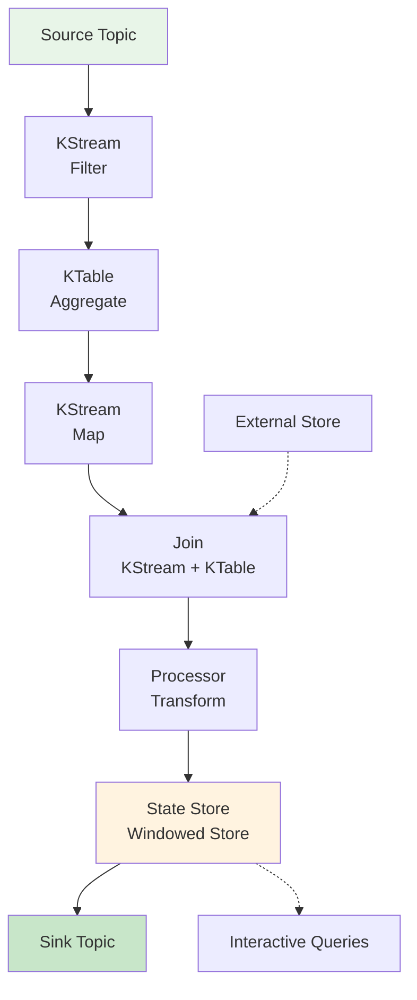

### Stream Processing Patterns

```mermaid
graph TD
    subgraph "Event Filtering"
        A1[Input Stream] --> B1[Filter Predicate]
        B1 --> C1[Filtered Stream]
    end

    subgraph "Event Aggregation"
        A2[Input Stream] --> B2[Window Function]
        B2 --> C2[Group By Key]
        C2 --> D2[Aggregate]
        D2 --> E2[Aggregated Stream]
    end

    subgraph "Stream Join"
        A3[Stream A] --> C3[Join]
        A4[Stream B] --> C3
        C3 --> D3[Joined Stream]
    end

    subgraph "Event Enrichment"
        A5[Input Stream] --> B5[Lookup<br/>External Data]
        B5 --> C5[Enrich Event]
        C5 --> D5[Enriched Stream]
    end

    style A1 fill:#e3f2fd
    style A2 fill:#f3e5f5
    style A3 fill:#fff3e0
    style A5 fill:#e8f5e8
```

### Windowing Operations

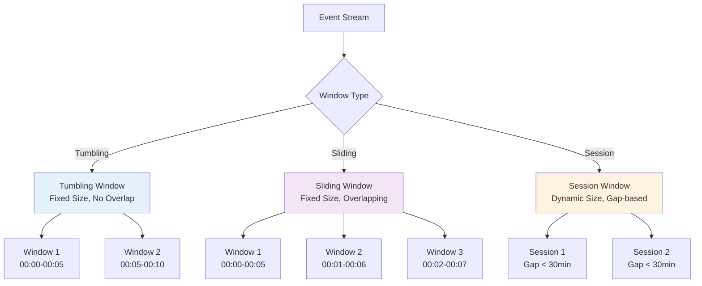

## Kafka Connect

### Connect Architecture

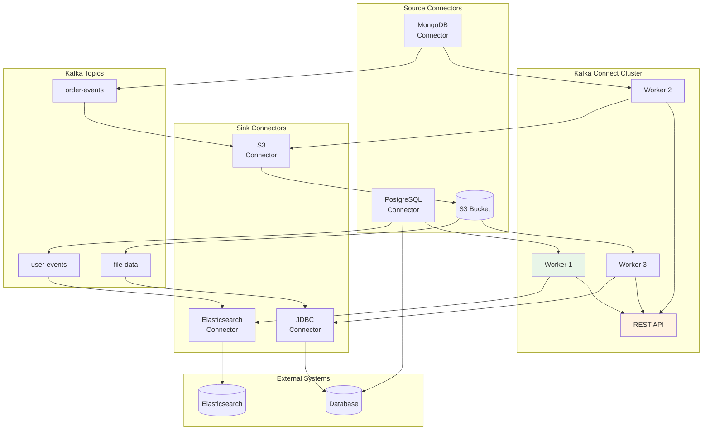

### Connector Lifecycle

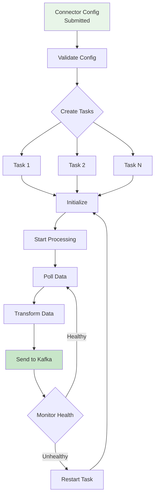

## Schema Registry

### Schema Evolution

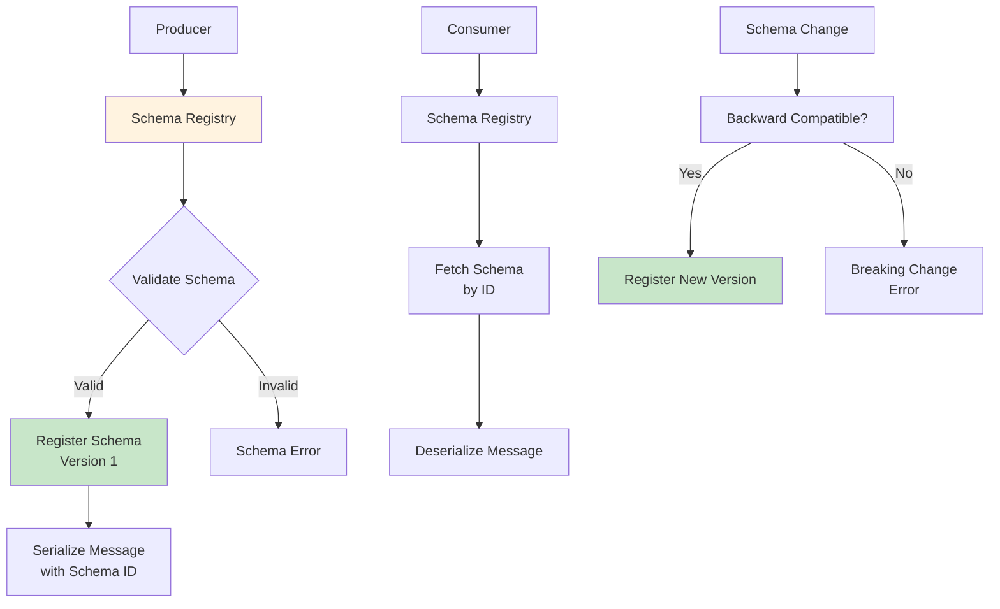

### Schema Compatibility Modes

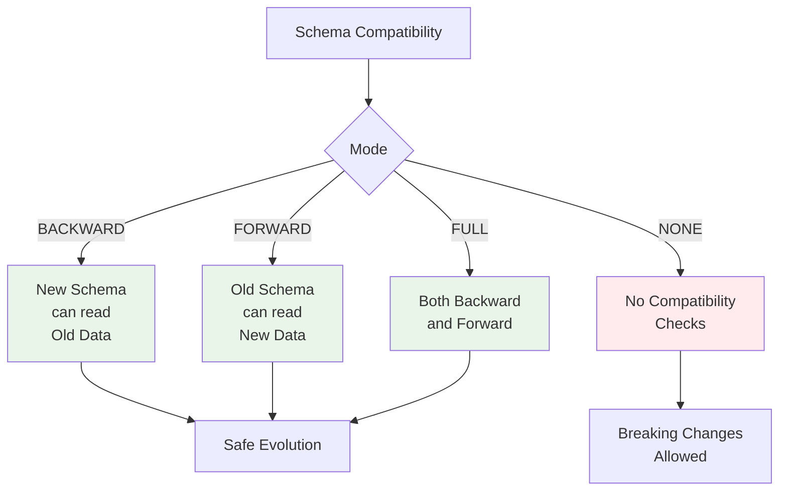

## Monitoring and Operations

### Kafka Metrics Dashboard

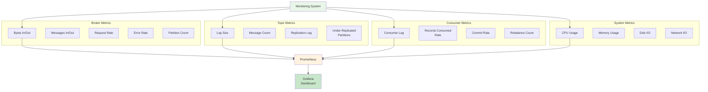

### Alerting Rules

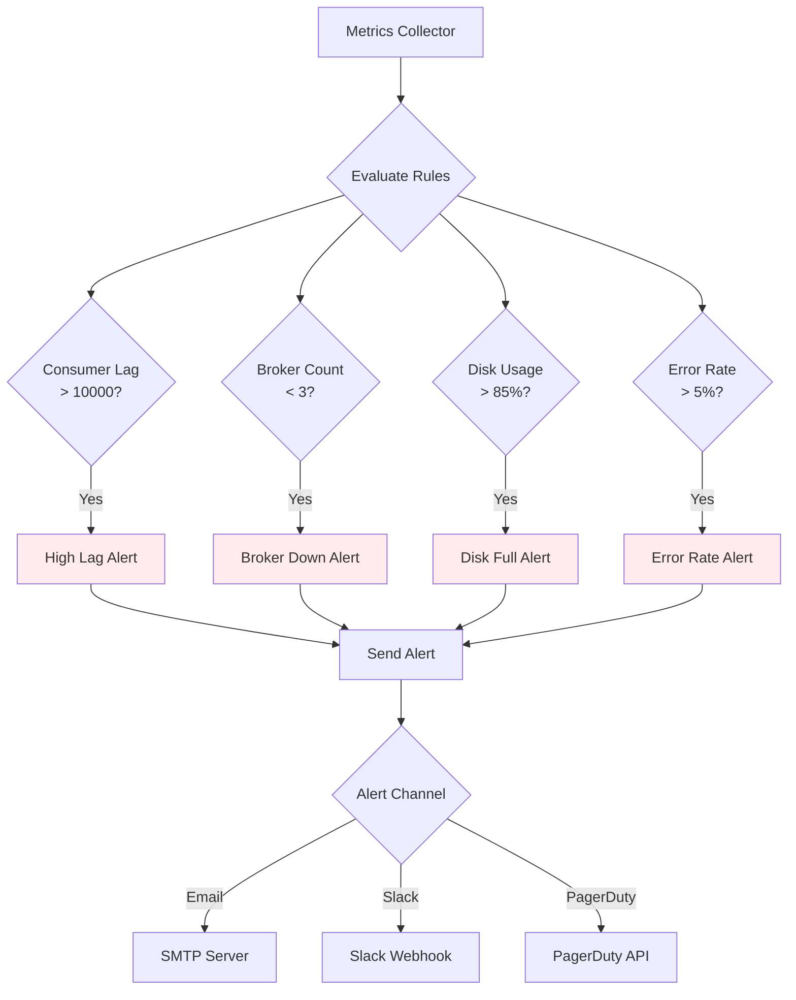

## Deployment Patterns

### Multi-Cluster Architecture

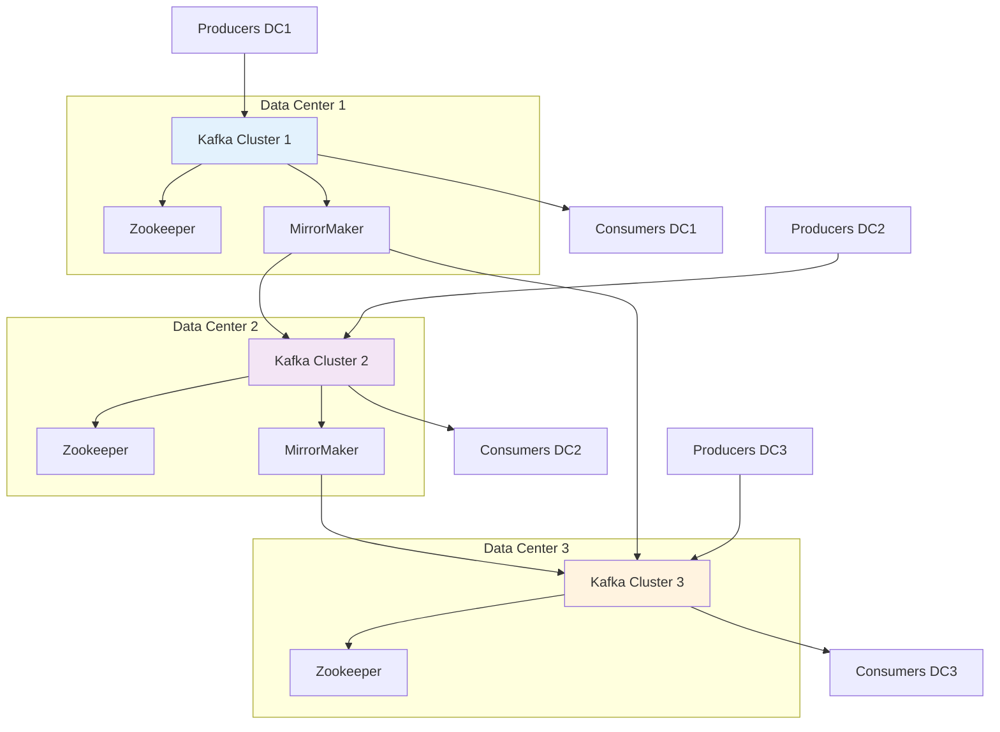

### Kubernetes Deployment

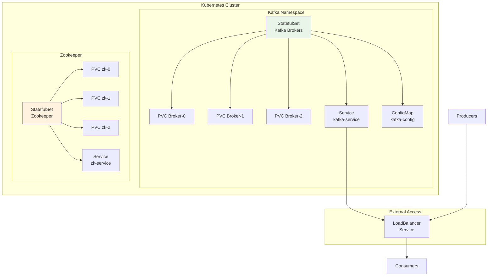

### Tiered Storage Architecture

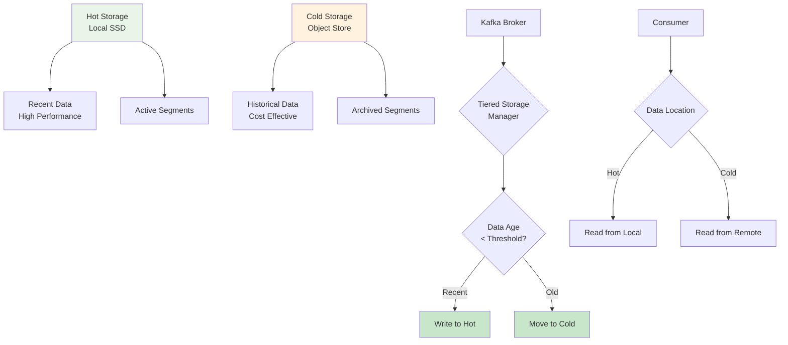

## Security Architecture

### Authentication and Authorization

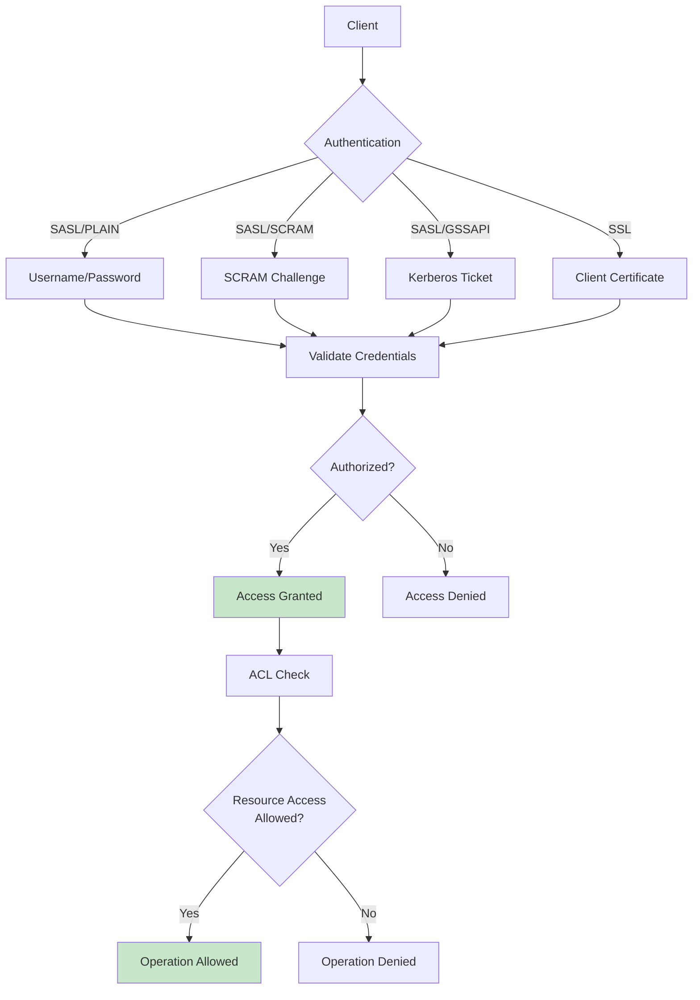

### End-to-End Encryption

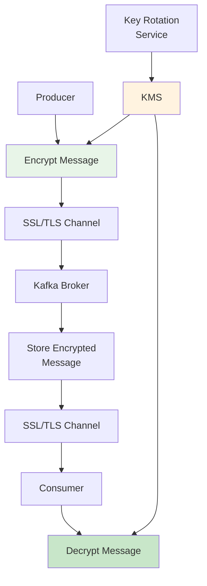

## Performance Optimization

### Throughput Optimization

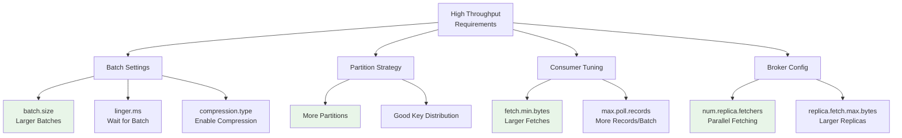

### Latency Optimization

```mermaid
graph TD
    A[Low Latency<br/>Requirements] --> B[Producer Settings]

    B --> C[acks=1<br/>Leader Only]
    B --> D[compression.type=none<br/>No Compression]
    B --> E[batch.size=0<br/>No Batching]

    A --> F[Consumer Settings]
    F --> G[fetch.min.bytes=1<br/>Immediate Fetch]
    F --> H[max.poll.records=1<br/>Single Record]

    A --> I[Broker Settings]
    I --> J[num.partitions<br/>Fewer Partitions]
    I --> K[replica.lag.time.max.ms<br/>Tighter Lag]

    A --> L[Network]
    L --> M[Dedicated Network]
    L --> N[Close Proximity]

    style C fill:#e8f5e8
    style G fill:#e8f5e8
    style J fill:#e8f5e8
    style M fill:#e8f5e8
```

## Disaster Recovery

### Backup and Recovery

```mermaid
graph TD
    A[Primary Cluster] --> B[MirrorMaker 2]
    B --> C[Backup Cluster]

    A --> D[Regular Backups]
    D --> E[S3/GCS Backup]

    F[Disaster Event] --> G{Failover<br/>Required?}

    G -->|Yes| H[Stop Primary]
    H --> I[Promote Backup]
    I --> J[Update DNS/Clients]

    G -->|No| K[Continue Normal<br/>Operation]

    L[Recovery Complete] --> M[Rebuild Primary]
    M --> N[Resync Data]
    N --> O[Failback]

    style A fill:#e8f5e8
    style C fill:#fff3e0
    style I fill:#c8e6c9
```

### Cross-Region Replication

```mermaid
graph TD
    subgraph "Region 1 (Primary)"
        K1[Kafka Cluster]
        MM1[MirrorMaker]
        P1[Producers]
        C1[Consumers]
    end

    subgraph "Region 2 (DR)"
        K2[Kafka Cluster]
        MM2[MirrorMaker]
        P2[Producers]
        C2[Consumers]
    end

    P1 --> K1
    K1 --> C1
    K1 --> MM1
    MM1 --> K2
    K2 --> C2

    P2 --> K2
    K2 --> MM2
    MM2 --> K1

    RTO[RTO: 1 hour] --> DR[DR Strategy]
    RPO[RPO: 5 minutes] --> DR

    style K1 fill:#e8f5e8
    style K2 fill:#fff3e0
```

This visual guide provides comprehensive diagrams covering Apache Kafka's architecture, data flow patterns, deployment strategies, monitoring approaches, and operational best practices. Each diagram illustrates complex concepts in an accessible way, helping developers and operators understand Kafka's fundamental building blocks and advanced features for building robust event streaming systems.
