# FastAPI Visual Guide

## Request-Response Flow

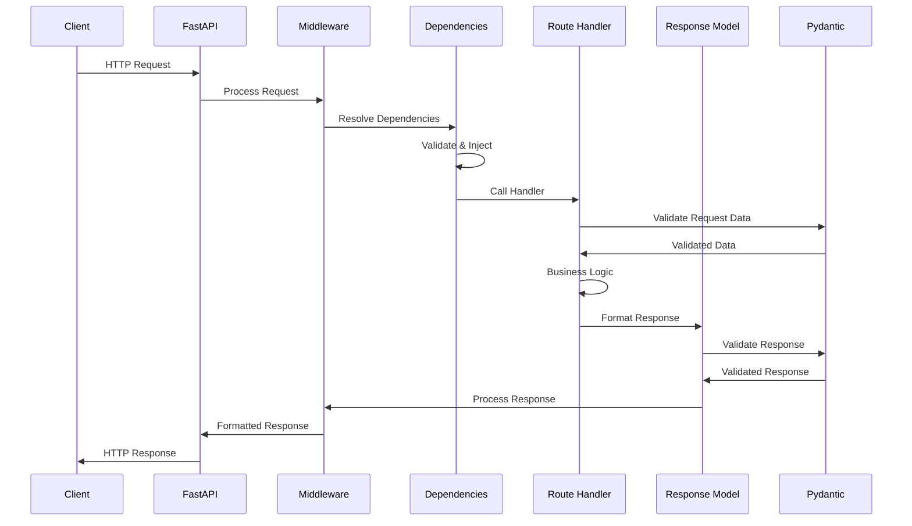

## FastAPI Architecture Layers

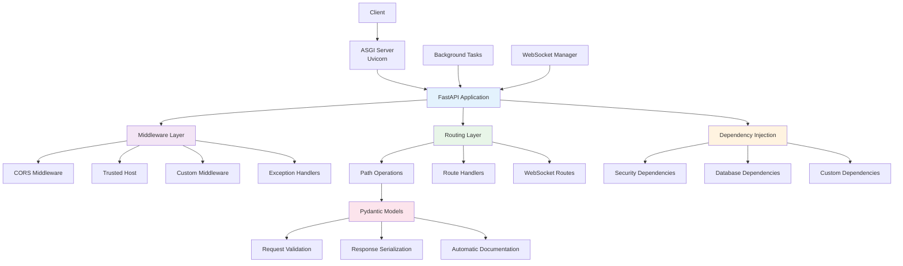

## Dependency Injection Flow

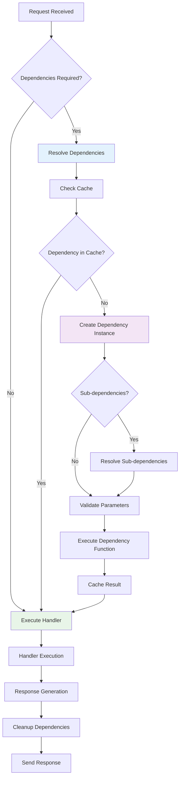

## API Endpoint Structure

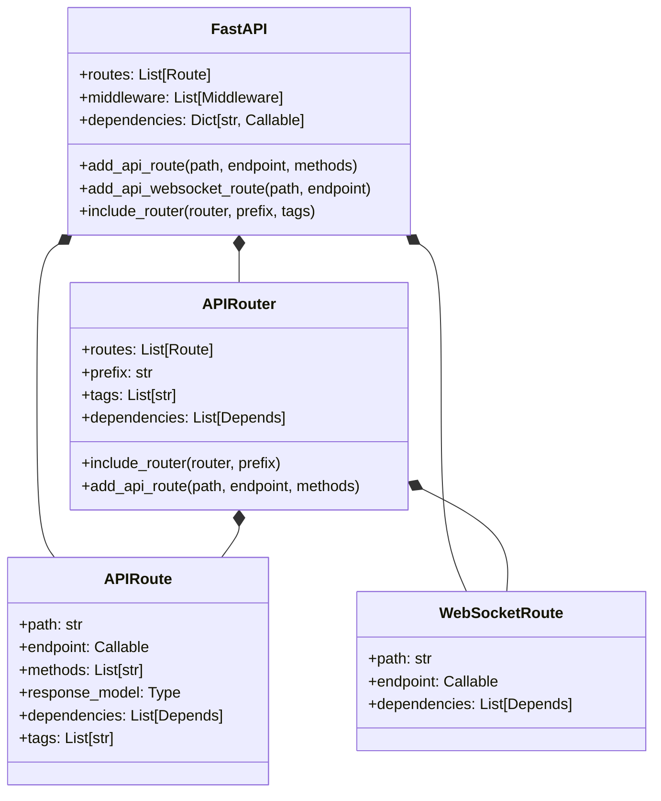

## Pydantic Model Validation

```mermaid
graph LR
    A[Raw JSON Data] --> B[Pydantic Model]
    B --> C[Field Validation]
    C --> D[Type Conversion]
    D --> E[Constraint Checking]
    E --> F[Custom Validators]
    F --> G{Valid?}
    G -->|Yes| H[Validated Model Instance]
    G -->|No| I[ValidationError]

    H --> J[Access via .dict()]
    H --> K[Access via .json()]
    H --> L[Field Values]

    I --> M[Error Details]
    M --> N[Field Errors]
    M --> O[Constraint Violations]

    style B fill:#e3f2fd
    style C fill:#f3e5f5
    style H fill:#e8f5e8
    style I fill:#ffebee
```

## Authentication & Security Flow

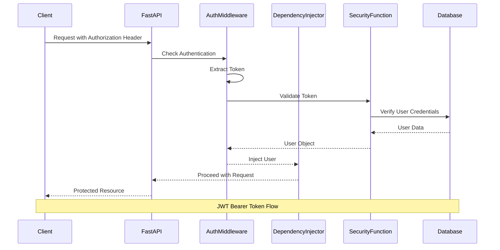

## Middleware Stack

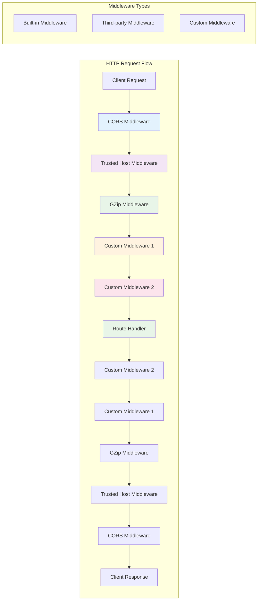

## Background Tasks Architecture

```mermaid
graph TD
    A[HTTP Request] --> B[Route Handler]
    B --> C[Business Logic]
    C --> D[BackgroundTasks.add_task()]
    D --> E[Task Queue]

    E --> F[Task Executor]
    F --> G[Async Task Execution]

    G --> H[Database Operations]
    G --> I[File Operations]
    G --> J[Email Sending]
    G --> K[External API Calls]

    L[Task Completion] --> M[Optional Callback]
    M --> N[Logging]
    M --> O[Metrics Update]

    P[Exception Handling] --> Q[Retry Logic]
    Q --> R[Dead Letter Queue]
    R --> S[Alert System]

    style D fill:#e3f2fd
    style E fill:#f3e5f5
    style F fill:#e8f5e8
    style G fill:#fff3e0
```

## WebSocket Connection Lifecycle

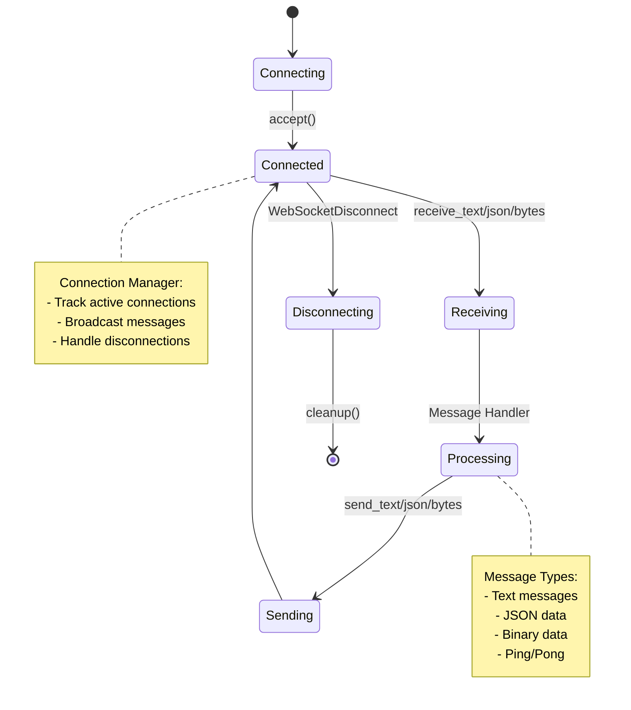

## Testing Pyramid

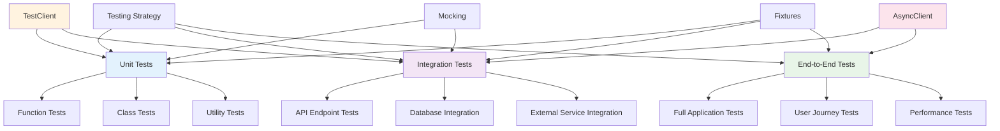

## Deployment Architecture

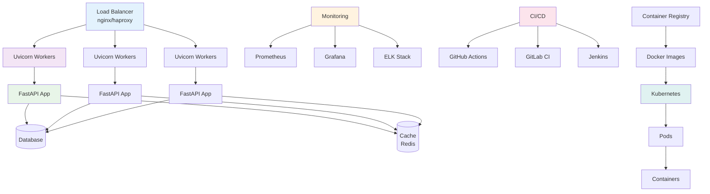

## Error Handling Flow

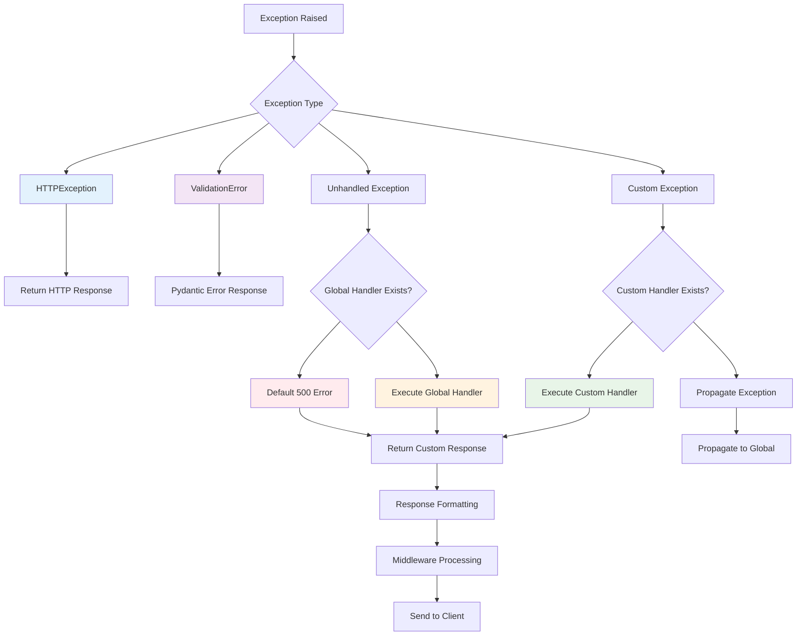

## Performance Optimization

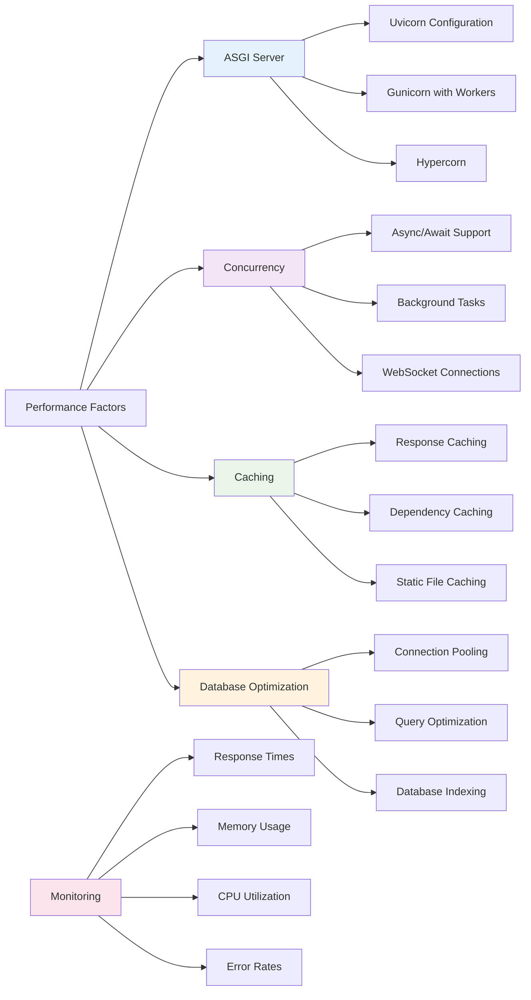

## API Documentation Generation

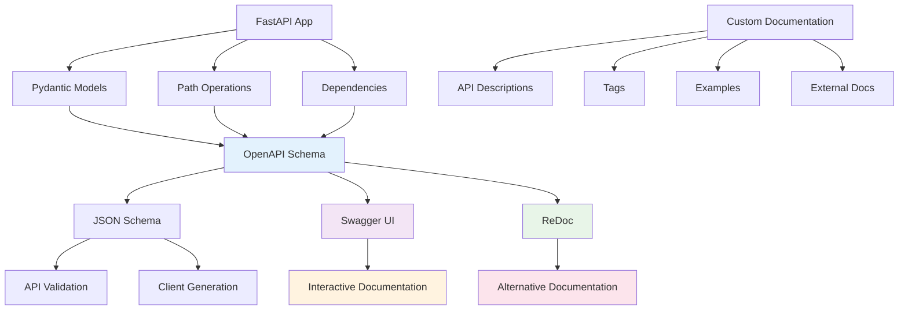

These diagrams provide a comprehensive visual representation of FastAPI's architecture, request flow, dependency injection system, and various features. The visualizations help understand how FastAPI processes requests, manages dependencies, handles authentication, and scales in production environments.
