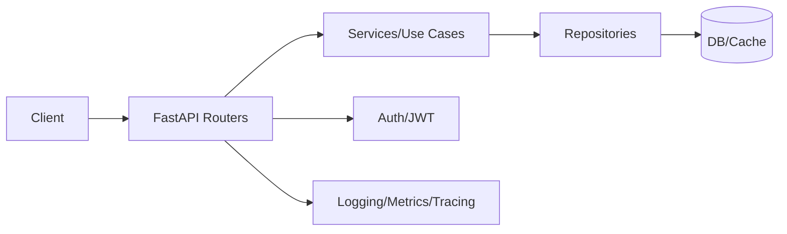

# FastAPI Guide – Basic → Architect

## Level 1 – Launch & Basics

### 1. Quick Setup
```bash
pip install fastapi uvicorn[standard]
uvicorn app:app --reload
```

### 2. First API
```python
from fastapi import FastAPI
app = FastAPI()

@app.get("/ping")
def ping():
    return {"pong": True}
```

### 3. Core Concepts
- Path/query/body params; validation via Pydantic models
- Dependency injection; response models; status codes
- Auto docs (Swagger/Redoc)

## Level 2 – Production Patterns

### Data & Validation
- Pydantic models with validators; settings management
- Error handling: HTTPException; custom handlers
- Serialization: response_model for contracts

### Auth & Security
- OAuth2/JWT flows; password hashing; scopes
- CORS; rate limiting via middleware/gateway

### Performance & Async
- Use async endpoints for I/O; avoid blocking calls
- DB access with async drivers (asyncpg, motor) or sync in threads

## Level 3 – Architect Playbook

### Architecture
- Layered structure: api/routers, services, repositories, schemas
- Dependency-injected services; config via env/settings
- Background tasks; Celery/RQ for heavy async work

### Observability & Ops
- Logging with structlog/loguru; request IDs
- Metrics via Prometheus/OTel; tracing with OTel
- Health/readiness endpoints; graceful shutdown

### Security & Quality
- Security headers (via middleware); input sanitization
- Testing: pytest + httpx; contract tests
- CI: lint/format/test/typecheck (ruff/black/mypy/pytest)

## Ops Cheat Sheet

| Task | Command | Note |
| --- | --- | --- |
| Run dev | `uvicorn app:app --reload` | hot reload |
| Run prod | `gunicorn -k uvicorn.workers.UvicornWorker app:app` | prod |
| Test | `pytest` | unit/integration |
| Lint | `ruff check .` | lint |
| Type | `mypy .` | types |

## Architecture Patterns



## Checklist Before Production
- [ ] Layered structure with routers/services/repos
- [ ] Pydantic validation; response models; error handlers
- [ ] Auth/JWT with hashed passwords; CORS configured
- [ ] Observability: logs, metrics, traces; request IDs
- [ ] CI: lint/format/type/test; security headers; rate limiting

