# Node.js Visual Architecture Guide

## Node.js Architecture Overview

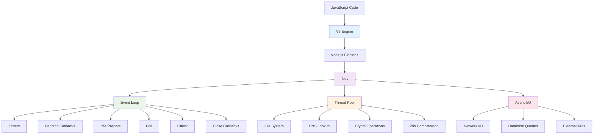

## Event Loop Phases

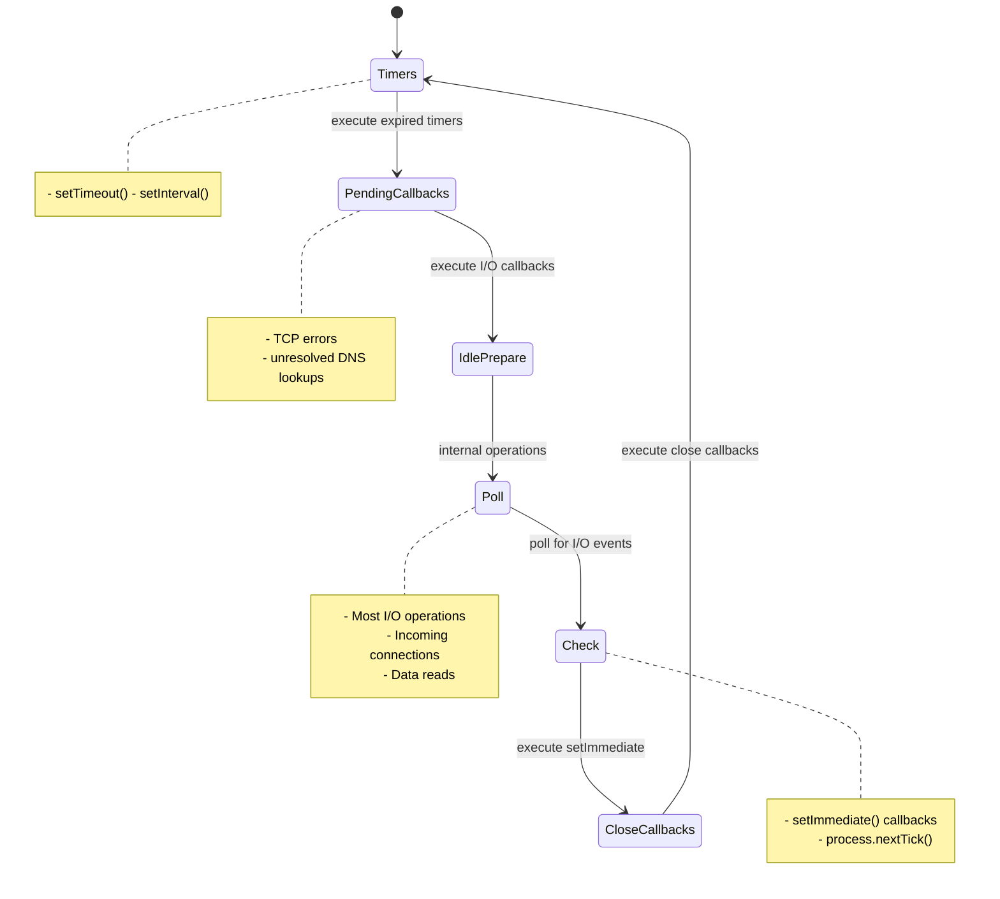

## Express.js Request-Response Flow

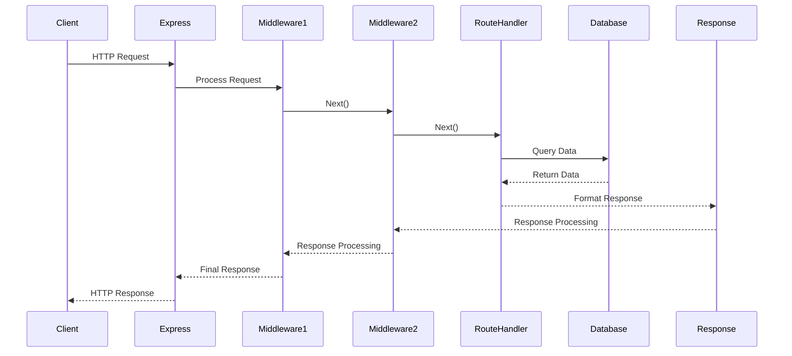

## Middleware Stack Architecture

```mermaid
graph LR
    A[Client Request] --> B[CORS Middleware]
    B --> C[Body Parser<br/>express.json()]
    C --> D[Cookie Parser]
    D --> E[Session Middleware]
    E --> F[Authentication<br/>JWT Verify]
    F --> G[Authorization<br/>Role Check]
    G --> H[Logging<br/>Morgan]
    H --> I[Route Handler]
    I --> J[Error Handler]
    J --> K[Response<br/>to Client]

    style B fill:#e3f2fd
    style E fill:#f3e5f5
    style G fill:#e8f5e8
    style I fill:#fff3e0
    style J fill:#ffebee
```

## REST API Architecture

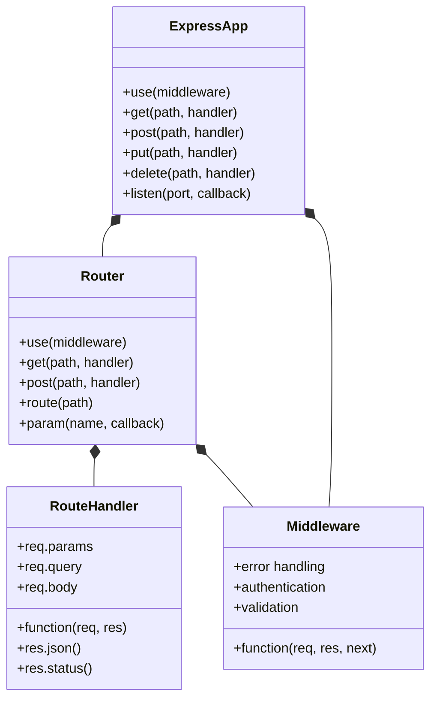

## Database Integration Patterns

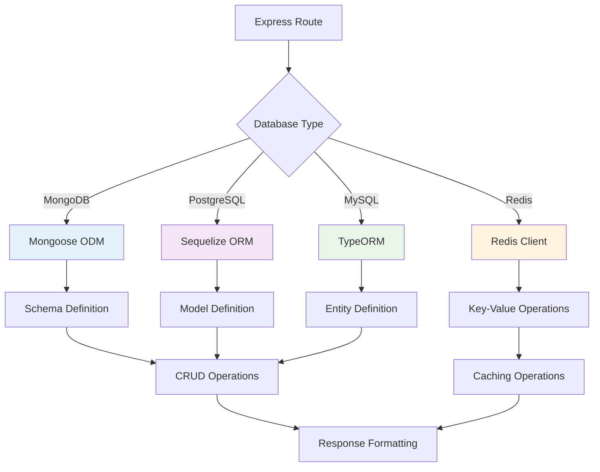

## Authentication Flow

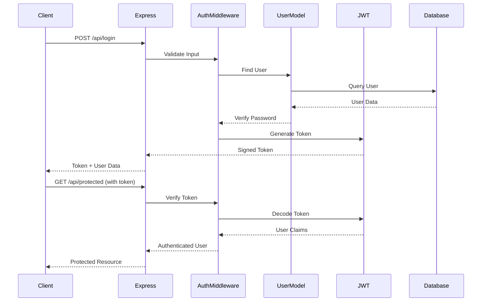

## File Upload Architecture

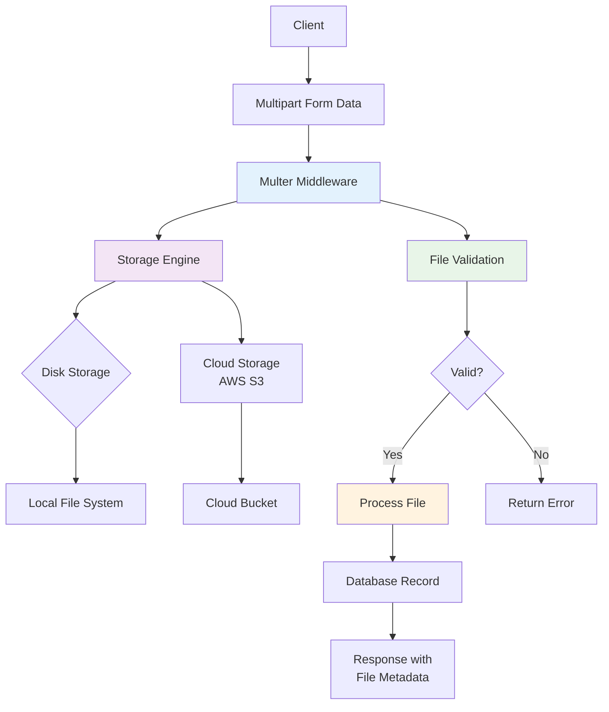

## Real-time Communication with Socket.io

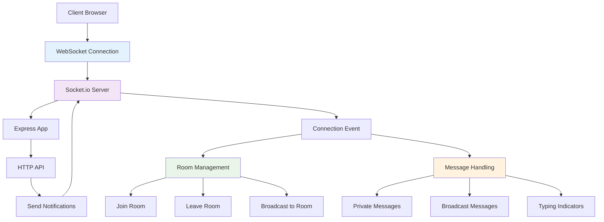

## Error Handling Flow

```mermaid
flowchart TD
    A[Error Occurs] --> B{Error Type}
    B --> C[Synchronous Error]
    B --> D[Asynchronous Error]
    B --> E[Promise Rejection]
    B --> F[Unhandled Exception]

    C --> G[Express Error Handler]
    D --> H[Callback Error]
    E --> I[catch() Block]
    F --> J[process.on('uncaughtException')]

    G --> K[Error Response]
    H --> L[Callback Function]
    I --> M[Error Handling Logic]
    J --> N[Graceful Shutdown]

    K --> O[Client Response]
    L --> O
    M --> O
    N --> P[Process Exit]

    style G fill:#e3f2fd
    style H fill:#f3e5f5
    style I fill:#e8f5e8
    style J fill:#ffebee
```

## Testing Pyramid

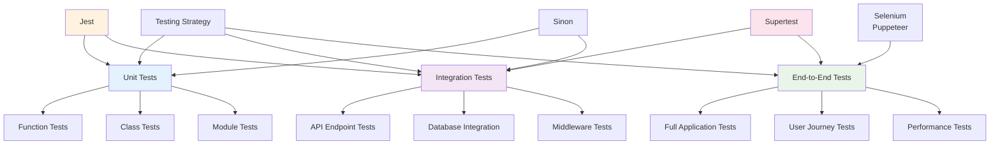

## Deployment Architecture

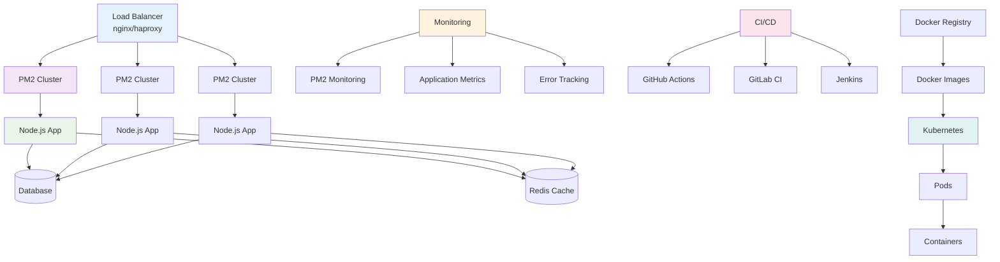

## Performance Optimization

```mermaid
graph TD
    A[Performance Factors] --> B[Code Optimization]
    A --> C[Memory Management]
    A --> D[Caching Strategies]
    A --> E[Database Optimization]

    B --> B1[Algorithm Efficiency]
    B --> B2[Async/Await Usage]
    B --> B3[Stream Processing]

    C --> C1[Garbage Collection]
    C --> C2[Memory Leaks Prevention]
    C --> C3[Object Pooling]

    D --> D1[Response Caching]
    D --> D2[Database Query Caching]
    D --> D3[Static Asset Caching]

    E --> E1[Connection Pooling]
    E --> E2[Query Optimization]
    E --> E3[Indexing Strategy]

    F[Monitoring] --> F1[Response Times]
    F --> F2[Memory Usage]
    F --> F3[CPU Utilization]
    F --> F4[Error Rates]

    style B fill:#e3f2fd
    style C fill:#f3e5f5
    style D fill:#e8f5e8
    style E fill:#fff3e0
    style F fill:#fce4ec
```

## Microservices Architecture

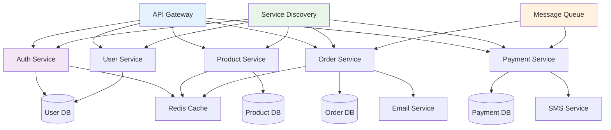

## Security Layers

```mermaid
graph LR
    A[Client Request] --> B[HTTPS/TLS]
    B --> C[Rate Limiting]
    C --> D[Input Validation]
    D --> E[CORS Policy]
    E --> F[Authentication]
    F --> G[Authorization]
    G --> H[Data Sanitization]
    H --> I[Output Encoding]
    I --> J[Security Headers]
    J --> K[Application Logic]

    style B fill:#e3f2fd
    style D fill:#f3e5f5
    style F fill:#e8f5e8
    style H fill:#fff3e0
    style J fill:#fce4ec
```

## Package Management Flow

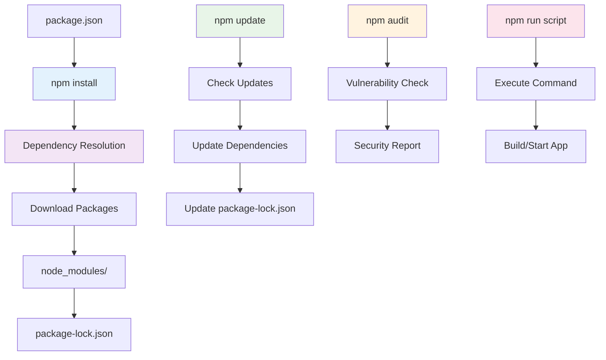

These diagrams provide a comprehensive visual representation of Node.js architecture, from the core event loop mechanics to complex deployment patterns and microservices architectures. Understanding these visual flows is crucial for building scalable and maintainable Node.js applications.
