# Python Backend Architecture Guide

## Flask Application Architecture

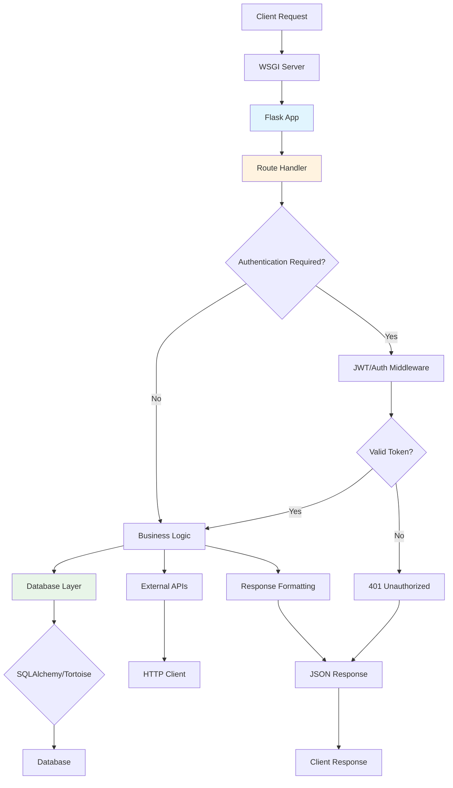
```mermaid
graph TD
    A[Client Request] --> B[WSGI Server]
    B --> C[Flask App]
    C --> D[Route Handler]
    D --> E{Authentication Required?}

    E -->|Yes| F[JWT/Auth Middleware]
    E -->|No| G[Business Logic]

    F --> H{Valid Token?}
    H -->|Yes| G
    H -->|No| I[401 Unauthorized]

    G --> J[Database Layer]
    J --> K{SQLAlchemy/Tortoise}
    K --> L[Database]

    G --> M[External APIs]
    M --> N[HTTP Client]

    G --> O[Response Formatting]
    O --> P[JSON Response]

    I --> P
    P --> Q[Client Response]

    style C fill:#e1f5fe
    style D fill:#fff3e0
    style J fill:#e8f5e8
```

## Django Application Architecture

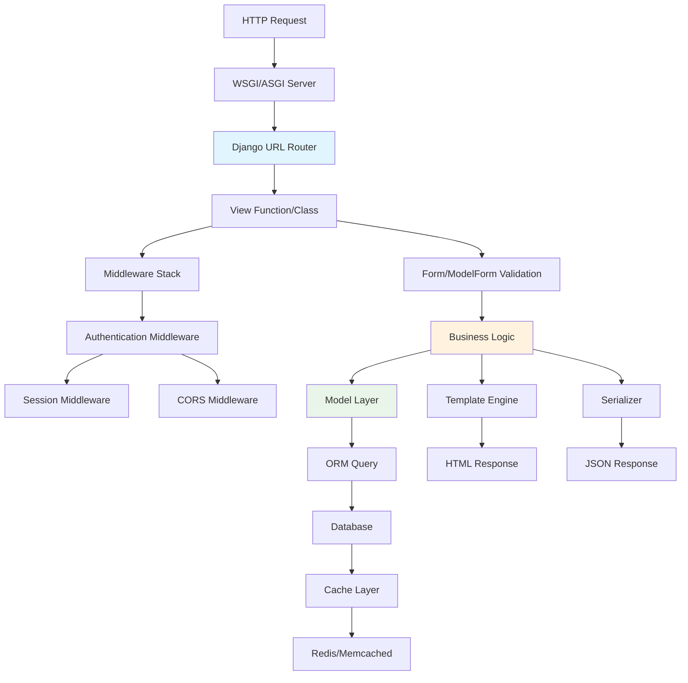
```mermaid
graph TD
    A[HTTP Request] --> B[WSGI/ASGI Server]
    B --> C[Django URL Router]
    C --> D[View Function/Class]
    D --> E[Middleware Stack]

    E --> F[Authentication Middleware]
    F --> G[Session Middleware]
    F --> H[CORS Middleware]

    D --> I[Form/ModelForm Validation]
    I --> J[Business Logic]

    J --> K[Model Layer]
    K --> L[ORM Query]
    L --> M[Database]

    J --> N[Template Engine]
    N --> O[HTML Response]

    J --> P[Serializer]
    P --> Q[JSON Response]

    M --> R[Cache Layer]
    R --> S[Redis/Memcached]

    style C fill:#e1f5fe
    style K fill:#e8f5e8
    style J fill:#fff3e0
```

## FastAPI Application Architecture

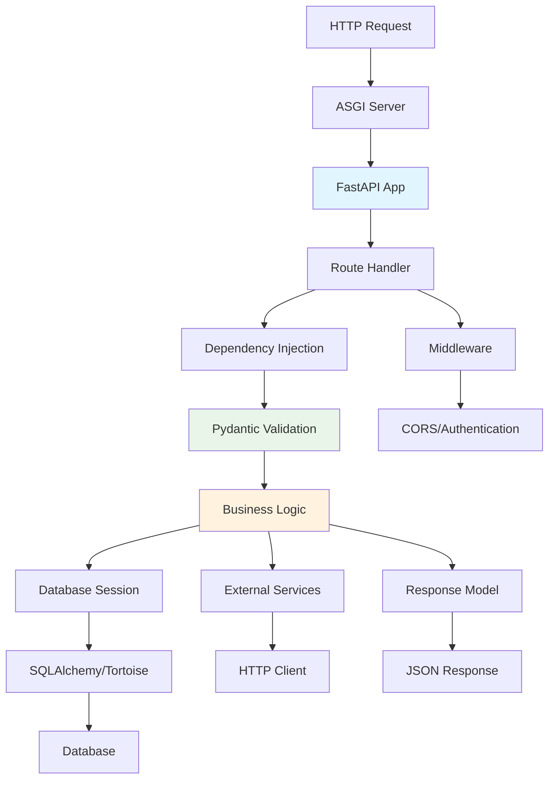
```mermaid
graph TD
    A[HTTP Request] --> B[ASGI Server]
    B --> C[FastAPI App]
    C --> D[Route Handler]
    D --> E[Dependency Injection]

    E --> F[Pydantic Validation]
    F --> G[Business Logic]

    G --> H[Database Session]
    H --> I[SQLAlchemy/Tortoise]
    I --> J[Database]

    G --> K[External Services]
    K --> L[HTTP Client]

    G --> M[Response Model]
    M --> N[JSON Response]

    D --> O[Middleware]
    O --> P[CORS/Authentication]

    style C fill:#e1f5fe
    style F fill:#e8f5e8
    style G fill:#fff3e0
```

## Database Layer Architecture

### SQLAlchemy ORM Architecture

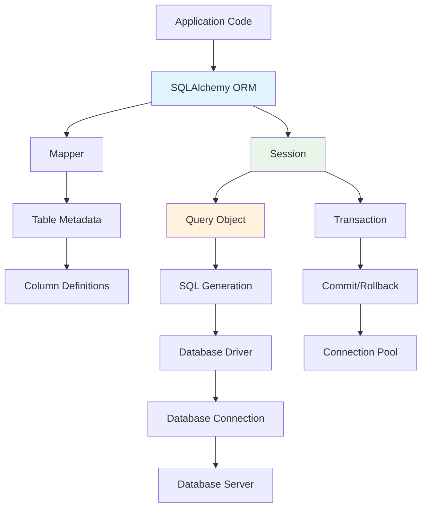
```mermaid
graph TD
    A[Application Code] --> B[SQLAlchemy ORM]
    B --> C[Session]
    C --> D[Transaction]

    B --> E[Mapper]
    E --> F[Table Metadata]
    F --> G[Column Definitions]

    C --> H[Query Object]
    H --> I[SQL Generation]
    I --> J[Database Driver]

    J --> K[Database Connection]
    K --> L[Database Server]

    D --> M[Commit/Rollback]
    M --> N[Connection Pool]

    style B fill:#e1f5fe
    style C fill:#e8f5e8
    style H fill:#fff3e0
```

### Django ORM Architecture

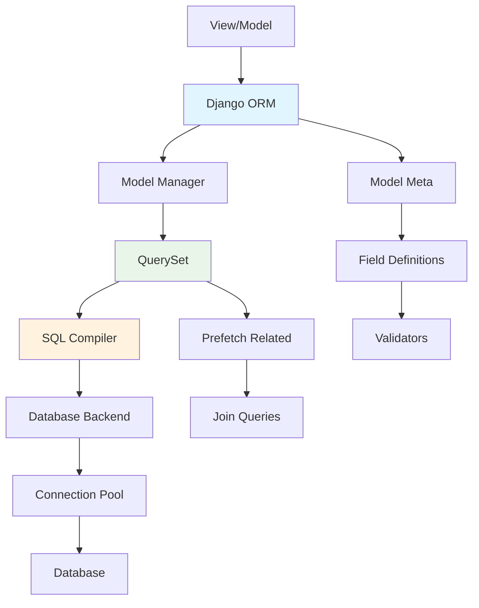
```mermaid
graph TD
    A[View/Model] --> B[Django ORM]
    B --> C[Model Manager]
    C --> D[QuerySet]

    D --> E[SQL Compiler]
    E --> F[Database Backend]

    B --> G[Model Meta]
    G --> H[Field Definitions]
    H --> I[Validators]

    D --> J[Prefetch Related]
    J --> K[Join Queries]

    F --> L[Connection Pool]
    L --> M[Database]

    style B fill:#e1f5fe
    style D fill:#e8f5e8
    style E fill:#fff3e0
```

## Authentication & Authorization Flow

### JWT Authentication Flow

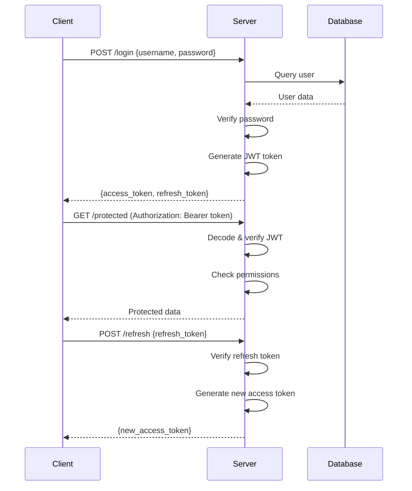
```mermaid
sequenceDiagram
    participant C as Client
    participant S as Server
    participant DB as Database

    C->>S: POST /login {username, password}
    S->>DB: Query user
    DB-->>S: User data
    S->>S: Verify password
    S->>S: Generate JWT token
    S-->>C: {access_token, refresh_token}

    C->>S: GET /protected (Authorization: Bearer token)
    S->>S: Decode & verify JWT
    S->>S: Check permissions
    S-->>C: Protected data

    C->>S: POST /refresh {refresh_token}
    S->>S: Verify refresh token
    S->>S: Generate new access token
    S-->>C: {new_access_token}
```

### Session-Based Authentication

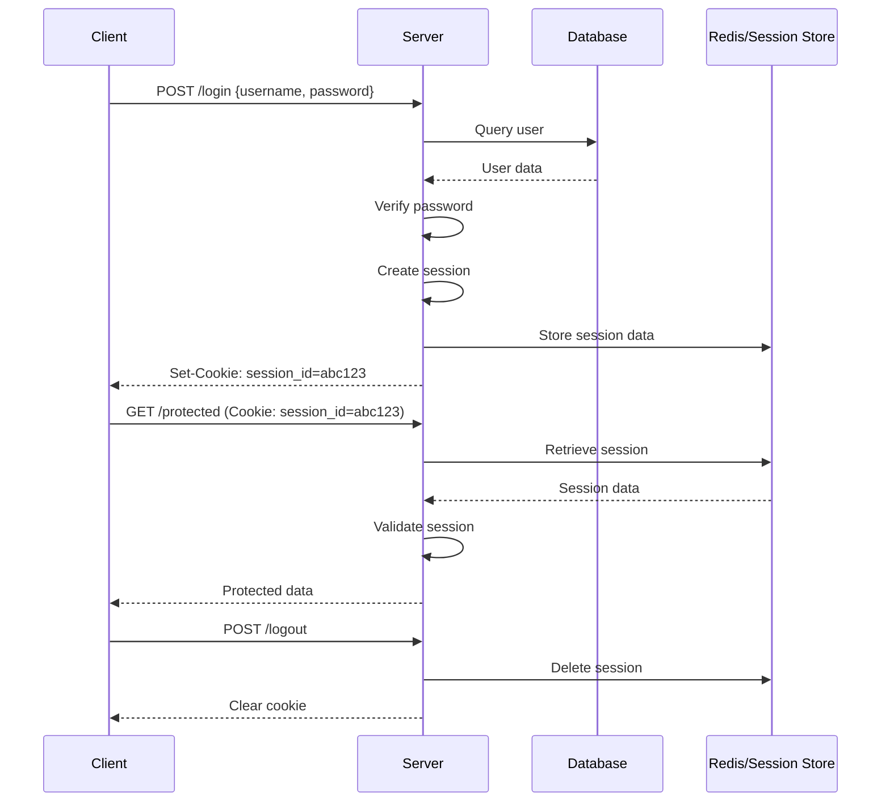
```mermaid
sequenceDiagram
    participant C as Client
    participant S as Server
    participant DB as Database
    participant R as Redis/Session Store

    C->>S: POST /login {username, password}
    S->>DB: Query user
    DB-->>S: User data
    S->>S: Verify password
    S->>S: Create session
    S->>R: Store session data
    S-->>C: Set-Cookie: session_id=abc123

    C->>S: GET /protected (Cookie: session_id=abc123)
    S->>R: Retrieve session
    R-->>S: Session data
    S->>S: Validate session
    S-->>C: Protected data

    C->>S: POST /logout
    S->>R: Delete session
    S-->>C: Clear cookie
```

## API Design Patterns

### REST API Architecture

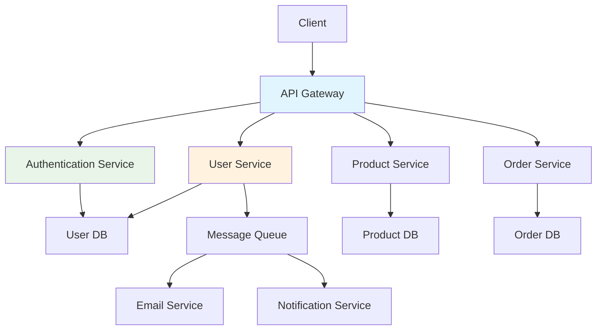
```mermaid
graph TD
    A[Client] --> B[API Gateway]
    B --> C[Authentication Service]
    B --> D[User Service]
    B --> E[Product Service]
    B --> F[Order Service]

    C --> G[User DB]
    D --> G
    E --> H[Product DB]
    F --> I[Order DB]

    D --> J[Message Queue]
    J --> K[Email Service]
    J --> L[Notification Service]

    style B fill:#e1f5fe
    style C fill:#e8f5e8
    style D fill:#fff3e0
```

### GraphQL API Architecture

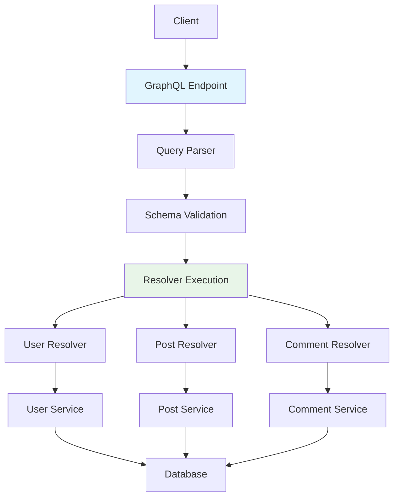
```mermaid
graph TD
    A[Client] --> B[GraphQL Endpoint]
    B --> C[Query Parser]
    C --> D[Schema Validation]
    D --> E[Resolver Execution]

    E --> F[User Resolver]
    E --> G[Post Resolver]
    E --> H[Comment Resolver]

    F --> I[User Service]
    G --> J[Post Service]
    H --> K[Comment Service]

    I --> L[Database]
    J --> L
    K --> L

    style B fill:#e1f5fe
    style E fill:#e8f5e8
```

## Microservices Architecture

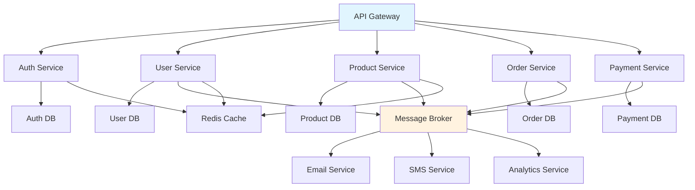
```mermaid
graph TD
    A[API Gateway] --> B[Auth Service]
    A --> C[User Service]
    A --> D[Product Service]
    A --> E[Order Service]
    A --> F[Payment Service]

    B --> G[Auth DB]
    C --> H[User DB]
    D --> I[Product DB]
    E --> J[Order DB]
    F --> K[Payment DB]

    C --> L[Message Broker]
    D --> L
    E --> L
    F --> L

    L --> M[Email Service]
    L --> N[SMS Service]
    L --> O[Analytics Service]

    B --> P[Redis Cache]
    C --> P
    D --> P

    style A fill:#e1f5fe
    style L fill:#fff3e0
```

## Caching Architecture

### Multi-Level Caching

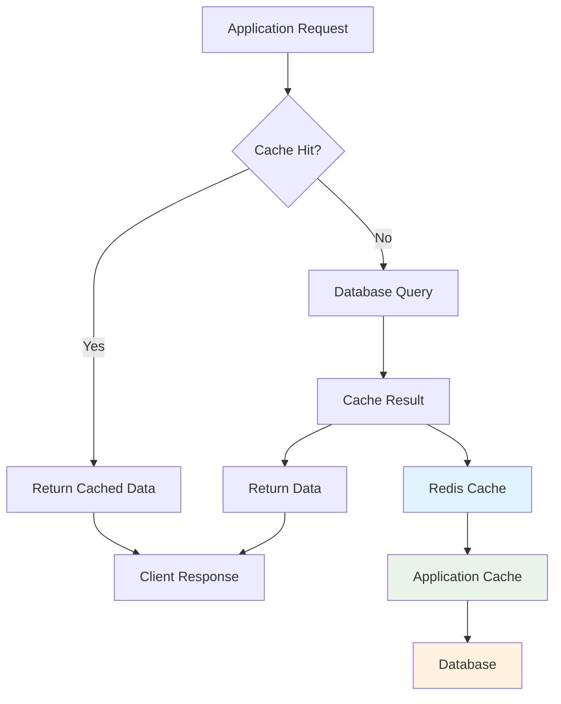
```mermaid
graph TD
    A[Application Request] --> B{Cache Hit?}
    B -->|Yes| C[Return Cached Data]
    B -->|No| D[Database Query]

    D --> E[Cache Result]
    E --> F[Return Data]

    C --> G[Client Response]
    F --> G

    E --> H[Redis Cache]
    H --> I[Application Cache]
    I --> J[Database]

    style H fill:#e1f5fe
    style I fill:#e8f5e8
    style J fill:#fff3e0
```

### Cache-Aside Pattern

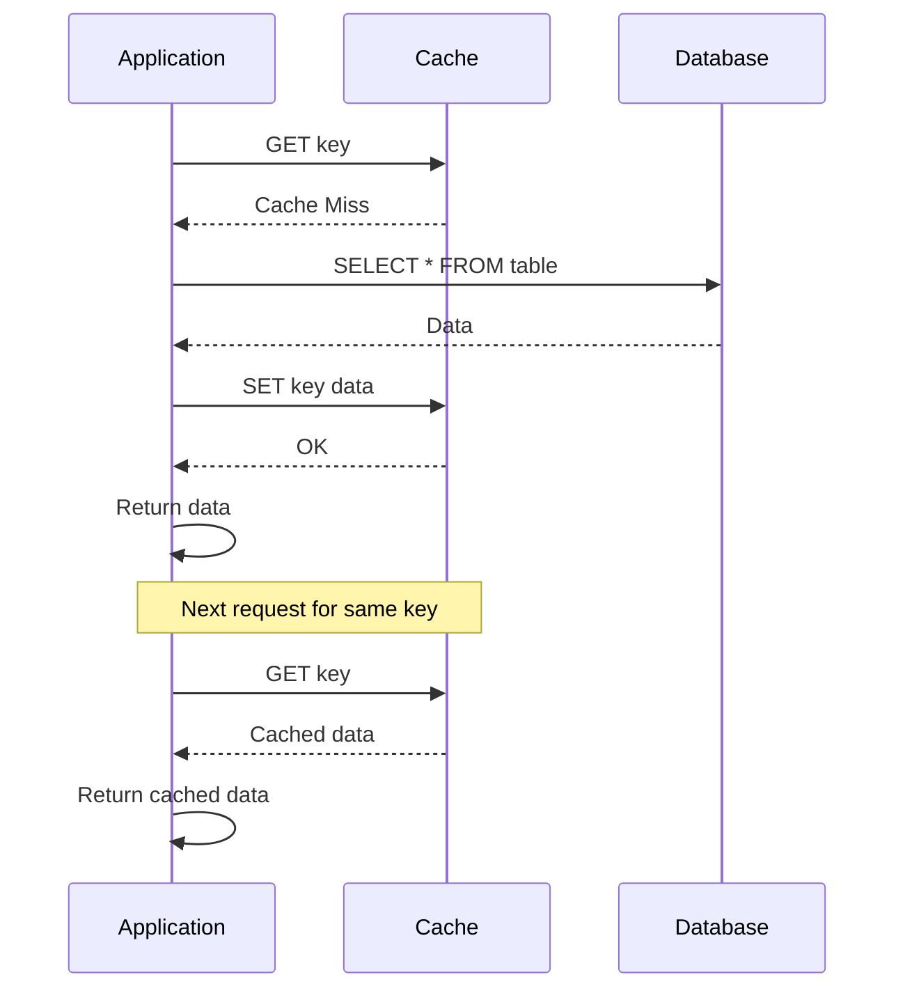
```mermaid
sequenceDiagram
    participant App as Application
    participant Cache as Cache
    participant DB as Database

    App->>Cache: GET key
    Cache-->>App: Cache Miss

    App->>DB: SELECT * FROM table
    DB-->>App: Data

    App->>Cache: SET key data
    Cache-->>App: OK

    App->>App: Return data

    Note over App,Cache: Next request for same key
    App->>Cache: GET key
    Cache-->>App: Cached data
    App->>App: Return cached data
```

## Background Task Processing

### Celery Architecture

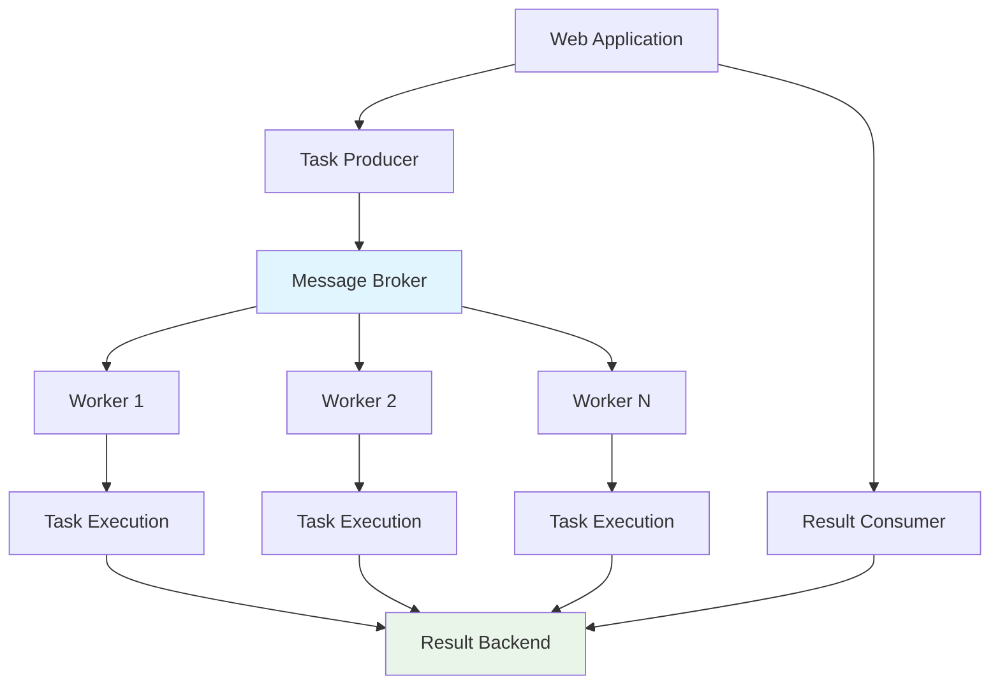
```mermaid
graph TD
    A[Web Application] --> B[Task Producer]
    B --> C[Message Broker]
    C --> D[Worker 1]
    C --> E[Worker 2]
    C --> F[Worker N]

    D --> G[Task Execution]
    E --> H[Task Execution]
    F --> I[Task Execution]

    G --> J[Result Backend]
    H --> J
    I --> J

    A --> K[Result Consumer]
    K --> J

    style C fill:#e1f5fe
    style J fill:#e8f5e8
```

### RQ (Redis Queue) Architecture

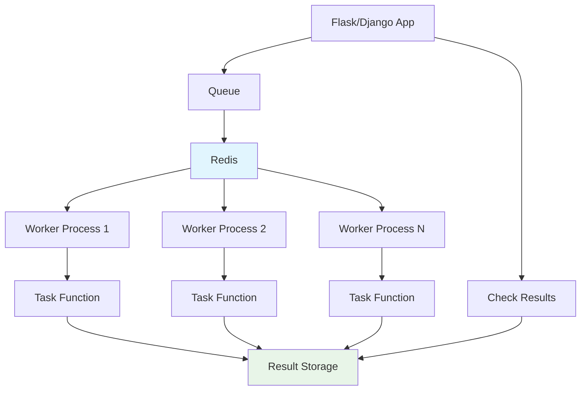
```mermaid
graph TD
    A[Flask/Django App] --> B[Queue]
    B --> C[Redis]

    C --> D[Worker Process 1]
    C --> E[Worker Process 2]
    C --> F[Worker Process N]

    D --> G[Task Function]
    E --> H[Task Function]
    F --> I[Task Function]

    G --> J[Result Storage]
    H --> J
    I --> J

    A --> K[Check Results]
    K --> J

    style C fill:#e1f5fe
    style J fill:#e8f5e8
```

## Deployment Architecture

### Docker Container Architecture

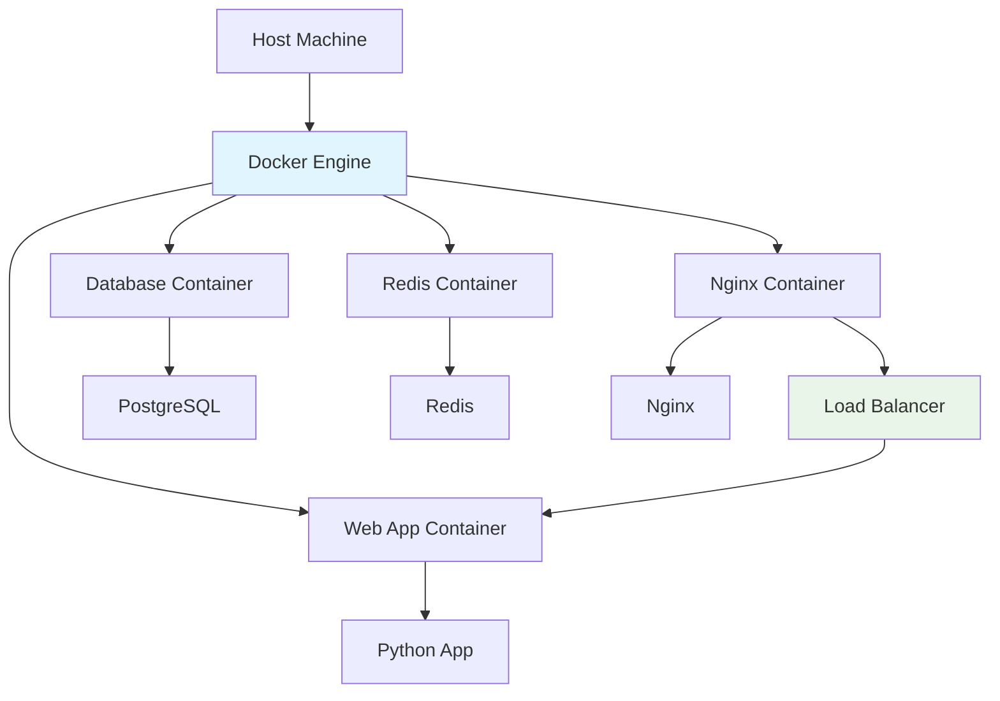
```mermaid
graph TD
    A[Host Machine] --> B[Docker Engine]
    B --> C[Web App Container]
    B --> D[Database Container]
    B --> E[Redis Container]
    B --> F[Nginx Container]

    C --> G[Python App]
    D --> H[PostgreSQL]
    E --> I[Redis]
    F --> J[Nginx]

    F --> K[Load Balancer]
    K --> C

    style B fill:#e1f5fe
    style K fill:#e8f5e8
```

### Kubernetes Deployment

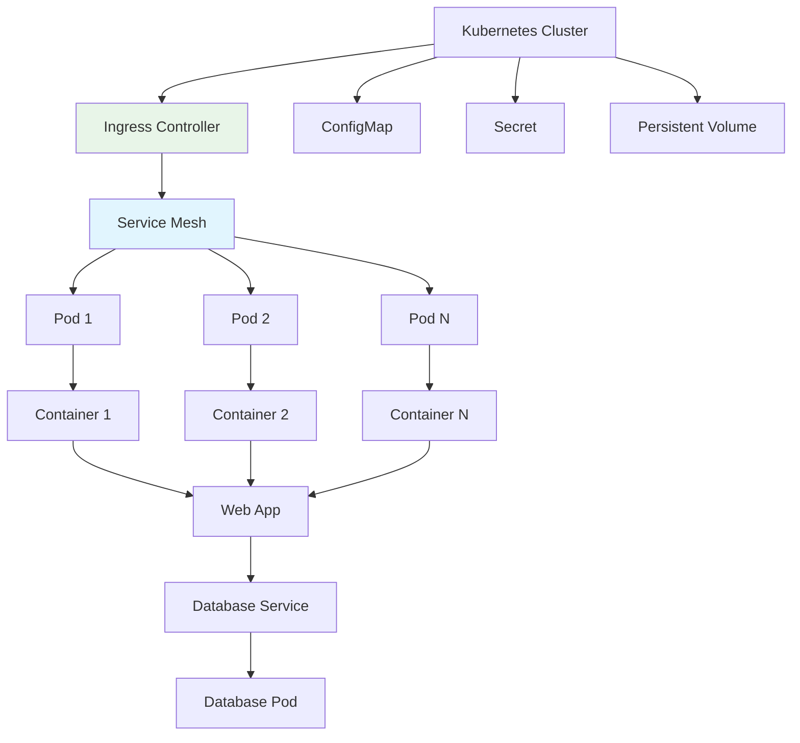
```mermaid
graph TD
    A[Kubernetes Cluster] --> B[Ingress Controller]
    B --> C[Service Mesh]
    C --> D[Pod 1]
    C --> E[Pod 2]
    C --> F[Pod N]

    D --> G[Container 1]
    E --> H[Container 2]
    F --> I[Container N]

    G --> J[Web App]
    H --> J
    I --> J

    A --> K[ConfigMap]
    A --> L[Secret]
    A --> M[Persistent Volume]

    J --> N[Database Service]
    N --> O[Database Pod]

    style C fill:#e1f5fe
    style B fill:#e8f5e8
```

## Testing Architecture

### Test Pyramid

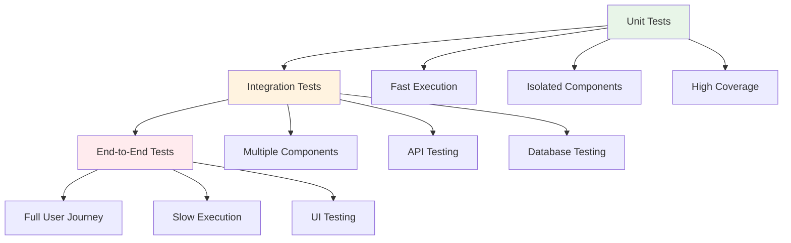
```mermaid
graph TD
    A[Unit Tests] --> B[Integration Tests]
    B --> C[End-to-End Tests]

    A --> D[Fast Execution]
    A --> E[Isolated Components]
    A --> F[High Coverage]

    B --> G[Multiple Components]
    B --> H[API Testing]
    B --> I[Database Testing]

    C --> J[Full User Journey]
    C --> K[Slow Execution]
    C --> L[UI Testing]

    style A fill:#e8f5e8
    style B fill:#fff3e0
    style C fill:#ffebee
```

### Testing Workflow

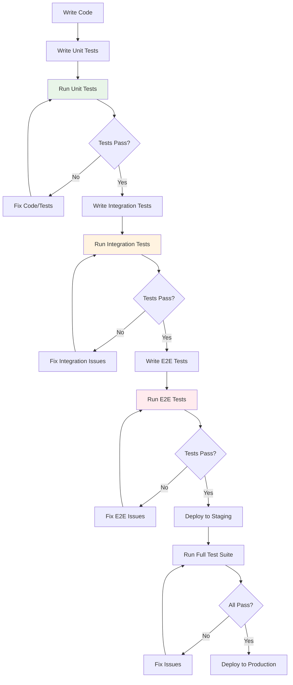
```mermaid
flowchart TD
    A[Write Code] --> B[Write Unit Tests]
    B --> C[Run Unit Tests]
    C --> D{Tests Pass?}
    D -->|No| E[Fix Code/Tests]
    E --> C
    D -->|Yes| F[Write Integration Tests]
    F --> G[Run Integration Tests]
    G --> H{Tests Pass?}
    H -->|No| I[Fix Integration Issues]
    I --> G
    H -->|Yes| J[Write E2E Tests]
    J --> K[Run E2E Tests]
    K --> L{Tests Pass?}
    L -->|No| M[Fix E2E Issues]
    M --> K
    L -->|Yes| N[Deploy to Staging]
    N --> O[Run Full Test Suite]
    O --> P{All Pass?}
    P -->|No| Q[Fix Issues]
    Q --> O
    P -->|Yes| R[Deploy to Production]

    style C fill:#e8f5e8
    style G fill:#fff3e0
    style K fill:#ffebee
```

## Security Architecture

### Authentication & Authorization Layers

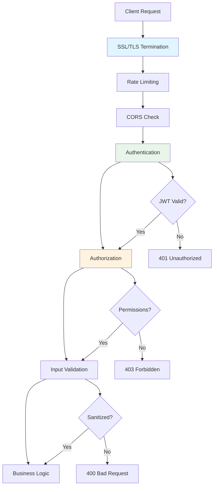
```mermaid
graph TD
    A[Client Request] --> B[SSL/TLS Termination]
    B --> C[Rate Limiting]
    C --> D[CORS Check]
    D --> E[Authentication]
    E --> F[Authorization]
    F --> G[Input Validation]
    G --> H[Business Logic]

    E --> I{JWT Valid?}
    I -->|Yes| F
    I -->|No| J[401 Unauthorized]

    F --> K{Permissions?}
    K -->|Yes| G
    K -->|No| L[403 Forbidden]

    G --> M{Sanitized?}
    M -->|Yes| H
    M -->|No| N[400 Bad Request]

    style B fill:#e1f5fe
    style E fill:#e8f5e8
    style F fill:#fff3e0
```

### Data Protection Layers

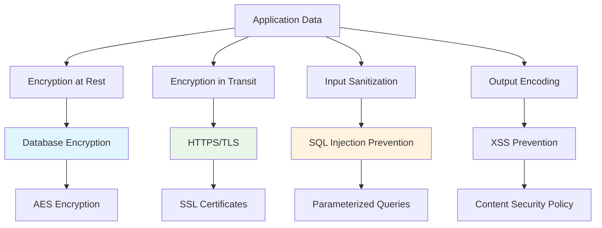
```mermaid
graph TD
    A[Application Data] --> B[Encryption at Rest]
    A --> C[Encryption in Transit]
    A --> D[Input Sanitization]
    A --> E[Output Encoding]

    B --> F[Database Encryption]
    C --> G[HTTPS/TLS]
    D --> H[SQL Injection Prevention]
    E --> I[XSS Prevention]

    F --> J[AES Encryption]
    G --> K[SSL Certificates]
    H --> L[Parameterized Queries]
    I --> M[Content Security Policy]

    style F fill:#e1f5fe
    style G fill:#e8f5e8
    style H fill:#fff3e0
```

## Performance Monitoring Architecture

```mermaid
graph TD
    A[Application] --> B[Application Metrics]
    A --> C[APM Agent]
    A --> D[Custom Logging]

    B --> E[Response Time]
    B --> F[Error Rate]
    B --> G[Throughput]

    C --> H[New Relic/AppDynamics]
    D --> I[ELK Stack]

    H --> J[Real-time Monitoring]
    I --> K[Log Aggregation]

    J --> L[Alerts]
    K --> M[Dashboards]

    A --> N[Health Checks]
    N --> O[Database Ping]
    N --> P[External Service Check]

    style C fill:#e1f5fe
    style I fill:#e8f5e8
    style L fill:#ffebee
```

## CI/CD Pipeline Architecture

```mermaid
flowchart LR
    A[Developer Push] --> B[Git Repository]
    B --> C[CI Server]
    C --> D[Code Quality]
    D --> E[Unit Tests]
    E --> F[Integration Tests]
    F --> G[Build Artifact]
    G --> H[Container Registry]

    H --> I[CD Server]
    I --> J[Deploy to Staging]
    J --> K[Smoke Tests]
    K --> L[Performance Tests]
    L --> M[Security Scan]
    M --> N{All Pass?}
    N -->|Yes| O[Deploy to Production]
    N -->|No| P[Rollback]

    O --> Q[Post-deployment Tests]
    Q --> R[Monitoring]

    style C fill:#e1f5fe
    style I fill:#e8f5e8
    style O fill:#fff3e0
```

This visual guide provides comprehensive architecture diagrams for Python backend development, covering frameworks, databases, authentication, APIs, microservices, caching, deployment, testing, security, and monitoring patterns.
