# Redis Architecture Guide

## Redis Data Structures Visual

```mermaid
graph TD
    A[Redis Data Types] --> B[Strings]
    A --> C[Hashes]
    A --> D[Lists]
    A --> E[Sets]
    A --> F[Sorted Sets]
    A --> G[Bitmaps]
    A --> H[HyperLogLogs]
    A --> I[Geospatial]

    B --> B1["SET key value"]
    B --> B2["GET key"]
    B --> B3["INCR key"]
    B --> B4["APPEND key value"]

    C --> C1["HSET hash field value"]
    C --> C2["HGET hash field"]
    C --> C3["HGETALL hash"]
    C --> C4["HINCRBY hash field 1"]

    D --> D1["LPUSH list value"]
    D --> D2["RPOP list"]
    D --> D3["LRANGE list 0 -1"]
    D --> D4["LINDEX list index"]

    E --> E1["SADD set member"]
    E --> E2["SMEMBERS set"]
    E --> E3["SISMEMBER set member"]
    E --> E4["SUNION set1 set2"]

    F --> F1["ZADD zset score member"]
    F --> F2["ZRANGE zset 0 -1 WITHSCORES"]
    F --> F3["ZRANK zset member"]
    F --> F4["ZSCORE zset member"]

    style A fill:#e1f5fe
    style B fill:#e8f5e8
    style C fill:#fff3e0
    style D fill:#f3e5f5
    style E fill:#e8f5e8
    style F fill:#fff3e0
```

## Redis Memory Architecture

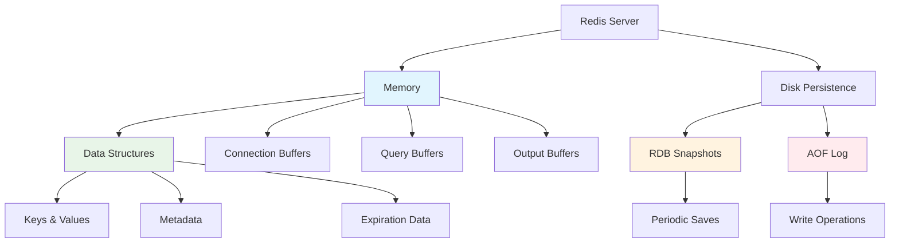

## Redis Persistence Options

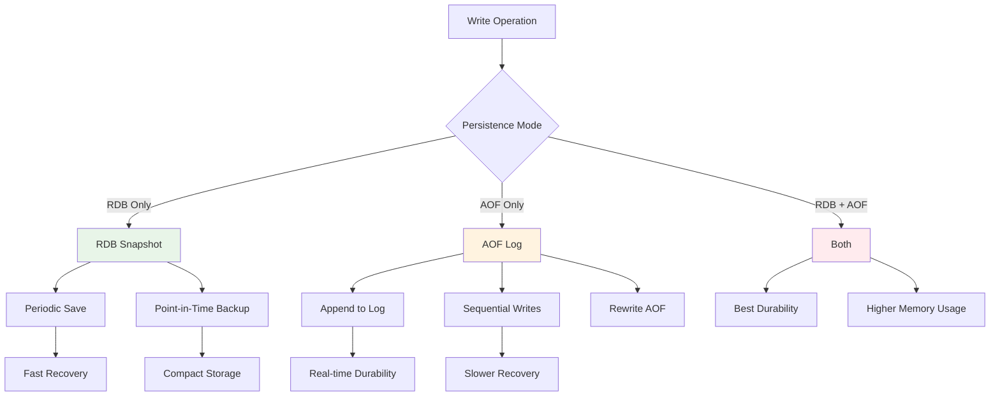

## Master-Slave Replication

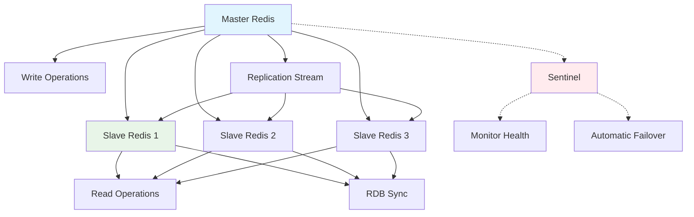

## Redis Cluster Architecture

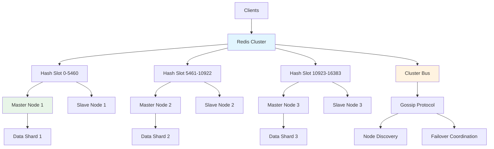

## Pub/Sub Messaging Pattern

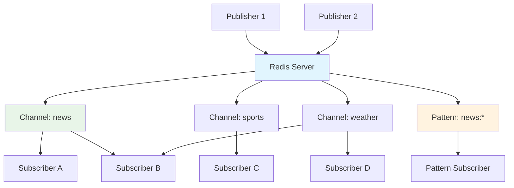

## Transaction Processing

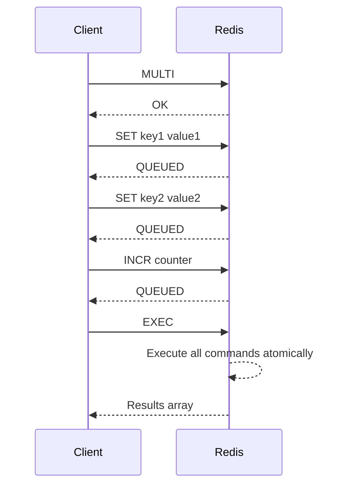

## Lua Scripting Execution

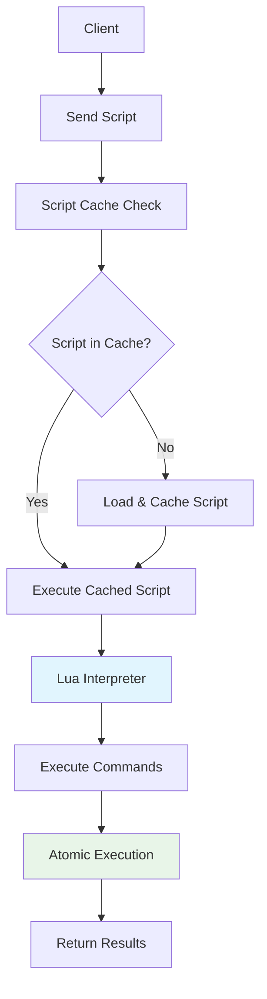

## Connection Pooling

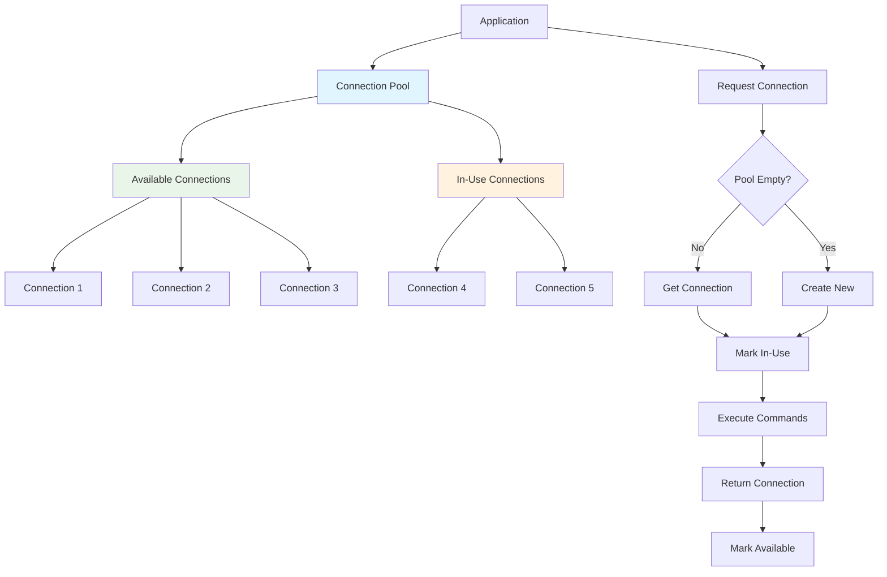

## Caching Strategies

### Cache-Aside Pattern

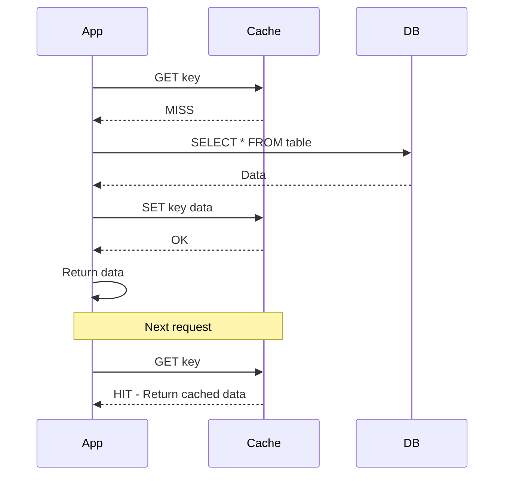

### Write-Through Cache

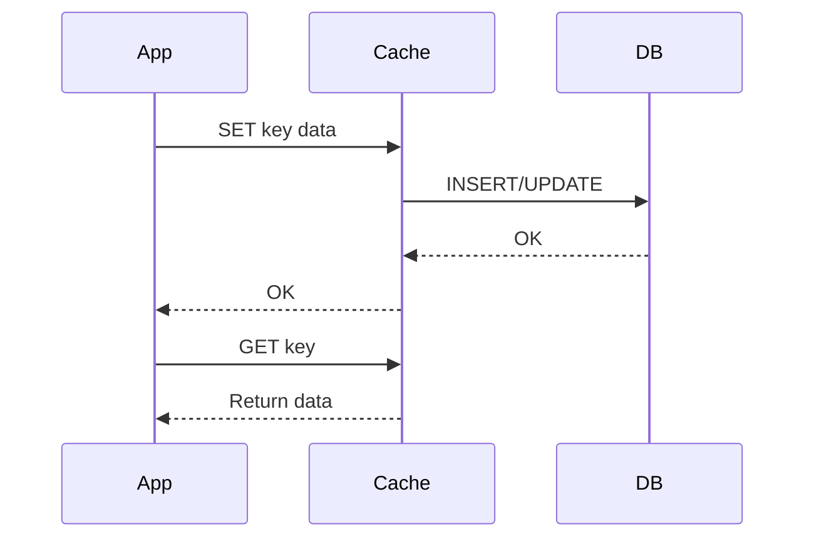

### Write-Behind Cache

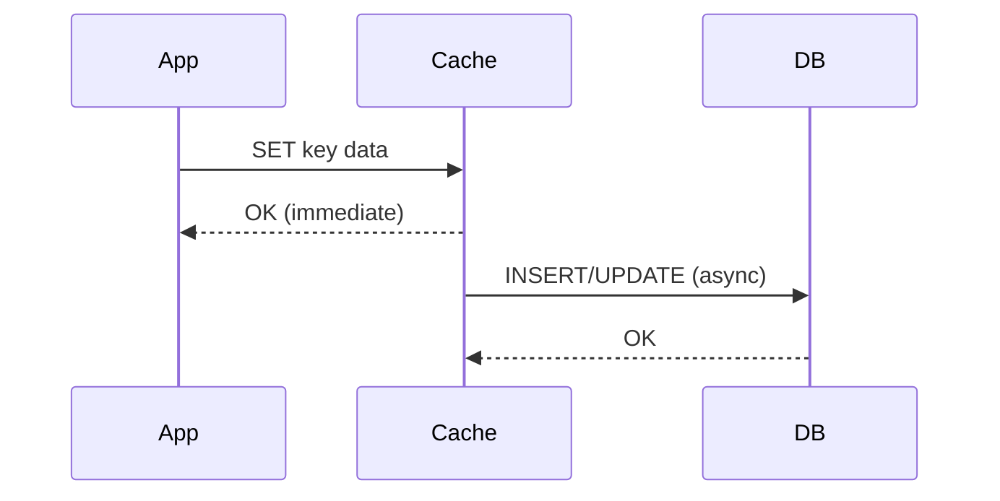

## Session Management

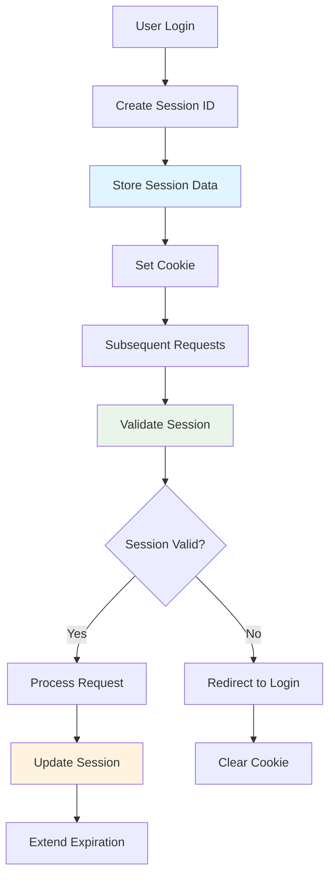

## Rate Limiting Implementation

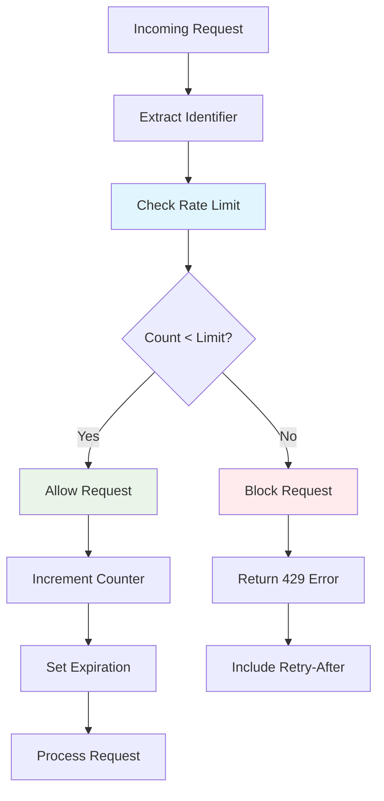

## Redis as Message Queue

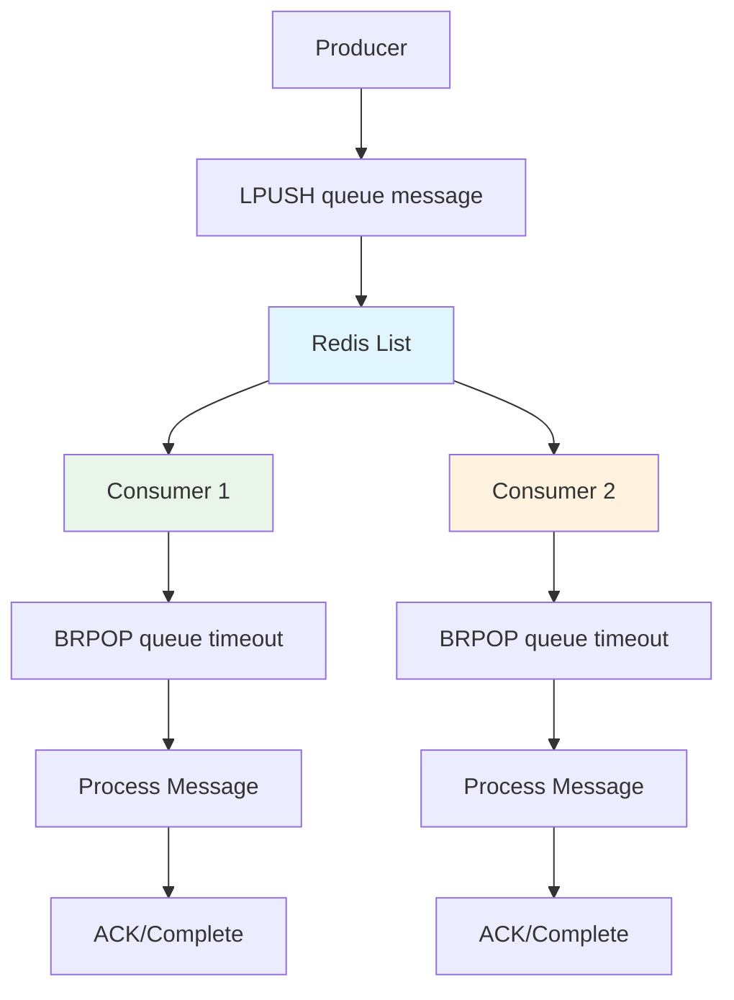

## Monitoring and Observability

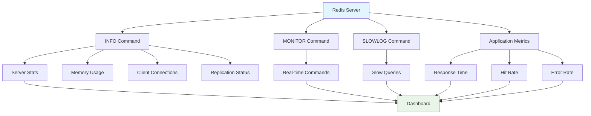

## High Availability Setup

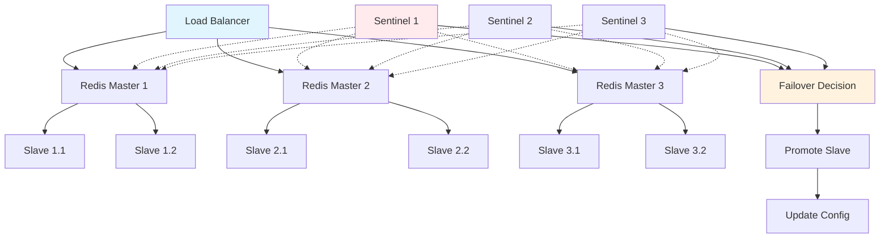

## Performance Optimization

### Memory Management

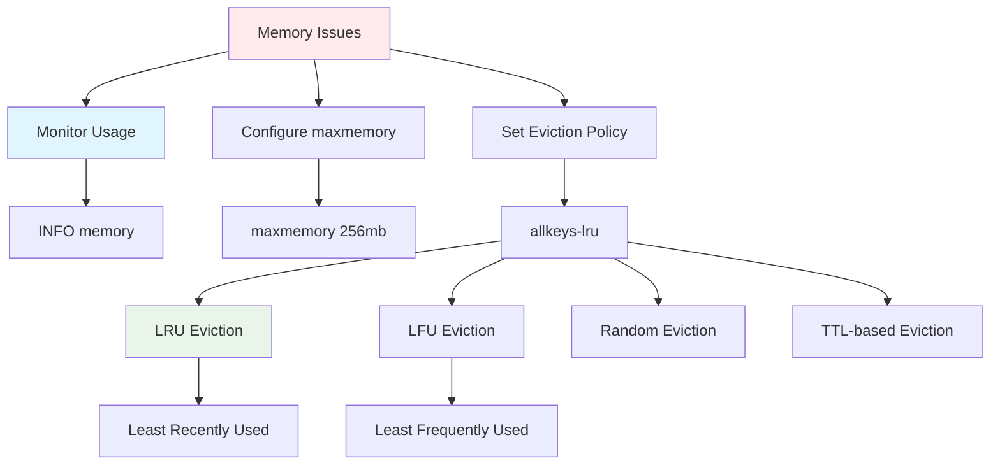

### Connection Optimization

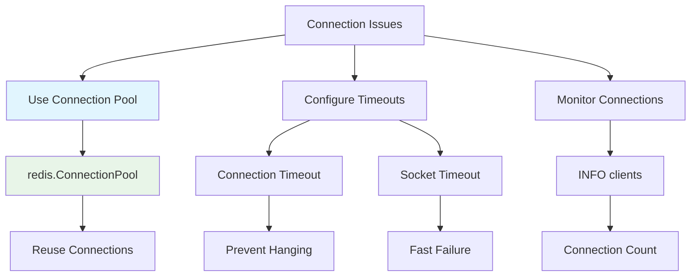

## Security Architecture

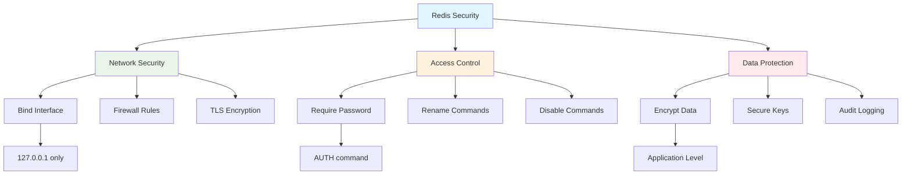

## Backup and Recovery

```mermaid
flowchart TD
    A[Backup Strategy] --> B[RDB Snapshots]
    A --> C[AOF Logs]
    A --> D[Replication]

    B --> E[Periodic Saves]
    B --> F[Copy RDB Files]
    B --> G[External Storage]

    C --> H[Continuous Logging]
    C --> I[Append Operations]
    C --> J[Rewrite AOF]

    D --> K[Slave Backups]
    D --> L[Point-in-Time Recovery]

    E --> M[Fast Backup]
    F --> N[Consistent State]
    G --> O[Disaster Recovery]

    style A fill:#e1f5fe
    style B fill:#e8f5e8
    style C fill:#fff3e0
    style D fill:#ffebee
```

## Scaling Patterns

### Vertical Scaling

```mermaid
graph TD
    A[Single Redis] --> B[Increase Resources]
    B --> C[More CPU]
    B --> D[More Memory]
    B --> E[Faster Storage]

    C --> F[Handle More Ops]
    D --> G[Store More Data]
    E --> H[Faster Persistence]

    style A fill:#ffebee
    style B fill:#e1f5fe
    style F fill:#e8f5e8
```

### Horizontal Scaling

```mermaid
graph TD
    A[Multiple Redis] --> B[Sharding]
    A --> C[Replication]
    A --> D[Clustering]

    B --> E[Data Partitioning]
    C --> F[Read Scaling]
    D --> G[Auto Sharding]

    E --> H[Hash Slots]
    F --> I[Master-Slave]
    G --> J[Cluster Mode]

    style A fill:#e1f5fe
    style B fill:#e8f5e8
    style C fill:#fff3e0
    style D fill:#ffebee
```

This visual guide provides comprehensive architecture diagrams for Redis, covering data structures, persistence, replication, clustering, caching patterns, monitoring, security, and scaling strategies.
