# SQLite Architecture Guide

## SQLite Database Architecture

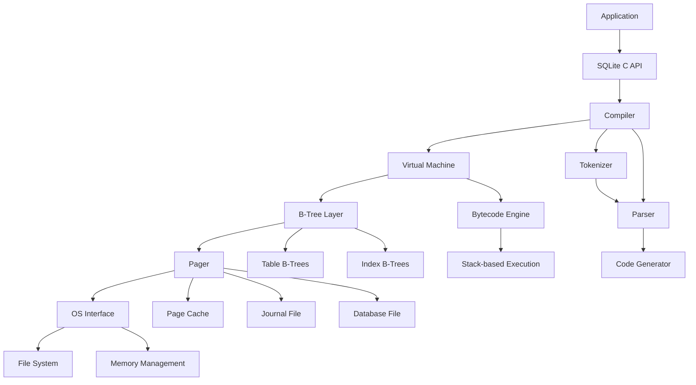

## SQLite File Format

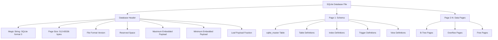

## B-Tree Structure

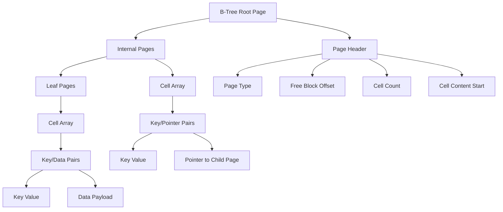

## Transaction Processing

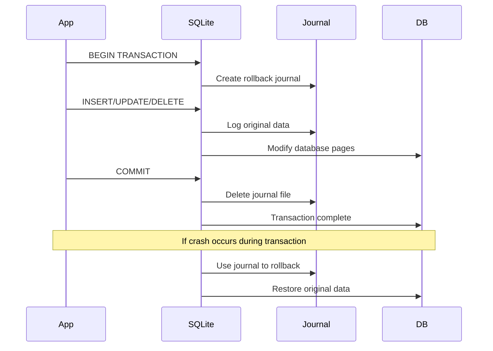

## Query Execution Pipeline

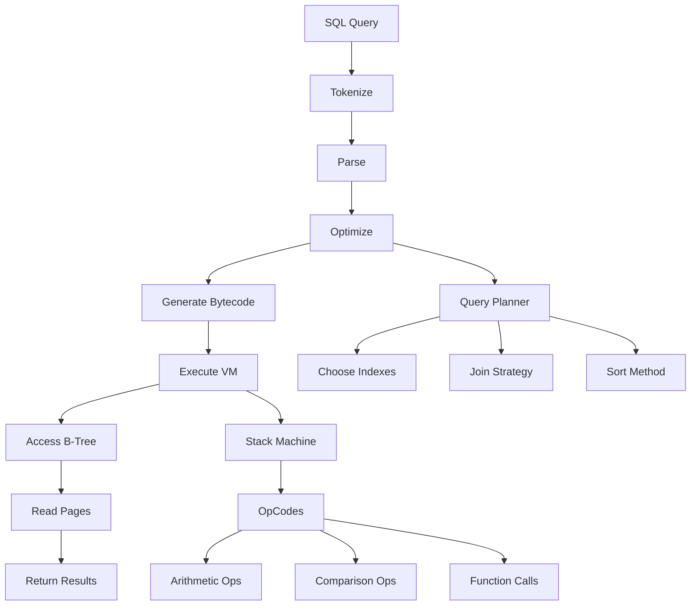

## Connection and Concurrency

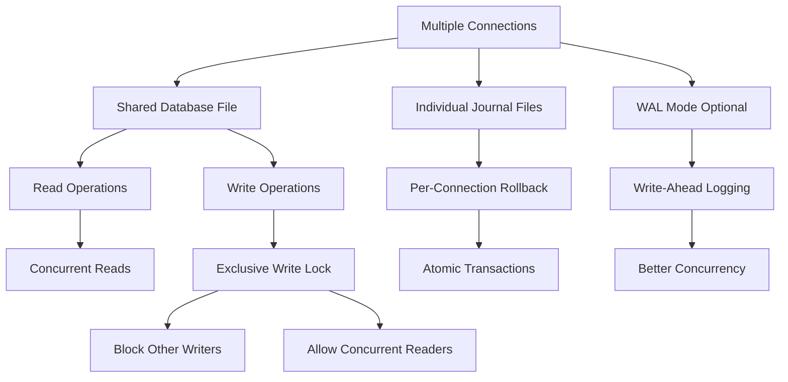

## Indexing Architecture

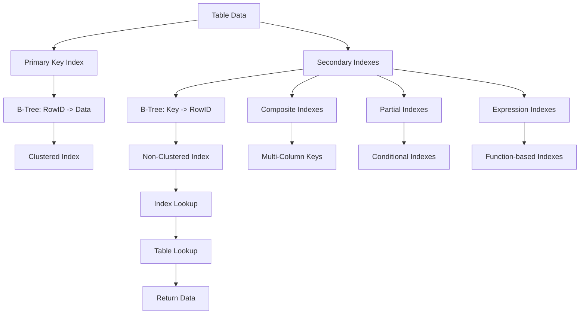

## Memory Management

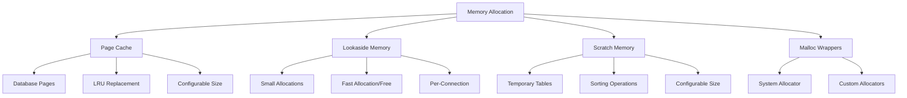

## Full-Text Search (FTS) Architecture

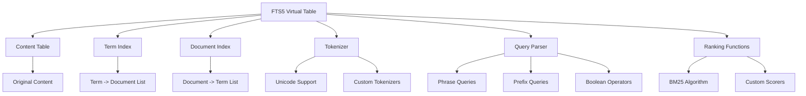

## JSON Support Architecture

```mermaid
graph TD
    A[JSON Functions] --> B[json()]
    A --> C[json_array()]
    A --> D[json_object()]
    A --> E[json_extract()]
    A --> F[json_set()]
    A --> G[json_insert()]
    A --> H[json_replace()]
    A --> I[json_remove()]
    A --> J[json_array_length()]
    A --> K[json_type()]
    A --> L[json_valid()]

    B --> M[Parse JSON String]
    E --> N[Extract Values by Path]
    F --> O[Set Values by Path]
    G --> P[Insert New Values]
    H --> Q[Replace Existing Values]
    I --> R[Remove Values by Path]

    A --> S[JSON Path Syntax]
    S --> T[$.field]
    S --> U[$[index]]
    S --> V[$.field[index]]
    S --> W[$.field1.field2]
```

## Backup and Recovery

```mermaid
flowchart TD
    A[Backup Request] --> B[Acquire Read Lock]
    B --> C[Copy Database Pages]
    C --> D[Release Lock]
    D --> E[Write to Backup File]

    A --> F[Online Backup API]
    F --> G[sqlite3_backup_init()]
    F --> H[Incremental Page Copying]
    F --> I[Resume/Pause Support]

    A --> J[SQL Backup]
    J --> K[VACUUM INTO command]
    J --> L[Complete Database Copy]

    E --> M[Backup File]
    M --> N[Restore Process]
    N --> O[Copy to New Location]
    N --> P[Verify Integrity]
    N --> Q[Ready for Use]
```

## Performance Optimization

### Query Execution Plans

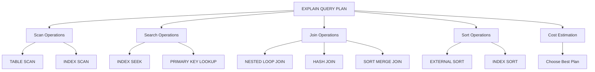

### Index Usage Patterns

```mermaid
graph TD
    A[Query Types] --> B[Point Queries]
    A --> C[Range Queries]
    A --> D[Prefix Queries]
    A --> E[Full Table Scans]

    B --> F[Unique Index Seek]
    B --> G[Primary Key Lookup]

    C --> H[Index Range Scan]
    C --> I[Index Seek + Table Lookup]

    D --> J[Index Prefix Scan]
    D --> K[Partial Index Usage]

    E --> L[No Index Used]
    E --> M[Heap Scan]

    F --> N[Fastest: O(1)]
    H --> O[Fast: O(log n + k)]
    L --> P[Slowest: O(n)]
```

## WAL Mode Architecture

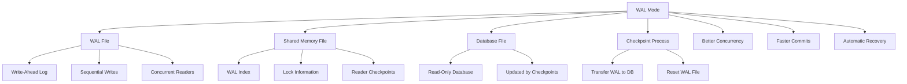

## Extension Architecture

```mermaid
graph TD
    A[SQLite Extensions] --> B[Loadable Extensions]
    A --> C[Virtual Tables]
    A --> D[Custom Functions]
    A --> E[Collating Sequences]
    A --> F[Tokenizers]

    B --> G[Shared Libraries]
    B --> H[sqlite3_load_extension()]
    B --> I[Custom SQL Functions]

    C --> J[FTS5 Tables]
    C --> K[JSON Tables]
    C --> L[R-Tree Indexes]

    D --> M[Application Functions]
    D --> N[Aggregate Functions]
    D --> O[Window Functions]

    E --> P[Custom Sorting]
    E --> Q[Case-Insensitive Search]

    F --> R[Full-Text Search]
    F --> S[Custom Tokenization]
```

## Security Architecture

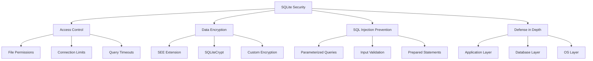

## Monitoring and Diagnostics

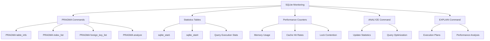

## Deployment Patterns

### Embedded Database

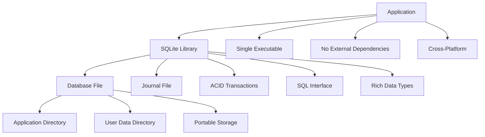

### Client-Server with SQLite

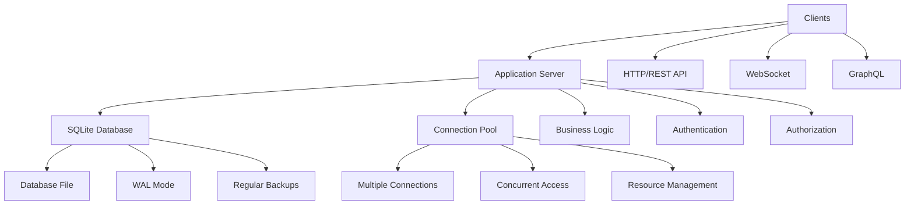

This visual guide provides comprehensive architecture diagrams for SQLite, covering its internal structure, query processing, storage mechanisms, performance optimization, and deployment patterns.
