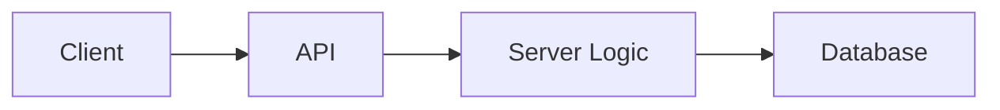
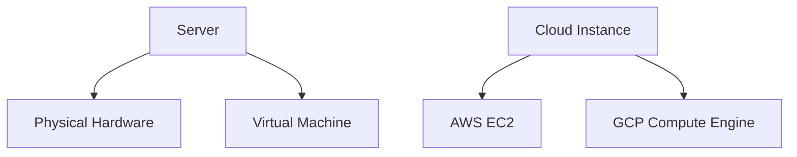
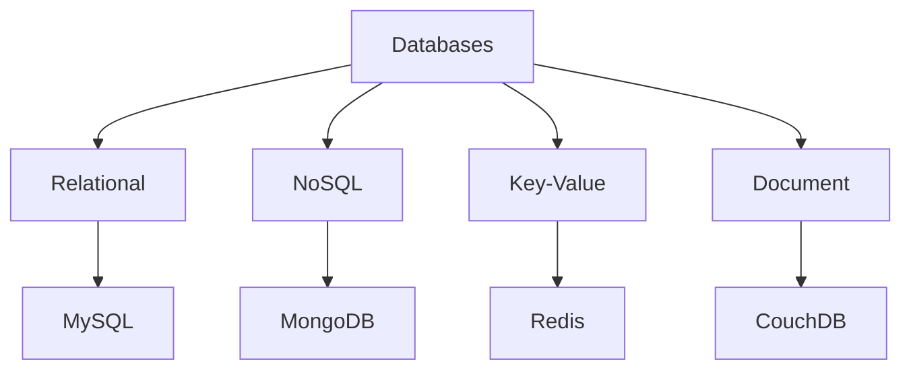
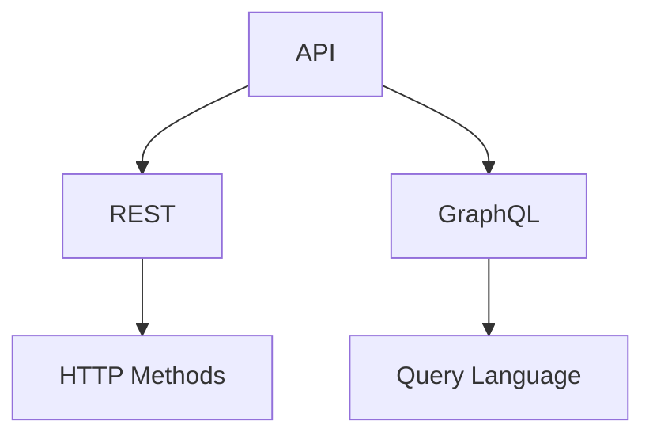
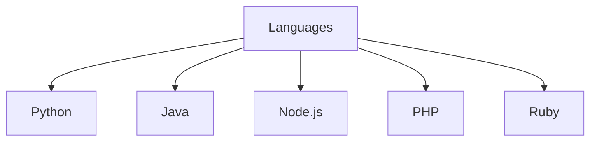
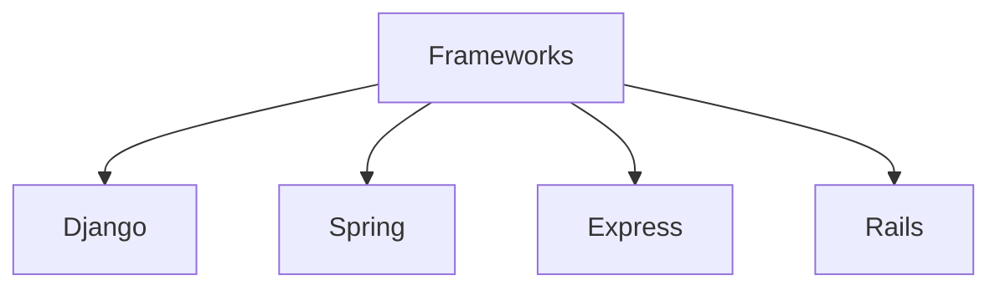
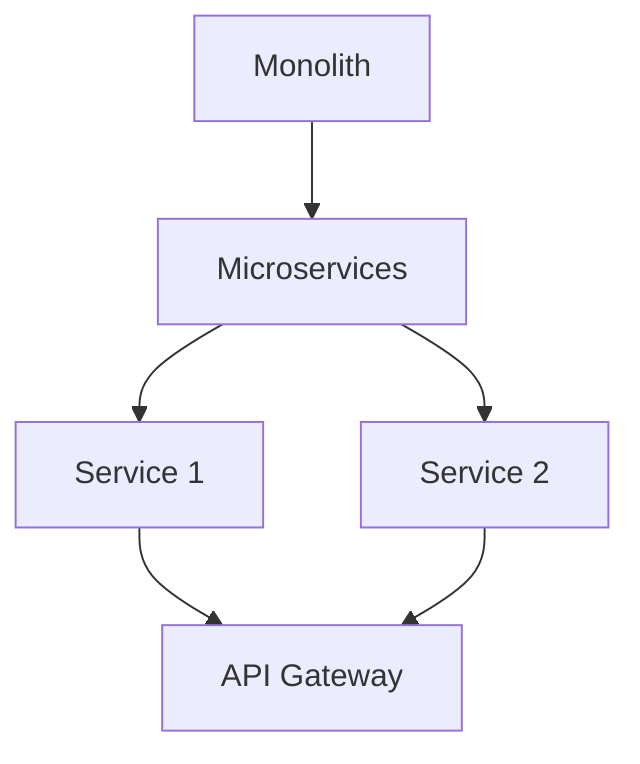
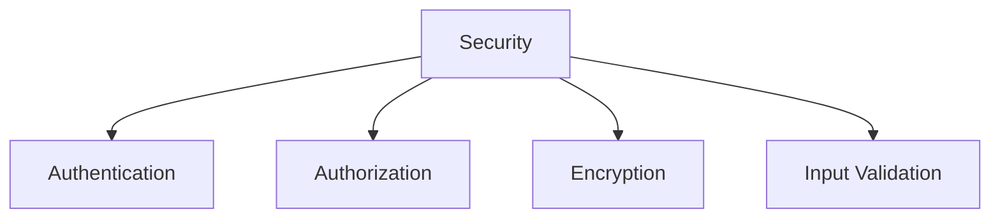
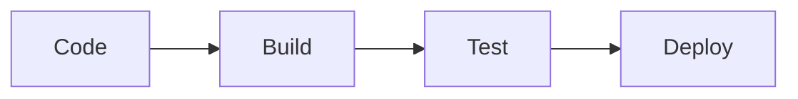

# Backend Technology Guide

## Table of Contents

1. [Introduction](#introduction)
2. [Servers and Cloud Instances](#servers-and-cloud-instances)
3. [Databases](#databases)
4. [APIs](#apis)
5. [Server-Side Languages](#server-side-languages)
6. [Frameworks](#frameworks)
7. [Microservices](#microservices)
8. [Security](#security)
9. [Deployment](#deployment)

## Introduction

Backend development handles server-side logic, databases, and APIs for web applications.

## Servers and Cloud Instances

Servers host applications. Cloud instances provide scalable, virtual servers.

## Databases

Store and manage data. Types: relational, NoSQL, etc.

## APIs

Interfaces for communication between systems. RESTful and GraphQL common.

## Server-Side Languages

Languages for backend logic: Python, Java, Node.js, etc.

## Frameworks

Tools for building applications: Django, Spring, Express.

## Microservices

Architecture with small, independent services.

## Security

Protect against threats: authentication, encryption.

## Deployment

CI/CD pipelines for reliable releases.

