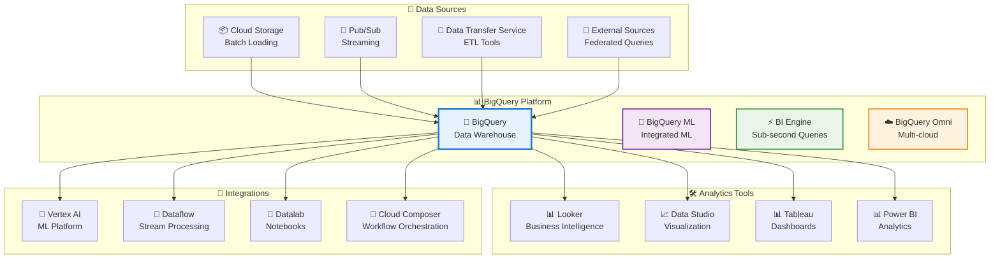
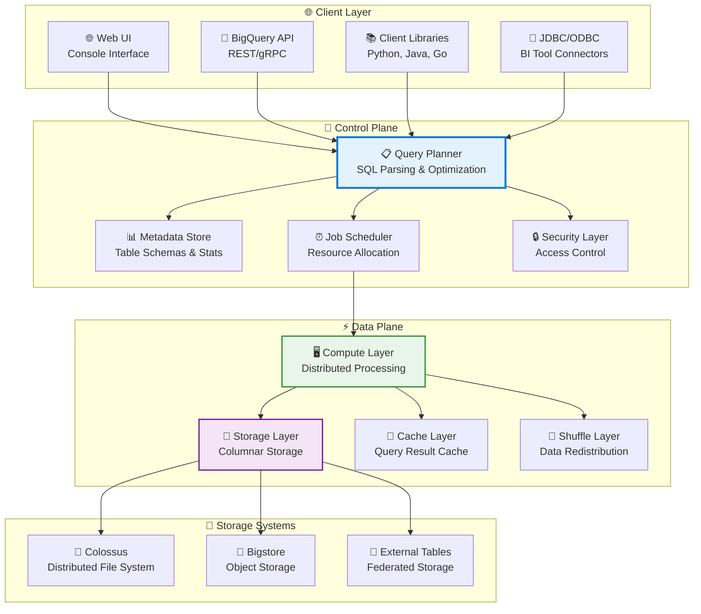
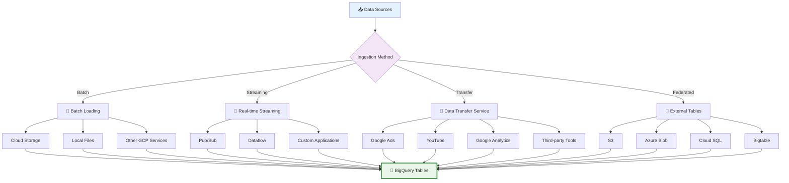
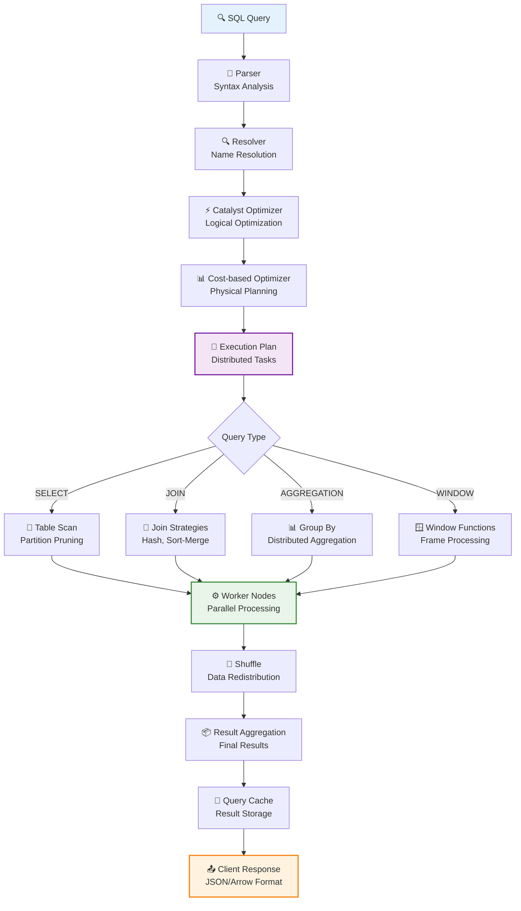
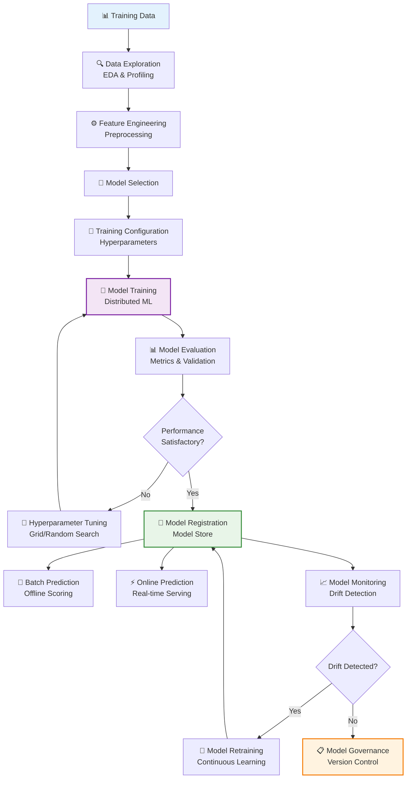
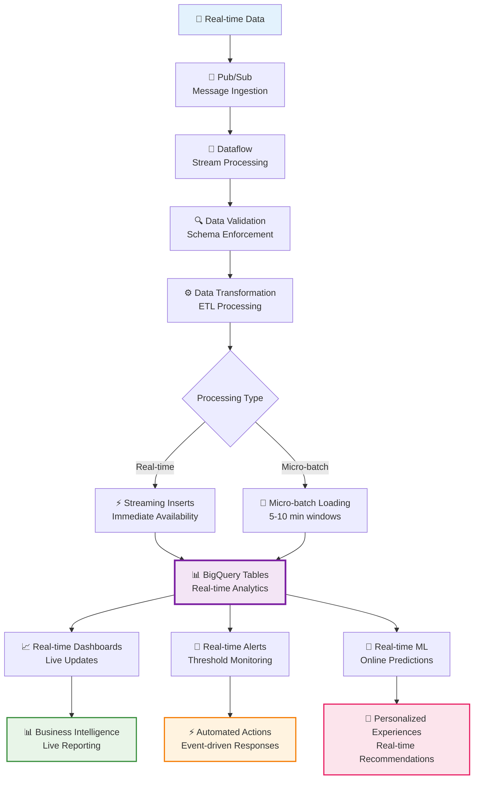
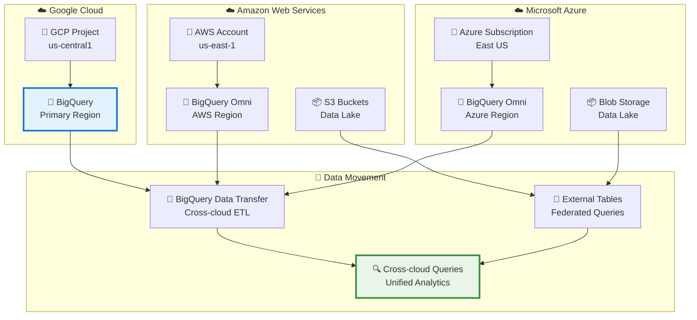
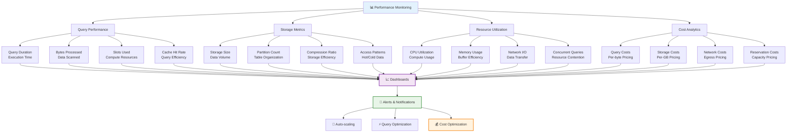

# BigQuery Visual Architecture Guide

## BigQuery Ecosystem Overview



## BigQuery Architecture



## Data Ingestion Patterns



## Partitioning and Clustering

```mermaid
graph TD
    A[📊 Table Organization] --> B[Partitioning]
    A --> C[Clustering]

    B --> D[Time-based<br/>DATE/TIMESTAMP]
    B --> E[Range-based<br/>Numeric Ranges]
    B --> F[Hash-based<br/>Even Distribution]

    C --> G[Column-based<br/>Sort Keys]
    C --> H[Multiple Columns<br/>Hierarchical]

    D --> I[Daily Partitions<br/>2024-01-01/]
    D --> J[Hourly Partitions<br/>2024-01-01-12/]
    D --> K[Monthly Partitions<br/>2024-01/]

    E --> L[User ID Ranges<br/>0-99999/]
    E --> M[Score Ranges<br/>0-100/]

    F --> N[Hash Buckets<br/>MOD(user_id, 100)]

    G --> O[Sort by customer_id]
    G --> P[Sort by date, customer_id]

    I --> Q[Query Pruning<br/>WHERE date = '2024-01-01']
    J --> Q
    K --> Q
    L --> Q
    M --> Q
    N --> Q

    O --> R[Block Elimination<br/>WHERE customer_id = 123]
    P --> R

    Q --> S[⚡ Faster Queries]
    R --> S

    style A fill:#e3f2fd
    style S fill:#e8f5e8,stroke:#388e3c,stroke-width:3px
```

## Query Execution Flow



## BigQuery ML Workflow



## Security Architecture

```mermaid
graph TD
    A[🔐 Security Layers] --> B[Identity & Access]
    A --> C[Data Protection]
    A --> D[Network Security]
    A --> E[Audit & Compliance]

    B --> F[IAM Policies<br/>Role-based Access]
    B --> G[Service Accounts<br/>Application Identity]
    B --> H[OAuth 2.0<br/>User Authentication]
    B --> I[Row-level Security<br/>Data Filtering]

    C --> J[Encryption at Rest<br/>AES-256]
    C --> K[Encryption in Transit<br/>TLS 1.3]
    C --> L[Customer-managed Keys<br/>Cloud KMS]
    C --> M[Data Masking<br/>PII Protection]

    D --> N[VPC Service Controls<br/>Network Isolation]
    D --> O[Private Google Access<br/>Internal Networking]
    D --> P[IP Whitelisting<br/>Access Control]
    D --> Q[Cloud Armor<br/>DDoS Protection]

    E --> R[Cloud Audit Logs<br/>Activity Monitoring]
    E --> S[Data Access Logs<br/>Query Auditing]
    E --> T[Compliance Reports<br/>Regulatory Requirements]
    E --> U[Data Loss Prevention<br/>Sensitive Data Detection]

    F --> V[🔒 Secure Access]
    G --> V
    H --> V
    I --> V
    J --> V
    K --> V
    L --> V
    M --> V
    N --> V
    O --> V
    P --> V
    Q --> V
    R --> V
    S --> V
    T --> V
    U --> V

    style A fill:#e3f2fd
    style V fill:#e8f5e8,stroke:#388e3c,stroke-width:3px
```



## Cost Optimization Strategies

```mermaid
graph TD
    A[💰 Cost Optimization] --> B[Storage Costs]
    A --> C[Query Costs]
    A --> D[Network Costs]
    A --> E[Compute Costs]

    B --> F[Partition Expiration<br/>Automatic Cleanup]
    B --> G[Storage Classes<br/>Standard, Nearline, Coldline]
    B --> H[Data Lifecycle<br/>Age-based Policies]
    B --> I[Compression<br/>Automatic Optimization]

    C --> J[Query Caching<br/>Result Reuse]
    C --> K[Approximate Functions<br/>COUNT DISTINCT → APPROX_COUNT_DISTINCT]
    C --> L[Query Optimization<br/>Efficient SQL]
    C --> M[BI Engine<br/>Sub-second Queries]

    D --> N[Same Region<br/>Intra-zone Traffic]
    D --> O[Data Locality<br/>Regional Datasets]
    D --> P[Query Result Export<br/>Minimize Egress]

    E --> Q[Flat-rate Pricing<br/>Predictable Costs]
    E --> R[Reservations<br/>Capacity Commitments]
    E --> S[Auto-scaling<br/>Pay for Usage]
    E --> T[Query Queuing<br/>Resource Management]

    F --> U[💸 Cost Savings]
    G --> U
    H --> U
    I --> U
    J --> U
    K --> U
    L --> U
    M --> U
    N --> U
    O --> U
    P --> U
    Q --> U
    R --> U
    S --> U
    T --> U

    style A fill:#e3f2fd
    style U fill:#e8f5e8,stroke:#388e3c,stroke-width:3px
```



## Real-time Analytics Pipeline



## Multi-cloud Architecture



## Performance Monitoring



## Summary

BigQuery's visual architecture reveals a sophisticated, multi-layered platform that combines:

- **Scalable Storage**: Distributed columnar storage with automatic optimization
- **Intelligent Processing**: Query optimization and distributed execution
- **Multi-modal Ingestion**: Batch, streaming, and federated data sources
- **Integrated Analytics**: Built-in ML, real-time processing, and BI capabilities
- **Enterprise Security**: Comprehensive access controls and compliance features
- **Cost Intelligence**: Automatic optimization and flexible pricing models
- **Multi-cloud Flexibility**: Unified analytics across cloud providers

The platform represents the convergence of data warehousing, analytics, and AI, providing organizations with a complete data platform that scales from gigabytes to petabytes while maintaining sub-second query performance.
