# Apache Airflow Data Engineering Visual Guide

## DAG Architecture Diagrams

### Airflow System Architecture
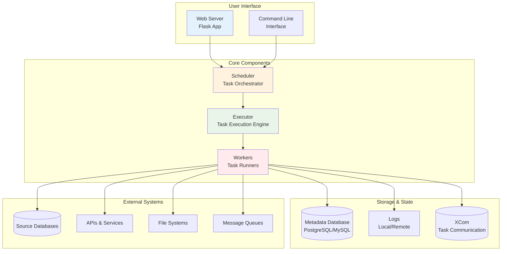

### DAG Structure and Dependencies
```mermaid
graph TD
    subgraph "DAG: daily_etl_pipeline"
        START([Start])
        EXTRACT[Extract Data<br/>from Sources]
        VALIDATE[Validate<br/>Data Quality]
        TRANSFORM[Transform<br/>Data]
        LOAD[Load to<br/>Warehouse]
        END([End])
    end

    START --> EXTRACT
    EXTRACT --> VALIDATE
    VALIDATE --> TRANSFORM
    TRANSFORM --> LOAD
    LOAD --> END

    subgraph "Task Details"
        EXTRACT -.-> "Operator: PythonOperator<br/>Retries: 3<br/>Timeout: 30min"
        VALIDATE -.-> "Operator: PythonOperator<br/>Quality Checks"
        TRANSFORM -.-> "Operator: BashOperator<br/>Script: transform.py"
        LOAD -.-> "Operator: PostgresOperator<br/>SQL: INSERT statements"
    end

    style START fill:#e8f5e8
    style END fill:#ffebee
    style EXTRACT fill:#e3f2fd
    style VALIDATE fill:#fff3e0
    style TRANSFORM fill:#f3e5f5
    style LOAD fill:#e8f5e8
```

## Workflow Patterns

### ETL Pipeline Pattern
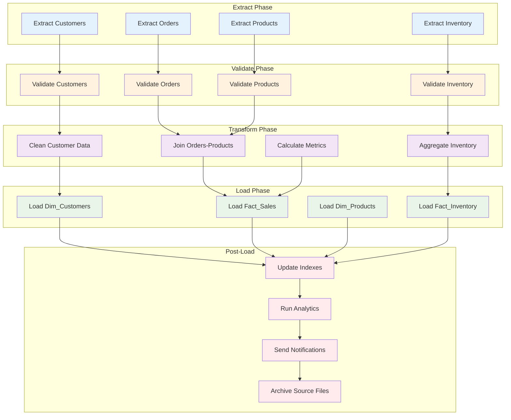

### Branching Workflow Pattern
```mermaid
graph TD
    START([Start Pipeline]) --> CHECK{Data Available?}

    CHECK -->|Yes| PROCESS[Process Data]
    CHECK -->|No| SKIP[Skip Processing<br/>Log Warning]

    PROCESS --> QUALITY{Quality Check<br/>Passed?}

    QUALITY -->|Yes| LOAD[Load to Production]
    QUALITY -->|No| CLEANUP[Clean Bad Data<br/>Send Alert]

    LOAD --> ANALYTICS[Run Analytics]
    CLEANUP --> NOTIFY[Notify Team]

    ANALYTICS --> END([End])
    SKIP --> END
    NOTIFY --> END

    subgraph "Conditional Logic"
        CHECK -.-> "FileSensor<br/>Check for input files"
        QUALITY -.-> "ShortCircuitOperator<br/>Data validation"
    end

    style START fill:#e8f5e8
    style END fill:#ffebee
    style PROCESS fill:#e3f2fd
    style LOAD fill:#e8f5e8
    style ANALYTICS fill:#fff3e0
    style SKIP fill:#ffebee
    style CLEANUP fill:#ffebee
    style NOTIFY fill:#ffebee
```

### Fan-Out/Fan-In Pattern
```mermaid
graph TD
    START([Start]) --> SPLIT[Split by Region]

    SPLIT --> US[Process US Data]
    SPLIT --> EU[Process EU Data]
    SPLIT --> ASIA[Process Asia Data]

    US --> US_EXTRACT[Extract US]
    EU --> EU_EXTRACT[Extract EU]
    ASIA --> ASIA_EXTRACT[Extract Asia]

    US_EXTRACT --> US_TRANSFORM[Transform US]
    EU_EXTRACT --> EU_TRANSFORM[Transform EU]
    ASIA_EXTRACT --> ASIA_TRANSFORM[Transform Asia]

    US_TRANSFORM --> MERGE[Merge Results]
    EU_TRANSFORM --> MERGE
    ASIA_TRANSFORM --> MERGE

    MERGE --> LOAD[Load Combined Data]
    LOAD --> END([End])

    subgraph "Parallel Processing"
        US_EXTRACT -.-> "Parallel execution<br/>Independent regions"
        EU_EXTRACT -.-> "Same operators<br/>Different data"
        ASIA_EXTRACT -.-> "Scalable pattern"
    end

    style START fill:#e8f5e8
    style END fill:#ffebee
    style SPLIT fill:#fff3e0
    style MERGE fill:#fff3e0
    style US fill:#e3f2fd
    style EU fill:#e3f2fd
    style ASIA fill:#e3f2fd
```

## Task Dependencies and Flow Control

### Complex Dependency Patterns
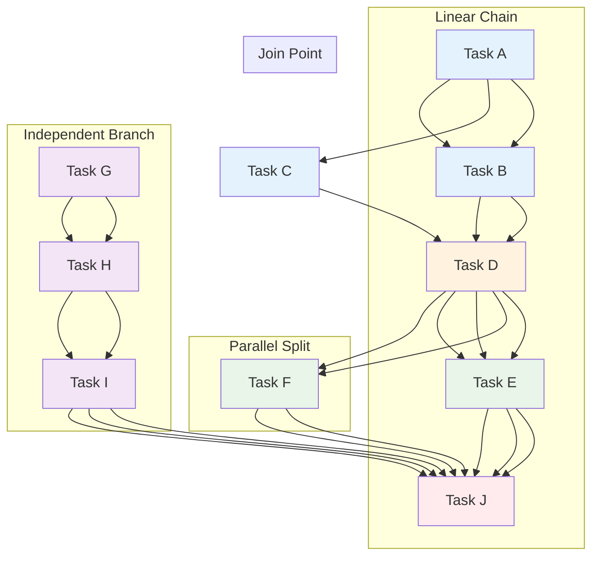

### Task Group Organization
```mermaid
graph TD
    subgraph "ETL Pipeline"
        START([Start]) --> ETL_CUSTOMERS
        START --> ETL_ORDERS
        START --> ETL_PRODUCTS

        subgraph "Customer ETL"
            ETL_CUSTOMERS --> C_EXTRACT[Extract]
            C_EXTRACT --> C_VALIDATE[Validate]
            C_VALIDATE --> C_TRANSFORM[Transform]
            C_TRANSFORM --> C_LOAD[Load]
        end

        subgraph "Order ETL"
            ETL_ORDERS --> O_EXTRACT[Extract]
            O_EXTRACT --> O_VALIDATE[Validate]
            O_VALIDATE --> O_TRANSFORM[Transform]
            O_TRANSFORM --> O_LOAD[Load]
        end

        subgraph "Product ETL"
            ETL_PRODUCTS --> P_EXTRACT[Extract]
            P_EXTRACT --> P_VALIDATE[Validate]
            P_VALIDATE --> P_TRANSFORM[Transform]
            P_TRANSFORM --> P_LOAD[Load]
        end

        C_LOAD --> END
        O_LOAD --> END
        P_LOAD --> END
    end

    END([End])

    subgraph "Task Group Benefits"
        ETL_CUSTOMERS -.-> "Logical grouping<br/>Cleaner DAG view<br/>Reusable patterns"
        C_EXTRACT -.-> "Same structure<br/>Different data"
    end

    style START fill:#e8f5e8
    style END fill:#ffebee
    style ETL_CUSTOMERS fill:#e3f2fd
    style ETL_ORDERS fill:#e3f2fd
    style ETL_PRODUCTS fill:#e3f2fd
```

## Scheduling and Execution

### Schedule Intervals Visualization
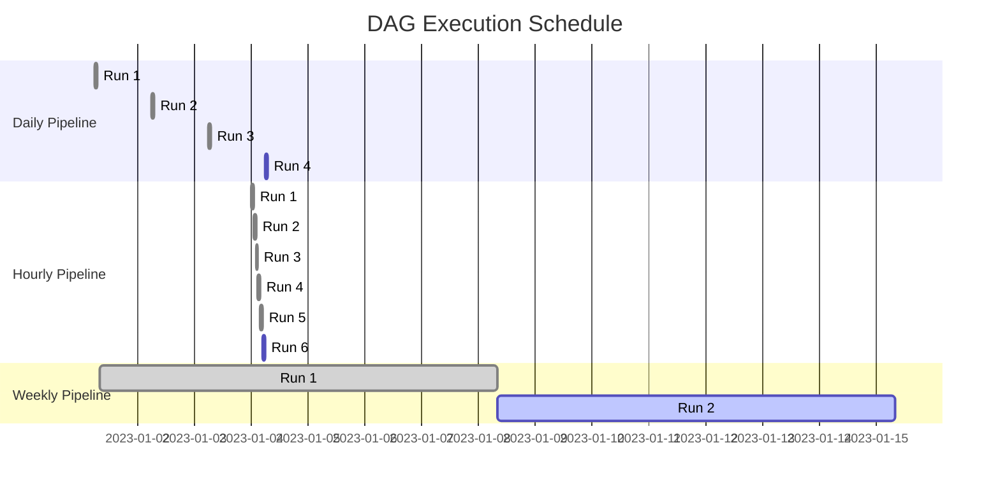

### Backfilling Visualization
```mermaid
gantt
    title Backfill Execution
    dateFormat YYYY-MM-DD
    section Original Runs
    2023-01-01      :done, 2023-01-01, 1d
    2023-01-02      :done, 2023-01-02, 1d
    2023-01-03      :done, 2023-01-03, 1d

    section Failed Runs
    2023-01-04      :crit, 2023-01-04, 1d
    2023-01-05      :crit, 2023-01-05, 1d
    2023-01-06      :crit, 2023-01-06, 1d

    section Backfill Runs
    2023-01-04      :active, 2023-01-04, 1d
    2023-01-05      :active, 2023-01-05, 1d
    2023-01-06      :active, 2023-01-06, 1d
    2023-01-07      :2023-01-07, 1d
```

## XCom Data Flow

### Task Communication Pattern
```mermaid
graph TD
    subgraph "Task A: Extract"
        A1[Read CSV File]
        A2[Count Rows]
        A3[Push to XCom<br/>key: 'row_count'<br/>value: 1000]
        A4[Push File Path<br/>key: 'file_path']
    end

    subgraph "Task B: Validate"
        B1[Pull Row Count<br/>from Task A]
        B2[Validate Count > 0]
        B3[Pull File Path]
        B4[Check File Exists]
        B5[Push Validation<br/>Results]
    end

    subgraph "Task C: Transform"
        C1[Pull Validation<br/>Results]
        C2[Pull File Path]
        C3[Process Data]
        C4[Push Transformed<br/>Data Path]
    end

    subgraph "Task D: Load"
        D1[Pull Transformed<br/>Data Path]
        D2[Load to Database]
        D3[Push Load Stats]
    end

    A1 --> A2 --> A3 --> A4
    A4 --> B1
    B1 --> B2 --> B3 --> B4 --> B5
    B5 --> C1
    C1 --> C2 --> C3 --> C4
    C4 --> D1 --> D2 --> D3

    subgraph "XCom Flow"
        A3 -.-> "Metadata passing<br/>between tasks"
        B5 -.-> "Validation status"
        C4 -.-> "File locations"
        D3 -.-> "Processing stats"
    end

    style A1 fill:#e3f2fd
    style B1 fill:#fff3e0
    style C1 fill:#f3e5f5
    style D1 fill:#e8f5e8
```

## Error Handling and Recovery

### Failure Recovery Pattern
```mermaid
graph TD
    START([Start]) --> MAIN[Main Process]

    MAIN --> SUCCESS{Success?}

    SUCCESS -->|Yes| CLEANUP[Cleanup Temp Files]
    SUCCESS -->|No| RETRY{Retry<br/>Count < 3?}

    RETRY -->|Yes| WAIT[Wait 5 minutes]
    RETRY -->|No| ALERT[Send Alert]

    WAIT --> MAIN
    ALERT --> RECOVERY[Manual Recovery<br/>Process]

    CLEANUP --> END([End])
    RECOVERY --> END

    subgraph "Error Handling"
        RETRY -.-> "Automatic retry<br/>with backoff"
        ALERT -.-> "Email/Slack alerts<br/>for failures"
        RECOVERY -.-> "Manual intervention<br/>for critical failures"
    end

    style START fill:#e8f5e8
    style END fill:#ffebee
    style MAIN fill:#e3f2fd
    style SUCCESS fill:#fff3e0
    style CLEANUP fill:#e8f5e8
    style ALERT fill:#ffebee
    style RECOVERY fill:#ffebee
```

### Circuit Breaker Pattern
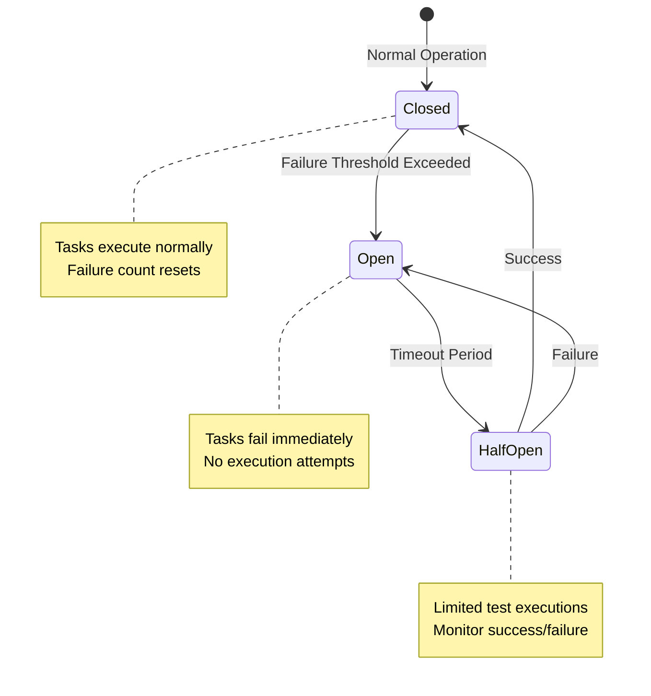

## Monitoring and Alerting

### DAG Health Dashboard
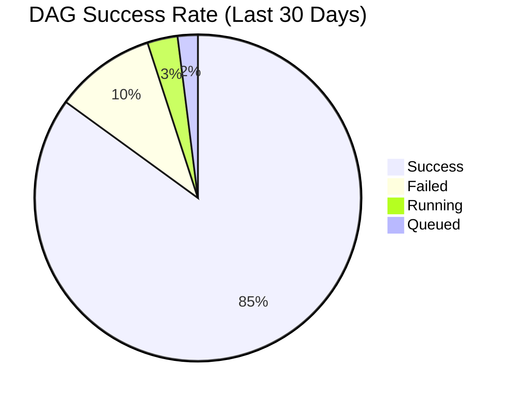

### Task Performance Metrics
```mermaid
gantt
    title Task Execution Times (Last 24 Hours)
    dateFormat HH:mm
    section Extract Tasks
    Customer Extract    :done, 00:00, 00:15
    Order Extract       :done, 00:05, 00:20
    Product Extract     :done, 00:10, 00:25

    section Transform Tasks
    Data Cleaning       :done, 00:20, 00:35
    Aggregation         :done, 00:25, 00:45
    Validation          :done, 00:30, 00:50

    section Load Tasks
    Dimension Load      :done, 00:40, 00:55
    Fact Load          :done, 00:45, 01:10
    Index Update       :done, 01:05, 01:15
```

### Resource Utilization
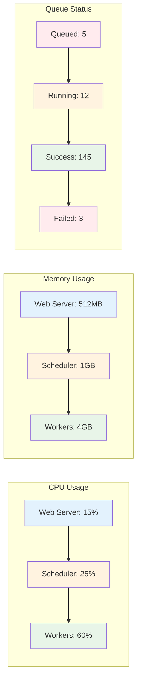

## Deployment Architectures

### Local Development Setup
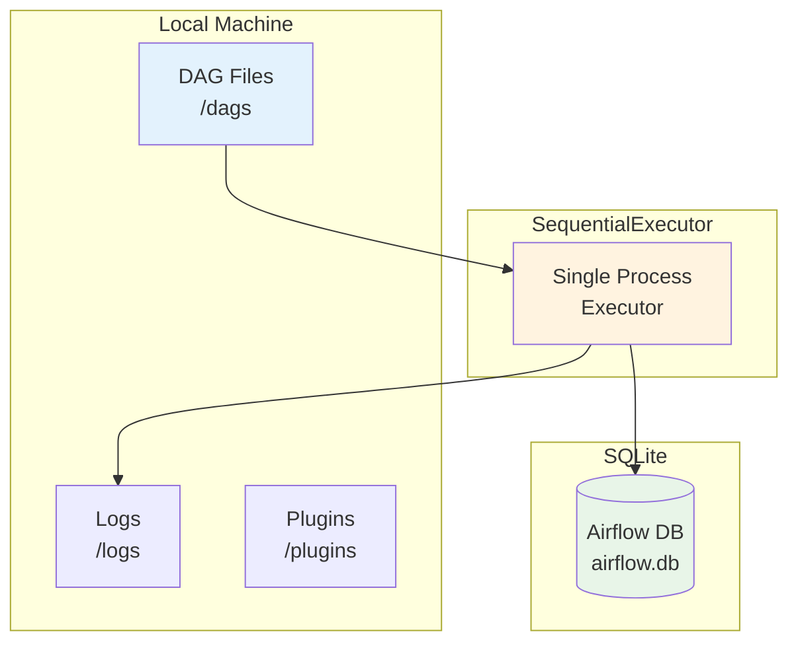

### Distributed Production Setup
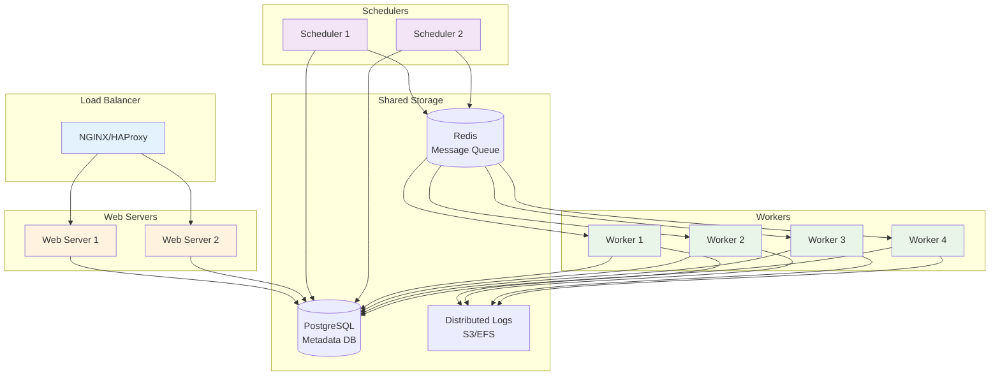

### Kubernetes Deployment
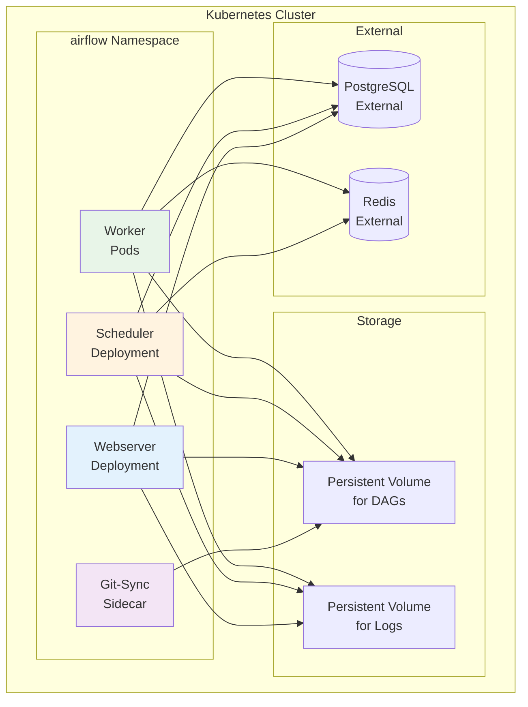

## Data Pipeline Monitoring

### Pipeline Health Overview
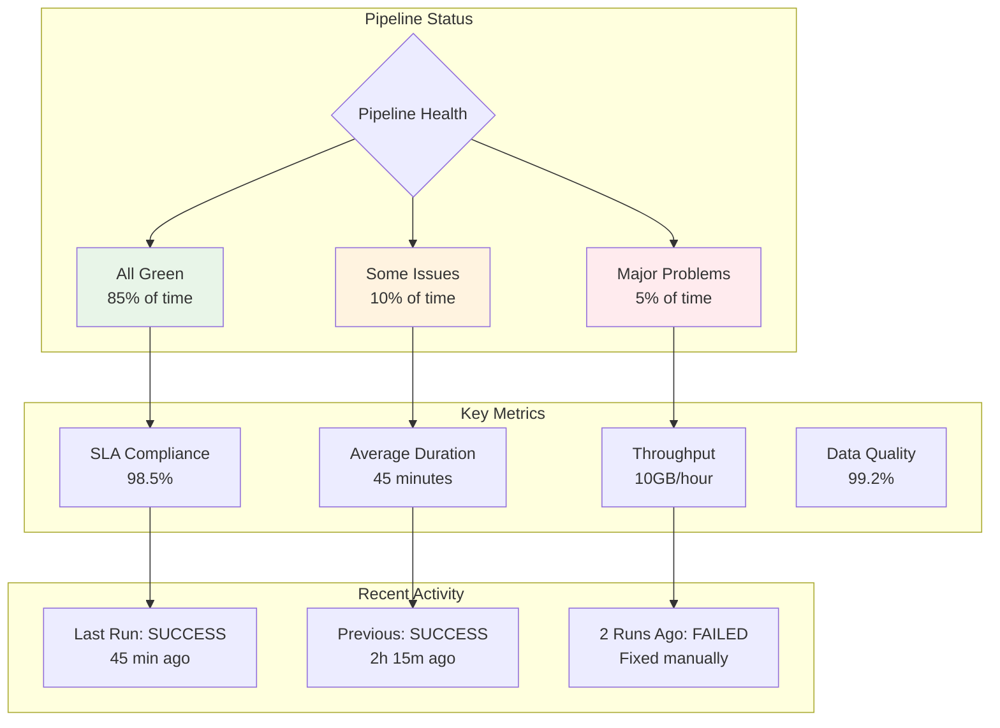

### Alert Escalation Flow
```mermaid
flowchart TD
    FAILURE[Task Failure<br/>Detected] --> RETRY{Retry<br/>Available?}

    RETRY -->|Yes| AUTO_RETRY[Automatic Retry<br/>With Backoff]
    RETRY -->|No| IMMEDIATE[Immediate Alert<br/>Team Notification]

    AUTO_RETRY --> SUCCESS{Success?}
    SUCCESS -->|Yes| RESOLVE[Issue Resolved<br/>Log Success]
    SUCCESS -->|No| IMMEDIATE

    IMMEDIATE --> EMAIL[Email Alert<br/>On-Call Engineer]
    EMAIL --> ACK{Acknowledged<br/>Within 15 min?}

    ACK -->|Yes| INVESTIGATE[Engineer<br/>Investigates]
    ACK -->|No| ESCALATE[Escalate to<br/>Senior Engineer]

    INVESTIGATE --> RESOLVE
    ESCALATE --> RESOLVE

    RESOLVE --> REPORT[Generate<br/>Incident Report]
    REPORT --> IMPROVE[Implement<br/>Improvements]

    subgraph "Escalation Timeline"
        EMAIL -.-> "Immediate"
        ACK -.-> "15 minutes"
        ESCALATE -.-> "30 minutes"
    end

    style FAILURE fill:#ffebee
    style RESOLVE fill:#e8f5e8
    style ESCALATE fill:#ffebee
```

## Summary

Apache Airflow visualization covers:

- **Architecture**: System components, executors, and deployment patterns
- **Workflows**: DAG structures, dependency patterns, branching logic
- **Execution**: Scheduling, backfilling, task states
- **Communication**: XCom data flow between tasks
- **Error Handling**: Recovery patterns, circuit breakers
- **Monitoring**: Health dashboards, performance metrics, alerting
- **Scaling**: Distributed setups, Kubernetes deployments

Key visual concepts:
- **Flow Diagrams**: Task dependencies and data flow
- **State Diagrams**: Task states and transitions
- **Gantt Charts**: Scheduling and execution timelines
- **Architecture Diagrams**: System components and interactions
- **Metrics Dashboards**: Performance monitoring and alerting
- **Deployment Diagrams**: Infrastructure and scaling patterns

These visualizations help understand complex workflow orchestration, making it easier to design, monitor, and troubleshoot data pipelines in production environments.
