# Apache Spark Visual Architecture Guide

## Spark Application Architecture

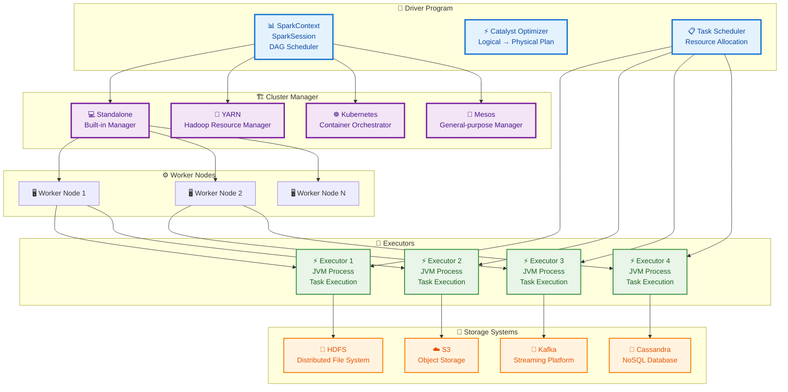

## RDD Execution Model

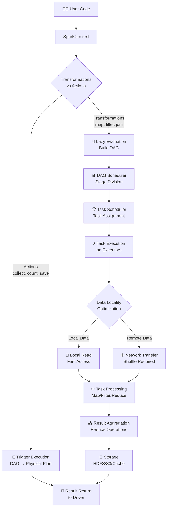

## Data Abstraction Layers

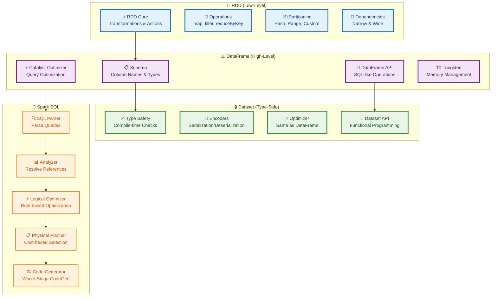

## Catalyst Query Optimization Pipeline

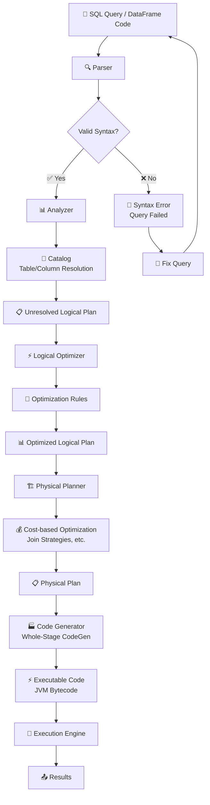

## Spark Streaming Architecture

```mermaid
graph TD
    %% Define styles
    classDef streamClass fill:#e3f2fd,stroke:#1976d2,stroke-width:3px,color:#0d47a1
    classDef dstreamClass fill:#f3e5f5,stroke:#7b1fa2,stroke-width:2px,color:#4a148c
    classDef structuredClass fill:#e8f5e8,stroke:#388e3c,stroke-width:2px,color:#1b5e20
    classDef sourceClass fill:#fff3e0,stroke:#f57c00,stroke-width:2px,color:#e65100

    subgraph "📊 DStreams (Original)"
        RECEIVER[📡 Receiver<br/>Data Ingestion]
        BLOCKS[📦 Blocks<br/>Data Batches]
        DSTREAM[🌊 DStream<br/>Sequence of RDDs]
        TRANSFORM[🔄 Transformations<br/>map, filter, window]
        OUTPUT[📤 Output Operations<br/>foreachRDD, saveAsTextFiles]
    end

    subgraph "🏗️ Structured Streaming"
        SOURCE[🔌 Source<br/>Kafka, File, Socket]
        DATAFRAME[📊 DataFrame<br/>Streaming DataFrame]
        QUERY[🔍 Streaming Query<br/>Continuous Processing]
        SINK[💾 Sink<br/>Console, File, Kafka]
        CHECKPOINT[📍 Checkpoint<br/>Fault Tolerance]
    end

    subgraph "🔄 Processing Models"
        MICRO_BATCH[⚡ Micro-batch<br/>Batch Interval Processing]
        CONTINUOUS[🌊 Continuous<br/>Row-by-row Processing]
        TRIGGER[⏰ Trigger<br/>Processing Triggers]
    end

    subgraph "💾 State Management"
        STATE_STORE[🏪 State Store<br/>Key-value Store]
        WATERMARK[🌊 Watermarking<br/>Late Data Handling]
        CHECKPOINTING[📋 Checkpointing<br/>Recovery Mechanism]
    end

    RECEIVER --> BLOCKS
    BLOCKS --> DSTREAM
    DSTREAM --> TRANSFORM
    TRANSFORM --> OUTPUT

    SOURCE --> DATAFRAME
    DATAFRAME --> QUERY
    QUERY --> SINK
    QUERY --> CHECKPOINT

    MICRO_BATCH --> CONTINUOUS
    CONTINUOUS --> TRIGGER

    STATE_STORE --> WATERMARK
    WATERMARK --> CHECKPOINTING

    %% Apply styles
    class RECEIVER,BLOCKS,DSTREAM,TRANSFORM,OUTPUT dstreamClass
    class SOURCE,DATAFRAME,QUERY,SINK,CHECKPOINT structuredClass
    class MICRO_BATCH,CONTINUOUS,TRIGGER streamClass
    class STATE_STORE,WATERMARK,CHECKPOINTING sourceClass
```

## MLlib Pipeline Architecture

```mermaid
graph TD
    %% Define styles
    classDef pipelineClass fill:#e3f2fd,stroke:#1976d2,stroke-width:3px,color:#0d47a1
    classDef transformerClass fill:#f3e5f5,stroke:#7b1fa2,stroke-width:2px,color:#4a148c
    classDef estimatorClass fill:#e8f5e8,stroke:#388e3c,stroke-width:2px,color:#1b5e20
    classDef evaluatorClass fill:#fff3e0,stroke:#f57c00,stroke-width:2px,color:#e65100

    subgraph "🔧 Pipeline Components"
        PIPELINE[📋 Pipeline<br/>Stages Orchestrator]
        STAGES[🎭 Pipeline Stages<br/>Transformers & Estimators]
        PARAMS[⚙️ Parameters<br/>Hyperparameter Tuning]
        MODEL[🤖 Fitted Model<br/>Transformer Chain]
    end

    subgraph "🔄 Transformers"
        TOKENIZER[✂️ Tokenizer<br/>Text → Words]
        VECTORIZER[🔢 VectorAssembler<br/>Features → Vector]
        SCALER[📏 StandardScaler<br/>Feature Scaling]
        ENCODER[🏷️ StringIndexer<br/>Categorical → Numeric]
    end

    subgraph "🎯 Estimators"
        LR[📈 LogisticRegression<br/>Binary Classification]
        RF[🌳 RandomForest<br/>Ensemble Learning]
        GBT[🚀 GBTClassifier<br/>Gradient Boosting]
        KMEANS[🎯 KMeans<br/>Clustering]
    end

    subgraph "📊 Evaluators"
        ACCURACY[✅ MulticlassClassificationEvaluator<br/>Accuracy Metrics]
        AUC[📈 BinaryClassificationEvaluator<br/>AUC-ROC]
        RMSE[📏 RegressionEvaluator<br/>RMSE]
        SILHOUETTE[🎭 ClusteringEvaluator<br/>Silhouette Score]
    end

    PIPELINE --> STAGES
    STAGES --> PARAMS
    PARAMS --> MODEL

    TOKENIZER --> VECTORIZER
    VECTORIZER --> SCALER
    SCALER --> ENCODER

    LR --> RF
    RF --> GBT
    GBT --> KMEANS

    ACCURACY --> AUC
    AUC --> RMSE
    RMSE --> SILHOUETTE

    %% Apply styles
    class PIPELINE,STAGES,PARAMS,MODEL pipelineClass
    class TOKENIZER,VECTORIZER,SCALER,ENCODER transformerClass
    class LR,RF,GBT,KMEANS estimatorClass
    class ACCURACY,AUC,RMSE,SILHOUETTE evaluatorClass
```

## Memory Management and Storage

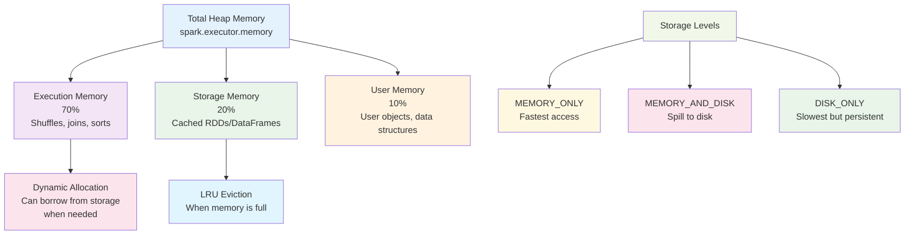

## Shuffle Operations and Data Partitioning

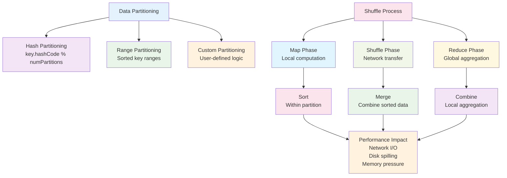

## Adaptive Query Execution (AQE)

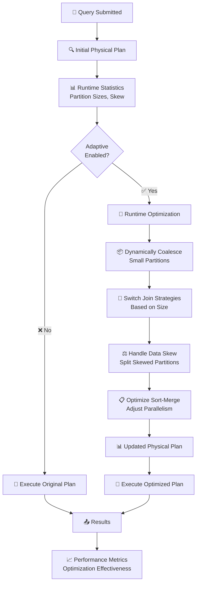

## Spark 3.x Performance Features

```mermaid
graph TD
    %% Define styles
    classDef perfClass fill:#e3f2fd,stroke:#1976d2,stroke-width:3px,color:#0d47a1
    classDef dynamicClass fill:#f3e5f5,stroke:#7b1fa2,stroke-width:2px,color:#4a148c
    classDef vectorizedClass fill:#e8f5e8,stroke:#388e3c,stroke-width:2px,color:#1b5e20
    classDef binaryClass fill:#fff3e0,stroke:#f57c00,stroke-width:2px,color:#e65100

    subgraph "🔄 Dynamic Partition Pruning"
        DYNAMIC_FILTER[🔍 Dynamic Filter<br/>Runtime Partition Elimination]
        DPP_BENEFIT[⚡ Reduces I/O<br/>Prune Unnecessary Partitions]
        DPP_EXAMPLE[📊 Example: Fact-Dimension Join<br/>Prune Dimension Partitions]
    end

    subgraph "⚡ Vectorized Query Execution"
        SIMD[🚀 SIMD Instructions<br/>Parallel Data Processing]
        COLUMNAR[📊 Columnar Processing<br/>Whole Column Operations]
        VECTORIZED_BENEFIT[📈 10x Performance<br/>For Parquet/ORC]
    end

    subgraph "🏗️ Binary Data Source"
        BINARY_FORMAT[📦 Binary Format<br/>High-Performance Storage]
        NESTED_SCHEMA[🔗 Nested Schema Support<br/>Complex Data Types]
        BINARY_BENEFIT[⚡ Faster Serialization<br/>Reduced CPU Usage]
    end

    subgraph "🎯 Query Compilation"
        CODE_GEN[🏭 Enhanced CodeGen<br/>Better JVM Optimization]
        INLINING[🔧 Method Inlining<br/>Reduced Function Calls]
        COMPILATION_BENEFIT[📈 Improved Throughput<br/>Lower Latency]
    end

    DYNAMIC_FILTER --> DPP_BENEFIT
    DPP_BENEFIT --> DPP_EXAMPLE

    SIMD --> COLUMNAR
    COLUMNAR --> VECTORIZED_BENEFIT

    BINARY_FORMAT --> NESTED_SCHEMA
    NESTED_SCHEMA --> BINARY_BENEFIT

    CODE_GEN --> INLINING
    INLINING --> COMPILATION_BENEFIT

    %% Apply styles
    class DYNAMIC_FILTER,DPP_BENEFIT,DPP_EXAMPLE dynamicClass
    class SIMD,COLUMNAR,VECTORIZED_BENEFIT vectorizedClass
    class BINARY_FORMAT,NESTED_SCHEMA,BINARY_BENEFIT binaryClass
    class CODE_GEN,INLINING,COMPILATION_BENEFIT perfClass
```

## Cluster Deployment Options

```mermaid
graph TD
    %% Define styles
    classDef standaloneClass fill:#e3f2fd,stroke:#1976d2,stroke-width:3px,color:#0d47a1
    classDef yarnClass fill:#f3e5f5,stroke:#7b1fa2,stroke-width:2px,color:#4a148c
    classDef k8sClass fill:#e8f5e8,stroke:#388e3c,stroke-width:2px,color:#1b5e20
    classDef cloudClass fill:#fff3e0,stroke:#f57c00,stroke-width:2px,color:#e65100

    subgraph "💻 Standalone Mode"
        STANDALONE_MASTER[🎯 Master Node<br/>Resource Manager]
        STANDALONE_WORKERS[👥 Worker Nodes<br/>Executor Hosts]
        STANDALONE_DEPLOY[🚀 spark-submit<br/>Direct Submission]
        STANDALONE_SCALING[📈 Manual Scaling<br/>Add/Remove Workers]
    end

    subgraph "🧵 YARN Integration"
        YARN_RM[🎛️ ResourceManager<br/>Cluster Resource Mgmt]
        YARN_NM[📊 NodeManager<br/>Per-node Resource Mgmt]
        YARN_APP_MASTER[👑 ApplicationMaster<br/>Spark App Coordinator]
        YARN_CONTAINERS[📦 Containers<br/>Executor Processes]
    end

    subgraph "☸️ Kubernetes Native"
        K8S_API[🔌 Kubernetes API<br/>Cluster Control Plane]
        K8S_PODS[📦 Pods<br/>Containerized Executors]
        K8S_SERVICES[🔗 Services<br/>Driver Communication]
        K8S_VOLUMES[💾 Persistent Volumes<br/>Data Persistence]
    end

    subgraph "☁️ Cloud Platforms"
        EMR[🌀 Amazon EMR<br/>Managed Spark Clusters]
        DATABRICKS[🔷 Databricks<br/>Unified Analytics Platform]
        DPH[🔥 Google Dataproc<br/>Managed Hadoop/Spark]
        HDINSIGHT[🔵 Azure HDInsight<br/>Cloud Hadoop/Spark]
    end

    STANDALONE_MASTER --> STANDALONE_WORKERS
    STANDALONE_WORKERS --> STANDALONE_DEPLOY
    STANDALONE_DEPLOY --> STANDALONE_SCALING

    YARN_RM --> YARN_NM
    YARN_NM --> YARN_APP_MASTER
    YARN_APP_MASTER --> YARN_CONTAINERS

    K8S_API --> K8S_PODS
    K8S_PODS --> K8S_SERVICES
    K8S_SERVICES --> K8S_VOLUMES

    EMR --> DATABRICKS
    DATABRICKS --> DPH
    DPH --> HDINSIGHT

    %% Apply styles
    class STANDALONE_MASTER,STANDALONE_WORKERS,STANDALONE_DEPLOY,STANDALONE_SCALING standaloneClass
    class YARN_RM,YARN_NM,YARN_APP_MASTER,YARN_CONTAINERS yarnClass
    class K8S_API,K8S_PODS,K8S_SERVICES,K8S_VOLUMES k8sClass
    class EMR,DATABRICKS,DPH,HDINSIGHT cloudClass
```

## Data Lakehouse Architecture with Spark

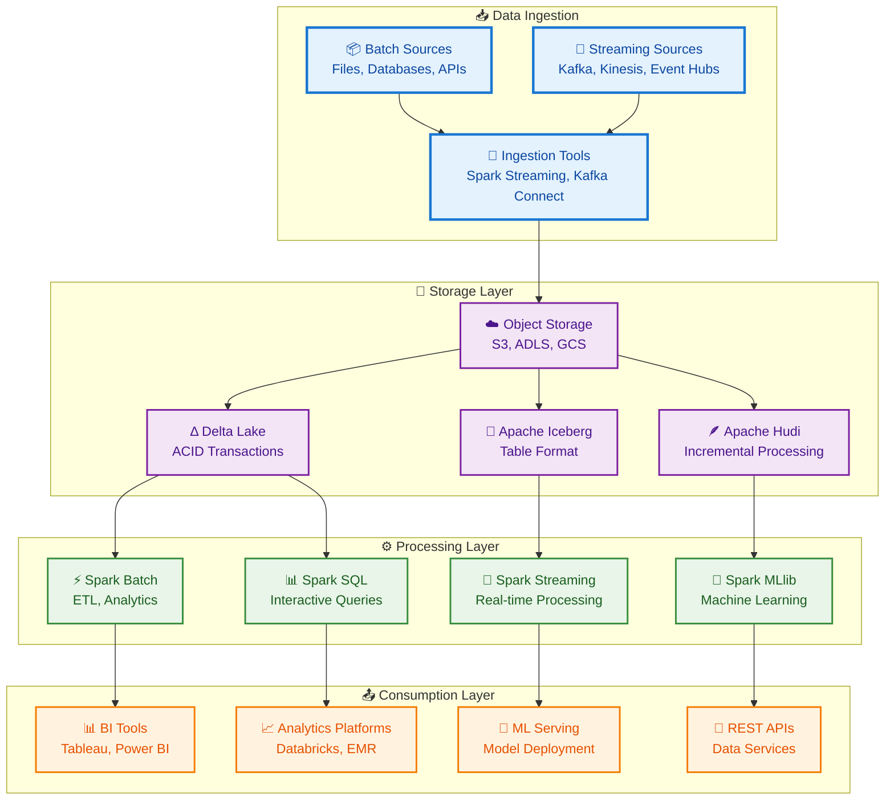

## Summary

Apache Spark's visual architecture reveals a sophisticated, layered system designed for scalable data processing:

- **Unified Engine**: Single platform for diverse workloads (batch, streaming, ML, graph)
- **Layered Abstractions**: RDD → DataFrame → Dataset progression with increasing optimization
- **Adaptive Optimization**: Runtime query plan adjustments based on actual data characteristics
- **Flexible Deployment**: Support for various cluster managers and cloud platforms
- **Rich Ecosystem**: Deep integration with storage systems, streaming platforms, and analytics tools

The combination of in-memory processing, advanced optimization, and high-level APIs makes Spark a cornerstone of modern big data architectures, enabling organizations to process massive datasets efficiently across diverse use cases.
