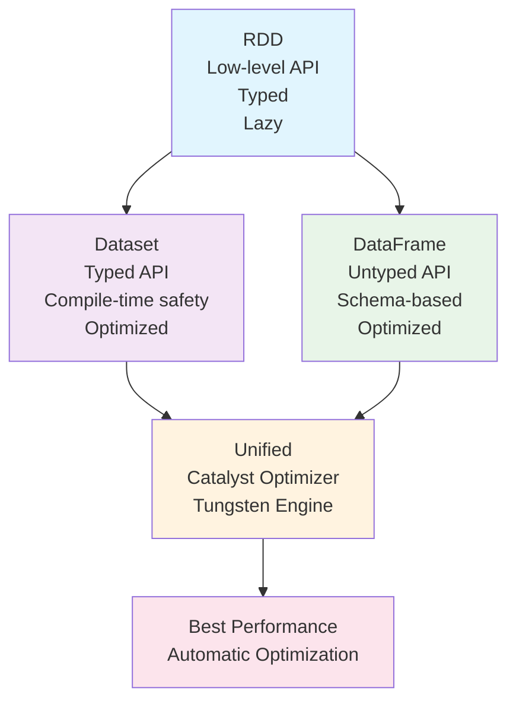
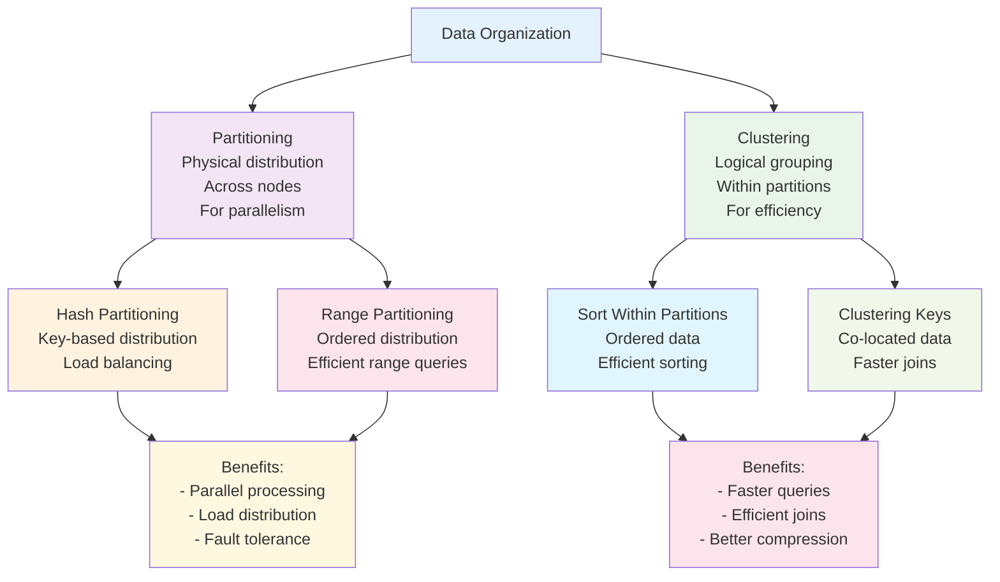
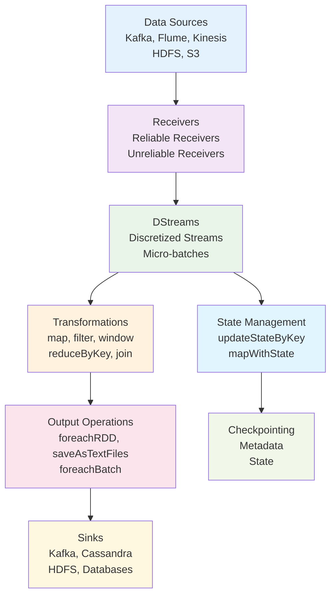
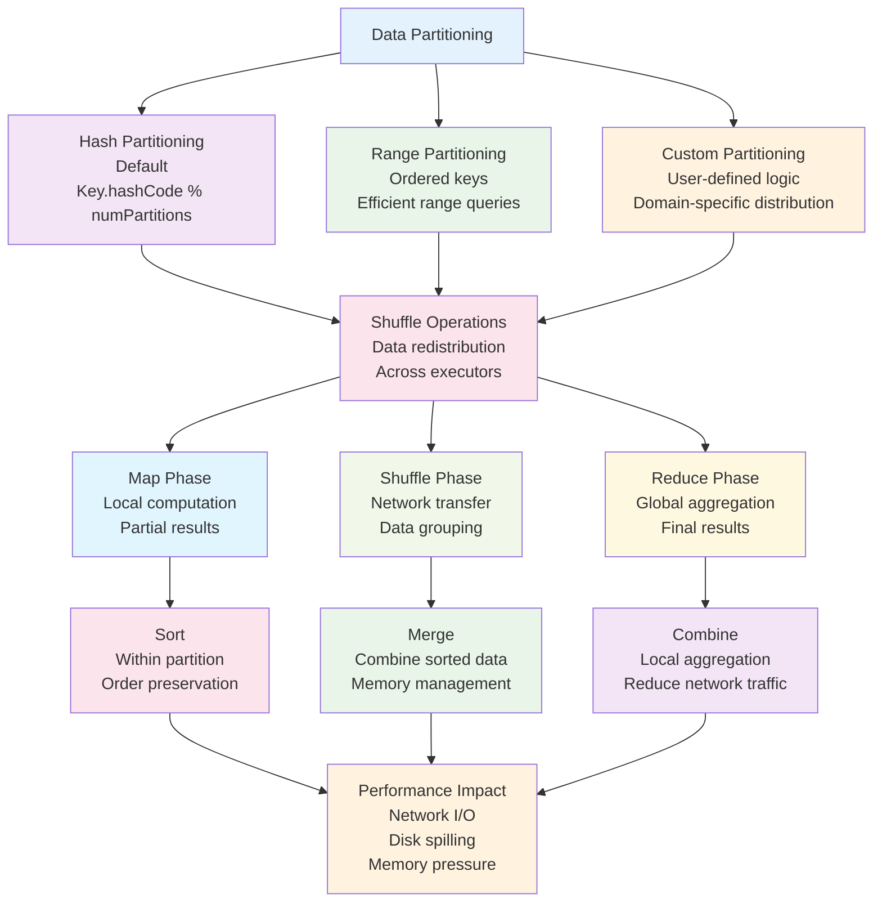
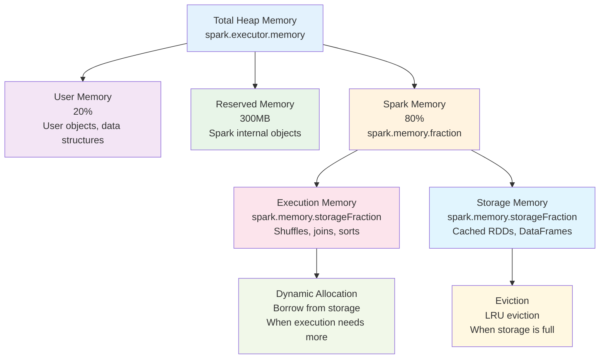

# Apache Spark: Unified Analytics Engine

## What is Apache Spark?

Apache Spark is a unified analytics engine for large-scale data processing. It provides high-level APIs in Java, Scala, Python, and R, and an optimized engine that supports general computation graphs for data analysis. Spark was originally developed at UC Berkeley's AMPLab and later donated to the Apache Software Foundation.

## Core Architecture

### Spark Application Architecture

```scala
// Spark Application Structure
val spark = SparkSession.builder()
  .appName("My Spark Application")
  .config("spark.master", "local[*]")
  .getOrCreate()

// DataFrame API
val df = spark.read.json("data.json")
df.filter($"age" > 21).groupBy($"city").count().show()

spark.stop()
```

### Key Components

1. **Spark Core**: Foundation providing distributed task dispatching, scheduling, and basic I/O functionalities
2. **Spark SQL**: Module for structured data processing with DataFrame and Dataset APIs
3. **Spark Streaming**: Real-time data stream processing capabilities
4. **MLlib**: Machine learning library with algorithms and utilities
5. **GraphX**: Graph computation engine for graph-parallel computations

### Execution Model

```scala
// RDD Execution Model
val rdd = sc.parallelize(Seq(1, 2, 3, 4, 5))
val result = rdd.map(_ * 2).filter(_ > 5).collect()
// Transformations are lazy, collect() triggers execution
```

## Data Abstraction Layers

### Resilient Distributed Datasets (RDDs)

RDDs are the fundamental data structure in Spark, representing an immutable, partitioned collection of elements that can be operated on in parallel.

```scala
// RDD Operations
val rdd = sc.textFile("hdfs://path/to/file")

// Transformations (lazy)
val words = rdd.flatMap(line => line.split(" "))
val wordPairs = words.map(word => (word, 1))
val wordCounts = wordPairs.reduceByKey(_ + _)

// Actions (eager)
wordCounts.collect()
wordCounts.saveAsTextFile("output")
```

**RDD Characteristics:**
- **Immutable**: Cannot be changed after creation
- **Resilient**: Automatically recovers from node failures
- **Distributed**: Data partitioned across cluster nodes
- **Typed**: Elements have consistent data types

### DataFrames and Datasets

DataFrames provide a higher-level abstraction similar to relational tables, with optimizations through Catalyst optimizer.

```scala
// DataFrame API
import spark.implicits._

val df = Seq(
  (1, "Alice", 25),
  (2, "Bob", 30),
  (3, "Charlie", 35)
).toDF("id", "name", "age")

// SQL-like operations
df.filter($"age" > 28)
  .groupBy($"name")
  .agg(count("*").as("count"))
  .orderBy($"count".desc)
  .show()
```

**DataFrame vs Dataset:**
- **DataFrame**: Untyped, similar to Python/R DataFrames
- **Dataset**: Typed, provides compile-time type safety
- **Performance**: Both optimized by Catalyst optimizer

## Spark Transformations and Actions

### RDD Transformations

Transformations create new RDDs from existing ones. They are lazy - not executed until an action is called.

#### Basic Transformations

```scala
val rdd = sc.parallelize(Seq(1, 2, 3, 4, 5))

// map: Apply function to each element
val doubled = rdd.map(_ * 2)  // [2, 4, 6, 8, 10]

// filter: Keep elements matching predicate
val evens = rdd.filter(_ % 2 == 0)  // [2, 4]

// flatMap: Apply function returning sequence, flatten result
val words = sc.parallelize(Seq("hello world", "spark rocks"))
val flattened = words.flatMap(_.split(" "))  // [hello, world, spark, rocks]

// distinct: Remove duplicates
val unique = sc.parallelize(Seq(1, 2, 2, 3, 3, 3)).distinct()  // [1, 2, 3]
```

#### Key-Value Transformations

```scala
val kvRDD = sc.parallelize(Seq(("a", 1), ("b", 2), ("a", 3), ("c", 4)))

// mapValues: Apply function to values only
val mappedValues = kvRDD.mapValues(_ * 10)  // [("a", 10), ("b", 20), ("a", 30), ("c", 40)]

// reduceByKey: Aggregate values by key
val reduced = kvRDD.reduceByKey(_ + _)  // [("a", 4), ("b", 2), ("c", 4)]

// groupByKey: Group values by key
val grouped = kvRDD.groupByKey()  // [("a", [1, 3]), ("b", [2]), ("c", [4])]

// sortByKey: Sort by key
val sorted = kvRDD.sortByKey()  // [("a", 1), ("a", 3), ("b", 2), ("c", 4)]

// join: Join two RDDs by key
val other = sc.parallelize(Seq(("a", "x"), ("b", "y"), ("d", "z")))
val joined = kvRDD.join(other)  // [("a", (1, "x")), ("a", (3, "x")), ("b", (2, "y"))]
```

#### Advanced Transformations

```scala
// union: Combine two RDDs
val rdd1 = sc.parallelize(Seq(1, 2, 3))
val rdd2 = sc.parallelize(Seq(3, 4, 5))
val unioned = rdd1.union(rdd2)  // [1, 2, 3, 3, 4, 5]

// intersection: Common elements
val intersected = rdd1.intersection(rdd2)  // [3]

// subtract: Elements in first but not second
val subtracted = rdd1.subtract(rdd2)  // [1, 2]

// cartesian: Cartesian product
val cartesian = rdd1.cartesian(rdd2)  // [(1,3), (1,4), (1,5), (2,3), ...]

// coalesce: Reduce number of partitions
val coalesced = rdd.repartition(10).coalesce(5)

// repartition: Increase/decrease partitions
val repartitioned = rdd.repartition(8)

// zip: Zip two RDDs together
val zipped = rdd1.zip(rdd2)  // [(1,3), (2,4), (3,5)]
```

### RDD Actions

Actions trigger computation and return results to the driver or write to external storage.

#### Basic Actions

```scala
val rdd = sc.parallelize(Seq(1, 2, 3, 4, 5))

// collect: Return all elements to driver
val allElements = rdd.collect()  // Array(1, 2, 3, 4, 5)

// count: Count elements
val count = rdd.count()  // 5

// first: Get first element
val first = rdd.first()  // 1

// take: Take first n elements
val taken = rdd.take(3)  // Array(1, 2, 3)

// takeOrdered: Take first n elements in order
val ordered = rdd.takeOrdered(3)  // Array(1, 2, 3)

// top: Get top n elements
val top = rdd.top(2)  // Array(5, 4)
```

#### Key-Value Actions

```scala
val kvRDD = sc.parallelize(Seq(("a", 1), ("b", 2), ("a", 3)))

// countByKey: Count occurrences of each key
val counts = kvRDD.countByKey()  // Map(a -> 2, b -> 1)

// collectAsMap: Collect as Map
val asMap = kvRDD.collectAsMap()  // Map(a -> 3, b -> 2) - last value wins

// lookup: Get all values for a key
val lookup = kvRDD.lookup("a")  // Seq(1, 3)
```

#### Storage Actions

```scala
// saveAsTextFile: Save as text files
rdd.saveAsTextFile("hdfs://path/to/output")

// saveAsObjectFile: Save as serialized objects
rdd.saveAsObjectFile("hdfs://path/to/objects")

// saveAsSequenceFile: Save as SequenceFile
kvRDD.saveAsSequenceFile("hdfs://path/to/sequence")
```

### DataFrame Transformations

DataFrame transformations are also lazy and create new DataFrames.

#### Selection and Projection

```scala
val df = Seq(
  (1, "Alice", 25, "Engineering"),
  (2, "Bob", 30, "Sales"),
  (3, "Charlie", 35, "Engineering")
).toDF("id", "name", "age", "dept")

// select: Select columns
val selected = df.select("name", "age")

// selectExpr: Select with expressions
val selectedExpr = df.selectExpr("name", "age * 2 as double_age")

// withColumn: Add or replace column
val withCol = df.withColumn("senior", $"age" > 30)

// withColumnRenamed: Rename column
val renamed = df.withColumnRenamed("dept", "department")

// drop: Drop columns
val dropped = df.drop("id")
```

#### Filtering

```scala
// filter/where: Filter rows
val filtered = df.filter($"age" > 28)
val whereFiltered = df.where("dept = 'Engineering'")

// distinct: Remove duplicate rows
val distinctRows = df.distinct()

// dropDuplicates: Remove duplicates with subset
val dropDup = df.dropDuplicates("dept")
```

#### Aggregation

```scala
import org.apache.spark.sql.functions._

// groupBy: Group and aggregate
val grouped = df.groupBy("dept")
  .agg(
    count("*").as("count"),
    avg("age").as("avg_age"),
    max("age").as("max_age")
  )

// rollup: Hierarchical aggregation
val rollup = df.rollup("dept")
  .agg(sum("age").as("total_age"))
  .orderBy("dept")

// cube: Multi-dimensional aggregation
val cube = df.cube("dept")
  .agg(avg("age").as("avg_age"))
```

#### Joins

```scala
val deptDF = Seq(
  ("Engineering", "Tech"),
  ("Sales", "Business")
).toDF("dept", "division")

// join: Join DataFrames
val joined = df.join(deptDF, "dept")

// join with different join types
val leftJoin = df.join(deptDF, Seq("dept"), "left")
val innerJoin = df.join(deptDF, Seq("dept"), "inner")
val fullJoin = df.join(deptDF, Seq("dept"), "full")
```

#### Window Functions

```scala
import org.apache.spark.sql.expressions.Window

// Define window specification
val windowSpec = Window
  .partitionBy("dept")
  .orderBy("age")
  .rowsBetween(Window.unboundedPreceding, Window.currentRow)

// Window functions
val withRank = df.withColumn("rank", rank().over(windowSpec))
val withRunningTotal = df.withColumn("running_total", sum("age").over(windowSpec))
val withLag = df.withColumn("prev_age", lag("age", 1).over(windowSpec))
```

#### Set Operations

```scala
val df1 = Seq((1, "A"), (2, "B")).toDF("id", "value")
val df2 = Seq((2, "B"), (3, "C")).toDF("id", "value")

// union: Combine rows
val unioned = df1.union(df2)

// unionByName: Union with column name matching
val unionByName = df1.unionByName(df2)

// intersect: Common rows
val intersected = df1.intersect(df2)

// except: Rows in first but not second
val excepted = df1.except(df2)
```

### DataFrame Actions

```scala
// show: Display DataFrame
df.show()

// collect: Return all rows as Array
val rows = df.collect()

// head/take: Get first n rows
val head = df.head(5)
val taken = df.take(3)

// count: Count rows
val rowCount = df.count()

// describe: Summary statistics
val summary = df.describe()

// write: Write to external storage
df.write
  .format("parquet")
  .mode("overwrite")
  .save("path/to/output")
```

### Dataset Transformations

Datasets provide typed transformations with compile-time safety.

```scala
case class Person(id: Int, name: String, age: Int)

// Create Dataset
val ds = Seq(
  Person(1, "Alice", 25),
  Person(2, "Bob", 30)
).toDS()

// Typed transformations
val adults = ds.filter(_.age >= 18)
val names = ds.map(_.name)
val withBonus = ds.map(p => p.copy(age = p.age + 1))

// Join with type safety
val ds2 = Seq(Person(3, "Charlie", 35)).toDS()
val combined = ds.union(ds2)
```

## Spark Data Abstractions Comparison

### DataFrame vs Dataset vs RDD



**Key Differences:**

| Aspect | RDD | DataFrame | Dataset |
|--------|-----|-----------|---------|
| **Type Safety** | Compile-time | Runtime | Compile-time |
| **Optimization** | Manual | Automatic (Catalyst) | Automatic (Catalyst) |
| **API Style** | Functional | SQL-like | Functional + SQL |
| **Performance** | Good (manual tuning) | Excellent | Excellent |
| **Use Case** | Low-level control | Analytics/ML | Type-safe analytics |

### Partitioning vs Clustering



**Partitioning Strategies:**

```scala
// Hash Partitioning (default)
val hashPartitioned = rdd.partitionBy(new HashPartitioner(10))

// Range Partitioning
val rangePartitioned = rdd.partitionBy(new RangePartitioner(10, rdd))

// Custom Partitioning
class CustomPartitioner extends Partitioner {
  override def numPartitions: Int = 10
  override def getPartition(key: Any): Int = key.hashCode % numPartitions
}
```

**Clustering Techniques:**

```scala
// Sort data within partitions
val sortedWithinPartitions = rdd.repartitionAndSortWithinPartitions(new CustomPartitioner)

// Bucketed tables (DataFrame)
df.write
  .bucketBy(4, "column")
  .sortBy("column")
  .saveAsTable("bucketed_table")

// Z-ordering for multi-dimensional clustering
// (Available in Delta Lake)
```

## Spark SQL and Catalyst Optimizer

### Catalyst Optimizer

Catalyst is Spark SQL's query optimizer that uses advanced programming language features to build an extensible query optimizer.

```scala
// Logical Plan -> Physical Plan Optimization
val df = spark.read.parquet("sales.parquet")
val result = df
  .filter($"amount" > 1000)
  .groupBy($"category")
  .agg(sum($"amount").as("total"))
  .filter($"total" > 50000)

// Catalyst automatically:
// 1. Pushes down filters
// 2. Reorders operations
// 3. Chooses optimal join strategies
// 4. Selects appropriate data sources
```

### Query Execution Pipeline

1. **Parsing**: SQL/Catalyst parses query into Unresolved Logical Plan
2. **Analysis**: Binds column/table references using Catalog
3. **Optimization**: Applies logical optimizations (predicate pushdown, constant folding)
4. **Physical Planning**: Converts to Physical Plan with cost-based optimization
5. **Code Generation**: Generates efficient Java bytecode (Whole-Stage CodeGen)
6. **Execution**: Runs on Spark execution engine

## Spark Streaming

### Discretized Streams (DStreams)

DStreams represent a continuous stream of data, divided into batches for processing.

```scala
// DStream Example
val ssc = new StreamingContext(spark.sparkContext, Seconds(1))

val lines = ssc.socketTextStream("localhost", 9999)
val words = lines.flatMap(_.split(" "))
val wordCounts = words.map(word => (word, 1)).reduceByKey(_ + _)

wordCounts.print()
ssc.start()
ssc.awaitTermination()
```

### Structured Streaming

Structured Streaming provides a higher-level API based on DataFrames/Datasets for stream processing.

```scala
// Structured Streaming
val spark = SparkSession.builder().getOrCreate()

val df = spark.readStream
  .format("kafka")
  .option("kafka.bootstrap.servers", "localhost:9092")
  .option("subscribe", "topic1")
  .load()

val result = df
  .selectExpr("CAST(key AS STRING)", "CAST(value AS STRING)")
  .groupBy(window($"timestamp", "10 minutes"), $"key")
  .count()

val query = result.writeStream
  .outputMode("complete")
  .format("console")
  .start()

query.awaitTermination()
```

**Output Modes:**
- **Append**: Only new rows added to result table
- **Complete**: Entire result table rewritten
- **Update**: Only changed rows updated

### Spark Streaming Architecture



## MLlib: Machine Learning Library

### ML Pipeline API

MLlib provides a high-level API for building machine learning pipelines.

```scala
import org.apache.spark.ml.Pipeline
import org.apache.spark.ml.classification.LogisticRegression
import org.apache.spark.ml.feature.{VectorAssembler, StringIndexer}

// Feature Engineering
val indexer = new StringIndexer()
  .setInputCol("category")
  .setOutputCol("categoryIndex")

val assembler = new VectorAssembler()
  .setInputCols(Array("feature1", "feature2", "categoryIndex"))
  .setOutputCol("features")

// Model
val lr = new LogisticRegression()
  .setLabelCol("label")
  .setFeaturesCol("features")

// Pipeline
val pipeline = new Pipeline()
  .setStages(Array(indexer, assembler, lr))

// Train
val model = pipeline.fit(trainingData)

// Predict
val predictions = model.transform(testData)
```

### Key Algorithms

- **Classification**: Logistic Regression, Decision Trees, Random Forest, Gradient-Boosted Trees, SVM
- **Regression**: Linear Regression, Decision Tree Regression, Random Forest Regression
- **Clustering**: K-Means, Gaussian Mixture, Bisecting K-Means
- **Collaborative Filtering**: ALS (Alternating Least Squares)
- **Feature Engineering**: TF-IDF, Word2Vec, PCA, Chi-Squared Selector

## GraphX: Graph Processing

GraphX extends Spark RDD with graph computation capabilities.

```scala
import org.apache.spark.graphx._

// Create Graph
val vertices: RDD[(VertexId, (String, Int))] = sc.parallelize(Seq(
  (1L, ("Alice", 28)),
  (2L, ("Bob", 27)),
  (3L, ("Charlie", 65)),
  (4L, ("David", 42))
))

val edges: RDD[Edge[Int]] = sc.parallelize(Seq(
  Edge(1L, 2L, 7),  // Alice follows Bob
  Edge(2L, 3L, 4),  // Bob follows Charlie
  Edge(3L, 4L, 2)   // Charlie follows David
))

val graph = Graph(vertices, edges)

// Graph Operations
val degrees: RDD[(VertexId, Int)] = graph.degrees
val pageRank = graph.pageRank(0.0001).vertices
val connectedComponents = graph.connectedComponents().vertices
```

## Cluster Managers

### Standalone Mode

Spark's built-in cluster manager for development and small clusters.

```bash
# Start Master
$SPARK_HOME/sbin/start-master.sh

# Start Workers
$SPARK_HOME/sbin/start-worker.sh spark://master-host:7077

# Submit Application
$SPARK_HOME/bin/spark-submit \
  --class com.example.MyApp \
  --master spark://master-host:7077 \
  myapp.jar
```

### YARN (Yet Another Resource Negotiator)

Integration with Hadoop YARN for resource management.

```bash
# Submit to YARN
spark-submit \
  --master yarn \
  --deploy-mode cluster \
  --class com.example.MyApp \
  myapp.jar
```

### Kubernetes

Native Kubernetes support for containerized deployments.

```bash
# Submit to Kubernetes
spark-submit \
  --master k8s://https://kubernetes-cluster:443 \
  --deploy-mode cluster \
  --class com.example.MyApp \
  --conf spark.kubernetes.container.image=myapp:latest \
  myapp.jar
```

## Performance Optimization

### Shuffle Operations and Data Partitioning



### Data Partitioning

```scala
// Custom Partitioning
val partitionedRDD = rdd.partitionBy(new HashPartitioner(100))

// Co-partitioning for Joins
val rdd1 = sc.parallelize(Seq((1, "A"), (2, "B"))).partitionBy(new HashPartitioner(10))
val rdd2 = sc.parallelize(Seq((1, "X"), (2, "Y"))).partitionBy(new HashPartitioner(10))

val joined = rdd1.join(rdd2)  // Efficient join due to co-partitioning
```

### Caching and Persistence

```scala
// Cache Strategies
val df = spark.read.parquet("large-dataset.parquet")

// MEMORY_ONLY: Store deserialized objects in memory
df.cache()

// MEMORY_AND_DISK: Spill to disk if memory insufficient
df.persist(StorageLevel.MEMORY_AND_DISK)

// MEMORY_ONLY_SER: Store serialized objects (more CPU, less memory)
df.persist(StorageLevel.MEMORY_ONLY_SER)

// Custom Storage Level
import org.apache.spark.storage.StorageLevel
df.persist(StorageLevel.MEMORY_AND_DISK_SER_2)
```

### Broadcast Variables

```scala
// Broadcast large read-only variables
val broadcastVar = sc.broadcast(Array(1, 2, 3, 4, 5))

val result = rdd.map(x => x + broadcastVar.value.sum)
// Broadcast variable sent to each executor once, not with each task
```

### Accumulators

```scala
// Accumulate values across executors
val counter = sc.longAccumulator("counter")

rdd.foreach(x => {
  if (x % 2 == 0) counter.add(1)
})

println(s"Even numbers: ${counter.value}")
```

## Memory Management

### Spark Memory Architecture



### Execution Memory vs Storage Memory

- **Execution Memory**: Used for computations (joins, sorts, aggregations)
- **Storage Memory**: Used for cached RDDs/DataFrames
- **Dynamic Allocation**: Memory can be borrowed between execution and storage

### Memory Tuning

```scala
// Memory Configuration
val spark = SparkSession.builder()
  .config("spark.driver.memory", "4g")
  .config("spark.executor.memory", "8g")
  .config("spark.memory.fraction", "0.8")  // 80% for execution/storage
  .config("spark.memory.storageFraction", "0.5")  // 50% of heap for storage
  .getOrCreate()
```

## Data Sources and Formats

### Built-in Data Sources

```scala
// JSON
val df = spark.read.json("data.json")

// Parquet (default columnar format)
val df = spark.read.parquet("data.parquet")

// CSV
val df = spark.read
  .option("header", "true")
  .option("inferSchema", "true")
  .csv("data.csv")

// JDBC
val df = spark.read
  .format("jdbc")
  .option("url", "jdbc:postgresql://localhost/db")
  .option("dbtable", "table")
  .option("user", "username")
  .option("password", "password")
  .load()
```

### Custom Data Sources

```scala
// Custom Data Source
class CustomDataSource extends DataSourceRegister with RelationProvider {
  override def shortName(): String = "custom"

  override def createRelation(sqlContext: SQLContext, parameters: Map[String, String]): BaseRelation = {
    // Implementation
  }
}

// Usage
val df = spark.read
  .format("custom")
  .option("param1", "value1")
  .load()
```

## Security

### Authentication and Authorization

```scala
// Kerberos Authentication
val spark = SparkSession.builder()
  .config("spark.hadoop.hadoop.security.authentication", "kerberos")
  .config("spark.hadoop.hadoop.security.authorization", "true")
  .getOrCreate()
```

### Data Encryption

- **In-transit**: TLS/SSL encryption for network communication
- **At-rest**: Encryption of data stored in HDFS/S3
- **Column-level**: Encrypt sensitive columns in DataFrames

## Monitoring and Debugging

### Spark UI

Spark provides a web UI for monitoring applications:

- **Jobs**: High-level view of job execution
- **Stages**: Breakdown of jobs into stages
- **Tasks**: Individual task execution details
- **Storage**: Cached RDDs and DataFrames
- **Environment**: Configuration and system properties
- **Executors**: Resource usage and task distribution

### Metrics and Logging

```scala
// Custom Metrics
val sparkContext = spark.sparkContext
val myCounter = sparkContext.longAccumulator("myCounter")

// Structured Logging
import org.apache.log4j.{Level, Logger}
Logger.getLogger("org").setLevel(Level.ERROR)

// Event Logging
spark.sparkContext.setLogLevel("INFO")
```

## Spark 3.x Features

### Adaptive Query Execution (AQE)

AQE dynamically adjusts query execution plans based on runtime statistics.

```scala
// AQE automatically:
// - Coalesces partitions dynamically
// - Switches join strategies
// - Optimizes skew joins
val spark = SparkSession.builder()
  .config("spark.sql.adaptive.enabled", "true")
  .config("spark.sql.adaptive.coalescePartitions.enabled", "true")
  .getOrCreate()
```

### Dynamic Partition Pruning

Automatically prunes unnecessary partitions during query execution.

### Binary Data Source (Beta)

High-performance columnar format for structured data.

## Ecosystem Integration

### Spark with Kafka

```scala
// Structured Streaming with Kafka
val df = spark.readStream
  .format("kafka")
  .option("kafka.bootstrap.servers", "localhost:9092")
  .option("subscribe", "topic1")
  .load()

// Write to Kafka
df.writeStream
  .format("kafka")
  .option("kafka.bootstrap.servers", "localhost:9092")
  .option("topic", "output-topic")
  .start()
```

### Spark with Delta Lake

```scala
// Delta Lake Integration
import io.delta.tables._

val deltaTable = DeltaTable.forPath(spark, "delta-table-path")

// ACID Transactions
deltaTable.update(
  condition = expr("date > '2020-01-01'"),
  set = Map("status" -> "'updated'")
)

// Time Travel
val df = spark.read
  .format("delta")
  .option("versionAsOf", "0")
  .load("delta-table-path")
```

## Best Practices

### DataFrame vs RDD

- **Use DataFrames when possible**: Better optimization and performance
- **Use RDDs for**: Custom partitioning, low-level control, non-tabular data

### Memory Management

- **Cache judiciously**: Only cache data used multiple times
- **Use appropriate storage levels**: Balance memory vs CPU usage
- **Monitor memory usage**: Use Spark UI and metrics

### Performance Tuning

- **Partition wisely**: Aim for 100-200MB partitions
- **Avoid shuffling**: Use broadcast joins for small tables
- **Optimize joins**: Ensure proper partitioning for large joins
- **Use appropriate data formats**: Parquet for analytics, ORC for Hive

### Production Deployment

- **Resource allocation**: Right-size executors and memory
- **Monitoring**: Implement comprehensive monitoring
- **Error handling**: Implement retry logic and error recovery
- **Security**: Enable authentication and encryption

## Common Patterns and Idioms

### Broadcast Join

```scala
// Broadcast small table for efficient join
val smallDF = spark.read.parquet("small-table")
val largeDF = spark.read.parquet("large-table")

val broadcastedSmall = broadcast(smallDF)
val result = largeDF.join(broadcastedSmall, "key")
```

### Salting for Skewed Data

```scala
// Handle data skew in joins
val saltedLarge = largeDF.withColumn("salt",
  when($"key" === "skewed-key", floor(rand() * 10))
  .otherwise(lit(0))
)

val saltedSmall = smallDF.withColumn("salt", explode(array((0 until 10).map(lit(_)): _*)))

val result = saltedLarge.join(saltedSmall,
  saltedLarge("key") === saltedSmall("key") &&
  saltedLarge("salt") === saltedSmall("salt")
)
```

### Window Functions

```scala
// Advanced analytics with window functions
import org.apache.spark.sql.expressions.Window

val windowSpec = Window
  .partitionBy("department")
  .orderBy("salary")
  .rowsBetween(Window.unboundedPreceding, Window.currentRow)

val result = df.withColumn("running_total",
  sum("salary").over(windowSpec)
)
```

## Summary

Apache Spark represents a paradigm shift in big data processing, offering:

- **Unified Platform**: Single engine for batch, streaming, and interactive analytics
- **Performance**: In-memory computing with advanced optimizations
- **Ease of Use**: High-level APIs in multiple languages
- **Scalability**: Horizontal scaling across thousands of nodes
- **Rich Ecosystem**: Integration with storage systems, streaming platforms, and ML frameworks

The combination of RDDs, DataFrames, and the Catalyst optimizer provides both low-level control and high-level abstractions, making Spark suitable for diverse workloads from ETL pipelines to complex machine learning workflows.
