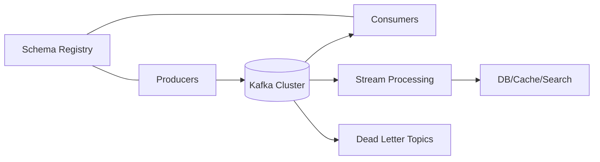

# Kafka Guide – Basic → Architect

## Level 1 – Launch & Basics

### 1. Quick Setup (Local)
```bash
docker compose up -d zookeeper kafka
kafka-topics --bootstrap-server localhost:9092 --create --topic demo --partitions 3 --replication-factor 1
```

### 2. Produce/Consume
```bash
kafka-console-producer --bootstrap-server localhost:9092 --topic demo
kafka-console-consumer --bootstrap-server localhost:9092 --topic demo --from-beginning
```

### 3. Core Concepts
- Topics, partitions, replication factor, ISR
- Producers (acks, retries, idempotence), Consumers (groups, offsets, rebalance)
- Retention, compaction, ordering per partition

## Level 2 – Production Patterns

### Producers
- Enable idempotence; acks=all; retries/backoff; proper batch.size/linger.ms
- Keys for partitioning; custom partitioner only when needed

### Consumers
- Use consumer groups; commit strategy (async vs sync)
- Cooperative rebalancing; max.poll settings tuned
- Deserialization safety; poison pill handling; dead-letter topics

### Topics & Storage
- Partition count sized for throughput + future growth
- Retention policies per use case; compaction for changelog topics
- Quotas and ACLs; rack-aware placement

## Level 3 – Architect Playbook

### Reliability & Ordering
- Exactly-once: idempotent producer + transactional writes + EOS in consumer
- At-least-once with idempotent downstream writes
- Backpressure strategies; bounded queues; circuit breakers

### Observability & Operations
- Metrics: lag per group, broker health, ISR, request rates
- Alerts: offline partitions, under-replicated, high lag, rebalance storms
- Governance: schema registry (compatibility), ACLs, RBAC

### Stream Processing
- Kafka Streams/Flink/Spark: state stores, repartitioning, watermarking
- KTable/KStream, joins, windowing; state store sizing and cleanup

## Ops Cheat Sheet

| Task | Command | Note |
| --- | --- | --- |
| Topics | `kafka-topics --list --bootstrap-server ...` | list |
| Lag | `kafka-consumer-groups --describe` | monitor |
| Produce | console producer | quick test |
| Consume | console consumer | quick test |
| Configs | `kafka-configs --alter ...` | tune |

## Architecture Patterns



## Checklist Before Production
- [ ] Topics sized; retention/compaction set; rack-aware enabled
- [ ] Producers idempotent; acks=all; retries/backoff; keys defined
- [ ] Consumers tuned (max.poll, session.timeout); DLQ strategy
- [ ] ACLs/quotas; schema registry with compatibility
- [ ] Monitoring/alerts for lag, ISR, UROPs, offline partitions
- [ ] Disaster plan: backups for configs, restore/runbooks

## Learning Path Links
- Track: `LearningTracks/Data-Engineering/track.md`
- Projects: `Projects/Data-Engineering/starter/03-kafka-producer-consumer.md` and `Projects/Integrated/data-engineering-capstone.md`
- Mastery: `Mastery/Kafka/` (quiz, scenarios, flashcards)

