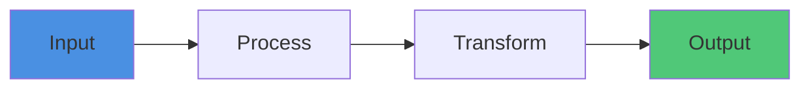
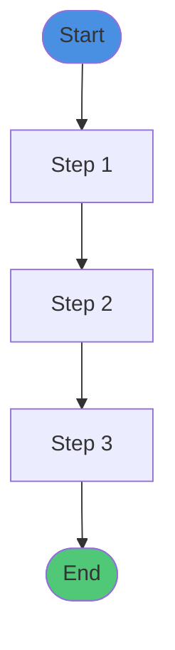
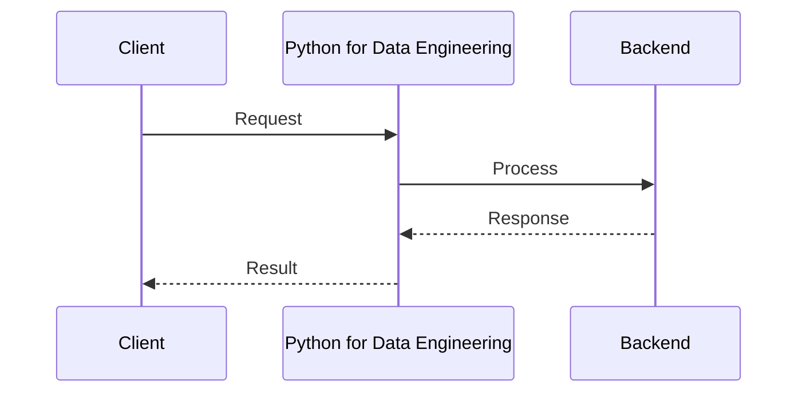

# Python for Data Engineering: Visual Guide

## Architecture Diagrams

### Python for Data Engineering Architecture

```mermaid
graph TD
    A[Python for Data Engineering] --> B[Component 1]
    A --> C[Component 2]
    A --> D[Component 3]
    B --> E[Feature 1]
    C --> F[Feature 2]
    D --> G[Feature 3]
    
    style A fill:#150458
    style B fill:#C13C37
    style C fill:#F7931E
```

### Data Flow

```mermaid
graph LR
    A[Input] --> B[Process]
    B --> C[Transform]
    C --> D[Output]
    
    style A fill:#4A90E2
    style D fill:#50C878
```

### Workflow

```mermaid
flowchart TD
    Start([Start]) --> Step1[Step 1]
    Step1 --> Step2[Step 2]
    Step2 --> Step3[Step 3]
    Step3 --> End([End])
    
    style Start fill:#4A90E2
    style End fill:#50C878
```

### Component Interaction

```mermaid
sequenceDiagram
    participant A as Client
    participant B as Python for Data Engineering
    participant C as Backend
    
    A->>B: Request
    B->>C: Process
    C-->>B: Response
    B-->>A: Result
```
