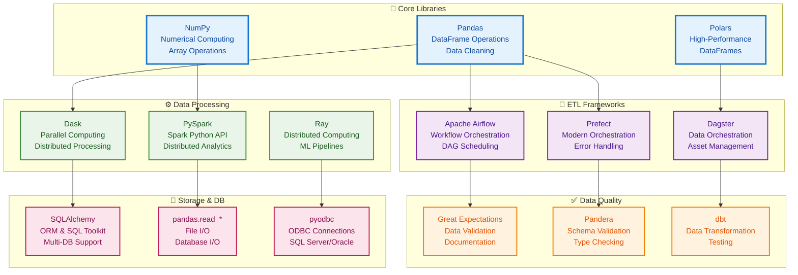
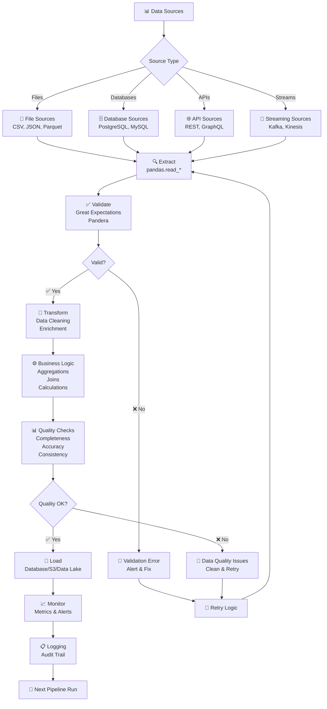
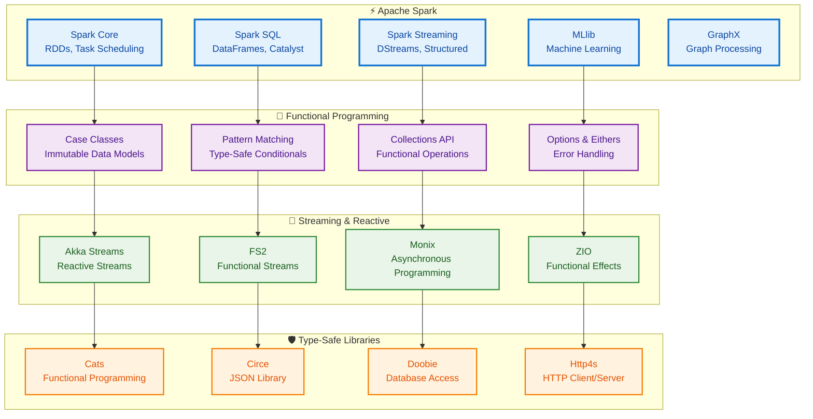
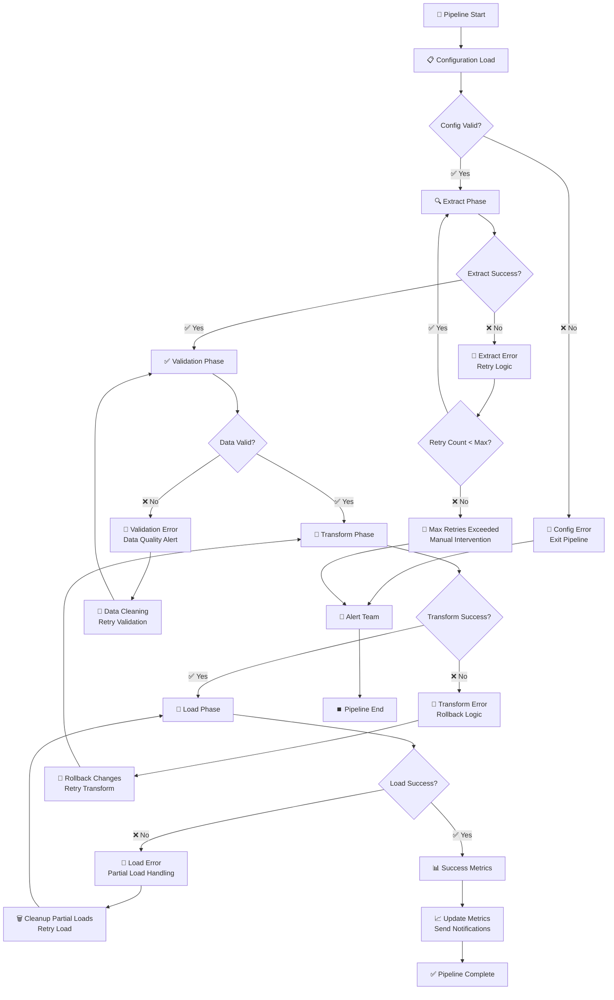
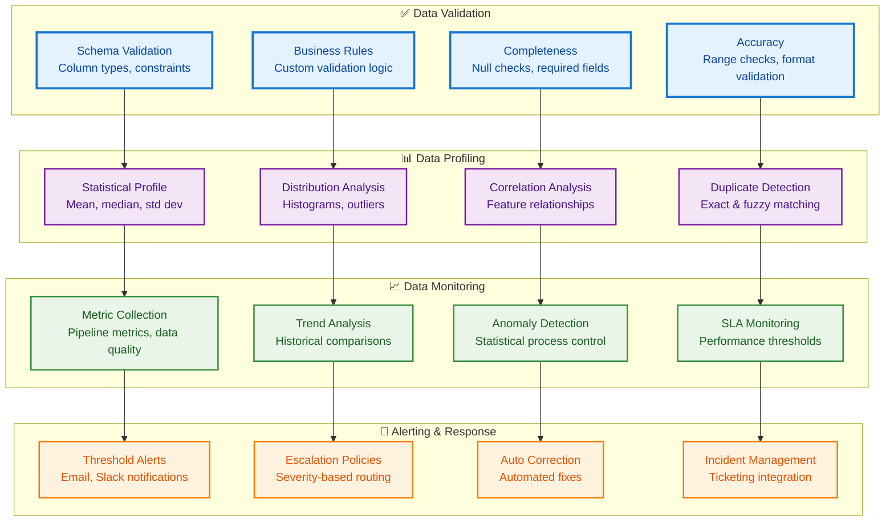

# Python & Scala Data Engineering Visual Architecture Guide

## Python Data Engineering Ecosystem



## ETL Pipeline Architecture



## Pandas Data Processing Flow

```mermaid
graph TD
    %% Define styles
    classDef inputClass fill:#e3f2fd,stroke:#1976d2,stroke-width:2px,color:#0d47a1
    classDef processClass fill:#f3e5f5,stroke:#7b1fa2,stroke-width:2px,color:#4a148c
    classDef transformClass fill:#e8f5e8,stroke:#388e3c,stroke-width:2px,color:#1b5e20
    classDef outputClass fill:#fff3e0,stroke:#f57c00,stroke-width:2px,color:#e65100

    subgraph "📥 Input"
        CSV[CSV Files<br/>pd.read_csv()]
        JSON[JSON Files<br/>pd.read_json()]
        PARQUET[Parquet Files<br/>pd.read_parquet()]
        SQL[SQL Databases<br/>pd.read_sql()]
    end

    subgraph "🔍 Initial Processing"
        HEAD[Head/Tail<br/>df.head()]
        INFO[Data Info<br/>df.info()]
        DESCRIBE[Statistics<br/>df.describe()]
        SHAPE[Shape Check<br/>df.shape]
    end

    subgraph "🧹 Data Cleaning"
        DROPNA[Remove Nulls<br/>df.dropna()]
        FILLNA[Fill Nulls<br/>df.fillna()]
        DROP_DUPLICATES[Remove Duplicates<br/>df.drop_duplicates()]
        REPLACE[Value Replacement<br/>df.replace()]
    end

    subgraph "🔄 Transformations"
        SELECT[Column Selection<br/>df[['col1', 'col2']]]
        FILTER[Row Filtering<br/>df[df['col'] > 0]]
        GROUPBY[Grouping<br/>df.groupby('col')]
        AGGREGATE[Aggregation<br/>df.agg({'col': 'sum'})]
        MERGE[Join Operations<br/>df.merge(other_df)]
        PIVOT[Pivot Tables<br/>df.pivot_table()]
    end

    subgraph "📤 Output"
        TO_CSV[To CSV<br/>df.to_csv()]
        TO_PARQUET[To Parquet<br/>df.to_parquet()]
        TO_SQL[To Database<br/>df.to_sql()]
        TO_JSON[To JSON<br/>df.to_json()]
    end

    CSV --> HEAD
    JSON --> INFO
    PARQUET --> DESCRIBE
    SQL --> SHAPE

    HEAD --> DROPNA
    INFO --> FILLNA
    DESCRIBE --> DROP_DUPLICATES
    SHAPE --> REPLACE

    DROPNA --> SELECT
    FILLNA --> FILTER
    DROP_DUPLICATES --> GROUPBY
    REPLACE --> AGGREGATE

    SELECT --> MERGE
    FILTER --> PIVOT
    GROUPBY --> TO_CSV
    AGGREGATE --> TO_PARQUET

    MERGE --> TO_SQL
    PIVOT --> TO_JSON

    %% Apply styles
    class CSV,JSON,PARQUET,SQL inputClass
    class HEAD,INFO,DESCRIBE,SHAPE processClass
    class DROPNA,FILLNA,DROP_DUPLICATES,REPLACE transformClass
    class TO_CSV,TO_PARQUET,TO_SQL,TO_JSON outputClass
```

## Apache Airflow DAG Architecture

```mermaid
graph TD
    %% Define styles
    classDef dagClass fill:#e3f2fd,stroke:#1976d2,stroke-width:3px,color:#0d47a1
    classDef taskClass fill:#f3e5f5,stroke:#7b1fa2,stroke-width:2px,color:#4a148c
    classDef operatorClass fill:#e8f5e8,stroke:#388e3c,stroke-width:2px,color:#1b5e20
    classDef sensorClass fill:#fff3e0,stroke:#f57c00,stroke-width:2px,color:#e65100

    subgraph "📋 DAG Definition"
        DAG_DEF[DAG Object<br/>dag = DAG('etl_pipeline')]
        DEFAULT_ARGS[Default Args<br/>retries, email, etc.]
        SCHEDULE[Schedule Interval<br/>@daily, cron]
    end

    subgraph "🎯 Task Definitions"
        PYTHON_TASK[PythonOperator<br/>python_callable]
        BASH_TASK[BashOperator<br/>bash_command]
        POSTGRES_TASK[PostgresOperator<br/>sql query]
        SENSOR_TASK[S3KeySensor<br/>file existence]
    end

    subgraph "🔧 Operators"
        DUMMY[DummyOperator<br/>Control Flow]
        BRANCH[BranchPythonOperator<br/>Conditional Logic]
        SUBDAG[SubDagOperator<br/>Nested DAGs]
        HTTP[SimpleHttpOperator<br/>API Calls]
    end

    subgraph "👁️ Sensors"
        FILE_SENSOR[FileSensor<br/>Local Files]
        S3_SENSOR[S3KeySensor<br/>S3 Objects]
        SQL_SENSOR[SqlSensor<br/>Database Changes]
        EXTERNAL[ExternalTaskSensor<br/>Cross-DAG Dependencies]
    end

    subgraph "🔗 Dependencies"
        UPSTREAM[Upstream Tasks<br/>task1 >> task2]
        DOWNSTREAM[Downstream Tasks<br/>task2 << task1]
        SET_UPSTREAM[set_upstream()<br/>Explicit Dependencies]
        SET_DOWNSTREAM[set_downstream()<br/>Explicit Dependencies]
    end

    DAG_DEF --> PYTHON_TASK
    DEFAULT_ARGS --> BASH_TASK
    SCHEDULE --> POSTGRES_TASK

    PYTHON_TASK --> DUMMY
    BASH_TASK --> BRANCH
    POSTGRES_TASK --> SUBDAG

    DUMMY --> FILE_SENSOR
    BRANCH --> S3_SENSOR
    SUBDAG --> SQL_SENSOR

    FILE_SENSOR --> UPSTREAM
    S3_SENSOR --> DOWNSTREAM
    SQL_SENSOR --> SET_UPSTREAM

    UPSTREAM --> SET_DOWNSTREAM

    %% Apply styles
    class DAG_DEF,DEFAULT_ARGS,SCHEDULE dagClass
    class PYTHON_TASK,BASH_TASK,POSTGRES_TASK,SENSOR_TASK taskClass
    class DUMMY,BRANCH,SUBDAG,HTTP operatorClass
    class FILE_SENSOR,S3_SENSOR,SQL_SENSOR,EXTERNAL sensorClass
```

## Scala Data Engineering Ecosystem



## DataFrame Operations Flow (Scala)

```mermaid
flowchart TD
    A[📊 DataFrame Creation] --> B{Source Type}
    B -->|Files| C[spark.read.parquet()<br/>spark.read.json()]
    B -->|Database| D[spark.read.jdbc()<br/>spark.read.format("jdbc")]
    B -->|Streaming| E[spark.readStream<br/>.format("kafka")]

    C --> F[🔍 Schema Inference<br/>spark.read.schema()]
    D --> F
    E --> F

    F --> G[📋 Column Operations]
    G --> H[Select Columns<br/>df.select("col1", "col2")]
    G --> I[Add Columns<br/>df.withColumn("newCol", expr)]
    G --> J[Drop Columns<br/>df.drop("col1")]
    G --> K[Rename Columns<br/>df.withColumnRenamed()]

    H --> L[🔄 Row Operations]
    I --> L
    J --> L
    K --> L

    L --> M[Filter Rows<br/>df.filter($"col" > 100)]
    L --> N[Sort Rows<br/>df.orderBy($"col".desc)]
    L --> O[Distinct Rows<br/>df.distinct()]
    L --> P[Limit Rows<br/>df.limit(100)]

    M --> Q[🎯 Aggregation Operations]
    N --> Q
    O --> Q
    P --> Q

    Q --> R[Group By<br/>df.groupBy("col").agg(sum("amount"))]
    Q --> S[Window Functions<br/>df.withColumn("rank", rank().over(windowSpec))]
    Q --> T[Rollup/Cube<br/>df.rollup("col1", "col2").sum()]

    R --> U[📤 Output Operations]
    S --> U
    T --> U

    U --> V[Write to Files<br/>df.write.parquet()]
    U --> W[Write to Database<br/>df.write.jdbc()]
    U --> X[Streaming Output<br/>df.writeStream.format("delta")]
```

## Functional Programming Patterns in Scala

```mermaid
graph TD
    %% Define styles
    classDef patternClass fill:#e3f2fd,stroke:#1976d2,stroke-width:3px,color:#0d47a1
    classDef typeClass fill:#f3e5f5,stroke:#7b1fa2,stroke-width:2px,color:#4a148c
    classDef compositionClass fill:#e8f5e8,stroke:#388e3c,stroke-width:2px,color:#1b5e20
    classDef errorClass fill:#fff3e0,stroke:#f57c00,stroke-width:2px,color:#e65100

    subgraph "🎭 Pattern Matching"
        CASE_CLASSES[Case Classes<br/>sealed trait DataType<br/>case class JsonData(...) extends DataType]
        EXTRACTORS[Extractors<br/>object HighValue {<br/>def unapply(order: Order): Option[Double] = ...<br/>}]
        PATTERN_GUARDS[Pattern Guards<br/>case Person(name, age) if age > 18 => ...]
        NESTED_PATTERNS[Nested Patterns<br/>case List(head, tail @ _*) => ...]
    end

    subgraph "🔒 Type System"
        EITHER[Either[L, R]<br/>Error Handling<br/>Right(success) | Left(error)]
        OPTION[Option[T]<br/>Null Safety<br/>Some(value) | None]
        TRY[Try[T]<br/>Exception Handling<br/>Success(value) | Failure(exception)]
        VALIDATION[Validation<br/>Accumulated Errors<br/>Valid(result) | Invalid(errors)]
    end

    subgraph "⚡ Function Composition"
        AND_THEN[andThen<br/>f andThen g<br/>g(f(x))]
        COMPOSE[compose<br/>f compose g<br/>f(g(x))]
        MAP_FLATMAP[map/flatMap<br/>Future chaining<br/>for comprehensions]
        PARTIAL[Partial Functions<br/>isDefinedAt<br/>orElse]
    end

    subgraph "🚨 Error Handling"
        RECOVER[Try.recover<br/>Handle specific exceptions]
        RECOVER_WITH[Try.recoverWith<br/>Fallback logic]
        TRANSFORM[Either.transform<br/>Convert Left/Right]
        ENSURE[Option.ensure<br/>Validate conditions]
    end

    CASE_CLASSES --> EITHER
    EXTRACTORS --> OPTION
    PATTERN_GUARDS --> TRY
    NESTED_PATTERNS --> VALIDATION

    EITHER --> AND_THEN
    OPTION --> COMPOSE
    TRY --> MAP_FLATMAP
    VALIDATION --> PARTIAL

    AND_THEN --> RECOVER
    COMPOSE --> RECOVER_WITH
    MAP_FLATMAP --> TRANSFORM
    PARTIAL --> ENSURE

    %% Apply styles
    class CASE_CLASSES,EXTRACTORS,PATTERN_GUARDS,NESTED_PATTERNS patternClass
    class EITHER,OPTION,TRY,VALIDATION typeClass
    class AND_THEN,COMPOSE,MAP_FLATMAP,PARTIAL compositionClass
    class RECOVER,RECOVER_WITH,TRANSFORM,ENSURE errorClass
```

## ETL Pipeline with Error Handling (Python)



## Scala ETL Pipeline with Functional Composition

```mermaid
flowchart TD
    A[🚀 Pipeline Start] --> B[⚙️ Configuration]

    B --> C[🔍 Extract<br/>Either[String, DataFrame]]
    C --> D{Extract Result}

    D -->|Left(error)| E[🚨 Log Error<br/>Return Failure]
    D -->|Right(data)| F[✅ Validate<br/>Either[String, DataFrame]]

    F --> G{Validation Result}
    G -->|Left(error)| H[🚨 Validation Error<br/>Data Quality Issue]
    G -->|Right(validData)| I[🔄 Transform<br/>DataFrame => DataFrame]

    I --> J[💾 Load<br/>DataFrame => Either[String, Unit]]
    J --> K{Load Result}

    K -->|Left(error)| L[🚨 Load Error<br/>Rollback Logic]
    K -->|Right(())| M[📊 Success<br/>Log Metrics]

    H --> N[🔧 Clean Data<br/>Retry Validation]
    N --> F

    L --> O[🗑️ Rollback<br/>Retry Load]
    O --> J

    E --> P[📢 Alert System]
    H --> P
    L --> P

    M --> Q[✅ Pipeline Complete]
    P --> R[⏹️ Pipeline End]
```

## Performance Optimization Patterns

```mermaid
graph TD
    %% Define styles
    classDef vectorizedClass fill:#e3f2fd,stroke:#1976d2,stroke-width:3px,color:#0d47a1
    classDef memoryClass fill:#f3e5f5,stroke:#7b1fa2,stroke-width:2px,color:#4a148c
    classDef parallelClass fill:#e8f5e8,stroke:#388e3c,stroke-width:2px,color:#1b5e20
    classDef cachingClass fill:#fff3e0,stroke:#f57c00,stroke-width:2px,color:#e65100

    subgraph "⚡ Vectorized Operations"
        PANDAS_VECTORIZED[Pandas Vectorized<br/>df['c'] = df['a'] * df['b']]
        NUMPY_VECTORIZED[NumPy Broadcasting<br/>matrix + vector]
        POLARS_EXPRESSIONS[Polars Expressions<br/>pl.col('a') * pl.col('b')]
        SCALA_COLLECTIONS[Scala Collections<br/>list.map(_ * 2)]
    end

    subgraph "💾 Memory Optimization"
        CHUNK_PROCESSING[Chunk Processing<br/>pd.read_csv(chunksize=100000)]
        DTYPE_OPTIMIZATION[Data Types<br/>category, int32 vs int64]
        GARBAGE_COLLECTION[GC Management<br/>del df; gc.collect()]
        SCALA_PRIMITIVES[Scala Primitives<br/>Array[Int] vs Seq[Int]]
    end

    subgraph "🔄 Parallel Processing"
        DASK_PARALLEL[Dask DataFrames<br/>df.map_partitions(func)]
        PYSPARK_DISTRIBUTED[PySpark RDDs<br/>rdd.map(lambda x: x*2)]
        SCALA_FUTURES[Scala Futures<br/>Future.sequence(futures)]
        MULTIPROCESSING[Multiprocessing<br/>Pool.map(func, data)]
    end

    subgraph "📦 Caching Strategies"
        PANDAS_CACHE[Pandas Cache<br/>Intermediate results]
        SPARK_CACHE[Spark Cache<br/>df.cache() / persist()]
        LRU_CACHE[LRU Cache<br/>functools.lru_cache]
        MEMOIZATION[Memoization<br/>Custom caching decorators]
    end

    PANDAS_VECTORIZED --> CHUNK_PROCESSING
    NUMPY_VECTORIZED --> DTYPE_OPTIMIZATION
    POLARS_EXPRESSIONS --> GARBAGE_COLLECTION
    SCALA_COLLECTIONS --> SCALA_PRIMITIVES

    CHUNK_PROCESSING --> DASK_PARALLEL
    DTYPE_OPTIMIZATION --> PYSPARK_DISTRIBUTED
    GARBAGE_COLLECTION --> SCALA_FUTURES
    SCALA_PRIMITIVES --> MULTIPROCESSING

    DASK_PARALLEL --> PANDAS_CACHE
    PYSPARK_DISTRIBUTED --> SPARK_CACHE
    SCALA_FUTURES --> LRU_CACHE
    MULTIPROCESSING --> MEMOIZATION

    %% Apply styles
    class PANDAS_VECTORIZED,NUMPY_VECTORIZED,POLARS_EXPRESSIONS,SCALA_COLLECTIONS vectorizedClass
    class CHUNK_PROCESSING,DTYPE_OPTIMIZATION,GARBAGE_COLLECTION,SCALA_PRIMITIVES memoryClass
    class DASK_PARALLEL,PYSPARK_DISTRIBUTED,SCALA_FUTURES,MULTIPROCESSING parallelClass
    class PANDAS_CACHE,SPARK_CACHE,LRU_CACHE,MEMOIZATION cachingClass
```

## Data Quality Framework Architecture



## Summary

Python and Scala data engineering architectures reveal complementary approaches:

**Python Ecosystem:**
- **Rich Libraries**: Pandas for DataFrames, NumPy for numerical computing
- **ETL Frameworks**: Airflow for orchestration, Prefect for modern pipelines
- **Data Quality**: Great Expectations for validation, Pandera for schemas
- **Processing**: Vectorized operations, chunked processing, parallel execution

**Scala Ecosystem:**
- **Type Safety**: Strong static typing, compile-time error detection
- **Functional Programming**: Immutable data, pattern matching, composition
- **Spark Integration**: Native DataFrame operations, type-safe transformations
- **Reactive Systems**: Akka Streams, functional effects (ZIO, Cats)

**Visual Patterns:**
- **Pipeline Architecture**: Extract → Validate → Transform → Load with error handling
- **Data Flow**: Source → Processing → Quality Gates → Destination
- **Performance**: Vectorization, caching, parallel processing, memory optimization
- **Quality Framework**: Validation → Profiling → Monitoring → Alerting

The combination of Python's flexibility and Scala's type safety provides a robust foundation for building scalable, maintainable data engineering solutions.