# SQL Data Engineering Visual Guide

## Database Architecture Diagrams

### Relational Database Schema
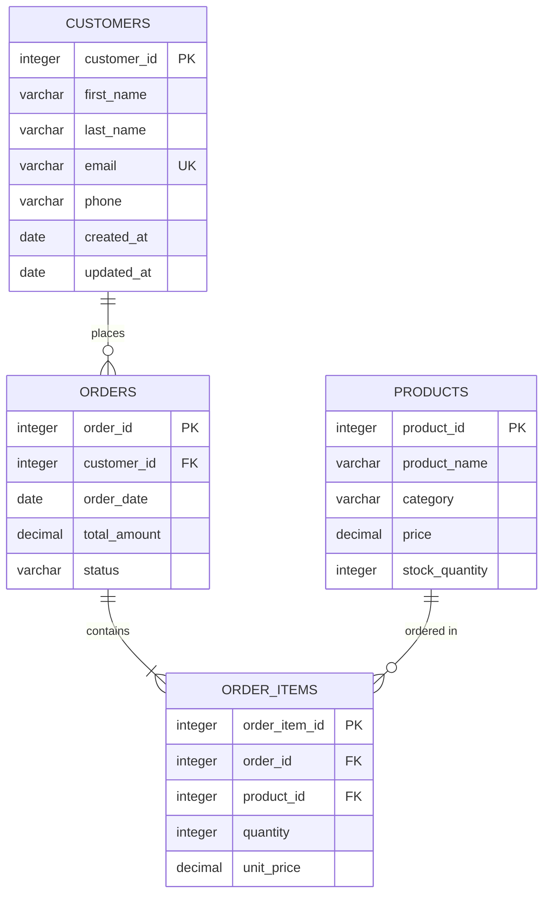

### Data Warehouse Star Schema
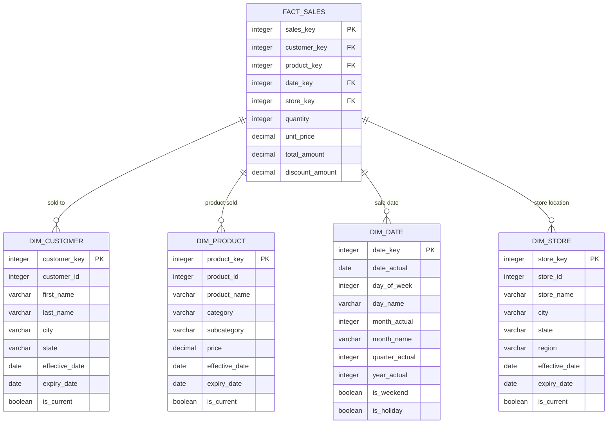

## Query Execution Flow

### SQL Query Processing Pipeline
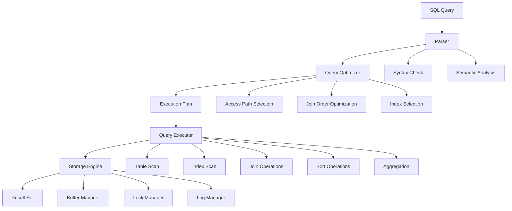

### Join Types Visualization
```mermaid
flowchart TD
    subgraph "Table A"
        A1[id: 1<br/>name: Alice]
        A2[id: 2<br/>name: Bob]
        A3[id: 3<br/>name: Charlie]
    end

    subgraph "Table B"
        B1[id: 1<br/>dept: Engineering]
        B2[id: 2<br/>dept: Sales]
        B4[id: 4<br/>dept: Marketing]
    end

    subgraph "INNER JOIN<br/>A.id = B.id"
        I1[1, Alice, Engineering]
        I2[2, Bob, Sales]
    end

    subgraph "LEFT JOIN<br/>A.id = B.id"
        L1[1, Alice, Engineering]
        L2[2, Bob, Sales]
        L3[3, Charlie, NULL]
    end

    subgraph "RIGHT JOIN<br/>A.id = B.id"
        R1[1, Alice, Engineering]
        R2[2, Bob, Sales]
        R4[4, NULL, Marketing]
    end

    subgraph "FULL OUTER JOIN<br/>A.id = B.id"
        F1[1, Alice, Engineering]
        F2[2, Bob, Sales]
        F3[3, Charlie, NULL]
        F4[4, NULL, Marketing]
    end

    A1 --> I1
    A2 --> I2
    B1 --> I1
    B2 --> I2

    A1 --> L1
    A2 --> L2
    A3 --> L3
    B1 --> L1
    B2 --> L2

    A1 --> R1
    A2 --> R2
    B1 --> R1
    B2 --> R2
    B4 --> R4

    A1 --> F1
    A2 --> F2
    A3 --> F3
    B1 --> F1
    B2 --> F2
    B4 --> F4
```

## Index Architecture

### B-Tree Index Structure
```mermaid
flowchart TD
    subgraph "Root Node"
        R[50<br/>| 25 | 50 | 75 |]
    end

    subgraph "Level 1"
        L1[25<br/>| 10 | 25 | 40 |]
        L2[75<br/>| 50 | 60 | 75 | 90 |]
    end

    subgraph "Leaf Nodes"
        LF1[10, 15, 20]
        LF2[25, 30, 35]
        LF3[40, 45]
        LF4[50, 55]
        LF5[60, 65, 70]
        LF6[75, 80, 85]
        LF7[90, 95, 100]
    end

    R --> L1
    R --> L2

    L1 --> LF1
    L1 --> LF2
    L1 --> LF3

    L2 --> LF4
    L2 --> LF5
    L2 --> LF6
    L2 --> LF7

    style R fill:#e1f5fe
    style L1 fill:#f3e5f5
    style L2 fill:#f3e5f5
    style LF1 fill:#e8f5e8
    style LF2 fill:#e8f5e8
    style LF3 fill:#e8f5e8
    style LF4 fill:#e8f5e8
    style LF5 fill:#e8f5e8
    style LF6 fill:#e8f5e8
    style LF7 fill:#e8f5e8
```

### Index Types Comparison
```mermaid
flowchart TD
    subgraph "B-Tree Index"
        BT[Balanced Tree Structure<br/>- Fast lookups<br/>- Range queries<br/>- Ordered data<br/>- Default choice]
    end

    subgraph "Hash Index"
        HI[Hash Table<br/>- O(1) lookups<br/>- Equality only<br/>- No range queries<br/>- Fast inserts]
    end

    subgraph "GIN Index<br/>(Generalized Inverted Index)"
        GIN[Inverted Index<br/>- Full-text search<br/>- Array elements<br/>- JSON paths<br/>- Complex types]
    end

    subgraph "GiST Index<br/>(Generalized Search Tree)"
        GIST[Tree Structure<br/>- Spatial data<br/>- Text search<br/>- Custom operators<br/>- Flexible indexing]
    end

    subgraph "BRIN Index<br/>(Block Range Index)"
        BRIN[Block Ranges<br/>- Large tables<br/>- Correlated data<br/>- Minimal storage<br/>- Fast scans]
    end

    BT --> D[Use Case:<br/>Primary keys,<br/>foreign keys,<br/>general queries]
    HI --> E[Use Case:<br/>Exact matches,<br/>high cardinality]
    GIN --> F[Use Case:<br/>JSON, arrays,<br/>full-text search]
    GIST --> G[Use Case:<br/>Geospatial,<br/>text search,<br/>custom types]
    BRIN --> H[Use Case:<br/>Time-series,<br/>large sorted tables]
```

## ETL Pipeline Architecture

### ETL Process Flow
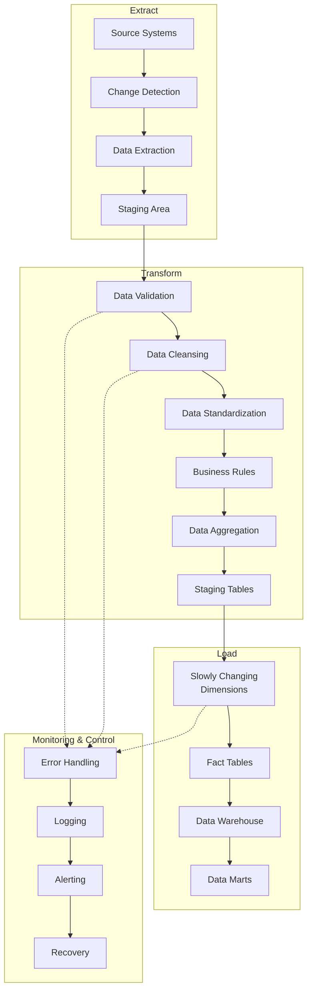

### Incremental Load Patterns
```mermaid
flowchart TD
    subgraph "Timestamp-based"
        TS1[Source Table<br/>updated_at] --> TS2[Target Table<br/>max(updated_at)]
        TS2 --> TS3[Extract records<br/>WHERE updated_at > max_target]
        TS3 --> TS4[Load to Target]
    end

    subgraph "Change Data Capture"
        CDC1[Transaction Log] --> CDC2[Change Events]
        CDC2 --> CDC3[Event Processing]
        CDC3 --> CDC4[Apply Changes<br/>INSERT/UPDATE/DELETE]
    end

    subgraph "Hash-based"
        H1[Source Records] --> H2[Calculate Row Hash]
        H2 --> H3[Compare with<br/>Target Hashes]
        H3 --> H4[Identify Changes]
        H4 --> H5[Update Changed Rows]
    end

    subgraph "Trigger-based"
        TR1[Source Table] --> TR2[Database Triggers]
        TR2 --> TR3[Change Log Table]
        TR3 --> TR4[Process Changes]
        TR4 --> TR5[Update Target]
    end
```

## Window Functions Visualization

### Window Function Concepts
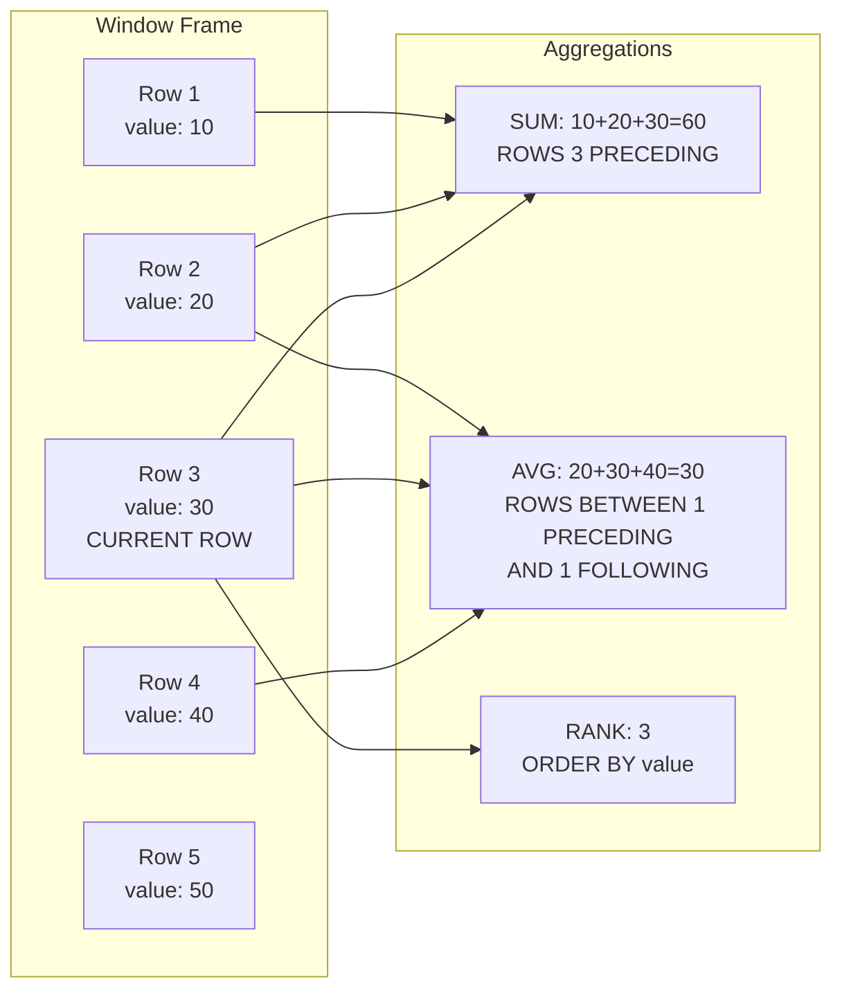

### Running Totals Example
```mermaid
flowchart TD
    subgraph "Sales Data"
        D1[Jan: $1000]
        D2[Feb: $1200]
        D3[Mar: $900]
        D4[Apr: $1500]
        D5[May: $1100]
    end

    subgraph "Running Total"
        R1[Jan: $1000]
        R2[Feb: $2200<br/>1000+1200]
        R3[Mar: $3100<br/>2200+900]
        R4[Apr: $4600<br/>3100+1500]
        R5[May: $5700<br/>4600+1100]
    end

    subgraph "Moving Average<br/>(3-month)"
        M1[Jan: NULL<br/>insufficient data]
        M2[Feb: NULL<br/>insufficient data]
        M3[Mar: $1033<br/>(1000+1200+900)/3]
        M4[Apr: $1200<br/>(1200+900+1500)/3]
        M5[May: $1200<br/>(900+1500+1100)/3]
    end

    D1 --> R1
    D1 --> R2
    D2 --> R2
    D1 --> R3
    D2 --> R3
    D3 --> R3
    D1 --> R4
    D2 --> R4
    D3 --> R4
    D4 --> R4
    D1 --> R5
    D2 --> R5
    D3 --> R5
    D4 --> R5
    D5 --> R5

    D1 --> M3
    D2 --> M3
    D3 --> M3
    D2 --> M4
    D3 --> M4
    D4 --> M4
    D3 --> M5
    D4 --> M5
    D5 --> M5
```

## Partitioning Strategies

### Table Partitioning Architecture
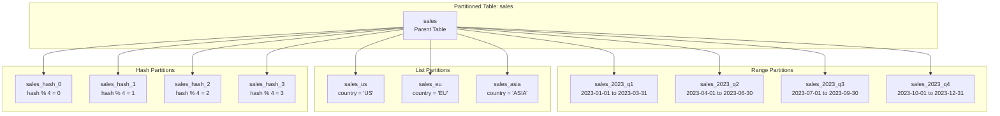

### Partitioning Benefits
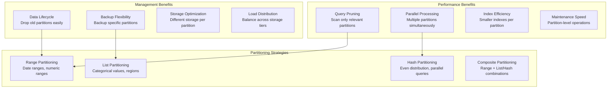

## Query Optimization Flow

### Execution Plan Analysis
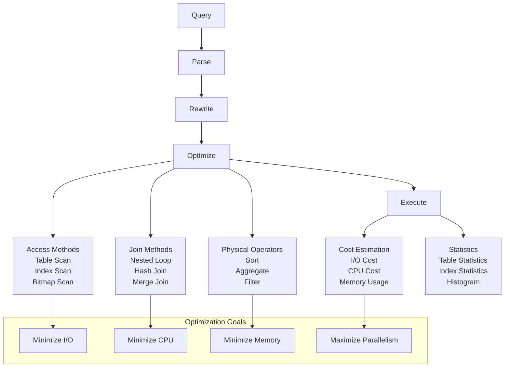

### Index Selection Decision Tree
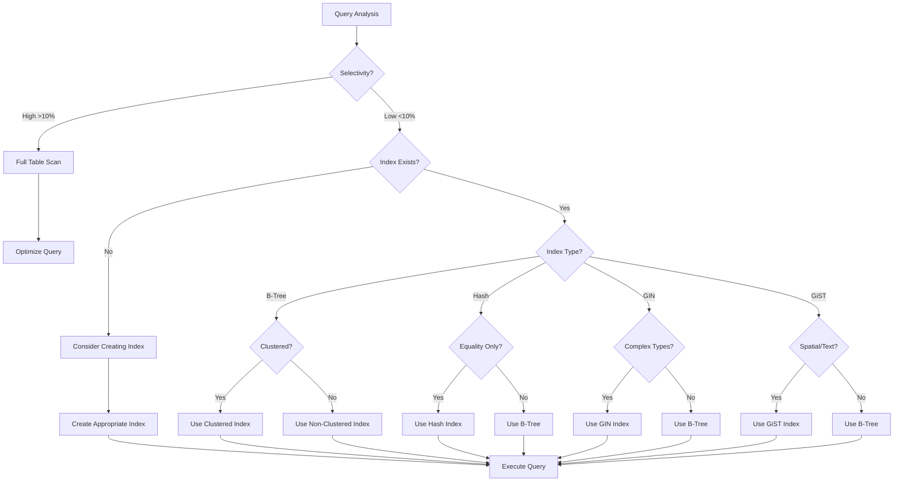

## Data Quality Framework

### Data Quality Checks Architecture
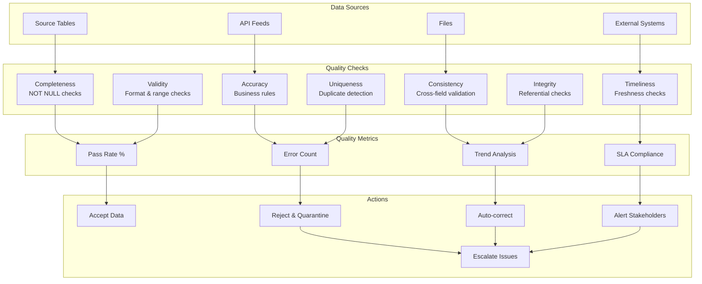

### Data Lineage Tracking
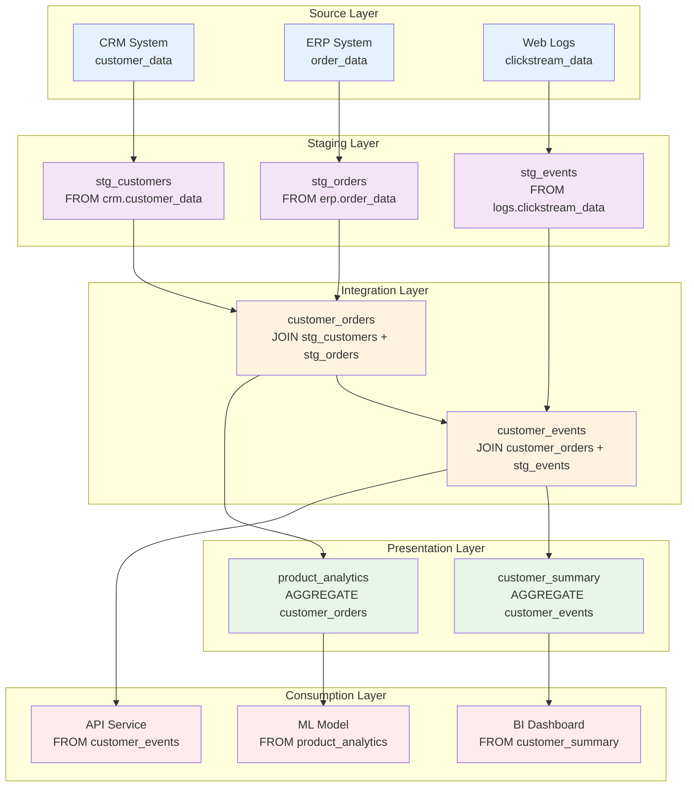

## Performance Monitoring Dashboard

### Query Performance Metrics
```mermaid
flowchart TD
    subgraph "Query Metrics"
        QM1[Execution Time<br/>Total runtime]
        QM2[CPU Usage<br/>Processing time]
        QM3[I/O Operations<br/>Reads/Writes]
        QM4[Memory Usage<br/>Buffer/cache usage]
        QM5[Lock Waits<br/>Concurrency conflicts]
    end

    subgraph "System Metrics"
        SM1[Buffer Hit Ratio<br/>Cache efficiency]
        SM2[Connection Count<br/>Active sessions]
        SM3[Temp File Usage<br/>Sort/hash spills]
        SM4[Deadlocks<br/>Lock conflicts]
        SM5[Replication Lag<br/>Data freshness]
    end

    subgraph "Business Metrics"
        BM1[Query Success Rate<br/>Successful executions]
        BM2[Average Response Time<br/>User experience]
        BM3[Throughput<br/>Queries per second]
        BM4[Error Rate<br/>Failed queries]
    end

    subgraph "Alerting"
        A1[Threshold Alerts<br/>Performance degradation]
        A2[Anomaly Detection<br/>Unusual patterns]
        A3[Capacity Planning<br/>Resource utilization]
        A4[SLA Monitoring<br/>Service level compliance]
    end

    QM1 --> A1
    QM2 --> A1
    SM1 --> A2
    SM2 --> A3
    BM1 --> A4
    BM2 --> A4
```

### Database Health Scorecard
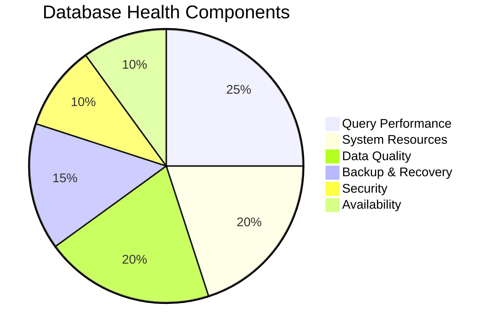

## Summary

SQL data engineering visualization covers:

- **Database Design**: ER diagrams, star schemas, normalization
- **Query Processing**: Execution plans, optimization strategies
- **Performance**: Indexing, partitioning, monitoring
- **ETL Patterns**: Data pipelines, quality frameworks
- **Analytics**: Window functions, time series, cohort analysis
- **Architecture**: Multi-tier systems, data lineage

Key visual concepts:
- **Flow Diagrams**: Process flows and data movement
- **Tree Structures**: Indexes, partitions, hierarchies
- **ER Diagrams**: Database relationships and schemas
- **Decision Trees**: Optimization and selection logic
- **Architecture Diagrams**: System components and interactions
- **Metrics Dashboards**: Performance monitoring and alerting

These visualizations help understand complex SQL concepts through clear, structured representations of database systems, query processing, and data engineering patterns.
