# Data Engineering Guide

## Table of Contents
1. [Introduction](#introduction)
2. [History](#history)
3. [Tools](#tools)
   - [Compute](#compute)
   - [Storage](#storage)
   - [Management](#management)
4. [Lifecycle](#lifecycle)
   - [Business Planning](#business-planning)
   - [Systems Design](#systems-design)
   - [Data Modeling](#data-modeling)
5. [Roles](#roles)
   - [Data Engineer](#data-engineer)
   - [Data Scientist](#data-scientist)
6. [ETL Process](#etl-process)
   - [Extract](#extract)
   - [Transform](#transform)
   - [Load](#load)
7. [Key Concepts](#key-concepts)
   - [Data Pipelines](#data-pipelines)
   - [Data Lakes](#data-lakes)
   - [Data Warehouses](#data-warehouses)

## Introduction
Data engineering is a software engineering approach to building data systems for collecting and using data, often for analysis and data science. It involves substantial computing and storage to make data usable.

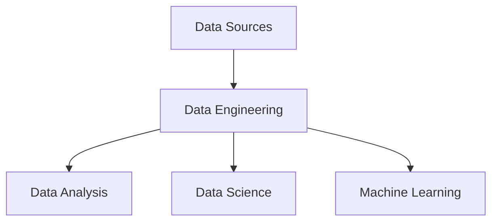

## History
Data engineering evolved from information engineering in the 1970s-1980s, focusing on database design and data processing. In the 2000s, IT teams handled data, but in the 2010s, big data and companies like Facebook and Airbnb popularized the data engineer role, moving from traditional ETL to modern techniques.

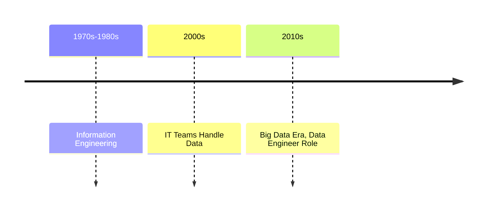

## Tools

### Compute
High-performance computing uses dataflow programming for processing. Popular implementations include Apache Spark and TensorFlow.

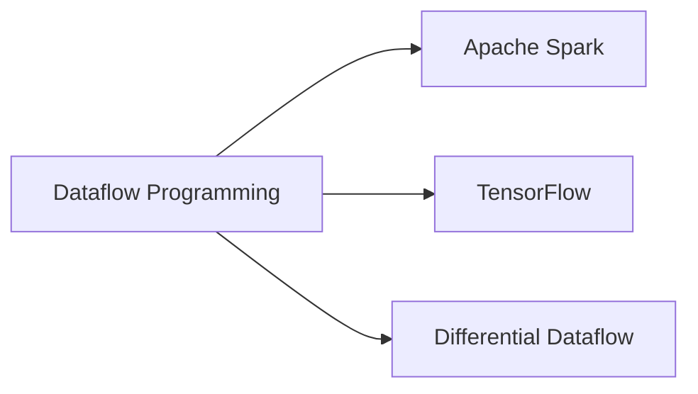

### Storage

#### Databases
Structured data uses databases with ACID guarantees (relational) or horizontal scaling (NoSQL). Examples: MySQL, PostgreSQL.

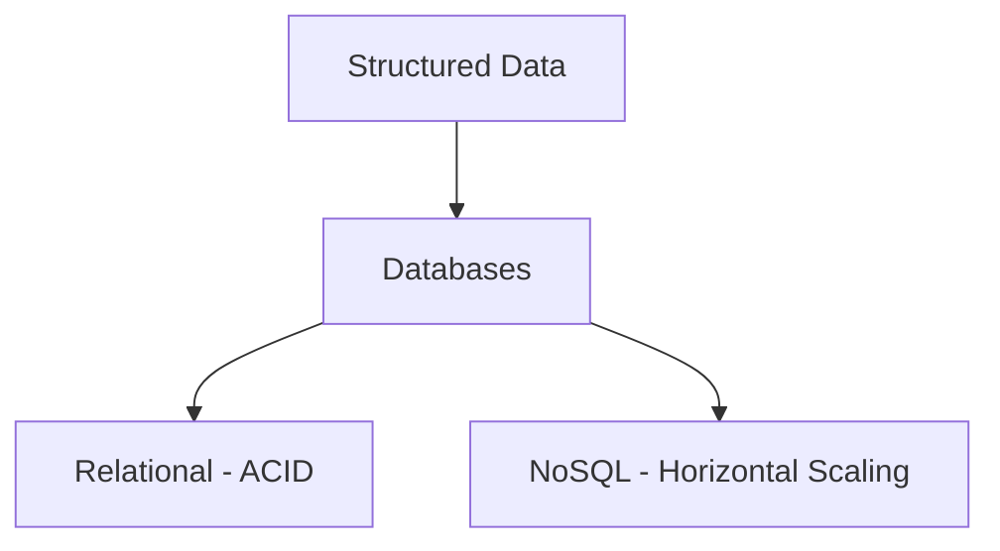

#### Data Warehouses
For structured data and OLAP, data warehouses enable analysis, mining, and AI. Data flows from databases to warehouses.

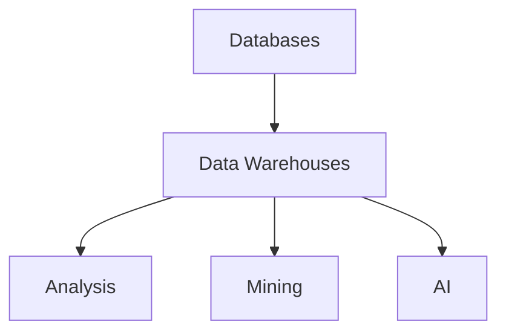

#### Data Lakes
Centralized repository for structured, semi-structured, unstructured, and binary data. Stored on-premises or in cloud.

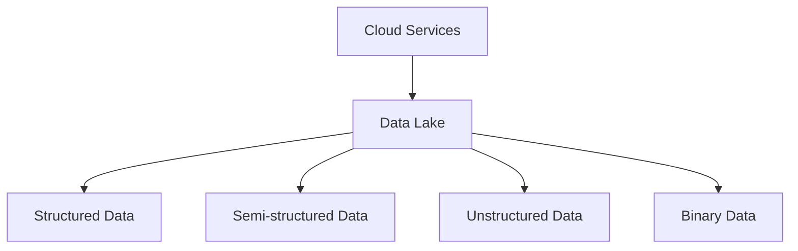

#### Files
For less structured data, stored in file systems, block storage, or object storage.

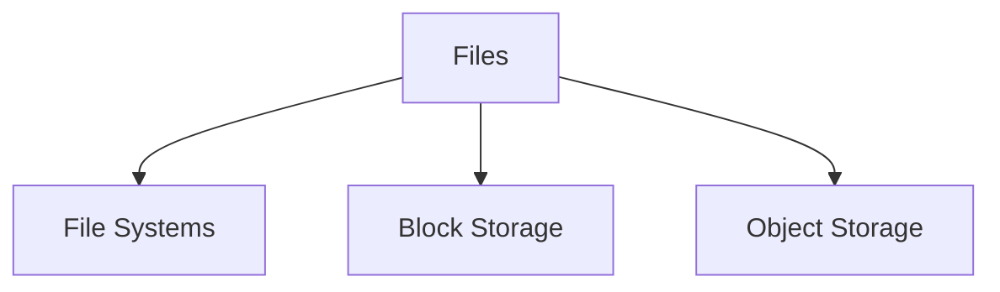

### Management
Workflow management systems like Apache Airflow specify, create, and monitor data tasks as directed acyclic graphs (DAGs).

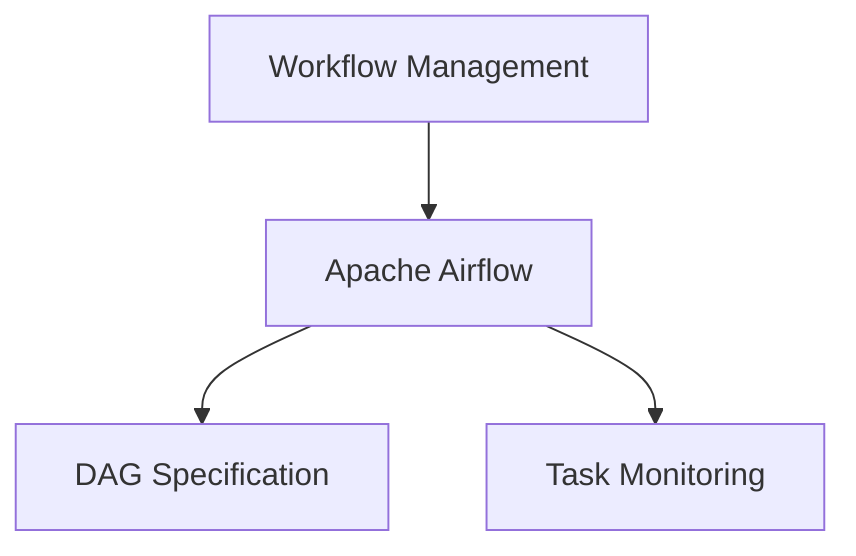

## Lifecycle

### Business Planning
Business objectives are set in plans, requiring transparency for correction.

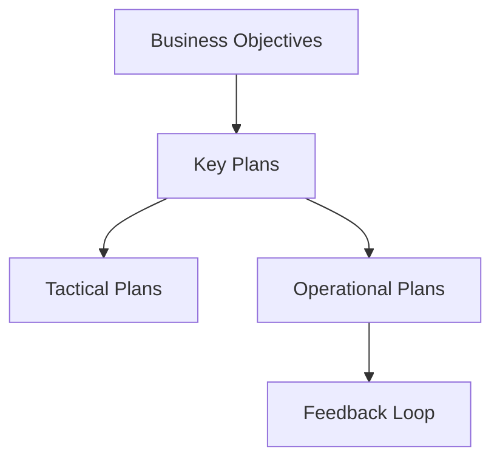

### Systems Design
Involves architecting data platforms and designing data stores.

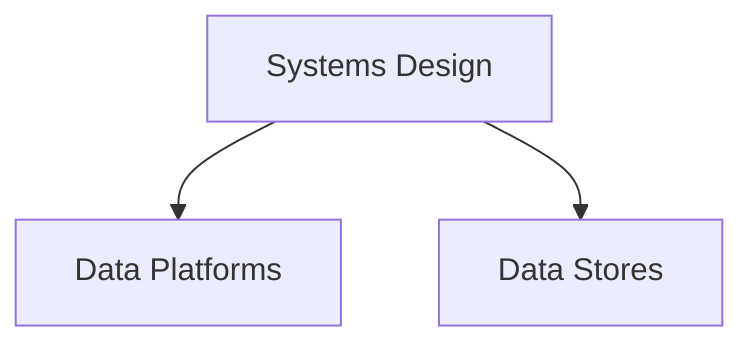

### Data Modeling
Analysis and representation of data requirements, producing a data model with entities, relationships, and constraints.

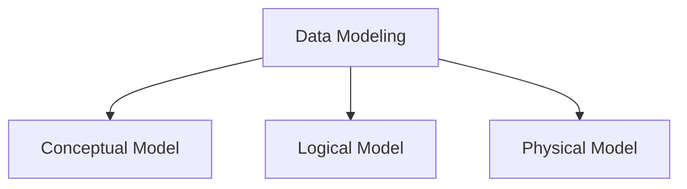

## Roles

### Data Engineer
Software engineer creating big data ETL pipelines to manage data flow, focusing on production readiness, formats, resilience, scaling, and security. Proficient in Java, Python, Scala, Rust, databases, architecture, cloud, Agile.

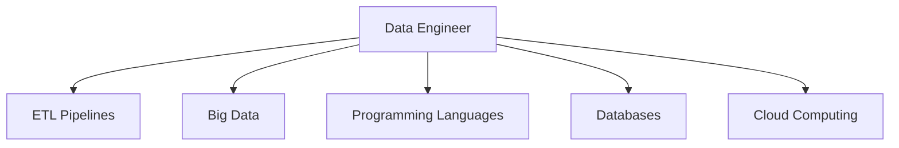

### Data Scientist
Focused on data analysis, familiar with mathematics, algorithms, statistics, machine learning.

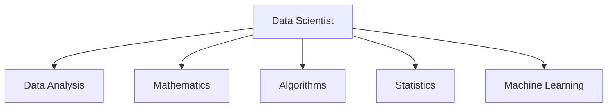

## ETL Process

### Extract
Extract data from sources like relational databases, flat files, XML, JSON, web crawlers, data scraping.

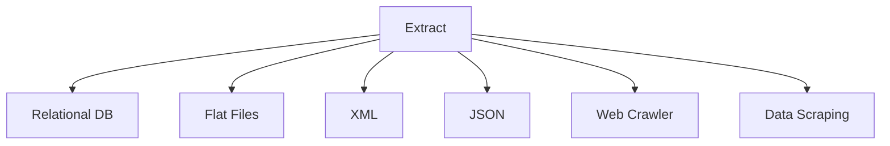

### Transform
Apply rules for data cleansing, validation, joining, aggregating, etc.

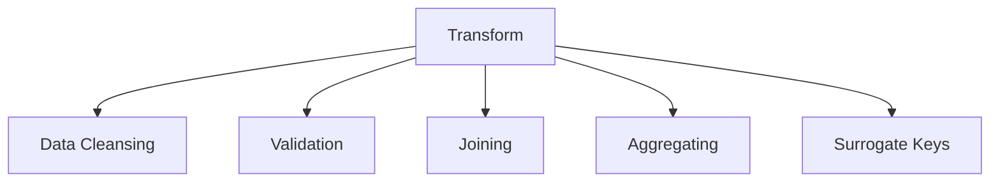

### Load
Load into target like operational data store, data mart, data lake, data warehouse.

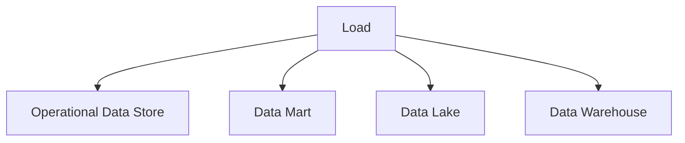

## Key Concepts

### Data Pipelines
Series of data processing steps to move and transform data from sources to destinations.

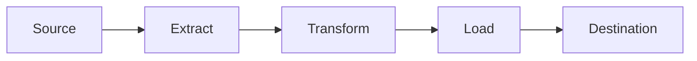

### Data Lakes
Centralized repository for all data types, enabling processing and analysis.

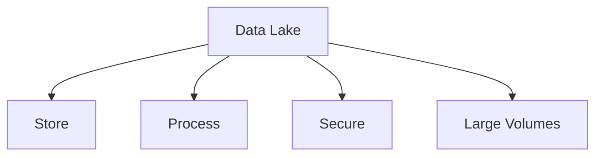

### Data Warehouses
Optimized for querying and analysis, storing historical data.

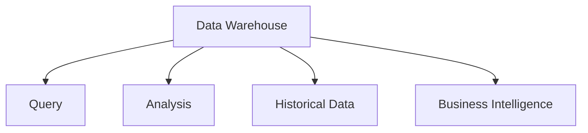
