# Data Modeling Visual Guide

## Entity-Relationship Diagrams

### Basic ER Diagram
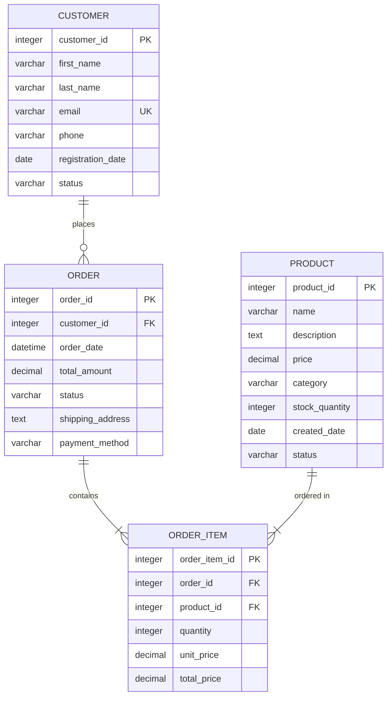
```mermaid
erDiagram
    CUSTOMER ||--o{ ORDER : places
    ORDER ||--|{ ORDER_ITEM : contains
    PRODUCT ||--|{ ORDER_ITEM : "ordered in"
    CUSTOMER {
        integer customer_id PK
        varchar first_name
        varchar last_name
        varchar email UK
        varchar phone
        date registration_date
        varchar status
    }
    PRODUCT {
        integer product_id PK
        varchar name
        text description
        decimal price
        varchar category
        integer stock_quantity
        date created_date
        varchar status
    }
    ORDER {
        integer order_id PK
        integer customer_id FK
        datetime order_date
        decimal total_amount
        varchar status
        text shipping_address
        varchar payment_method
    }
    ORDER_ITEM {
        integer order_item_id PK
        integer order_id FK
        integer product_id FK
        integer quantity
        decimal unit_price
        decimal total_price
    }
```

### Complex ER Diagram with Inheritance
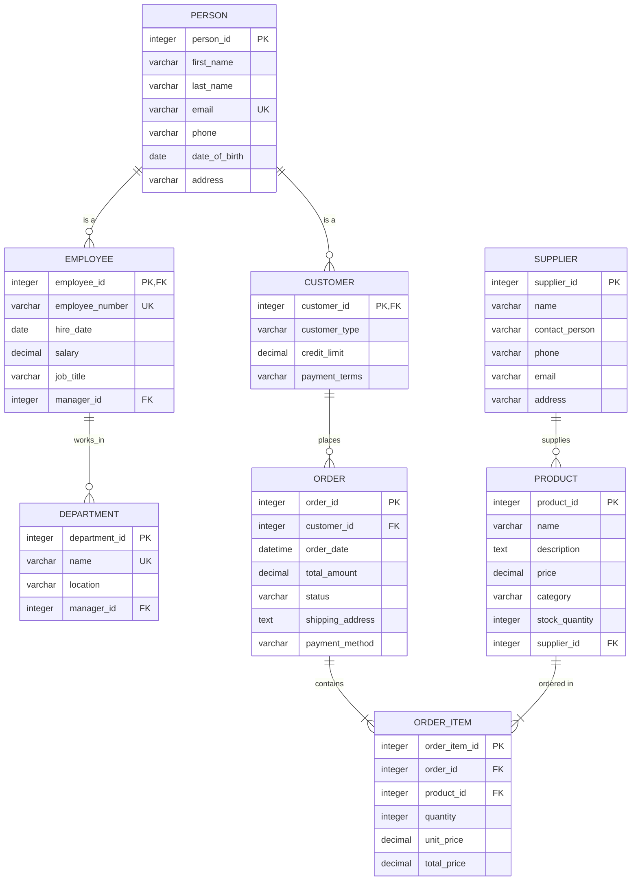
```mermaid
erDiagram
    PERSON ||--o{ EMPLOYEE : "is a"
    PERSON ||--o{ CUSTOMER : "is a"
    EMPLOYEE ||--o{ DEPARTMENT : works_in
    CUSTOMER ||--o{ ORDER : places
    ORDER ||--|{ ORDER_ITEM : contains
    PRODUCT ||--|{ ORDER_ITEM : "ordered in"
    SUPPLIER ||--o{ PRODUCT : supplies

    PERSON {
        integer person_id PK
        varchar first_name
        varchar last_name
        varchar email UK
        varchar phone
        date date_of_birth
        varchar address
    }
    EMPLOYEE {
        integer employee_id PK,FK
        varchar employee_number UK
        date hire_date
        decimal salary
        varchar job_title
        integer manager_id FK
    }
    CUSTOMER {
        integer customer_id PK,FK
        varchar customer_type
        decimal credit_limit
        varchar payment_terms
    }
    DEPARTMENT {
        integer department_id PK
        varchar name UK
        varchar location
        integer manager_id FK
    }
    PRODUCT {
        integer product_id PK
        varchar name
        text description
        decimal price
        varchar category
        integer stock_quantity
        integer supplier_id FK
    }
    SUPPLIER {
        integer supplier_id PK
        varchar name
        varchar contact_person
        varchar phone
        varchar email
        varchar address
    }
    ORDER {
        integer order_id PK
        integer customer_id FK
        datetime order_date
        decimal total_amount
        varchar status
        text shipping_address
        varchar payment_method
    }
    ORDER_ITEM {
        integer order_item_id PK
        integer order_id FK
        integer product_id FK
        integer quantity
        decimal unit_price
        decimal total_price
    }
```

## Relational Database Design

### Normalization Process Flow
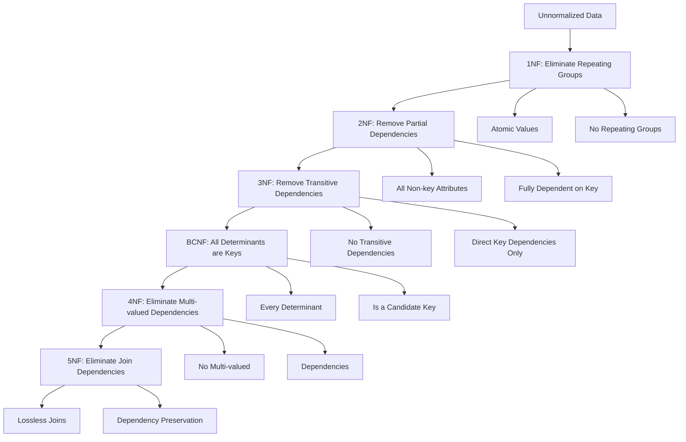
```mermaid
flowchart TD
    A[Unnormalized Data] --> B[1NF: Eliminate Repeating Groups]
    B --> C[2NF: Remove Partial Dependencies]
    C --> D[3NF: Remove Transitive Dependencies]
    D --> E[BCNF: All Determinants are Keys]
    E --> F[4NF: Eliminate Multi-valued Dependencies]
    F --> G[5NF: Eliminate Join Dependencies]

    B --> B1[Atomic Values]
    B --> B2[No Repeating Groups]

    C --> C1[All Non-key Attributes]
    C --> C2[Fully Dependent on Key]

    D --> D1[No Transitive Dependencies]
    D --> D2[Direct Key Dependencies Only]

    E --> E1[Every Determinant]
    E --> E2[Is a Candidate Key]

    F --> F1[No Multi-valued]
    F --> F2[Dependencies]

    G --> G1[Lossless Joins]
    G --> G2[Dependency Preservation]
```

### Database Schema Architecture
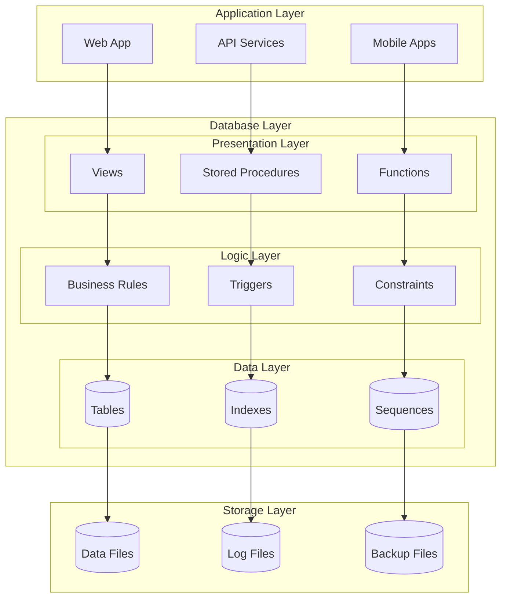
```mermaid
graph TB
    subgraph "Application Layer"
        A1[Web App]
        A2[API Services]
        A3[Mobile Apps]
    end

    subgraph "Database Layer"
        subgraph "Presentation Layer"
            P1[Views]
            P2[Stored Procedures]
            P3[Functions]
        end

        subgraph "Logic Layer"
            L1[Business Rules]
            L2[Triggers]
            L3[Constraints]
        end

        subgraph "Data Layer"
            D1[(Tables)]
            D2[(Indexes)]
            D3[(Sequences)]
        end
    end

    subgraph "Storage Layer"
        S1[(Data Files)]
        S2[(Log Files)]
        S3[(Backup Files)]
    end

    A1 --> P1
    A2 --> P2
    A3 --> P3

    P1 --> L1
    P2 --> L2
    P3 --> L3

    L1 --> D1
    L2 --> D2
    L3 --> D3

    D1 --> S1
    D2 --> S2
    D3 --> S3
```

## Dimensional Modeling

### Star Schema Architecture

```mermaid
graph TD
    subgraph "Fact Table"
        F[Sales Fact]
        F1[sales_amount]
        F2[quantity]
        F3[discount_amount]
        F4[date_key FK]
        F5[customer_key FK]
        F6[product_key FK]
        F7[store_key FK]
    end

    subgraph "Dimension Tables"
        D1[Date Dimension]
        D1_1[date_key PK]
        D1_2[date]
        D1_3[day_of_week]
        D1_4[month]
        D1_5[quarter]
        D1_6[year]
        D1_7[is_weekend]

        D2[Customer Dimension]
        D2_1[customer_key PK]
        D2_2[customer_id]
        D2_3[first_name]
        D2_4[last_name]
        D2_5[email]
        D2_6[city]
        D2_7[state]
        D2_8[country]
        D2_9[segment]

        D3[Product Dimension]
        D3_1[product_key PK]
        D3_2[product_id]
        D3_3[name]
        D3_4[category]
        D3_5[subcategory]
        D3_6[brand]
        D3_7[price]
        D3_8[cost]

        D4[Store Dimension]
        D4_1[store_key PK]
        D4_2[store_id]
        D4_3[name]
        D4_4[city]
        D4_5[state]
        D4_6[country]
        D4_7[manager]
        D4_8[type]
    end

    F --> D1
    F --> D2
    F --> D3
    F --> D4
```

### Snowflake Schema Architecture

```mermaid
graph TD
    subgraph "Fact Table"
        F[Sales Fact]
        F1[sales_amount]
        F2[quantity]
        F3[date_key FK]
        F4[customer_key FK]
        F5[product_key FK]
    end

    subgraph "Dimension Tables"
        D1[Date Dimension]
        D1_1[date_key PK]
        D1_2[date]
        D1_3[day_of_week]
        D1_4[month_key FK]

        D2[Customer Dimension]
        D2_1[customer_key PK]
        D2_2[customer_id]
        D2_3[first_name]
        D2_4[last_name]
        D2_5[city_key FK]

        D3[Product Dimension]
        D3_1[product_key PK]
        D3_2[product_id]
        D3_3[name]
        D3_4[subcategory_key FK]

        D4[Month Dimension]
        D4_1[month_key PK]
        D4_2[month_name]
        D4_3[quarter_key FK]

        D5[City Dimension]
        D5_1[city_key PK]
        D5_2[city_name]
        D5_3[state_key FK]

        D6[Subcategory Dimension]
        D6_1[subcategory_key PK]
        D6_2[subcategory_name]
        D6_3[category_key FK]

        D7[Quarter Dimension]
        D7_1[quarter_key PK]
        D7_2[quarter_name]
        D7_3[year]

        D8[State Dimension]
        D8_1[state_key PK]
        D8_2[state_name]
        D8_3[country]

        D9[Category Dimension]
        D9_1[category_key PK]
        D9_2[category_name]
    end

    F --> D1
    F --> D2
    F --> D3

    D1 --> D4
    D2 --> D5
    D3 --> D6

    D4 --> D7
    D5 --> D8
    D6 --> D9
```

### Dimensional Modeling Process
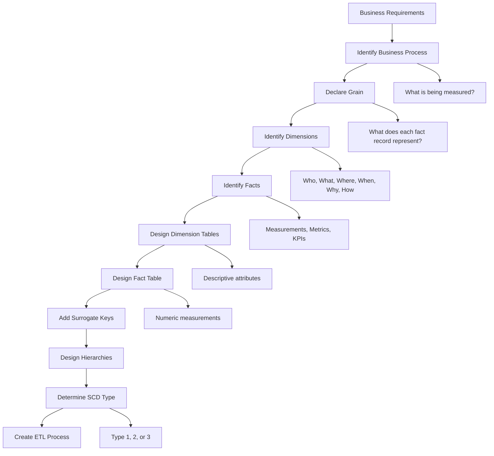
```mermaid
flowchart TD
    A[Business Requirements] --> B[Identify Business Process]
    B --> C[Declare Grain]
    C --> D[Identify Dimensions]
    D --> E[Identify Facts]
    E --> F[Design Dimension Tables]
    F --> G[Design Fact Table]
    G --> H[Add Surrogate Keys]
    H --> I[Design Hierarchies]
    I --> J[Determine SCD Type]
    J --> K[Create ETL Process]

    B --> B1[What is being measured?]
    C --> C1[What does each fact record represent?]
    D --> D1[Who, What, Where, When, Why, How]
    E --> E1[Measurements, Metrics, KPIs]
    F --> F1[Descriptive attributes]
    G --> G1[Numeric measurements]
    J --> J1[Type 1, 2, or 3]
```

## NoSQL Data Modeling

### Document Database Schema
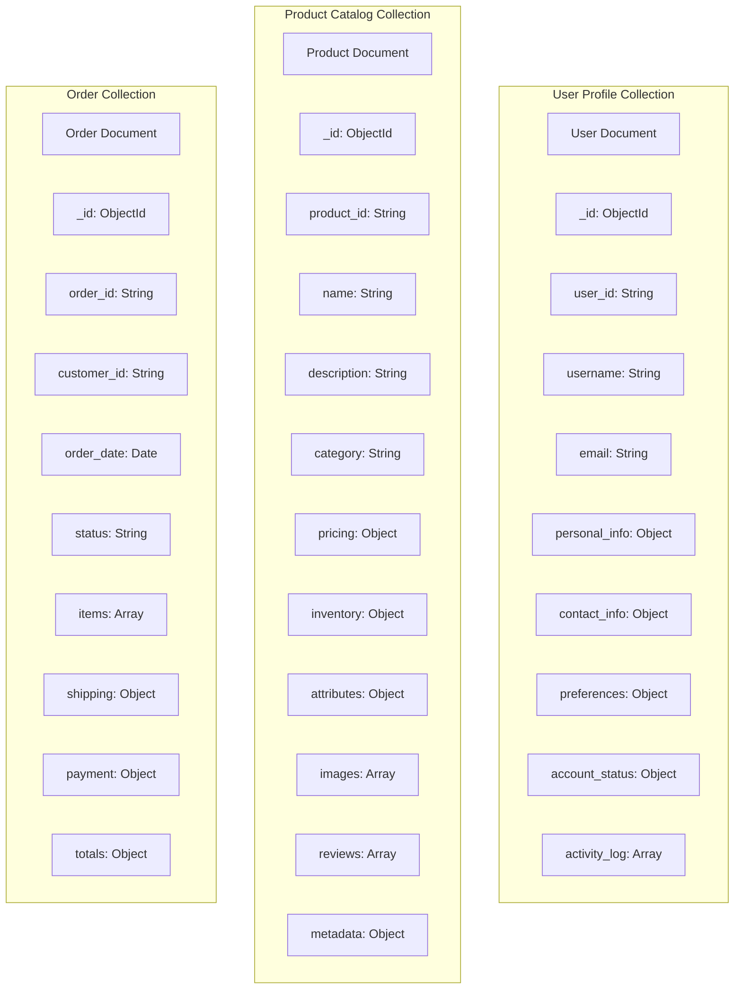
```mermaid
graph TD
    subgraph "User Profile Collection"
        U1[User Document]
        U1_1[_id: ObjectId]
        U1_2[user_id: String]
        U1_3[username: String]
        U1_4[email: String]
        U1_5[personal_info: Object]
        U1_6[contact_info: Object]
        U1_7[preferences: Object]
        U1_8[account_status: Object]
        U1_9[activity_log: Array]
    end

    subgraph "Product Catalog Collection"
        P1[Product Document]
        P1_1[_id: ObjectId]
        P1_2[product_id: String]
        P1_3[name: String]
        P1_4[description: String]
        P1_5[category: String]
        P1_6[pricing: Object]
        P1_7[inventory: Object]
        P1_8[attributes: Object]
        P1_9[images: Array]
        P1_10[reviews: Array]
        P1_11[metadata: Object]
    end

    subgraph "Order Collection"
        O1[Order Document]
        O1_1[_id: ObjectId]
        O1_2[order_id: String]
        O1_3[customer_id: String]
        O1_4[order_date: Date]
        O1_5[status: String]
        O1_6[items: Array]
        O1_7[shipping: Object]
        O1_8[payment: Object]
        O1_9[totals: Object]
    end
```

### Document Relationships Patterns
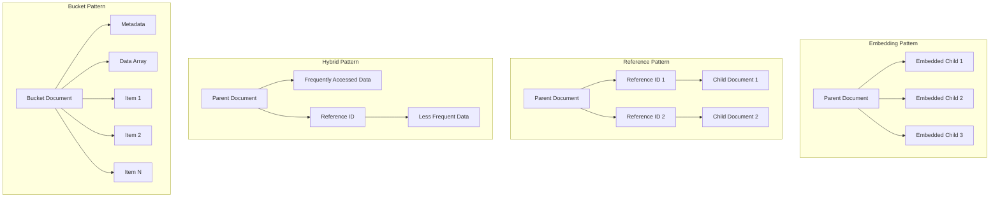
```mermaid
graph TD
    subgraph "Embedding Pattern"
        E1[Parent Document]
        E1 --> E2[Embedded Child 1]
        E1 --> E3[Embedded Child 2]
        E1 --> E4[Embedded Child 3]
    end

    subgraph "Reference Pattern"
        R1[Parent Document]
        R1 --> R2[Reference ID 1]
        R1 --> R3[Reference ID 2]
        R2 --> R4[Child Document 1]
        R3 --> R5[Child Document 2]
    end

    subgraph "Hybrid Pattern"
        H1[Parent Document]
        H1 --> H2[Frequently Accessed Data]
        H1 --> H3[Reference ID]
        H3 --> H4[Less Frequent Data]
    end

    subgraph "Bucket Pattern"
        B1[Bucket Document]
        B1 --> B2[Metadata]
        B1 --> B3[Data Array]
        B1 --> B4[Item 1]
        B1 --> B5[Item 2]
        B1 --> B6[Item N]
    end
```

### NoSQL Database Architecture
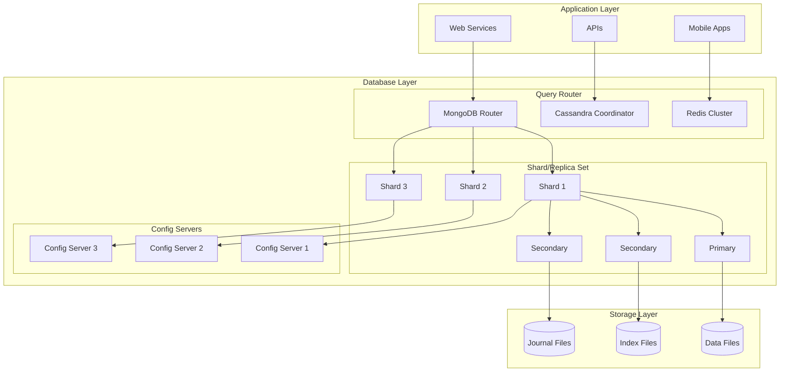
```mermaid
graph TB
    subgraph "Application Layer"
        A1[Web Services]
        A2[APIs]
        A3[Mobile Apps]
    end

    subgraph "Database Layer"
        subgraph "Query Router"
            Q1[MongoDB Router]
            Q2[Cassandra Coordinator]
            Q3[Redis Cluster]
        end

        subgraph "Shard/Replica Set"
            S1[Shard 1]
            S2[Shard 2]
            S3[Shard 3]
            S1 --> S1_1[Primary]
            S1 --> S1_2[Secondary]
            S1 --> S1_3[Secondary]
        end

        subgraph "Config Servers"
            C1[Config Server 1]
            C2[Config Server 2]
            C3[Config Server 3]
        end
    end

    subgraph "Storage Layer"
        ST1[(Data Files)]
        ST2[(Index Files)]
        ST3[(Journal Files)]
    end

    A1 --> Q1
    A2 --> Q2
    A3 --> Q3

    Q1 --> S1
    Q1 --> S2
    Q1 --> S3

    S1 --> C1
    S2 --> C2
    S3 --> C3

    S1_1 --> ST1
    S1_2 --> ST2
    S1_3 --> ST3
```

## Graph Database Modeling

### Property Graph Schema
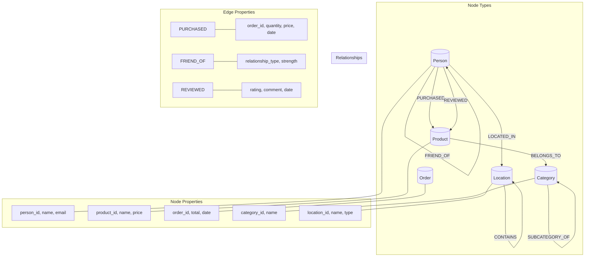
```mermaid
graph TD
    subgraph "Node Types"
        P[(Person)]
        PR[(Product)]
        O[(Order)]
        C[(Category)]
        L[(Location)]
    end

    subgraph "Relationships"
        P -->|PURCHASED| PR
        PR -->|BELONGS_TO| C
        P -->|LOCATED_IN| L
        P -->|FRIEND_OF| P
        P -->|REVIEWED| PR
        L -->|CONTAINS| L
        C -->|SUBCATEGORY_OF| C
    end

    subgraph "Node Properties"
        P --- P1[person_id, name, email]
        PR --- PR1[product_id, name, price]
        O --- O1[order_id, total, date]
        C --- C1[category_id, name]
        L --- L1[location_id, name, type]
    end

    subgraph "Edge Properties"
        PURCHASED --- PUR1[order_id, quantity, price, date]
        FRIEND_OF --- FRI1[relationship_type, strength]
        REVIEWED --- REV1[rating, comment, date]
    end
```

### Graph Query Patterns
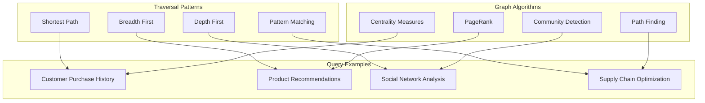
```mermaid
graph TD
    subgraph "Traversal Patterns"
        T1[Shortest Path]
        T2[Breadth First]
        T3[Depth First]
        T4[Pattern Matching]
    end

    subgraph "Graph Algorithms"
        A1[PageRank]
        A2[Community Detection]
        A3[Centrality Measures]
        A4[Path Finding]
    end

    subgraph "Query Examples"
        Q1[Customer Purchase History]
        Q2[Product Recommendations]
        Q3[Social Network Analysis]
        Q4[Supply Chain Optimization]
    end

    T1 --> Q1
    T2 --> Q2
    T3 --> Q3
    T4 --> Q4

    A1 --> Q2
    A2 --> Q3
    A3 --> Q1
    A4 --> Q4
```

### Graph Database Architecture
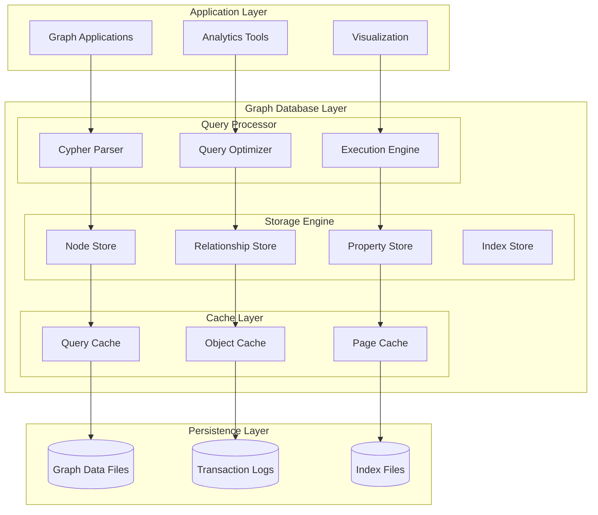
```mermaid
graph TB
    subgraph "Application Layer"
        A1[Graph Applications]
        A2[Analytics Tools]
        A3[Visualization]
    end

    subgraph "Graph Database Layer"
        subgraph "Query Processor"
            QP1[Cypher Parser]
            QP2[Query Optimizer]
            QP3[Execution Engine]
        end

        subgraph "Storage Engine"
            SE1[Node Store]
            SE2[Relationship Store]
            SE3[Property Store]
            SE4[Index Store]
        end

        subgraph "Cache Layer"
            CA1[Query Cache]
            CA2[Object Cache]
            CA3[Page Cache]
        end
    end

    subgraph "Persistence Layer"
        PL1[(Graph Data Files)]
        PL2[(Transaction Logs)]
        PL3[(Index Files)]
    end

    A1 --> QP1
    A2 --> QP2
    A3 --> QP3

    QP1 --> SE1
    QP2 --> SE2
    QP3 --> SE3

    SE1 --> CA1
    SE2 --> CA2
    SE3 --> CA3

    CA1 --> PL1
    CA2 --> PL2
    CA3 --> PL3
```

## Data Warehouse Architecture

### Kimball Data Warehouse Architecture
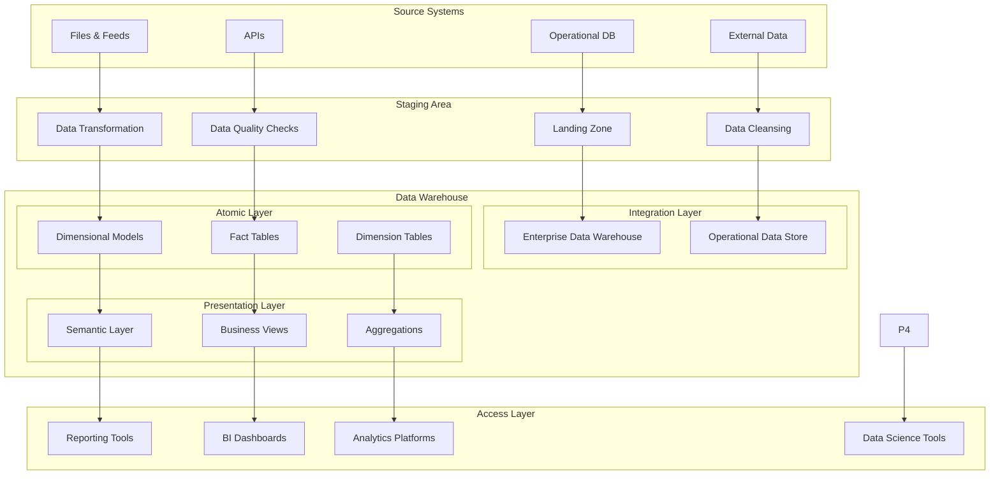
```mermaid
graph TB
    subgraph "Source Systems"
        S1[Operational DB]
        S2[External Data]
        S3[Files & Feeds]
        S4[APIs]
    end

    subgraph "Staging Area"
        ST1[Landing Zone]
        ST2[Data Cleansing]
        ST3[Data Transformation]
        ST4[Data Quality Checks]
    end

    subgraph "Data Warehouse"
        subgraph "Presentation Layer"
            P1[Semantic Layer]
            P2[Business Views]
            P3[Aggregations]
        end

        subgraph "Integration Layer"
            I1[Enterprise Data Warehouse]
            I2[Operational Data Store]
        end

        subgraph "Atomic Layer"
            A1[Dimensional Models]
            A2[Fact Tables]
            A3[Dimension Tables]
        end
    end

    subgraph "Access Layer"
        AC1[Reporting Tools]
        AC2[BI Dashboards]
        AC3[Analytics Platforms]
        AC4[Data Science Tools]
    end

    S1 --> ST1
    S2 --> ST2
    S3 --> ST3
    S4 --> ST4

    ST1 --> I1
    ST2 --> I2
    ST3 --> A1
    ST4 --> A2

    A1 --> P1
    A2 --> P2
    A3 --> P3

    P1 --> AC1
    P2 --> AC2
    P3 --> AC3
    P4 --> AC4
```

### Data Lake Architecture
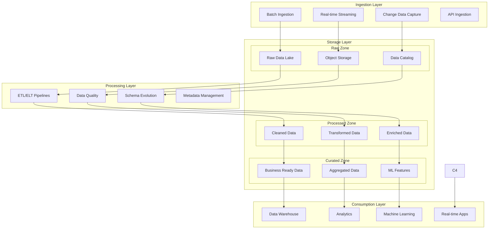
```mermaid
graph TB
    subgraph "Ingestion Layer"
        I1[Batch Ingestion]
        I2[Real-time Streaming]
        I3[Change Data Capture]
        I4[API Ingestion]
    end

    subgraph "Storage Layer"
        subgraph "Raw Zone"
            R1[Raw Data Lake]
            R2[Object Storage]
            R3[Data Catalog]
        end

        subgraph "Processed Zone"
            P1[Cleaned Data]
            P2[Transformed Data]
            P3[Enriched Data]
        end

        subgraph "Curated Zone"
            C1[Business Ready Data]
            C2[Aggregated Data]
            C3[ML Features]
        end
    end

    subgraph "Processing Layer"
        PR1[ETL/ELT Pipelines]
        PR2[Data Quality]
        PR3[Schema Evolution]
        PR4[Metadata Management]
    end

    subgraph "Consumption Layer"
        CO1[Data Warehouse]
        CO2[Analytics]
        CO3[Machine Learning]
        CO4[Real-time Apps]
    end

    I1 --> R1
    I2 --> R2
    I3 --> R3

    R1 --> PR1
    R2 --> PR2
    R3 --> PR3

    PR1 --> P1
    PR2 --> P2
    PR3 --> P3

    P1 --> C1
    P2 --> C2
    P3 --> C3

    C1 --> CO1
    C2 --> CO2
    C3 --> CO3
    C4 --> CO4
```

## Time Series Data Modeling

### Time Series Database Schema
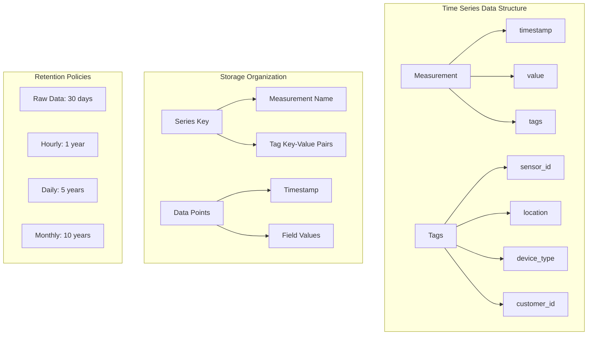
```mermaid
graph TD
    subgraph "Time Series Data Structure"
        TS1[Measurement]
        TS1 --> TS1_1[timestamp]
        TS1 --> TS1_2[value]
        TS1 --> TS1_3[tags]

        TS2[Tags]
        TS2 --> TS2_1[sensor_id]
        TS2 --> TS2_2[location]
        TS2 --> TS2_3[device_type]
        TS2 --> TS2_4[customer_id]
    end

    subgraph "Storage Organization"
        SO1[Series Key]
        SO1 --> SO2[Measurement Name]
        SO1 --> SO3[Tag Key-Value Pairs]

        SO4[Data Points]
        SO4 --> SO5[Timestamp]
        SO4 --> SO6[Field Values]
    end

    subgraph "Retention Policies"
        RP1[Raw Data: 30 days]
        RP2[Hourly: 1 year]
        RP3[Daily: 5 years]
        RP4[Monthly: 10 years]
    end
```

### IoT Data Architecture
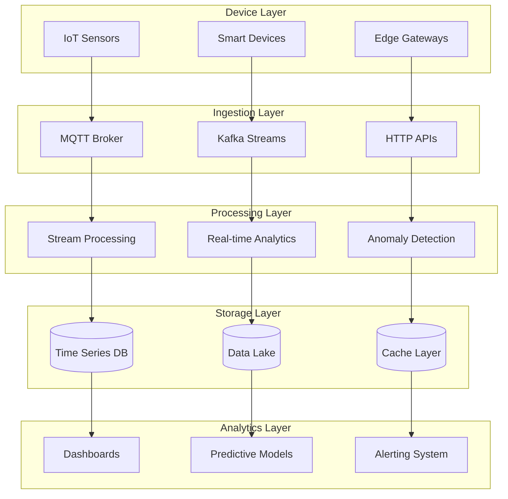
```mermaid
graph TB
    subgraph "Device Layer"
        D1[IoT Sensors]
        D2[Smart Devices]
        D3[Edge Gateways]
    end

    subgraph "Ingestion Layer"
        I1[MQTT Broker]
        I2[Kafka Streams]
        I3[HTTP APIs]
    end

    subgraph "Processing Layer"
        P1[Stream Processing]
        P2[Real-time Analytics]
        P3[Anomaly Detection]
    end

    subgraph "Storage Layer"
        S1[(Time Series DB)]
        S2[(Data Lake)]
        S3[(Cache Layer)]
    end

    subgraph "Analytics Layer"
        A1[Dashboards]
        A2[Predictive Models]
        A3[Alerting System]
    end

    D1 --> I1
    D2 --> I2
    D3 --> I3

    I1 --> P1
    I2 --> P2
    I3 --> P3

    P1 --> S1
    P2 --> S2
    P3 --> S3

    S1 --> A1
    S2 --> A2
    S3 --> A3
```

## Data Modeling Best Practices

### Data Model Quality Framework
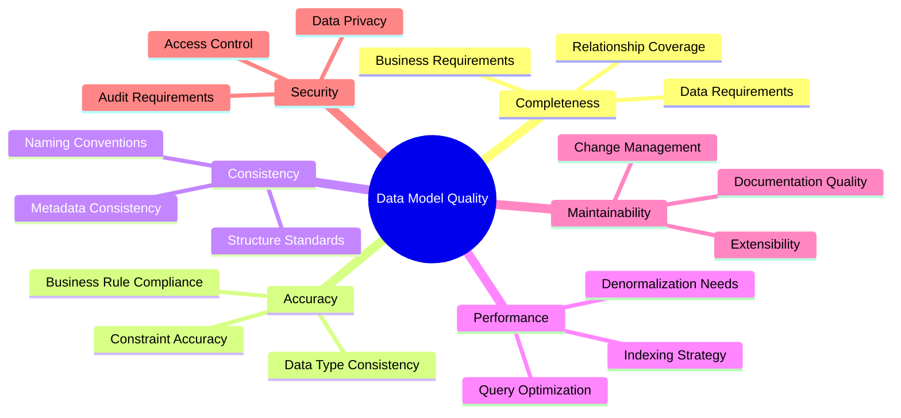
```mermaid
mindmap
  root((Data Model Quality))
    Completeness
      Business Requirements
      Data Requirements
      Relationship Coverage
    Accuracy
      Data Type Consistency
      Constraint Accuracy
      Business Rule Compliance
    Consistency
      Naming Conventions
      Structure Standards
      Metadata Consistency
    Performance
      Query Optimization
      Indexing Strategy
      Denormalization Needs
    Maintainability
      Documentation Quality
      Change Management
      Extensibility
    Security
      Access Control
      Data Privacy
      Audit Requirements
```

### Model Evolution Process
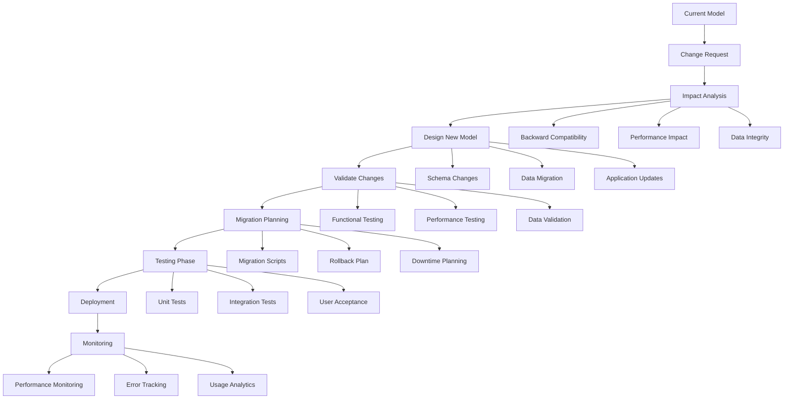
```mermaid
flowchart TD
    A[Current Model] --> B[Change Request]
    B --> C[Impact Analysis]
    C --> D[Design New Model]
    D --> E[Validate Changes]
    E --> F[Migration Planning]
    F --> G[Testing Phase]
    G --> H[Deployment]
    H --> I[Monitoring]

    C --> C1[Backward Compatibility]
    C --> C2[Performance Impact]
    C --> C3[Data Integrity]

    D --> D1[Schema Changes]
    D --> D2[Data Migration]
    D --> D3[Application Updates]

    E --> E1[Functional Testing]
    E --> E2[Performance Testing]
    E --> E3[Data Validation]

    F --> F1[Migration Scripts]
    F --> F2[Rollback Plan]
    F --> F3[Downtime Planning]

    G --> G1[Unit Tests]
    G --> G2[Integration Tests]
    G --> G3[User Acceptance]

    I --> I1[Performance Monitoring]
    I --> I2[Error Tracking]
    I --> I3[Usage Analytics]
```

### Database Design Patterns
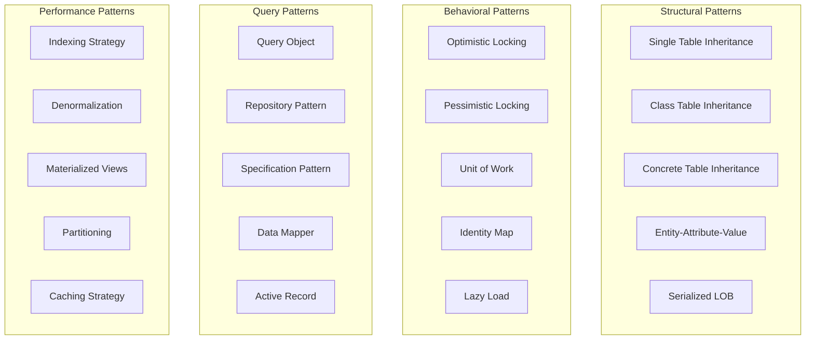
```mermaid
graph TD
    subgraph "Structural Patterns"
        SP1[Single Table Inheritance]
        SP2[Class Table Inheritance]
        SP3[Concrete Table Inheritance]
        SP4[Entity-Attribute-Value]
        SP5[Serialized LOB]
    end

    subgraph "Behavioral Patterns"
        BP1[Optimistic Locking]
        BP2[Pessimistic Locking]
        BP3[Unit of Work]
        BP4[Identity Map]
        BP5[Lazy Load]
    end

    subgraph "Query Patterns"
        QP1[Query Object]
        QP2[Repository Pattern]
        QP3[Specification Pattern]
        QP4[Data Mapper]
        QP5[Active Record]
    end

    subgraph "Performance Patterns"
        PP1[Indexing Strategy]
        PP2[Denormalization]
        PP3[Materialized Views]
        PP4[Partitioning]
        PP5[Caching Strategy]
    end
```

This visual guide provides comprehensive diagrams covering all aspects of data modeling including ER diagrams, relational design, dimensional modeling, NoSQL patterns, graph databases, data warehouse architectures, time series modeling, and best practices. Each diagram illustrates key concepts and relationships in the data modeling domain.
